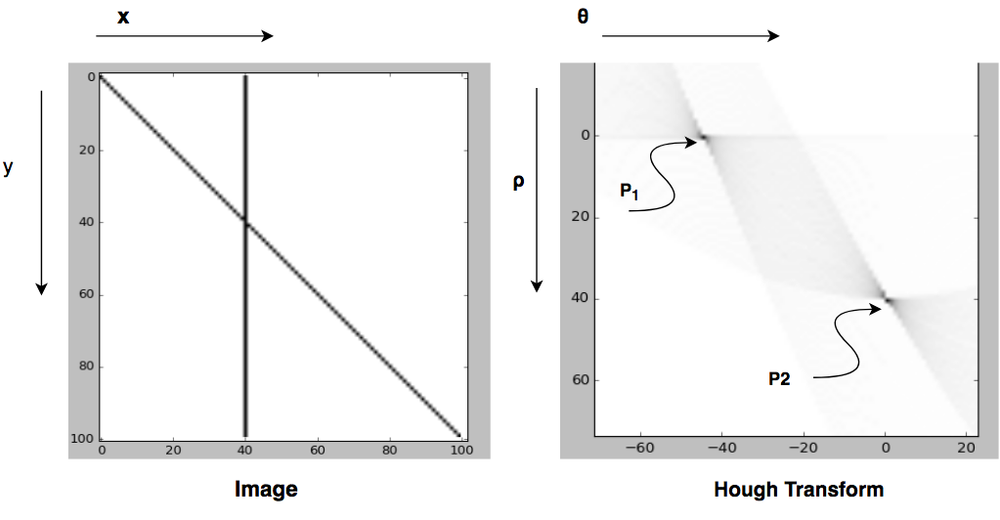

## Question 1 [Hough Transform]

Hough transform is used for line detection in images. The idea is to move from image space to parameter space. For line 

$$y = mx + b$$ 

where $$m$$ is the slope and $$b$$ intercept. 
For some reasons we switch to line in polar coordinate where parameters of line are $$\rho$$ and $$\theta$$ and relation is

$$ \rho = y sin(\theta) + x cos(\theta) $$ 

In the following figure we have an image with two lines and its corresponding Hough transform. 

1. Determine which point in Hough space that corresponds to vertical, diagonal lines in image space. Justify your answer. 
2. Find the accumulator value for both $$p_1$$ and $$p_2$$. Justify your answer.
3. Is it applicable to use $$m, b$$ parameter space for this image? Why ?

## Question 2 [Harris corner detector]

Corners are unique points in the image. They have change in intensity for all directions. Harris operator is used to detect such corners from what so called hessian matrix $$H$$ that depends on the the smoothed gradients of the image. Harris operator can be calculated using following equation. 

$$
Harris  = det(H) - a * trace(H)
$$

Where $$a$$ is a constant and $$trace(H)$$ is the sum of diagonal elements of hessian matrix. 

For Given 

$$H_1 = \begin{bmatrix} 
630 & 120 \\\
120  & 490
\end{bmatrix} $$ 

and 

$$H_2 = \begin{bmatrix} 
75 & 20 \\\
20  & 660
\end{bmatrix}$$ 

$$H_1$$ and $$H_2$$ are hessian matrix of  two different points in an image. 

1. Calculate Harris operator for both points. Let $$a = 0.2$$
2. Determine which point is a corner and which isn't a corner. Justify your answer.
3. For point that is not a corner, Can we consider it as an edge point ? Justify your answer (**Note:** Use values in its hessian matrix for justification). 