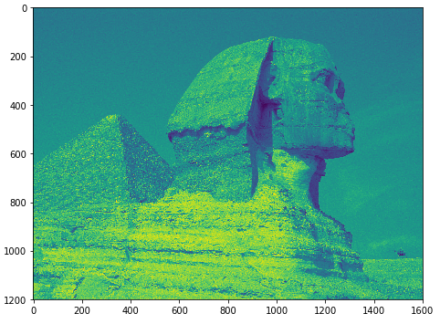
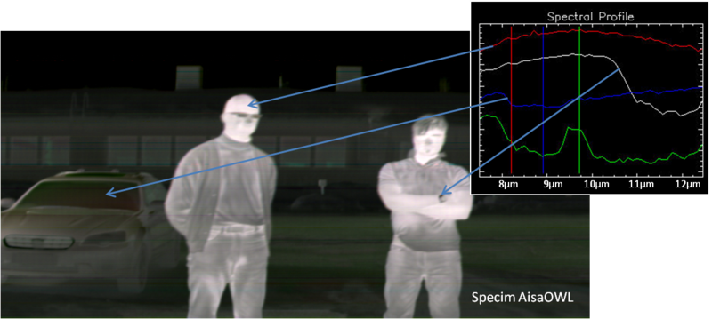
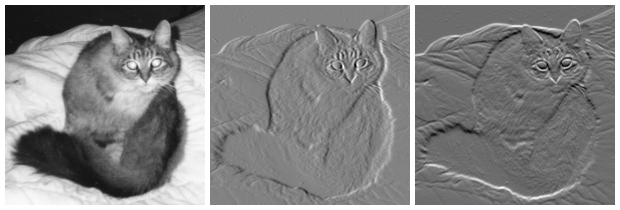

* TOC
{:toc}

## Images as Arrays


### RGB Images

For RGB images, each pixel is composed of three channels, namely: red, green, and blue.


### Binary Images and Scaler Images

* A pixel in a **binary** image is either 0 or 1.
* A pixel in a scaler image is composed of a single channel with scaler value.
  * Example: 256-grayscale images.

#### Converting from RGB to Grayscale

For each RGB pixel, we compute a combination of the three values into single value. In literature, using a combination of $$ \big[0.299, 0.587, 0.114\big] $$ is extensively used.

$$ I = \big[0.299, 0.587, 0.114\big] . \big[R, G, B\big]^T$$

```python
def rgb2gray(rgb_image):
    return np.dot(rgb_image[...,:3], [0.299, 0.587, 0.114])
```




#### Converting from Grayscale to Binary Image

We can binarize an image by using a *threshold* value, such that pixel value is 1 if $$ I > \text{threshold} $$ and 0 otherwise.


```python
def binarize( gray_image , threshold ):
    threshold = np.max( gray_image ) * threshold
    return 1 * ( gray_image > threshold )
```


### Hyperspectral Images

Pixels in Hyperspectral images consists of many channels.




## Mean and Variance

```python
print( np.mean( image ))

print( np.std( image ))
```

## Profiles

```python
x0 = 0
x1 = gray_image.shape[0] - 1
y0 = 0
y1 = gray_image.shape[1] - 1

x, y = np.linspace(x0, x1, 300), np.linspace(y0, y1, 300)
profile = gray_image[x.astype(np.int), y.astype(np.int)]

#-- Plot...
fig, axes = plt.subplots(nrows=2)
axes[0].imshow(gray_image)
axes[0].plot([x0, x1], [y0, y1], 'ro-')
axes[0].axis('image')

axes[1].plot(profile)

plt.show()
```


## Edges

In images, we are always interested to define the boundaries of objects existing in an image, and separating it from background. Edge detection is fundamental step in many Computer Vision pipelines.
The simplest form of edge detection is applying mathematical differentiation on image data. Since we work with digital pixels, we will apply difference equations.

### First-Order Derivatives

$$ \nabla f=\begin{bmatrix}
g_{x} \\
g_{y}
\end{bmatrix} = \begin{bmatrix}
\frac{\partial f}{\partial x} \\
\frac{\partial f}{\partial y}
\end{bmatrix} $$

where:

$$\textstyle\frac{\partial f}{\partial x}$$ is the derivative with respect to x (gradient in the x direction)

$$\textstyle\frac{\partial f}{\partial y}$$ is the derivative with respect to y (gradient in the y direction).




## Computer Vision Opportunities in Egypt

### Internship at [Affectiva](https://www.affectiva.com)


[Internship 1: Machine Learning](https://www.affectiva.com/machine-learning-intern/)

[Internship 2: Empath Summer Internship](https://www.affectiva.com/empath-high-school-summer-internship-program-at-affectiva/)

A very interesting talk by *Rana Elkaliouby* about Affectiva:

<div style="max-width:854px"><div style="position:relative;height:0;padding-bottom:56.25%"><iframe src="https://embed.ted.com/talks/lang/ar/rana_el_kaliouby_this_app_knows_how_you_feel_from_the_look_on_your_face" width="854" height="480" style="position:absolute;left:0;top:0;width:100%;height:100%" frameborder="0" scrolling="no" allowfullscreen></iframe></div></div>

### 360imaging in Egypt


An intuitive and easy to use treatment planning software for accurate and predictable planning of implant cases.

[Website](http://www.360imaging.com/)

* Planned Dental Surgeries.
* They demand highly skilled C++ developers.
* Computer Vision background is a plus
* They offer opportunities through Wuzzuf.

### Egyptian AI & Big Data Geeks

#### Follow the latest news, technologies, and vacancies in Egypt

[Egyptian AI & Big Data Geeks](https://www.facebook.com/groups/big.data.egypt/?hc_ref=ARRdEaEGxIrwkMjEnvNxD81ZxbGlFmE6i92Dd4Vdw0vboAUOg05qsCcMkLJNv3-28OE)

Also visit the [**pinned** post](https://www.facebook.com/groups/big.data.egypt/permalink/1762260707366456/) for lots of info about many related topics.

## Resources

* [Awsome Computer Vision](https://github.com/jbhuang0604/awesome-computer-vision), **+5K** starts.
* [Awesome Machine Learning](https://github.com/josephmisiti/awesome-machine-learning), **30K** starts.
* [Stanford Machine Learning Group](https://stanfordmlgroup.github.io/)


## Interesting Application: Artistic Flavor

### Neural Doodle

[Neural Doodle](https://github.com/alexjc/neural-doodle)


## Exercises

### Exercise 1.1

Implement a program that does the following:

#### Load a colour (RGB) image I in a lossless data format, such as bmp , png , or tiff , and display it on a screen


#### Display the histograms of all three colour channels of I


#### Move the mouse cursor within your image. For the current pixel location p in the image, compute and display

1. the outer border (see grey box) of the *11 × 11* square window $$W_p$$ around pixel *p* in your image *I* (i.e., *p* is the reference point of this window),
2. (above this window or in a separate command window) the location p (i.e., its coordinates) of the mouse cursor and the RGB values of your image I at p,
3. (below this window or in a separate command window) the intensity value $$ \frac{R(p) + G(p) + B(p)}{3}$$ at *p*, and
4. the mean $$\mu( W_p )$$ and standard deviation $$\sigma( W_p )$$ .
5. Discuss examples of image windows W p (within your selected input images) where you see “homogeneous distributions of image values”, and windows showing “inhomogeneous areas”. Try to define your definition of “homogeneous” or “inhomogeneous” in terms of histograms, means, or variances.

### Exercise 1.2

transform a few more (easy) RGB values manually into corresponding HSI values.