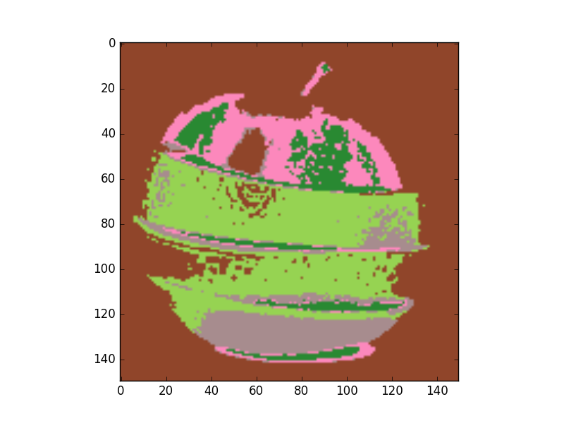
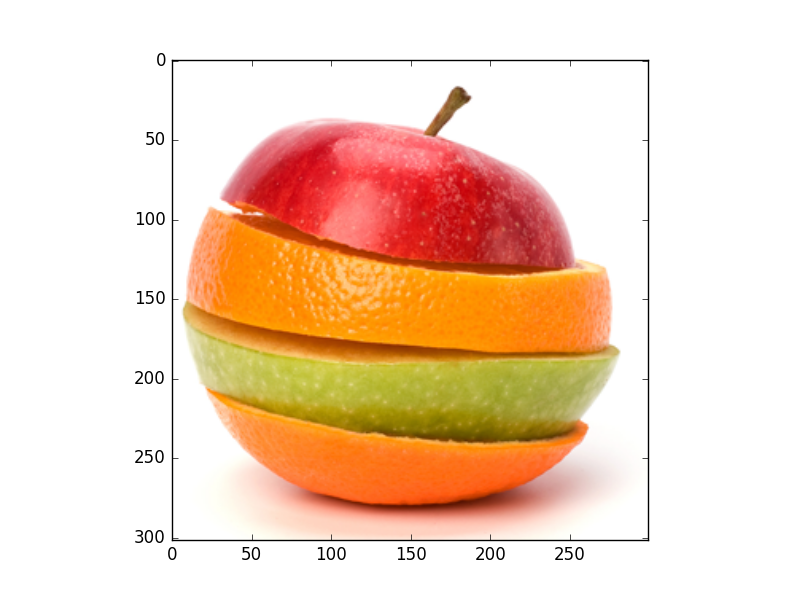
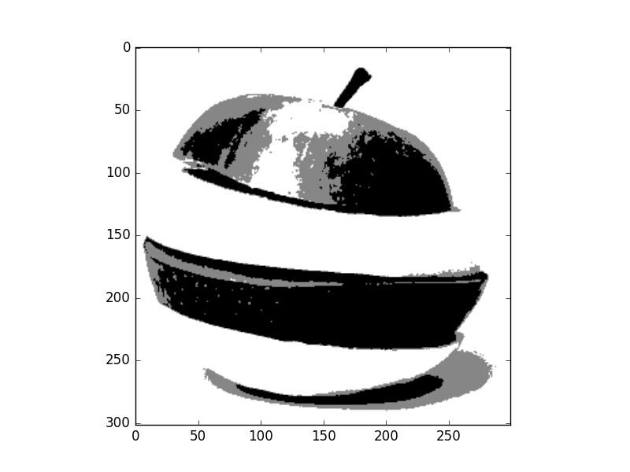
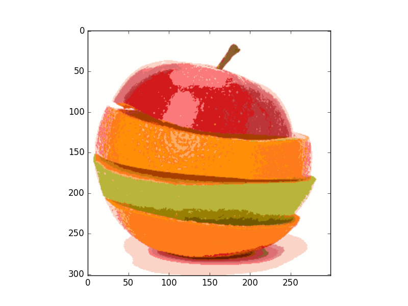

> These notes are inspired by slides made by TA Eng.Mohamed Hisham

* TOC
{:toc}

## Clustering Segmentation 

Clustering is the process of grouping similar data points together and marking them as a same cluster or group. It is used in many fields including machine learning, data analysis and data mining. We can consider segmentation as a clustering problem. We need to cluster image into different object, each object pixels has common features for example same color or same intensity. 


Talking about similarity criteria takes us to what so called feature. A feature is a value that measures or identify characteristic of subject, it must discriminate between different subjects. One of important rules in machine learning is that Good feature with simple classifier is more accurate that bad feature with robust classifier. 

Feature space is an alternative space of ordinary data space. Its coordinates are feature values and each data point is represented by its value of different features. For example, color components R, G, and B are the coordinates of our feature space. Each pixel in the image will be represented as a 3D vector of its R, G, and B values. 
  
## K means Clustering

K means clustering assumes random initial cluster centers in feature space. cluster data to these centers according to the distance between these data points and our centers. Now we can update the value of the center for each cluster, it is the mean of its points. Process is repeated and data are re-clustered for each iteration, new mean is calculated till convergence. Finally we have our centers and related data points. The process is shown in the following figure. 


So basic Algorithm steps for k means segmentation are

```python
Construct feature space from your image (number of data point = number of pixels)
Set number of required clusters k 
Set Max number of iterations for clustering
Get random k points in your feature space (initial centers)
for i in range(max number of iterations)
    #Cluster remaining data points to centers according to distance
    for each data point:
        for each cluster:
            distances =  distance between it cluster centers
        its cluster = min(distances)
    #Calculate the new centers 
    for each cluster:
        newCenter = mean(RelatedPoints)
```

**Let's Try to implement it**
### K means basic implementation
* Import some libraries 

```python
import numpy as np
import matplotlib.pyplot as plt
from matplotlib import colors
from scipy import  misc
```
* Function Definition 
```python
def kmeans(image, k, num_iterations, d):
    '''
    K means clustering segmentation algorithm 
    inputs: 
    k : number of clusters. 
    num_iterations : for convergence
    d : dimension of feature space 1, 2, or 3D
    '''
```
* Construction of feature space 
```python
    #1. Construct feature space
    m, n = image.shape[0:2]
    num_points = m*n
    # extract_feature_space is another function (Don't care about it now)
    feature_space = extract_feature_space(image, d)
```
* Getting Initial centers 
```python 
    idxs = np.round(num_points * np.random.rand(k))
    #Boundary condition
    idxs[np.where(idxs >= m*n)] -= 1 
    initial_centers = np.zeros((d,k))
    for i in range(k):
        initial_centers[:,i] = feature_space[:,int(idxs[i])]
    clusters_centers = initial_centers
    # Initialize distance vector 
    distance = np.zeros((k,1))
    #cluster points determines cluster of each point in space
    cluster_points = np.zeros((num_points, 1))
```
* start clustering for number of iterations
```python
    for j in range(num_iterations):
        #Cluster all points according min distance
        for l in range(num_points):
            #Get distance to all centers 
            for h in range(k):
                distance[h] = np.sqrt(np.sum((feature_space[:,l]-clusters_centers[:,h])**2))
            #Select minimum one
            cluster_points[l] = np.argmin(distance)
        # Update centers of clusters according new points 
        for c in range(k):
            # Get points associated with that cluster
            idxs = np.where(cluster_points == c)
            points = feature_space[:,idxs[0]]
            # Get its new center
            clusters_centers[:,c] = np.mean(points, 1)
```
* Back to Image Space
```python
        # extract_segmented_image is another function (Don't care about it now)
        segmented_image = extract_segmented_image(cluster_points, clusters_centers, image)
        return segmented_image
```
* Testing 
```python
if __name__=='__main__':
    #Load the image
    image = plt.imread('images/seg3.png')
    # Rescale image down for speedup    
    image = misc.imresize(image, (150,150))
    #Show original Image
    plt.figure('Original Image')
    plt.imshow(image)
    #Apply k means segmentation and show the result
    segmented_image = kmeans(image, 5,10, 1)
    plt.figure('segmented image')
    plt.set_cmap('gray')
    plt.imshow(segmented_image)
    plt.show()
```
### K means Results

* Results for k = 5 classes 

Original Image


1. 1D feature space (Gray level) 


2. 2D feature space (Colors HS channels)


3. 3D feature space (Colors RGB) 



We can see that convergence in 3D space is slower so classes picked none relevant colors.

## Mean shift Clustering

Mean shift clustering is non-parametric technique for clustering, it doesn't require specifying number of clusters. Also it is robust for outliers as clusters aren't in spherical shape it takes a none-linear shape according to clustering procedure. 

### Basic algorithm 
Pseudo code of basic mean shift algorithm with uniform kernel 

```python 
Extract feature space from image
While number of unvisited points > 0
    Select a random point in feature space (Initial mean)
    While true: 
    Get distance between mean and all points in feature space
    For uniform window, select points in the range of specified bandwidth and track that points
    Get the new mean, it is the mean of points within bandwidth
    if distance between new and old means < threshold:
        cluster all tracked points to new mean 
        update number of visited points 
        break
```
This algorithm is shown in that figure


So the process will repeated till all points in feature space are clustered. 


**Wait, we didn't finish yet!**

### Merging clusters

One of drawbacks of uniform kernel is that center may not move for uniform regions. Merging nearby centers is the solution of such problem. Merge condition is that distance between the two centers is lower than half the bandwidth. Algorithm will be modified as follow

```python 
Extract feature space from image
While number of unvisited points > 0
    Select a random point in feature space (Initial mean)
    While true: 
    Get distance between mean and all points in feature space
    For uniform window, select points in the range of specified bandwidth and track that points
    Get the new mean, it is the mean of points within bandwidth
    if distance between new and old means < threshold:
        for c in clusters:
            #Check merge condition
            if distance(c, center) < 0.5* Bandwidth:
                mean of cluster c = 0.5*distance(c,center)
                cluster all tracked points to cluster c
        #No merge
        cluster all tracked points to new mean 
        #Update visited points
        update number of visited points 
        break
```

### Bandwidth selection 

The effect of changing bandwidth is that number of clusters will change. Larger bandwidth tends to lower number of clusters while smaller bandwidth tends to more number of clusters.


### Results of mean shift segmentation

Original Image



1. 1D feature space (Gray level) 



2. 2D feature space (Colors HS channels)


3. 3D feature space (Colors RGB) 



As we can see mean shift is a robust segmentation algorithm. It more efficient than k means algorithm. It provides clusters with irregular shape and its points share same attraction basin.

## Demo

You can download week demo using  

```shell
git clone https://github.com/sbme-tutorials/cv-week8-demo.git
```

## Useful links
[Clustering with scikit](https://dashee87.github.io/data%20science/general/Clustering-with-Scikit-with-GIFs/)