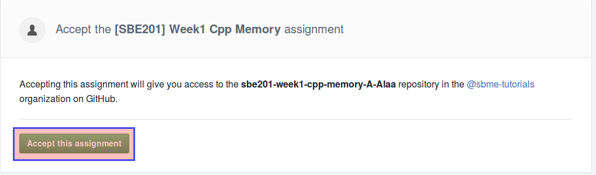
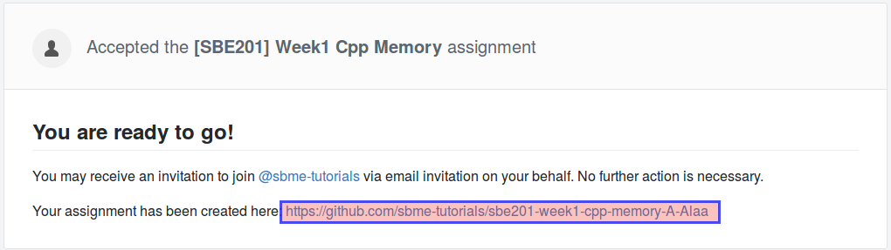
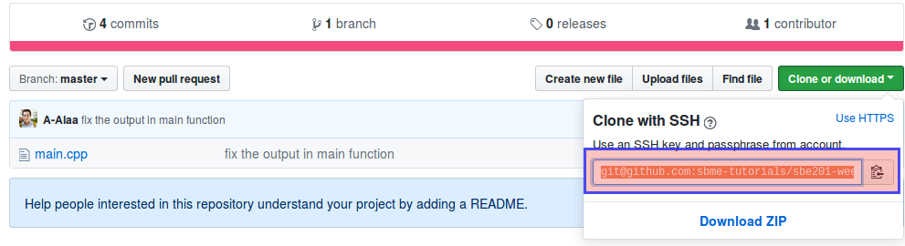

## Objectives

* Creating variables on stack and heap.
* Using arithmetic operations on variables using their addresses in memory.
* Memory management.
* Pass-by-value (copy) vs. pass-by-reference vs. pass-by-pointer (address)
* Make simple functions and using it several times.

## Prerequisites (Before you start)

#### 1. **Required**: Read the notes of the first week: \[[Memory, pointers, and references]({{ site.baseurl }}){:target="_blank"}\]

#### 2. **Required to Know**: Functions Can Be Declared Multiple Times and Defined Only Once

Example,

```c++
double sum( double a , double b ) // Declaration (Header)
{ // Definition
    return a + b;
}

int main()
{
    double results = sum( 12 , 17 );
    return 0;
}
```

Can also be written as,

```c++
// Function declaration (header) without definition
// We call function declaration without a header as function prototype.
double sum( double a , double b );
// Function prototypes allow us to define the function somewhere else.

int main()
{
    double results = sum( 12 , 17 );
}

// Another declaration, but now with a definition this time.
double sum( double a , double b ) 
{
    return a + b;
}
```

#### 3. **Recommended to Watch** animated explanation between pass-by-value (copy) and pass-by-reference

<iframe width="640" height="360" src="https://www.youtube.com/embed/ErMKBh1pobg" frameborder="0" allow="autoplay; encrypted-media" allowfullscreen></iframe>

The video is a good example with explanation, but **some bad practices in the video** you need to pay attention for:

* `using namespace std`, is a **bad practice**.
* `int input;` without initialization is a **bad practice**.

Otherwise, everything is good.


Another good video in *Arabic*,

<iframe width="640" height="360" src="https://www.youtube.com/embed/dqlCK_-ArO0" frameborder="0" allow="autoplay; encrypted-media" allowfullscreen></iframe>

**But be carefull**, she said cplusplus.com is a good website for **beginners**, which is not true.

## Grading

* Grading per line.
* +20% bonus.

## Deadline

**Monday 19/2/2018 11:59 PM**.

## Basic C++ Memory Operations

* First, register yourself for the assignment from this [link](https://classroom.github.com/a/qZUcR20l).



then,



then,



* As you did in the first part, clone the remote repository to your local machine.
* Jump to the assignment folder and open the `main.cpp` file.
* You will find the questions as in-line comments. If you understand the memory model explained in the notes of \[[Memory, pointers, and references]({{ site.baseurl }}){:target="_blank"}\], you should attept the questions seamlessly.
* If you feel uncomfortable with any question, do not panic, you can ask for explanation at office hours before deadline.

## Important notes

### How to compile my source code

After you attempt all problems, open the terminal on the task folder. Make sure you are on the right directory by listing the files and finding `main.cpp` file.

```terminal
$ ls
main.cpp
```

To compile, you need to introduce to your compiler the `main.cpp` and the executable name (which is an arbitrary name)

```terminal
$ g++ main.cpp -o app
```

To run,

```terminal
$ ./app
```

🎉🎉🎉

### About submitting

* As you did in first part, after solving problems, save the file, then commit and push.

```terminal
$ git commit -a -m "solved all problems, where is my github sticker?!!"
$ git push origin master
```

* You can push all solutions with a single `commit` and a single `push`.
* You can also solve each problem separately and `commit` and `push` for each problem you solve:

  * So you practice yourself with `git` commands.
  * So you realize some significance of using `git` to work on large projects.
