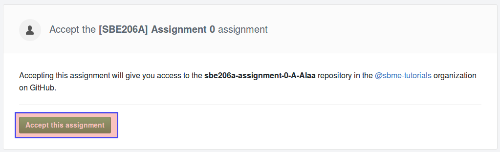
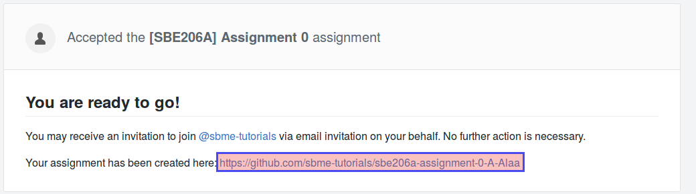

## Objectives

* Registration on Github.
* Registration on our Github classroom.
* First experience with git.
* First experience on submitting on the Github classroom.

## Prerequisites (Before you start)

* Learn git. Extensive resources: [https://try.github.io/](https://try.github.io/). Or, preferably, learn it from your colleagues of BIO2020 class. 

## Deadline

**Mondey 8/10/2018 11:59 PM**.

## 1. Registration on Github and Our Classroom

* If you do not have a GitHub account, [sign-up new account](https://github.com/join?source=header-home), then follow any further instructions by the website. You should receive a message in your e-mail to verify your e-mail. **Do not proceed to next step unless you verify your e-mail address**.
* Afterwards, send a message to me (i.e `asem.a.abdelaziz@gmail.com`):

  * subject: [SBE206A] classroom registration
  * contents:

      1. your github id/name
      2. your section and bench number (If you don’t know your bench number, refer to this [document](http://eng.cu.edu.eg/wp-content/uploads/StudentsLists2016/SBE/2.xls)).
      3. first and last names.

* Enter to the following assignment page the: [https://classroom.github.com/a/KjYUGsWA](https://classroom.github.com/a/KjYUGsWA), and give the classroom authorization to access your profile data. If you find an entry in the list that belongs to you BIO2021\_\[SEC\]\_\[BN\]\_\[Firstname\]\_\[Lastname\], click on. Otherwise, **skip** to next page. Press **Accept this assignment**.

## 2. Submitting your first project (single line) on our classroom

* You should find this dialoge, **click on the highlighted link:** .
* Copy your repository link from the repository page: .
* In your terminal, clone the repository in the current directory (you can change directory before cloning): 

git clone <the link you have copied>

For example, `git clone https://github.com/sbme-tutorials/sbe206a-assignment-0-A-Alaa.git`.
* Change directory to the directory of the downloaded repository. For example, `cd sbe206a-assignment-0-A-Alaa.git`
* You do not need to initialize that repository, it is already initialized and the current files are controlled by the repo.
* Open the file `favorite-saying.txt` and change the first line to a saying that you have recently read and has left impact on you, also include the name of the sayer.

* Save the file.
* Commit changes on that file, then submit:


$ git commit -a -m "Add a saying by <the sayer>"
$ git push origin master
