* TOC
{:toc}

## Introduction

Overleaf is a web service that processes LaTeX documents online, allows online collaboration with your mates, and also used as an archive for you LaTeX works. In its 2nd version release, Overleaf added support to import your LaTeX documents from Github, to make your edits online via Overleaf, and finally merging your changes back to the Github repository.

## Steps to Integrate Overleaf to Solve your Assignments at Github Classroom

### Grant Overleaf an Access 

- From your account setting, you need to link it to your Github account.
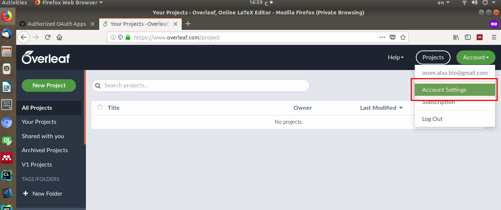
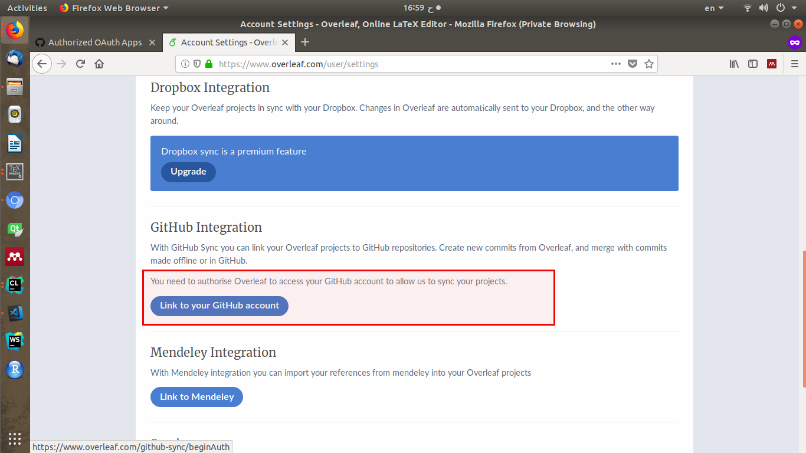

- Github will prompt you a message to authorize Overleaf to access your private and public repositories. 
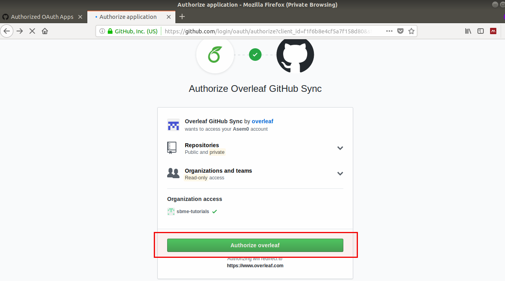

- After successfully authorizing Overleaf to access you Github repositories, get back to your Overleaf projects.
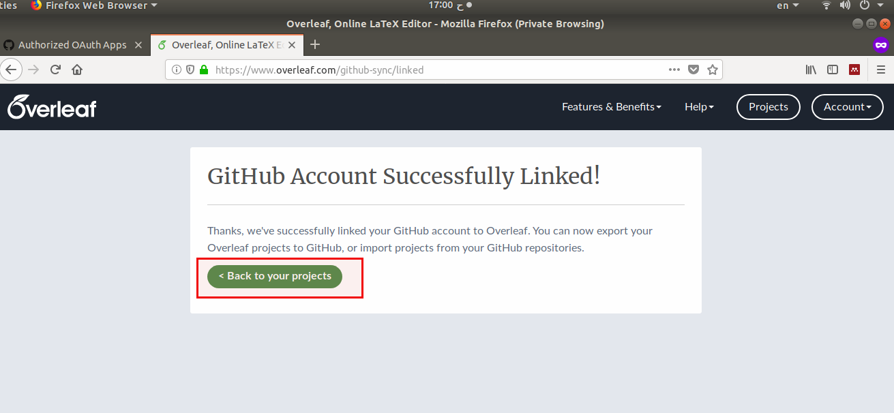

### Import your Repository of The LaTeX Document of Interest

- To start using Overleaf on your LaTeX documents at Github, create a new project and select **import from Github**.
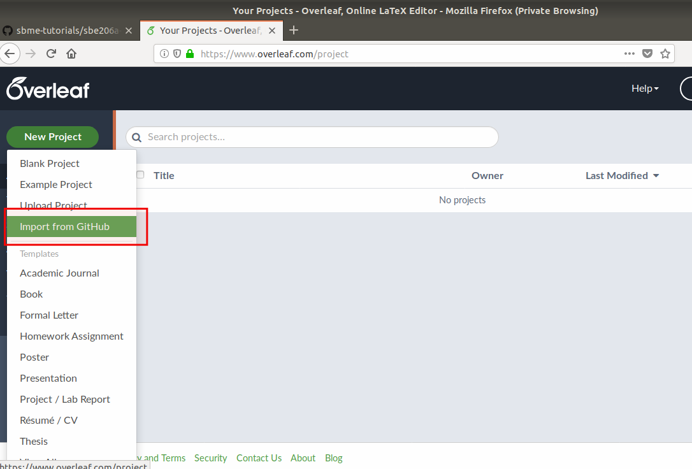

- You will see a list of Github repositories owned by you, select the assignment repository to be imported to the Overleaf.
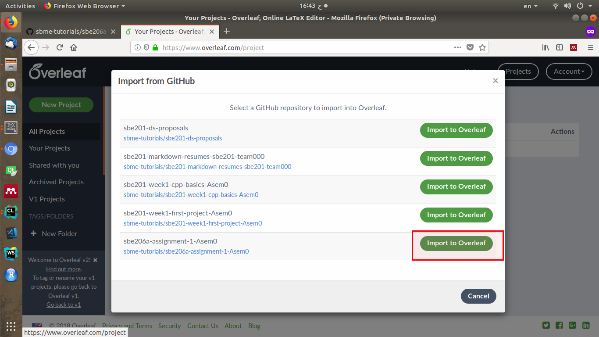

### Make your Edits

- Start working on your document via Overleaf.
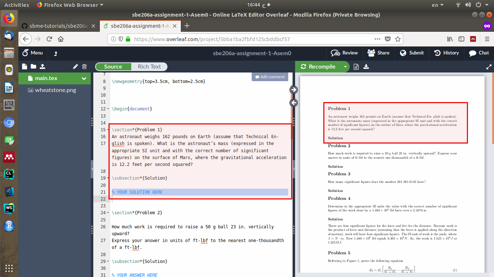

- To observe your changes on the generated PDF, press **CTRL+S** or click on **Recompile**.
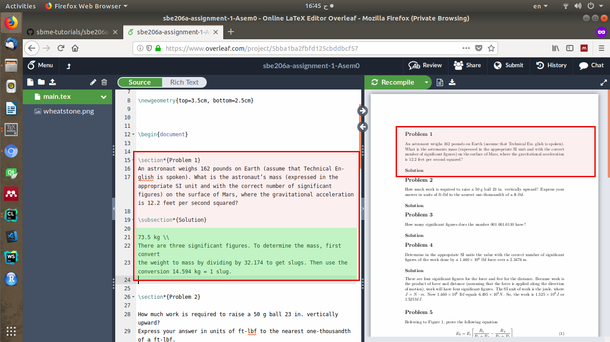
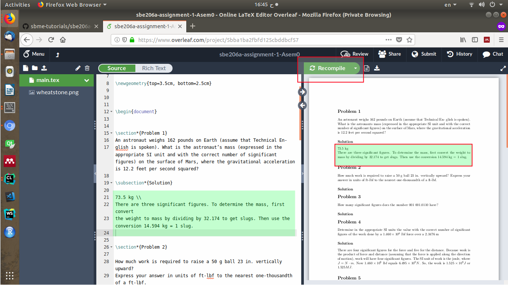

### Push Changes Back to The Github Repository

After finishing all or some problems, you may apply your changes to the original document at Github.

- Open the **Menu** tab.
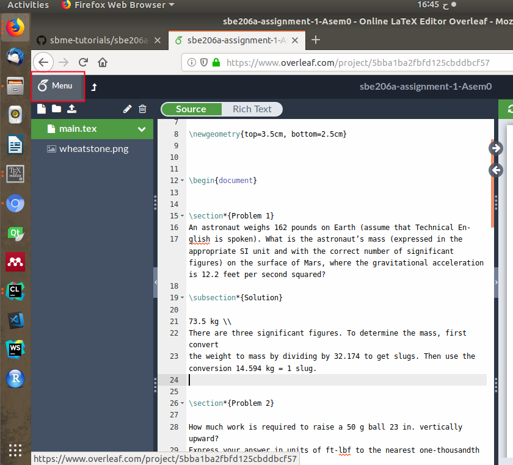

- Select *Syncing* your project to Github.
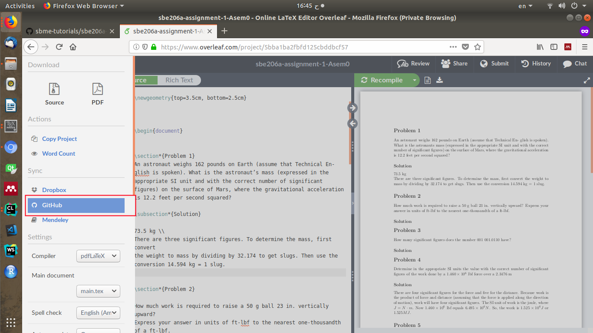

- A prompt will ask you whether you need to push your changes to your Github repository. Proceed with pushing your changes.
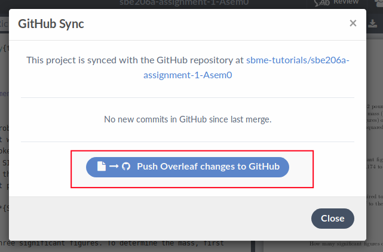

- Write your **commit** message of git
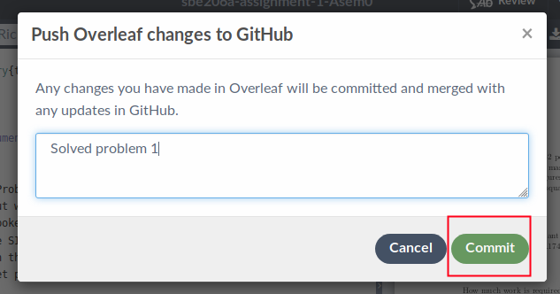

- Finally, realize your changes on your Github repository.
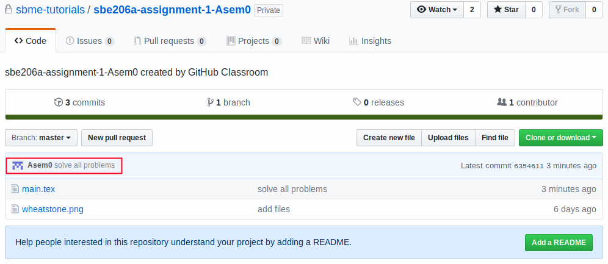