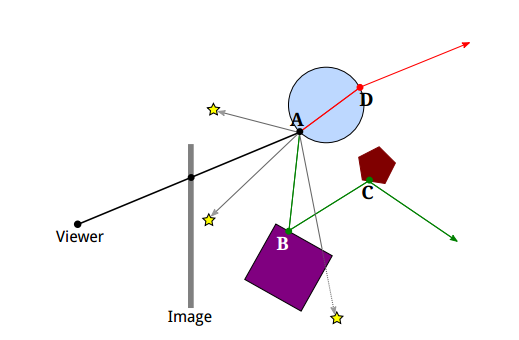
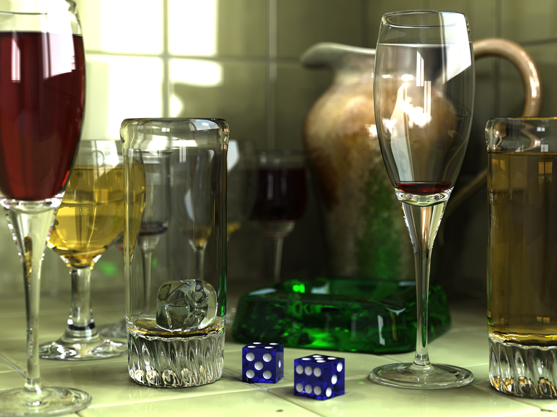
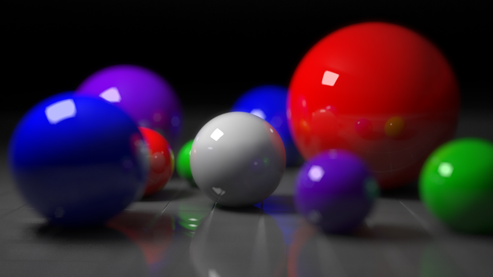
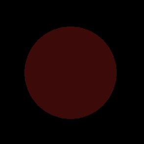

---
# You don't need to edit this file, it's empty on purpose.
# Edit theme's home layout instead if you wanna make some changes
# See: https://jekyllrb.com/docs/themes/#overriding-theme-defaults
layout: page
category: "notes"
course: "sbe306"
year: "2019"
title: "Ray Casting & Animation"
---
* TOC
{:toc}

## Ray Casting

### Vision Process 

In human vision process is as follow

1. Lights drop on objects
2. Then it is reflected (scattered) in all directions 
3. Reflected light rays are received by the eye and image is formed.

The same is for pinhole camera model 


**Idealy**

* There is an infinite number of rays 
* Multiple reflections happen for the same ray on different objects 

So how we simulate this in computer graphics ?
Keep in mind that the objective is to get a 2D image of the scene. 

### Ray Casting

**Basic Idea**
The process is reversed where rays are sent from camera position instead of receive it at camera position. 

Pseudo code for ray casting  
```python 
for each pixel:
    Send a ray through the scene
    Find the interection with objects 
    Calculate the color at this intersection 
    Assign this color to that pixel where ray was sent from
```


### Ray Tracing




* It is the same idea with more complex calculations
* Rays must be checked with all objects in the scene by tracking its reflections recursively. 

* It is computationally extensive and time consuming process but has realistic results

* It is used for creating visual effects and not applicable in interactive applications (Games)


Sample of generated images with ray tracing [(source)](https://en.wikipedia.org/wiki/Ray_tracing_(graphics))






## Lighting

### Classical lighting models

* Ambient lighting : 
It is an approximation of uniform light without light source. It illuminate all objects equally. 
* Diffuse lighting
The light is reflected in all direction due to roughness of the surface. 

* Specular lighting:
Reflection of the light in one direction (Smooth surface).


**Enabling lightening in OpenGL**

You need to define color properties and enable it. 

```c
// Here we have a red light source
float light_ambient[] = {1.0, 0.0, 0.0, 1.0};
float light_diffuse[] = {1.0, 0.0, 0.0, 1.0};
float light_specular[] = {1.0, 1.0, 1.0, 1.0};
// This is the light position
float light_position[] = {0.0, 0.0, 4.0, 1.0};

// Setting light source properties and enabling it
glLightfv(GL_LIGHT1, GL_POSITION, light_position);
glLightfv(GL_LIGHT1, GL_AMBIENT, light_ambient);
glLightfv(GL_LIGHT1, GL_DIFFUSE, light_diffuse);
glLightfv(GL_LIGHT1, GL_SPECULAR, light_specular);
glEnable(GL_LIGHT1);
glEnable(GL_LIGHTING);
```

This is an example of a solid sphere 

**No light sources**


**Only ambient is set**



**Ambient, diffuse and specular**


## Animation Key concept 

The key concept of animation is to compose a set of frame with different poses of the model and blend these frames one after another to get the object animated. 

Think of it like video capturing. You capture multiple frames through time and view these frames in a specific rate (Frame rate).

Frame by frame animation

[Useful tutorial](https://www.youtube.com/watch?v=f3Cr8Yx3GGA)

For example this is first pose


And this is the second pose


And this is the third pose 


and so on 

When we run these poses with time it will seem that the object is moving.


