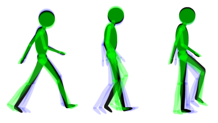
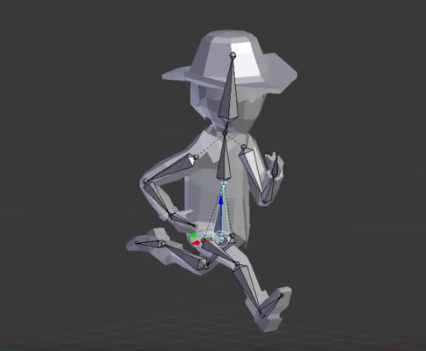

---
# You don't need to edit this file, it's empty on purpose.
# Edit theme's home layout instead if you wanna make some changes
# See: https://jekyllrb.com/docs/themes/#overriding-theme-defaults
layout: page
category: "notes"
course: "sbe306"
year: "2019"
title: "Animation"
---

## Key concept 
The key concept of animation is to compose a set of frame with different poses of the model and blend these frames one after another to get the object animated. 

Think of it like video capturing. You capture multiple frames through time and view these frames in a specific rate (Frame rate).

Frame by frame animation

[Useful tutorial](https://www.youtube.com/watch?v=f3Cr8Yx3GGA)

For example this is first pose

And this is the second pose

And this is the third pose 

and so on 

When we run these poses with time it will seem that the object is moving.

