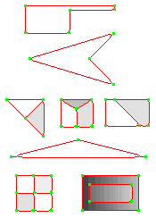
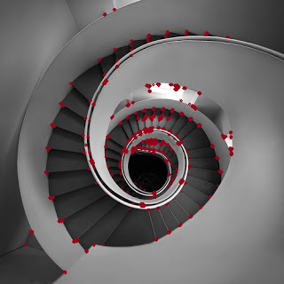
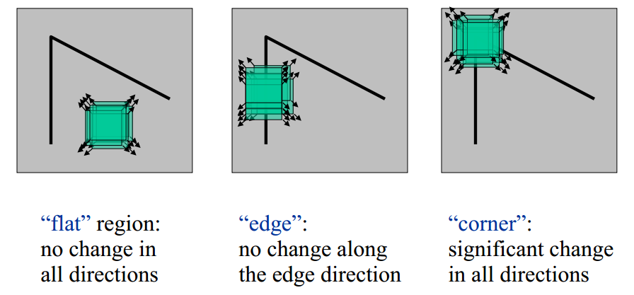
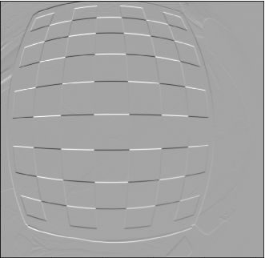
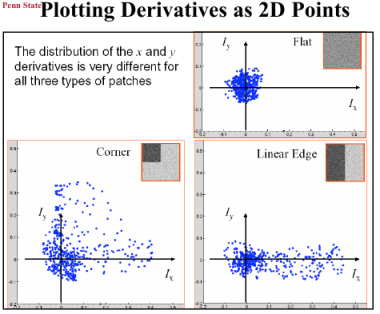
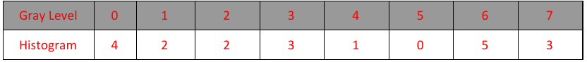
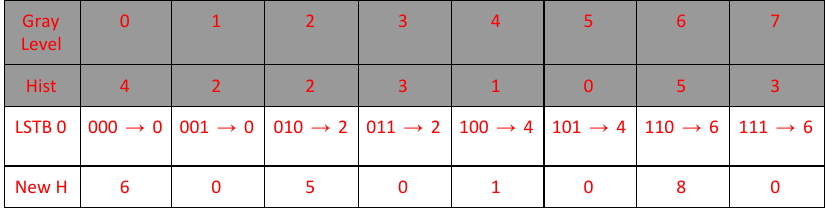
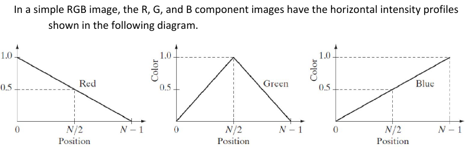

<textarea id="source">


class: top, left
## Corner Detection

By: Asem Alaa

---

class: top, left
## Feature Detection



---



---


---
class: top, left

### Challenges

* .red[Patch (image) matching]
--
  * .green[Distinctive features]
--
* .red[Geometric transformations (translation, rotation, scale)]
--
  * .green[Robust and efficient]
--
* .red[Photometric (brightness, exposure)]
--
  * .green[Many preprocessing options can be applied]


---
class: top, left
## Harris operator: corner detector



--

---
## Compute the .red[principal] vectors of variation at location `p` 


---
## Harris operator
### Step 1: image smoothing (optional)

--
$$ L(p,\sigma ) = \[I * G_\sigma \](p) $$

```python
 signal.convolve2d(img, gaussian_kernel(7,1.0) ,'same')
```


---
## Harris operator
### Step 2: compute $I_x$ and $I_y$

Many options to compute the $I_x$ and $I_y$ exist:

1. First order difference.
2. Prewitt kernel
3. Sobel kernel

```python
Ix = signal.convolve2d( img , sobel_h ,'same')
Iy = signal.convolve2d( img , sobel_v ,'same')
```

 

---
## Harris operator
### Step3: construct the Hessian (Hesh'n) matrix $M$

We will construct the Hessian matrix so we are able to compute the principal vectors of variation.

--
$$ M(p) = 
\begin{bmatrix}
I_x^2       & I_xI_y \\\
I_xI_y       & I_y^2
\end{bmatrix}
$$

--
```python
Ixx =  np.multiply( Ix, Ix) 
Iyy =  np.multiply( Iy, Iy)
Ixy =  np.multiply( Ix, Iy)
```

---
## Harris operator
### Step3 (Alternative): construct the Hessian (Hesh'n) matrix $M$ .red[over a window]

* If we need more robust detection
--
* Compute $M$ over a window (e.g $3 \times 3$)
--
* Now can detect larger corner that lives inside a window of pixels, instead of a single pixel.

--
$$
\hat{M}(p) = \sum_{i,j}  w(i,j)
\begin{bmatrix}
I_x^2       & I_xI_y \\\
I_xI_y       & I_y^2
\end{bmatrix}
$$

--
$$
\hat{M}(p) =
\begin{bmatrix}
\sum w(i,j) I_x^2(i,j)       & \sum  w(i,j) I_xI_y(i,j) \\\
\sum  w(i,j) I_xI_y(i,j)       & \sum w(i,j) I_y^2(i,j)
\end{bmatrix} 
$$

---
## Harris operator
### Step3 (Alternative): construct the Hessian (Hesh'n) matrix $M$ .red[over a window]

$$
\hat{M}(p) =
\begin{bmatrix}
\hat{I_x^2}       & \hat{I_xI_y} \\\
\hat{I_xI_y}       & \hat{I_y^2}
\end{bmatrix}
$$

--
```python
Ixx =  np.multiply( Ix, Ix) 
Iyy =  np.multiply( Iy, Iy)
Ixy =  np.multiply( Ix, Iy)

Ixx_hat = signal.convolve2d( Ixx , box_filter(3) ,'same') 
Iyy_hat = signal.convolve2d( Iyy , box_filter(3) ,'same') 
Ixy_hat = signal.convolve2d( Ixy , box_filter(3) ,'same') 
```


---
## Harris operator
### Step 4: compute $\lambda_1$ and $\lambda_2$ of $\hat{M}$

* Hessian matrix


* Eigen vectors and Eigen values
  * values (amount of variation)
  * vector (variation direction)


---




---
## Harris operator
### Step 4: compute $\lambda_1$ and $\lambda_2$ of $\hat{M}$

--
$$|H - \lambda I | = 0$$

---
## Harris operator
### Interpretation of $\lambda_1$ and $\lambda_2$


---
## Harris operator
### Step 5: evaluate corners using $R$ as a measure

--
$$R = (\lambda_1 \times \lambda_2) - k (\lambda_1 + \lambda_2)$$


---
## Harris operator
### Step 4 (Alternative): evaluate $R$ directly without $\lambda_1$ and $\lambda_2$

#### Indirect solution

--
$$det(M) = \lambda_1 \times \lambda_2$$

--
$$trace(M) = \lambda_1 + \lambda_2 $$

--
##### Instead of calculating $\lambda_1, \lambda_2$

--
* $R = det(\hat{M}) - k * trace(\hat{M})$
--
* Trace is sum of diagonal elements 

---
## Harris operator
### Step 4 (Alternative): evaluate $R$ directly without $\lambda_1$ and $\lambda_2$

$$
\hat{M}(p) =
\begin{bmatrix}
\hat{I_x^2}       & \hat{I_xI_y} \\\
\hat{I_xI_y}       & \hat{I_y^2}
\end{bmatrix}
$$

$$R = det(\hat{M}) - k * trace(\hat{M})$$


```python
K = 0.05

detM = np.multiply(Ixx_hat,Iyy_hat) - np.multiply(Ixy_hat,Ixy_hat) 
trM = Ixx_hat + Iyy_hat
R = detM - K * trM 
```

---
## Harris operator
### Finally

```python
corners = ???
```

Select large values of $R$, using whatever thresholding heuristic in mind.


#### Thresholding options:
- constant absolute value 
  - (e.g `corners = np.abs(R) > 2.5`)
--
- relative to maximum value 
  - (e.g `corners =  np.abs(R) > 0.2 * np.max(R)`)
--
- relative to quantile value 
  - (e.g `corners =  np.abs(R) > np.quantile(np.abs(R),0.9)`)


```python
corners = np.abs(R) >  np.quantile( np.abs(R),0.999)
```
---
## Harris operator
### Results

--
 


---
## Harris operator overview


---

calss: top, left
## FAST Corner Detector
* Features from Accelerated Segment Test (FAST)
* Real-time applications.


---

calss: top, left
## FAST Corner Detector
* Basic Algorithm

```python
1. Select Pixel p with intensity $$I_p$$ 
2. Select Threshold t
3. Consider circle with 16 pixels.
4. Calculate absolute difference $$I_p - I_i$$ and i =1 to 16
5. P is a corner if n points have absolute difference > t and n >= 6
6. Suppress weak corners (None-Max suppression)
```

--
* High Speed Test 

```python
4. Calculate absolute difference $$I_p - I_i$$ Considering i =1, 9, 5, 13 only.
5. P is a corner if n points have absolute difference > t and n >= 3
6. Suppress weak corners (None-Max suppression)
```
--
* None-Max suppression

```python
For successive corners.
1. For each corner point p
1. Compute score V which is sum of absolute difference between point p and 16 circle points.
2. Suppress if not local maximum. 
```
**Lets See Implementation**
---


---
## Midterm Spring 2018 Revision

<style type="text/css">
  .smaller { font-size: 15px; }
</style>

### Q1


.smaller[
1. Find the number of gray levels. 
2. Find the image carrier and its cardinality. 
3. What is the number of all possible images that can be defined for this image carrier and numbegray levels?
4. Find the image mean and median. 
5. Find the absolute image histogram.
6. Find the absolute image histogram after the least significant bit is set to 0. In general, what effect would setting to zero the lower-order bit planes have on the histogram of an image?
7. Find the absolute image histogram after the most significant bit is set to 0. In general, what effect would setting to zero the higher-order bit planes have on the histogram of an image?
8. Find and plot the means of the horizontal intensity profiles. 
9. Find the L​1​ and L​2​ distances between the first and last vertical intensity profiles. 
]

---
## Midterm Spring 2018 Revision

### Q1


* Find the number of gray levels. 
--
  * .red[8 = $2^3$]
--
* Find the image carrier and its cardinality.
--
  * .red[Image carrier: {$ (x,y) : 1 \leq x \leq 5  \land  1 \leq y \leq 4 $} $\subset Z^2$ ]
  * .red[Cardinality = $5 \times 4 = 20$]
--
* What is the number of all possible images that can be defined for this image carrier and number of gray levels?
--
  * .red[$8^{20}$]
--
* Find the image mean and median.
--
  * .red[mean=3.5, median=3]

---
## Midterm Spring 2018 Revision

### Q1


* .smaller[Find the absolute image histogram.]


--


--
* .smaller[Find the absolute image histogram after the least significant bit is set to 0. In general, what effect would setting to zero the lower-order bit planes have on the histogram of an image?]
--


--
.red[.smaller[The effect is compressing histogram of the image by clustering each two successive levels to lower one.]]


---
## Midterm Spring 2018 Revision

### Q1


* .smaller[Find the absolute image histogram after the most significant bit is set to 0. In general, what effect would setting to zero the higher-order bit planes have on the histogram of an image?]

--


--
.red[.smaller[The effect is that the image contrast will decrease and image will be darker.]]

---
## Midterm Spring 2018 Revision

### Q1


* Find and plot the means of the horizontal intensity profiles. 

--
.red[| index | horizontal profile mean |
|--|--|
| 1 | 5 |
| 2 | 2.6 |
| 3 | 5.6 |
| 4 | 0.8 |]


---
## Midterm Spring 2018 Revision

### Q1


1. Find the $L​_1$​ and $L​_2$​ distances between the first and last vertical intensity profiles. 
  
--
.red[* first column: $a = \[6, 7, 4, 0\]^T $
* last column: $b = \[7, 1, 2, 1 \]^T$]

--
.red[$$L_1 = \frac{1}{4} \sum_0^3 |a_i - b_i| = 2.5$$
$$L_2 = \frac{1}{4} \sqrt{ \sum_0^3 (a_i - b_i)^2 } = 1.5$$]

---
## Midterm Spring 2018 Revision
### Q2 - a

Use the exponential representation of the sine function to show that the DFT of the discrete function 
$$f(x,y) = sin( 2 \pi u_0 x + 2\pi v_0 y )$$

is 


$$F(u,v) = \frac{i}{2} \left[ \delta (u + N_c u_0, v+ N_r v_0) - \delta(u - N_c u_0, v - N_r v_0)\right]$$


---
## Midterm Spring 2018 Revision
### Q2 - b

b) Consider a $3 \times 3$ spatial mask that averages the four closest neighbors of a point $(x, y)$ , but excludes the point itself from the average.

1. Write an expression for the filter, $h(x, y )$ , in the spatial domain. 
2. Show that the equivalent filter, $H(u, v )$ , in the frequency domain is given by
$$ H(u,v) = \frac{1}{2}\[ cos(2 \pi u / N_c) + cos(2 \pi v / N_r) \]$$
3. Show that $H (u, v )$ is a low-pass filter.

---
## Midterm Spring 2018 Revision
### Q3



1.  What color would a person see in the first, middle, and last columns of this image? 
2.  What are the cyan (C), magenta (M), and yellow (Y) components of the first, middle, and last columns of this image?
3.  What are the hue (H), saturation (S), and intensity (I) components of the first, middle, and last columns of this image?


---
## Midterm Spring 2018 Revision
### Q4 - a

The rectangle in the binary image below is of size $4 \times 5$ pixels.


1. What would the magnitude of the gradient of this image look like based on using the approximation
$$ || grad I(x,y) || = |S_x(x,y)| + |S_y(x,y)| $$
Where $S_x$ and $S_y$ are obtained using the Sobel operators. Show all pixel values in the gradient image. 
2. Sketch the histogram of the gradient directions $\phi(x, y) = tan^{-1} \frac{S_y (x,y)}{S_x(x,y)}$. Be precise in labeling the height of each component of the histogram. 
3. What would the Laplacian of this image look like based on the following approximation?
$$ \nabla^2 I(x, y ) = I(x + 1, y ) + I(x − 1, y) + I(x, y + 1) + I(x, y − 1) − 4I(x, y)$$

---
## Midterm Spring 2018 Revision
### Q4 - b

A biomedical engineering student is assigned the job of inspecting a certain class of images generated by an electron microscope. In order to simplify the inspection task, the student decides to use digital image enhancement techniques and, to this end, examines a set of representative images and finds the following problems:

1. bright, isolated dots that are of no interest;
2. lack of sharpness;
3. not enough contrast in some images;
4. shifts in average intensity, when this value should be K to perform correctly certain intensity measurement
5. The student wants to correct these problems and then display in white all intensities in a band between $u_1$ and $u_2$ , while keeping normal tonality in the remaining intensities. 
6. Propose a sequence of processing steps that the student can follow to achieve the desired goals.

---
## Midterm Spring 2018 Revision
### Q5 (True or False)

1. In a grid cell model of image pixels, a pixel is a homogeneously shaded square cell. 
2. The 2D DFT maps a scalar image into a weighted sum of complex exponentials on the unit circle in the complex plane.
3. Low frequencies represent homogeneous ​multiplicative​ contributions to the input image while high frequencies represent local ​continuities​ in the image.
4. Directional patterns in an input image create value distributions in the DFT of the image in an orthogonal direction.
5. The 2D CIE Color Space represents the ​brightness and colors ​perceived by the average person. 
6. A 2D Gauss filter can be decomposed into two subsequent 1D Gauss filters. 
7. Computer screens have typically ​less​ available colors than color printers.​ ​
8. Illumination artifacts between subsequent or time-synchronized images violate the intensity constancy assumption.
9. For corner detection using the Hessian matrix, if the magnitude of both eigenvalues is ​large​, then we are at a low-contrast region while two ​small​ eigenvalues identify a corner.
10. In the edge following step of the canny edge detector, the paths of pixel locations p with gray level values exceeding the ​higher threshold​, i.e. $g(p) > T\text{high}$ , ​are traced, and pixels on such a path are marked as being edge pixels.


class: center, middle
# Thanks    
    


</textarea>
