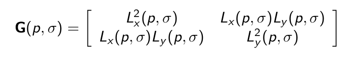

<textarea id="source">


class: top, left
##   Corner Detection

By: Eslam Adel 

email: eslam.a.mahmoud@eng1.cu.edu.eg

---

class: top, left
## Feature Detection

### Challenges

* Patch (image) matching
--
* Geometric transformations (Translation, Rotation, Scale)
--
* Photometric (Brightness, exposure )


---
class: top, left
### Good Feature

* Distinctive (unique)
* Robust & efficient 
* General


[source](http://aishack.in/tutorials/features/)
---

class: top, left
## Corner Detector

* Flat region 

* Edge 

* Corner


--

Variation in all directions

--

Corner is a good feature
---

class: left, top
## How to detect corners
* Hessian matrix


* Eigen vectors and Eigen values

  values (amount of variation), vector (variation direction)

 


---

class:center ,middle


  $$|H - \lambda I | = 0$$
--
Complex computation.

---

class: top, left
## Harris operator
* Instead of calculating $$\lambda_1, \lambda_2$$ 
* Lower complexity

 $$  Harris = det(H(p)) - a * trace(H(p))$$ 

where a is  a constant. 

* Trace is sum of diagonal elements 

**Lets try to implement it**.

---


class: top, left
## Harris and Stephens operator
* Instead of second order derivative Hessian matrix
* first-order derivatives of smoothed version (gaussian). 



 $$ H = \frac{det(G)}{trace(G)}  $$ 
 
 or 
 $$  H = det(G) - a * trace(G)$$ 
 

 Select large values 

 **Lets See implementation**

---

calss: top, left
## FAST Corner Detector
* Features from Accelerated Segment Test (FAST)
* Real-time applications.


---

calss: top, left
## FAST Corner Detector
* Basic Algorithm

```python
1. Select Pixel p with intensity $$I_p$$ 
2. Select Threshold t
3. Consider circle with 16 pixels.
4. Calculate absolute difference $$I_p - I_i$$ and i =1 to 16
5. P is a corner if n points have absolute difference > t and n >= 6
6. Suppress weak corners (None-Max suppression)
```

--
* High Speed Test 

```python
4. Calculate absolute difference $$I_p - I_i$$ Considering i =1, 9, 5, 13 only.
5. P is a corner if n points have absolute difference > t and n >= 3
6. Suppress weak corners (None-Max suppression)
```
--
* None-Max suppression

```python
For successive corners.
1. For each corner point p
1. Compute score V which is sum of absolute difference between point p and 16 circle points.
2. Suppress if not local maximum. 
```
**Lets See Implementation**
---

class: center, middle
# Thanks    
    


</textarea>
