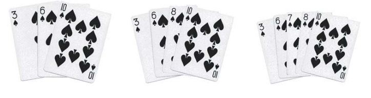
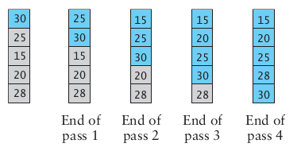
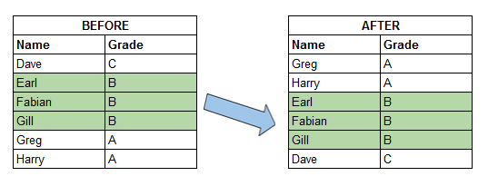
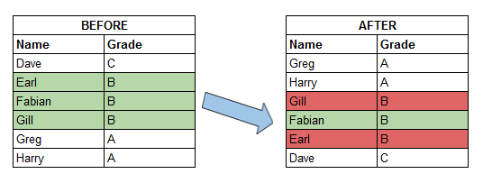
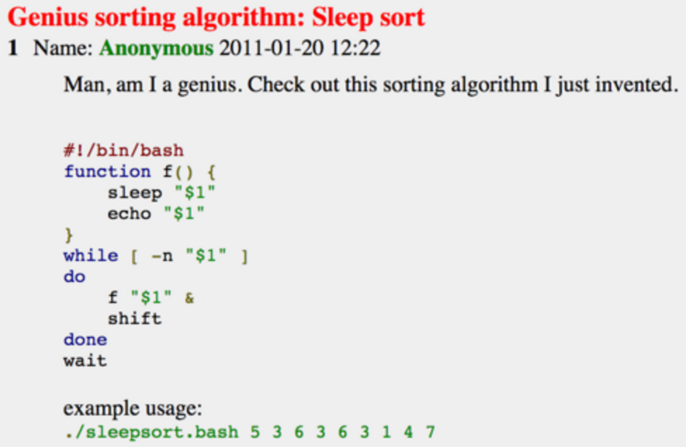
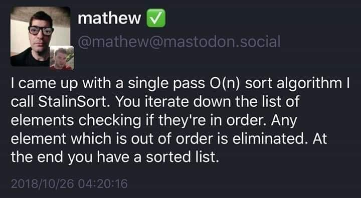
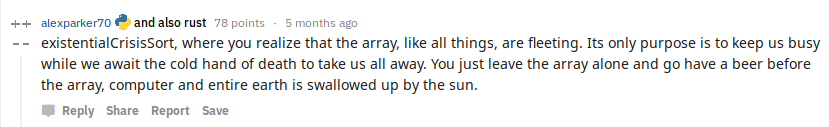

<textarea id="source">


---
## Sorting overview

1. .green[Bubble sorting]: $O(n^2)$
2. .green[Selection sorting]: $O(n^2)$
3. .green[Heap sort]: $O(nlog(n))$
--
1. Insertion sort
--
1. Merge sort
--
1. Quick sort


---
## Insertion sorting
.footnote[Objects Abstraction Data Structures and Design Using C++, Elliot B. Koffman and Paul A.T. Wolfgang]

* Inspired by Cards players.

--


--
.center[]


---
### Insertion sorting: in-class demo


--
```c++
void insertionSort(std::vector<int> &data)
{
for (int i = 1; i < data.size(); ++i)
{
for (int j = i; j > 0; --j)
{
   if (data[i] <data[j-1] )
{
   std::swap(data[j], data[j - 1]);
} else break;
}
}
```

--
#### Pull-request to add the implementation

---
## Divide and Conquer Strategy: The Merge Sorting

1. Break the big problem into smaller ones.
2. Solve the smaller problems.
3. Combine the solutions to get the solution of the big problem.

---
| Merge Sort animated |
|--------------------|
|  |
| [Creative Commons](https://en.wikipedia.org/wiki/File:Merge-sort-example-300px.gif) |

---
### Complexity Analysis

| Merge Sort Analysis via diagram |
|-----------------|
|  |
| [CC-BY-NC-SA](https://www.khanacademy.org/computing/computer-science/algorithms/merge-sort/a/analysis-of-merge-sort) |

---
For advanced details, see [Analysis of merge sort \| Khan Academy](https://www.khanacademy.org/computing/computer-science/algorithms/merge-sort/a/analysis-of-merge-sort).


---
### Implementation

--
#### Divide and Conquer

```c++
void mergeSort( std::vector< double > &a , int low, int high)
{
	if (low < high)
	{
		int mid=(low+high)/2;
		// Split the data into two half.
		mergeSort(a, low, mid);
		mergeSort(a, mid+1, high);
 
		// Merge them to get sorted output.
		merge(a, low, mid, high);
	}
}
```

---
#### Combine the small solutions
##### Make external copies

```c++
void merge( std::vector< double > &a , int low, int mid , int high )
{
    int n1 = mid - low + 1;
    int n2 =  high - mid;
 
    std::queue<double> left, right;
    
    for (int i = 0; i < n1; i++)
        left.push( a[low + i] );
    for (int i = 0; i < n2; i++)
        right.push( a[mid + 1 + i]);
}
```

---
#### Combine the small solutions
##### combine the solutions

```c++ 
int offset = low;
while( !left.empty() && !right.empty())
{
    if( left.front() < right.front())
    {
        a[ offset ] = left.front();
        left.pop();
    }
    else
    {
        a[ offset ] = right.front();
        right.pop();
    }
    ++offset;
}
```

---
#### Combine the small solutions
##### combine the solutions

```c++
while( !left.empty())
{
    a[ offset++ ] = left.front();
    left.pop();
}
while( !right.empty())
{
    a[ offset++ ] = right.front();
    right.pop();
}
```

---
### John Von Neumann

| John Von Neumann (1903-1957) |
|--------------------|
|  |

--
* Game Theory
--
* Quantum Mechanics
--
* Ergodic Theory
--
* Computer Science
--
* [{Manhattan Project}](https://en.wikipedia.org/wiki/Manhattan_Project).


---
## Divide and Conquer Strategy: The Quick Sorting


| Quick Sort animated |
|--------------------|
|  |
| [source](https://www.tutorialspoint.com/data_structures_algorithms/quick_sort_algorithm.htm) |


---
Pivot selection:

1. first element
1. last element
1. median
1. random


---
### QuickSort: Implementation
#### Divide and Conquer

```c++
void quickSort( std::vector< double > &a, int low, int high)
{
    if (low < high)
    {
        int pIdx = partition(a, low, high);
        quickSort(a, low, pIdx - 1);  // Before pIdx
        quickSort(a, pIdx + 1, high); // After pIdx
    }
}
```

---

### QuickSort: Implementation
#### Solve smaller problems
```c++
int partition( std::vector< double > &a, int low, int high )
{
    int pivot = a[low];  
 
    int i = low , j = high;

    while( i <= j )
    {
        while( a[ i ] < pivot ) ++i;
        while( a[ j ] > pivot ) --j;
        if( i <= j )
            std::swap( a[i++] , a[j--]);
    }
    return low;
}
```


---
The source code:

```bash
git clone git@github.com:sbme-tutorials/sbe201-merge-quick.git
```


---
class: center
## Stable sorting vs. non-stable sorting

<figure >

<figcaption>Image showing the effect of stable sorting</figcaption>
</figure>

<figure >

<figcaption>Image showing the effect of unstable sorting</figcaption>
</figure>

[{Stability in Sorting Algorithms — A Treatment of Equality}](https://medium.freecodecamp.org/stability-in-sorting-algorithms-a-treatment-of-equality-fa3140a5a539)


---
## Stable sorting vs. non-stable sorting

--
### Stable Sorting Algorithms:-

- Insertion Sort
- Merge Sort
- Bubble Sort

--
### Unstable Sorting Algorithms:-

- Heap Sort
- Selection sort
- Quick Sort


---
## Sorting applications

--
1. Make data searchable (e.g binary search, suffix arrays).
--
1. Lossless compression algorithms (e.g suffix arrays).
--
1. Lossy compression algorithms (e.g sort eigen values in PCA)
--
1. Machine learning (e.g nearest neighbors)
--
1. Networks analysis (e.g minimum spanning trees)


---
## The Sound of Sorting

### "Audibilization" and Visualization of Sorting Algorithms


[{The Sound of Sorting}](http://panthema.net/2013/sound-of-sorting/)

---
<iframe width="560" height="315" src="https://www.youtube.com/embed/kPRA0W1kECg" frameborder="0" allow="autoplay; encrypted-media" allowfullscreen></iframe>


---
## Nonesense sorting algorithms

--
### Sleep sorting




---
## Nonesense sorting algorithms

--
### StalinSort



---
## Nonesense sorting algorithms

--
### Thanossort


---
## Nonesense sorting algorithms

--
### existentialCrisisSort



</textarea>
    
