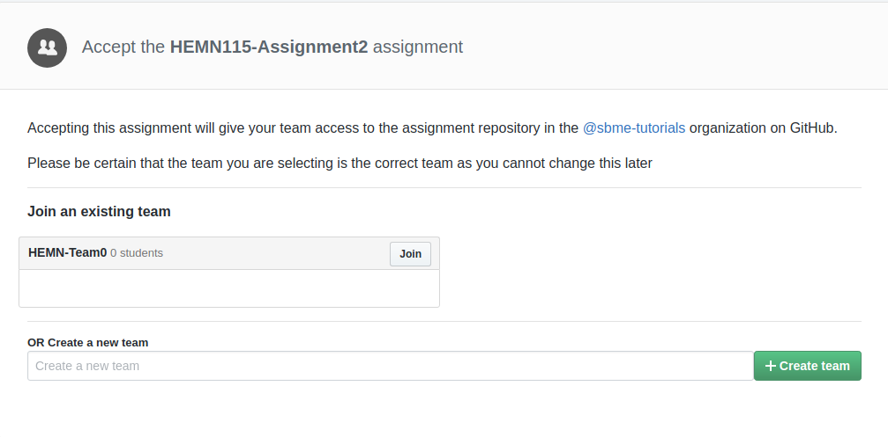

## Objectives

* Interaction with bio-signals using Matlab
* Fourier Transform of signal
* Signal Filtering
* Documentation using Markdown language

## Prerequisites (Before you start)

* Read [Section 5 Notes](){:target="_blank"}.

## Deadline

**Tuesday 30/10/2018**

## Joining to Assignment Repository

Refer to [this](https://docs.google.com/spreadsheets/d/1hdmFvHQYQybJCUS_TFgDmyFzorwZQOkQE6eTCSQDuew/edit?usp=sharing) sheet to know your **group number**: 

1. Go to the [Assignment Page](https://classroom.github.com/g/v_fUTPns).
2. Joint Group or make another group.

3. Wait till your repository created.

4. Open the link and Clone repository.`


## Part 1: Programming Matlab 

1. Plot the signal versus time (1 second per view). Need to scroll the view
2. Apply any 3 different filters on your signal, and plot the results.
3. Calculate and plot the Fourier transform of both the original and filtered signal.

## Part 2: Written

Report all details about your implementations in markdown file (Report.md). Report must show sample results of your code. Organize the report and be concise. State issues you faced in the assignment and how you treated with it. Mention any kind of contribution of other students.

## How to ask for help?

You can ask me to review your code, give an advice and fixing bugs. It is so easy, you have just to commit your buggy code and push it to github then mention me in the a comment and I will review the code.


## Important Notes 

* You are allowed to discuss task problems with your mates. But code must be on your own.
* You can get code lines from internet and include them in your own code and you must cite the source.
* Sharing few code lines of your own with your classmates is allowed for identifying and fixing bugs, it is not allowed to see others solution before submitting.
* Report must include summary about your implementation, sample results and issues that you faced and how you fixed it.
* You must mention any kind of contribution of other mates.

### Submitting

```terminal
$ git commit -a -m "solved all problems!"
$ git push origin master
```
