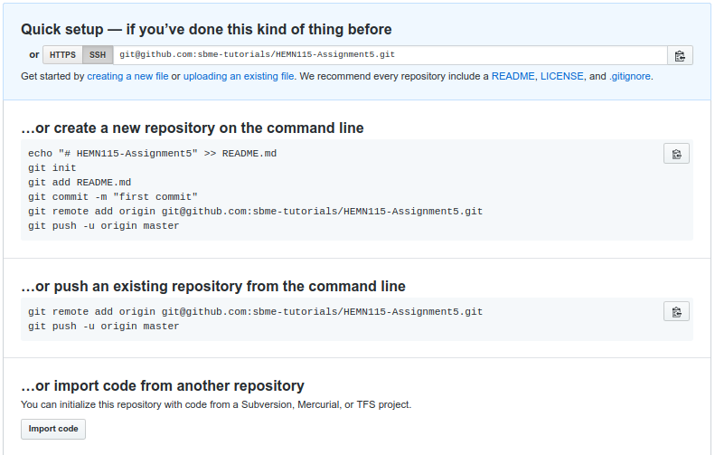

## Objectives

* Loading digital images
* Image enhancement
* Image segmentation

## Prerequisites (Before you start)

* Read [Section 12 Notes](){:target="_blank"}.

## Deadline

**Tuesday 18/12/2018** 

## Joining to Assignment Repository

Refer to [this](https://docs.google.com/spreadsheets/d/1hdmFvHQYQybJCUS_TFgDmyFzorwZQOkQE6eTCSQDuew/edit?usp=sharing) sheet to know your **group number**: 

1. Go to the [Assignment Page](https://classroom.github.com/g/1asDvYut).
2. Joint Group or make another group.
3. Wait till your repository created.
4. Open the link and follow instructions to setup your repository.



## Requirements

1. Load color RGB image.
2. Display the image on the screen.
3. Convert the image to a grayscale image and display it.
4. Get the histogram of the grayscale image and display it.
5. Apply histogram equalization on the grayscale image and display the result.
6. Get the histogram of the image after histogram equalization. Are they similar?
7. Segment the grayscale image using image thresholding and display the result.
8. Report all in a Markdown file.

## Important Notes 

* You are allowed to discuss task problems with your mates. But code must be on your own.
* You can get code lines from internet and include them in your own code and you must cite the source.
* Sharing few code lines of your own with your classmates is allowed for identifying and fixing bugs, it is not allowed to see others solution before submitting.
* Report must include summary about your implementation, sample results and issues that you faced and how you fixed it.
* You must mention any kind of contribution of other mates.

## How to ask for help?

You can ask me to review your code, give an advice and fixing bugs. It is so easy, you have just to commit your buggy code and push it to github then mention me in the a comment and I will review the code.


### Submitting

```terminal
$ git commit -a -m "solved all problems!"
$ git push origin master
```
