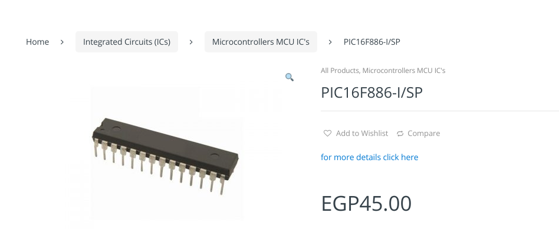
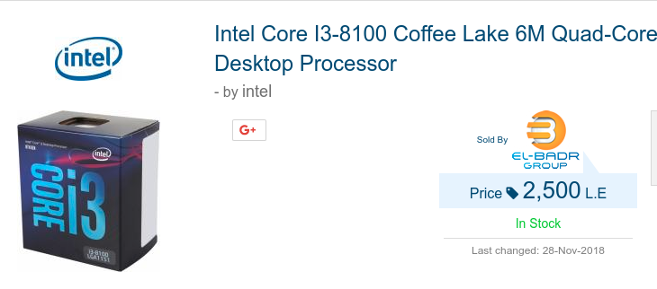
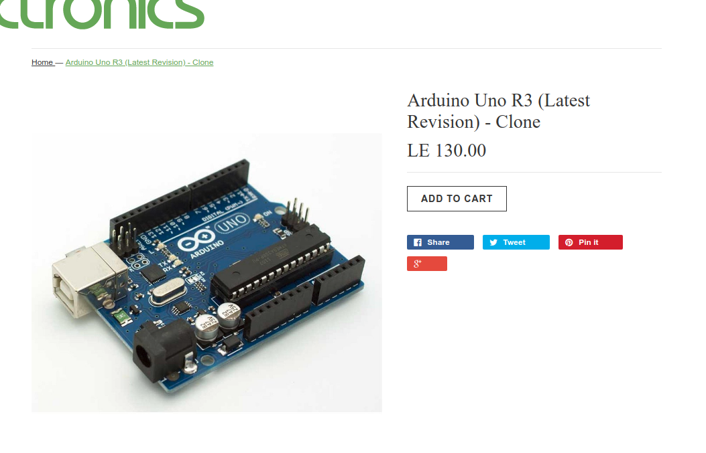
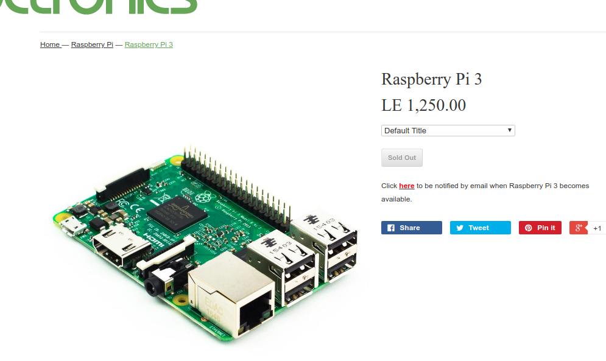
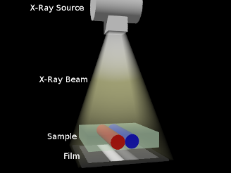
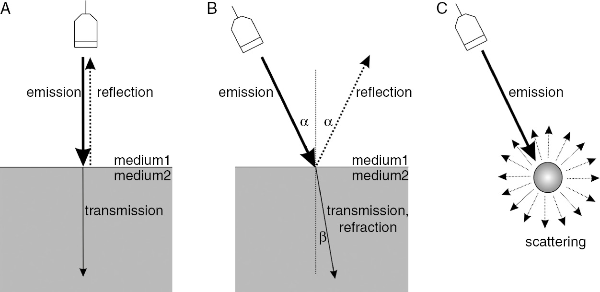
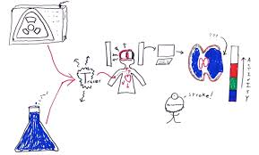

---
# You don't need to edit this file, it's empty on purpose.
# Edit theme's home layout instead if you wanna make some changes
# See: https://jekyllrb.com/docs/themes/#overriding-theme-defaults
layout: page
category: "notes"
course: "hemn115"
title:  "Week 11: Revision"
year: "2019"
by: "Eslam"
---

* TOC
{:toc}

## Midterm Mistakes

### Conversion 

* Kilo $$10^3 = 1000$$, in binary $$2^{10} = 1024$$
* Mega $$10^6$$, in binary $$2^{20}$$ 
* Giga $$10^9$$, in binary $$2^{30}$$ 

and So on 

To convert from byte to KByte Multiply or Divide ?

### Micro-controller, Microprocessor, Arduino and Raspberry pi

**Micro controller**

Suitable for production or manufacturing

* Advantages   
    * Cheap     
    * System on Chip (CPU + Interfaces) Standalone

* Disadvantages
    * More effort to configure and deploy
    * Processing power is very limited

**Micro-Processor**

It is the processor of your computer

* Advantages
    * High processing power
    * Multi-core and parallelism
* Disadvantages 
    * Very expensive
    * Not standalone (Need motherboard)

**Arduino**

For protyping and modeling

* Advantages
    * Relatively cheap
    * Huge support
  
* Disadvantages 
    * Limited processing power
    * Not suitable for production
  
**Raspberry Pi**

Mini Computer (Hand-held). For prototype of large projects

* Advantages
    * Full computer
    * High support
  
* Disadvantages
    * Limit computation power
    * Relatively expensive

## Imaging modalities

* X-ray imaging based on decay
  
  

* Ultrasound imaging based on reflection of sound due to sound speed 

* Nuclear imaging
  

