---
# You don't need to edit this file, it's empty on purpose.
# Edit theme's home layout instead if you wanna make some changes
# See: https://jekyllrb.com/docs/themes/#overriding-theme-defaults
layout: page
category: "notes"
course: "hemn115"
title:  "Week 12: Introduction to Image Processing"
year: "2019"
by: "Eslam"
---

* TOC
{:toc}

### Fundamental Block Diagram of Image Processing 

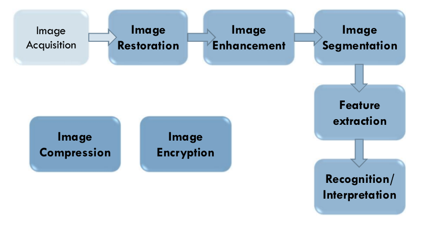

### Image Acquisition 

**Digital Camera**

* Matrix of CCD elements (photodiodes)

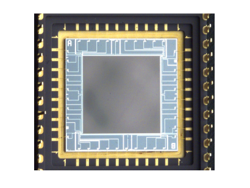

* Each pixel has 4 sensors (1 Red, 1 Blue, 2 Green)

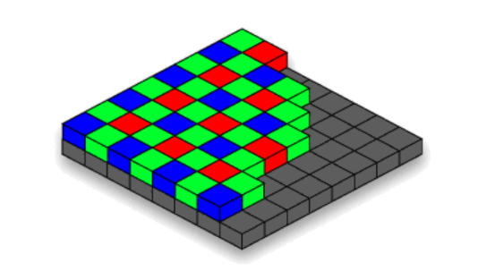

* Image projection 

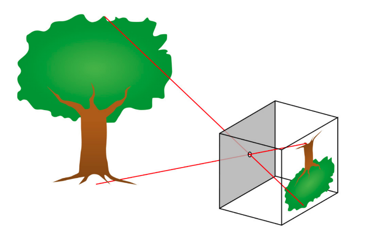


### Digital Image

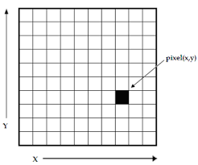


* Digital image is a matrix of pixels
Color of each pixel is determined by its RGB values 

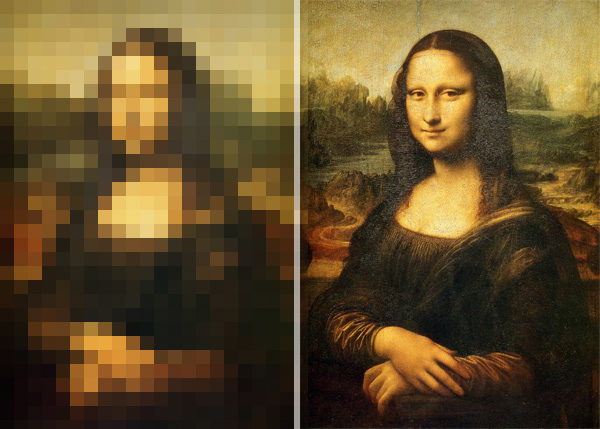

* For grayscale images only one channel determine the gray level


### Resizing images

**The Original Image**

```python
from scipy.misc import imresize
import matplotlib.pyplot as plt

im = plt.imread('black-dog.png')
```

**Resize the image**

```python
resizeFactors = [1, 0.2, 0.1, 0.05]
for factor in resizeFactors:
    plt.figure()
    plt.imshow(imresize(im, (int(im.shape[0]*factor), int(im.shape[1]*factor))))
    plt.title('Resized image with factor ' + str(factor))
plt.show()
```

The output 


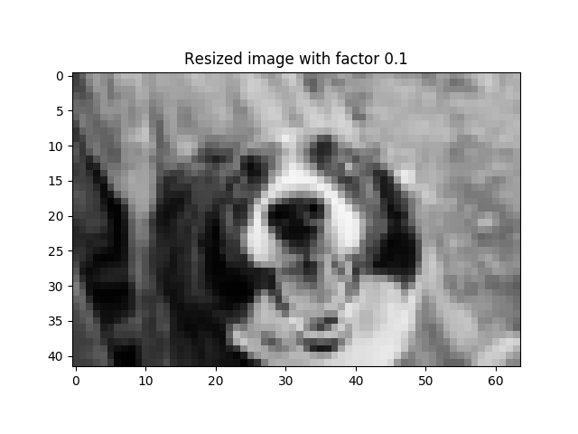


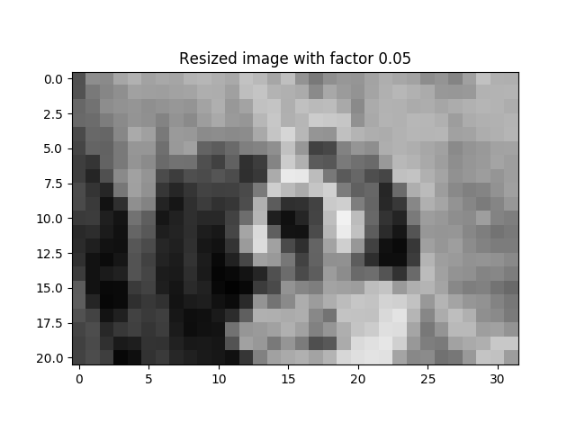

### Image Enhancement

Enhancing image contrast 

```python 
import cv2 
import numpy as np

img = cv2.imread('PgaNb.png',0)
equ = cv2.equalizeHist(img)
res = np.hstack((img,equ)) #stacking images side-by-side
cv2.imwrite('res.png',res)
```


Output 

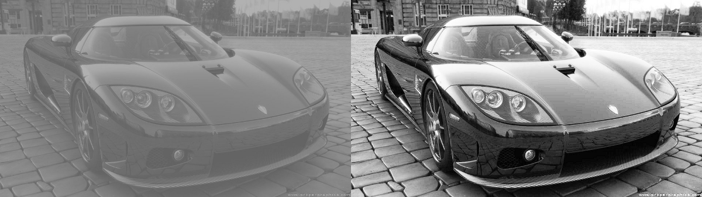


### Image Segmentation 

Convert the image to segments or isolated objects 

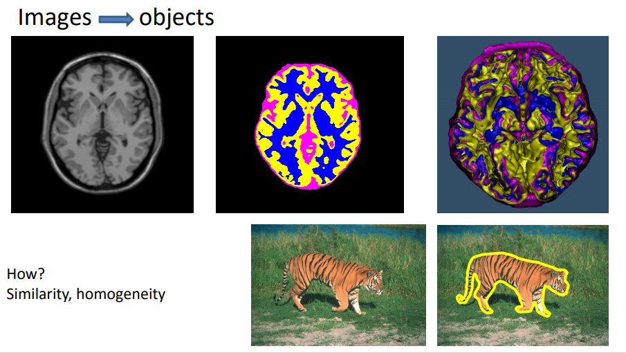

### Recognition and Interpretation

* Face and eye detection 

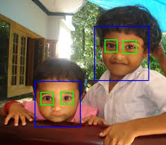


* Person detection 

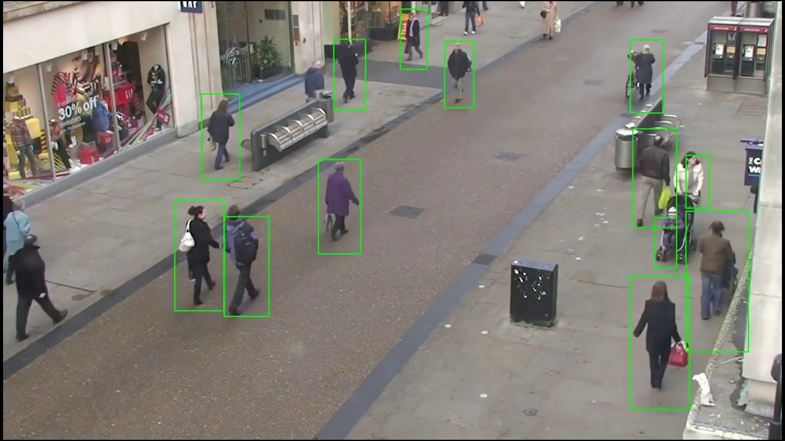

* Object detection (car)


* Object recognition 

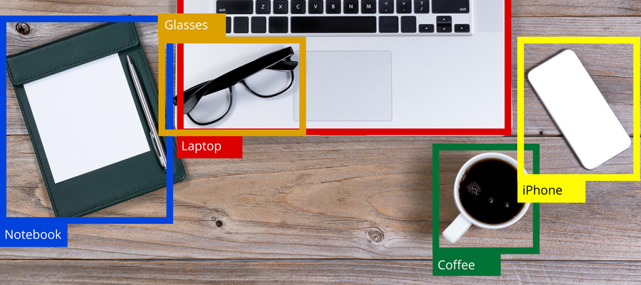

* Machine learning and classification 

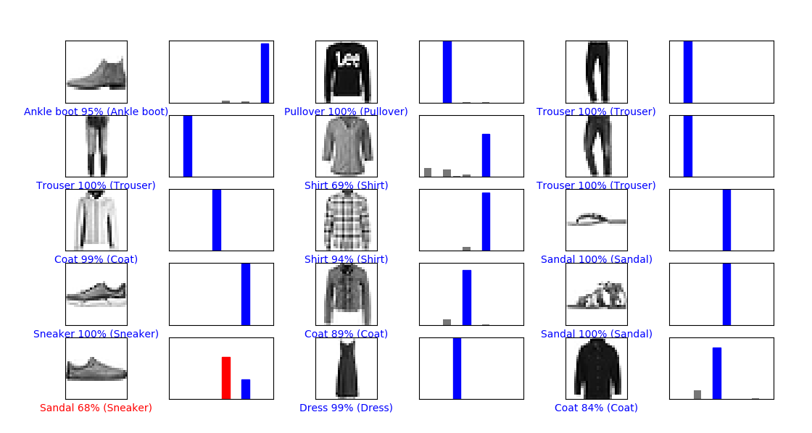

### Exercises 

True or False 

1. CCD Camera is    


