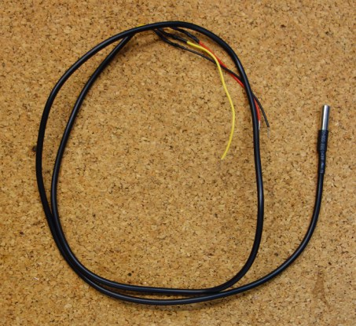
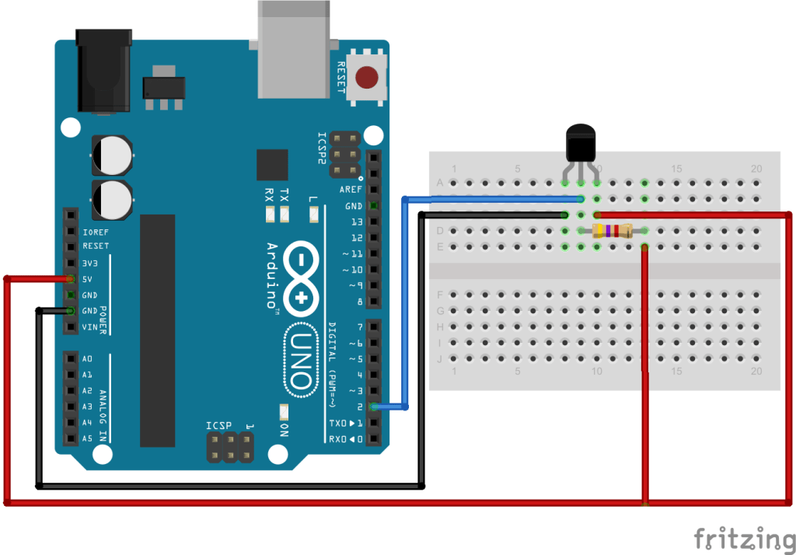
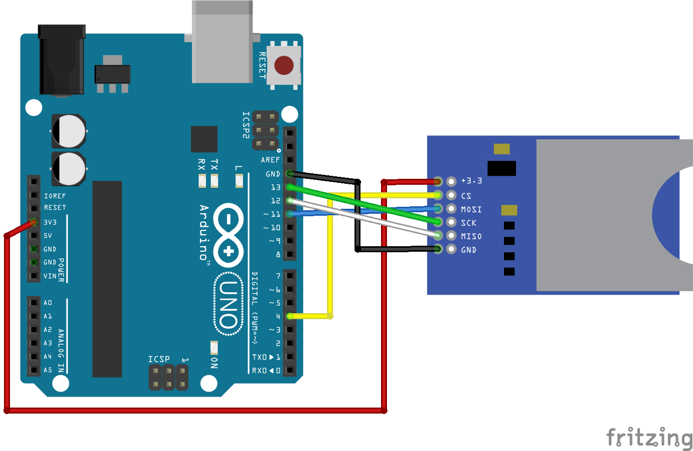

---
# You don't need to edit this file, it's empty on purpose.
# Edit theme's home layout instead if you wanna make some changes
# See: https://jekyllrb.com/docs/themes/#overriding-theme-defaults
layout: page
category: "notes"
course: "hemn115"
title:  "Week 3: Arduino Microcontroller"
year: "2019"
by: "Eslam"
---

* TOC
{:toc}

## Arduino Uno Kit 


**Kit specs** 
* Atmega328 microcontroller
 
* 14 I/O Digital pins (6 PWM)
* 6 Input pins (Analog)
* Clock speed 16 MHz
* Flash memory 32 KB
* USB port for programming

## DS18B20 Temperature Sensor
 1-wire digital temperature sensor. The sensor has just three pins as you can see in the following figure:


Red : VCC

Black : GND

Yellow : DQ

Operating range temperature: -55 to 125 Degree Celsius. 

Connection To arduino 

**Resistor is 4.7K**




To program it install this libraries 

[Onewire library](https://github.com/PaulStoffregen/OneWire/archive/master.zip)

[Dallas Temperature sensor library](https://github.com/milesburton/Arduino-Temperature-Control-Library/archive/master.zip)

To add the library to the arduino ide 


This is a simple example to use the temperature sensor 

```c
// Include the libraries we need
#include <OneWire.h>
#include <DallasTemperature.h>

// Data wire is plugged into port 2 on the Arduino
#define ONE_WIRE_BUS 2

// Setup a oneWire instance to communicate with any OneWire devices (not just Maxim/Dallas temperature ICs)
OneWire oneWire(ONE_WIRE_BUS);

// Pass our oneWire reference to Dallas Temperature. 
DallasTemperature sensors(&oneWire);

/*
 * The setup function. We only start the sensors here
 */
void setup(void)
{
  // start serial port
  Serial.begin(9600);
  Serial.println("Dallas Temperature IC Control Library Demo");

  // Start up the library
  sensors.begin();
}

/*
 * Main function, get and show the temperature
 */
void loop(void)
{ 
  // call sensors.requestTemperatures() to issue a global temperature 
  // request to all devices on the bus
  Serial.print("Requesting temperatures...");
  sensors.requestTemperatures(); // Send the command to get temperatures
  Serial.println("DONE");
  // After we got the temperatures, we can print them here.
  // We use the function ByIndex, and as an example get the temperature from the first sensor only.
  Serial.print("Temperature for the device 1 (index 0) is: ");
  Serial.println(sensors.getTempCByIndex(0));  
}
```

## Reading analog voltage

**Potentiometer (Variable resistor)**


Connection with arduino 


Sample Code 

```c
void setup() {
  // initialize serial communication at 9600 bits per second:
  Serial.begin(9600);
}

// the loop routine runs over and over again forever:
void loop() {
  // read the input on analog pin 0:
  int sensorValue = analogRead(A3);
  // Convert the analog reading (which goes from 0 - 1023) to a voltage (0 - 5V):
  float voltage = sensorValue * (5.0 / 1023.0);
  // print out the value you read:
  Serial.println(voltage);
}
```

## SD card 

Connection to arduino 



**Format your card at first**

Sample Code 

```c++
/*
  SD card read/write

 This example shows how to read and write data to and from an SD card file
 The circuit:
 * SD card attached to SPI bus as follows:
 ** MOSI - pin 11
 ** MISO - pin 12
 ** CLK - pin 13
 ** CS - pin 4 (for MKRZero SD: SDCARD_SS_PIN)

 created   Nov 2010
 by David A. Mellis
 modified 9 Apr 2012
 by Tom Igoe

 This example code is in the public domain.

 */

#include <SPI.h>
#include <SD.h>

File myFile;

void setup() {
  // Open serial communications and wait for port to open:
  Serial.begin(9600);
  while (!Serial) {
    ; // wait for serial port to connect. Needed for native USB port only
  }


  Serial.print("Initializing SD card...");

  if (!SD.begin(4)) {
    Serial.println("initialization failed!");
    return;
  }
  Serial.println("initialization done.");

  // open the file. note that only one file can be open at a time,
  // so you have to close this one before opening another.
  myFile = SD.open("test.txt", FILE_WRITE);

  // if the file opened okay, write to it:
  if (myFile) {
    Serial.print("Writing to test.txt...");
    myFile.println("testing 1, 2, 3.");
    // close the file:
    myFile.close();
    Serial.println("done.");
  } else {
    // if the file didn't open, print an error:
    Serial.println("error opening test.txt");
  }

  // re-open the file for reading:
  myFile = SD.open("test.txt");
  if (myFile) {
    Serial.println("test.txt:");

    // read from the file until there's nothing else in it:
    while (myFile.available()) {
      Serial.write(myFile.read());
    }
    // close the file:
    myFile.close();
  } else {
    // if the file didn't open, print an error:
    Serial.println("error opening test.txt");
  }
}

void loop() {
  // nothing happens after setup
}
```

## Task 2 

**Requirements**

1. Use Arduino to acquire two signals from two different sensors,

2. store the measurements on a SD card,

3. Raise an alarm if a measurement gets outside the range (below or above),

4. Plot the measurements (saved on the SD card) on your PC using Matlab or Python.

## Useful Links

[DS18B20 Temperature Sensor](https://randomnerdtutorials.com/guide-for-ds18b20-temperature-sensor-with-arduino/)

[Guide to SD Card with Arduino](https://randomnerdtutorials.com/guide-to-sd-card-module-with-arduino/)
