---
# You don't need to edit this file, it's empty on purpose.
# Edit theme's home layout instead if you wanna make some changes
# See: https://jekyllrb.com/docs/themes/#overriding-theme-defaults
layout: page
category: "notes"
course: "hemn115"
title:  "Week 5: Introduction to DSP"
year: "2019"
by: "Eslam"
---

* TOC
{:toc}

## Digital Signal Processing

### Signal 

Signal is a function that contains information. It is varying over time for one dimensional signal like sound, bio-signals, ... etc. It also may be varying  over space for 2D images.
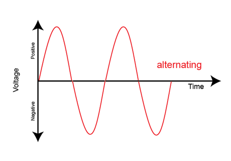
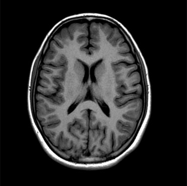

## Digital Signal

World is continuos or analog but We have limited memory to store signal value continuously. So we need to make it limited or digital. We need to sample the signal to get a good representation of the signal. 
For sampling process there is a sampling frequency in Hz or number of samples per second. Sampling time is the time between samples.

The relation is 

$$
F_s = \frac{1}{T_s} 
$$

Where $$F_s$$ is sampling frequency and $$T_s$$ is sampling period. 

Selection of sampling frequency depends on the signal its self. Our discussion now is will neglect this point. 


For 2D images sampling is in space so we use the resolution in x and resolution in y as a measure.

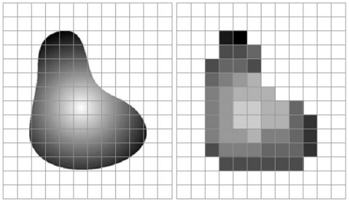


## Processing 

Applying some operation on the signal for enhancing signal and noise removal, extracting information from the signal and other purposes. 

### Fourier Transform

It is a complex representation of the signal in another domain. Fourier transform represents the frequency domain of the signal or frequency content. The basic idea is to represent the signal with sum of  different sinusoids have different magnitudes and phase shift. 

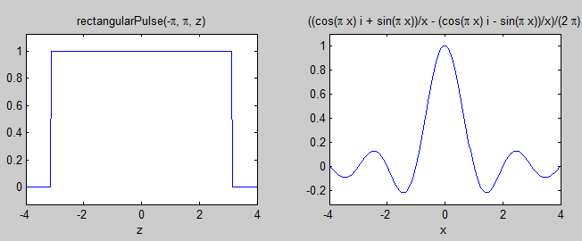
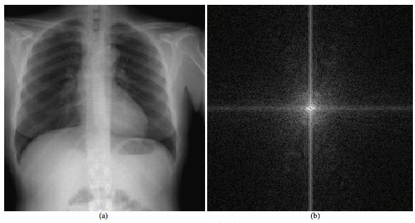

### Signal filtering 

Signal filtering is an essential step for signal processing. It is mainly used for signal enhancement, noise removal, and bandwidth selection. 

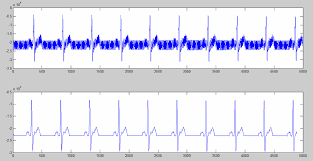


## Getting started with Matlab

### Variables 

Matlab is untyped language. You can define variable like this 

```matlab
x = 10;
y = 20; 
```
### Arrays and Matrices

Array is a vector of values and Matrix is a multi-dimensional vector. 

```matlab
% Define row vector
myRow = [1 5  6  8 6];

% Define column vector
myCol = [5; 9; 54; 84; 6]

% Define a matrix
myMatrix = [1 3 5;
            4 8 9;
            3 6 8]
```

**Colon Operator**

We used colon operator to generate vector. We also use it for indexing.

```matlab
% Step is 1
a  = 1:10 

% Step is 0.1
b = 1:0.1:10 
```

**Element wise multiplication**

We use dot operator (.) for element wise multiplication of matrices. 

```matlab
signal = [1, 2, 5, 6];
w = [1, 0, 1, 0];
out = w .* signal;
```

### Plotting 

To plot a signal use plot function

```matlab
% Define x with values from -1 to 1
x = -1:0.01:1;
% Define function y = f(x) and f(x) = x^2
y = x.^2;
% Now plot x and f(x) in a separate figure
figure, 
plot(x, y)
% Make a title to the figure
title('Plotting y = x^2')
% Make label for x and y axes
xlabel('x')
ylabel('y')
```

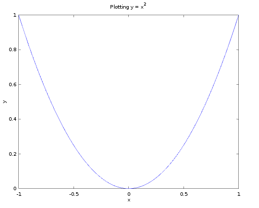

You can plot multiple plots in same figure using subplot function. 

Also you can plot two function on same plot and make a legend. 

### Control Structures

* if and if else
```matlab
if condition
    % Do something
else
    % Do  another thing
end
```

* For loop 
```matlab
for i = 1:5
    disp(i)
end
```

* While loop 
```matlab
while(condition)
    % do something
end
```
* switch, case
```matlab
switch(a)
case 1
    % Do something
case 2
    % Do another thing
otherwise
    % Do that by default
end
```

## Fourier Transform

In Matlab you can get fourier transform of the signal using fft function.

```matlab
% Sampling Frequency 
Fs = 100;
% Sampling Time 
Ts = 1/Fs;
% Time interval of signal first 10 seconds
t = 0:Ts:10;
% Sinusoidal signal
sig = sin(10.*t);
% Plot the signal 
figure,
plot(t, sig);
title('Sinusoidal signal sin(10t)');
xlabel('Time in second');
ylabel('Amplitude');

```

This is the sinusoidal signal

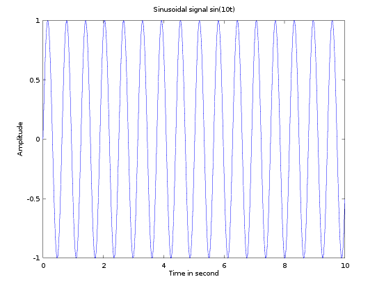

Now we want to get signal fourier magnitude and phase

```matlab
% To Get the Fourier domain of the signal
sigFourier = fftshift(fft(sig));
% Magnitude
sigFourierMag = abs(sigFourier);
% Phase 
sigFourierPhase = angle(sigFourier);
% Plotting Magnitude
figure,
plot(20*log10(sigFourierMag+1));
title('Magnitude of Fourier Domain of Signal sin(10t)');
```
This is the Magnitude of its fourier transform 
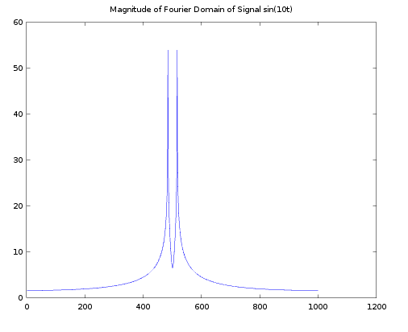

Lets plot the phase
```matlab
% Plotting Phase
figure,
plot(sigFourierPhase);
title('Phase of Fourier Domain of Signal sin(10t)');
```

This is the phase of fourier transform of the sinusoidal signal 

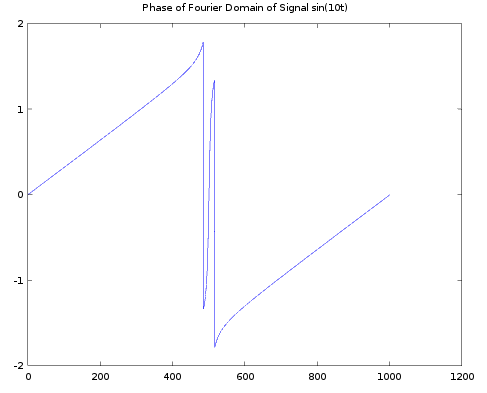

## Signal Filtering 

Loading and plotting ECG signal

```matlab
% Load Signals
load('signals.mat');
% Sampling Frequency is 250 Hz
Fs = 250;
Ts = 1/Fs;
% Lets take only 5 seconds from the signal
t = 0:Ts:5;
ecgSignal = sig_o4(1:length(t));
% Plot the original signal
figure,
plot(t, ecgSignal);
title('Original Signal');
xlabel('Time in seconds');
ylabel('Amplitude')
```
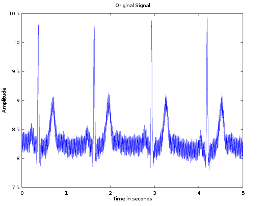

Filtering the signal using average Low Pass filter 
```matlab
% Filtering the signal using average filter
l  = 9;
mask = ones(1,l)/l;
% Apply the filter
clearEcg = conv(ecgSignal, mask,'same');
% Plot the result signal
figure,
plot(t, clearEcg);
title('Filtered Signal');
xlabel('Time in seconds');
ylabel('Amplitude');
ylim([min(ecgSignal), max(ecgSignal)])
```
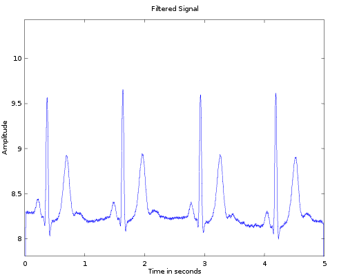

Comparing Fourier domain of both signals 

```matlab
% Compare fourier of both signals 
% Get FFT of original signal
ecgSigFFt = fftshift(fft(ecgSignal));
% Get FFT of filtered Signal
clearEcgFFt = fftshift(fft(clearEcg));
% Plot Both in same figure
figure,
subplot(2,1,1)
plot(20*log10(abs(ecgSigFFt)+1));
title('Fourier Magnitude of Original Signal');
subplot(2,1,2)
plot(20*log10(abs(clearEcgFFt)+1));
title('Fourier Magnitude of Filtered Signal');
```
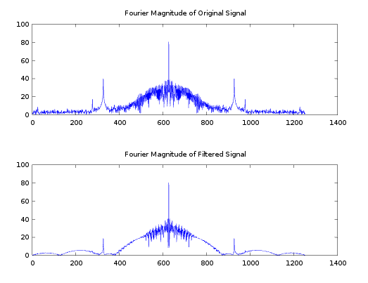