---
# You don't need to edit this file, it's empty on purpose.
# Edit theme's home layout instead if you wanna make some changes
# See: https://jekyllrb.com/docs/themes/#overriding-theme-defaults
layout: page
category: "notes"
course: "hemn115"
title:  "Week 6: Medical Instrumentation"
year: "2019"
by: "Eslam"
---

* TOC
{:toc}

## Medical Imaging
Visualize anatomy of an internal  organ of the body or a function of it. It replaces the surgical intervention and used for diagnostic purposes. 

### XRay 
Electromagnetic radiation is projected on the object and the shadow is mapped on the image. Bones appears white and soft tissues in black. Rays penetrate soft tissues but can't penetrate bones.

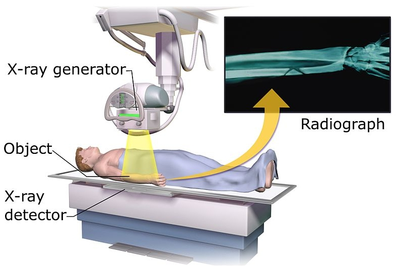

### Computed Tomography (CT)
CT is an enhanced version of XRay machine. It generated a series of images of the whole organ of the body. It enabled us to construct a 3D model of the organ. 

CT Still have limitation in imaging soft tissues. 

### Magnetic Resonance Imaging (MRI)

Magnetic Resonance imaging is another modality in medical imaging. It is perfect in imaging soft tissue, so it is used for spinal cord imaging to visualize nerves in accurate manner. It uses magnetic field to excite protons in soft tissues and record signal received from its spinning and decode it to construct the image. 
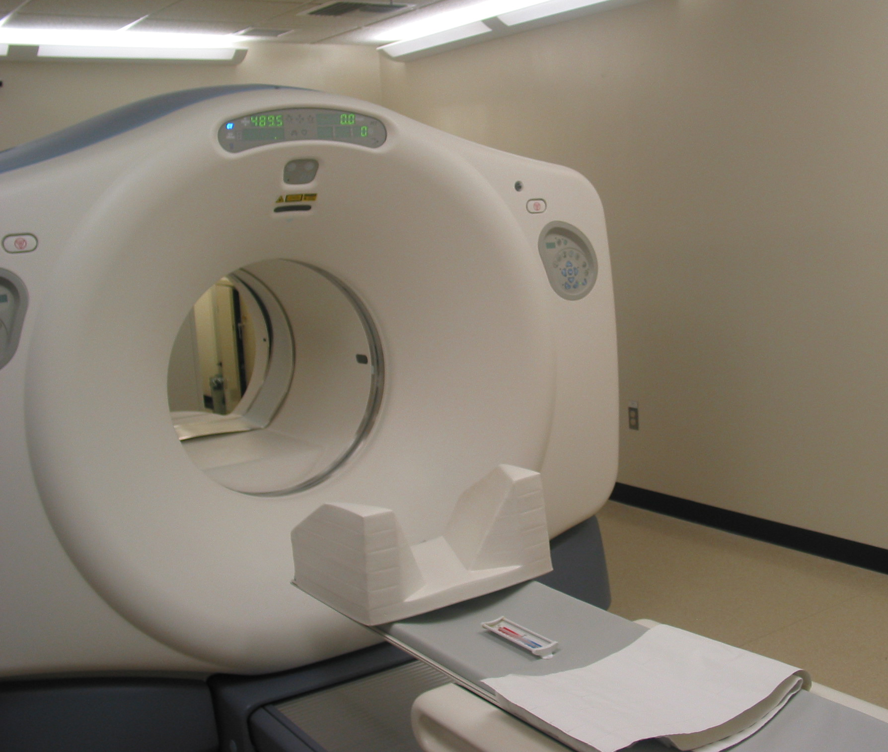
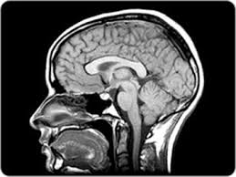
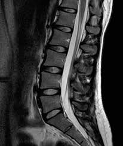

### Ultrasound 
Ultrasound uses sound wave that is sent through the body and received again after reflection at object boundaries. The received signal is decoded and image is reconstructed. Ultrasound is used for imaging fetus, heart and liver. Imaging bone structure is not applicable using ultrasound.  
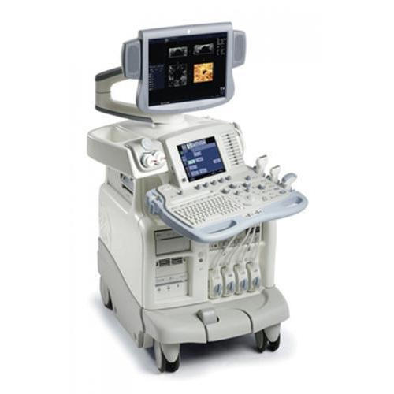
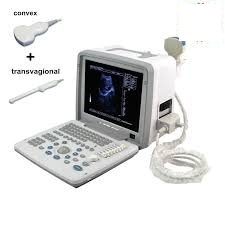
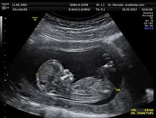

### Nuclear Medicine 
The use of radioactive substances in diagnosis and treatment of diseases. It is used to measure the functionality of the organs by imaging how body react with this radioactive substances (Radio-tracers). 

Large tumor in the liver. 

No Info about the anatomy here so in modern systems PET is combined with CT, where CT for anatomy and PET for physiology of the organ. 

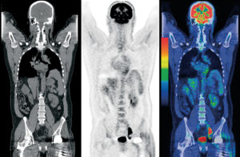

## Measurement Devices

Measurement of vital signs like heart rate, temperature, pressure, Oxygen level in blood, ... etc. 

### Patient Monitor 

Usually for intensive care unit (ICU) and inside operating rooms. Measures all vital signs in real time. Provide instantly discovering the error for fast action.
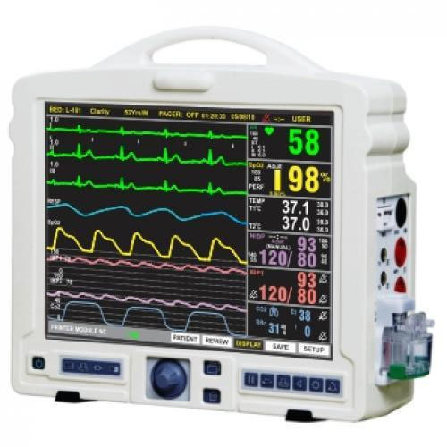

There also separate device for measuring ECG only, Blood pressure only and so on.

## Life Support Devices
* Ventilator
Help people who are not able to breathe or breathe insufficiently. 

There are different modes of ventilation for example
1. Assist mode : Person initiate the breathe 
2. Mandatory ventilation : No initiation
3. CPAP : For increasing Oxygen in alveoli. 

And more.

* Incubator

Or called neonatal intensive care unit. For premature infants. It insure ideal environment fot infants by controlling temperature, humidity, light ... etc. It also provide protection of infants from infection. 

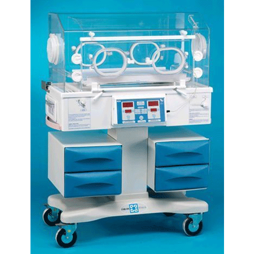

* DC Shock / Defibrillator
To prevent heart arythmia. 
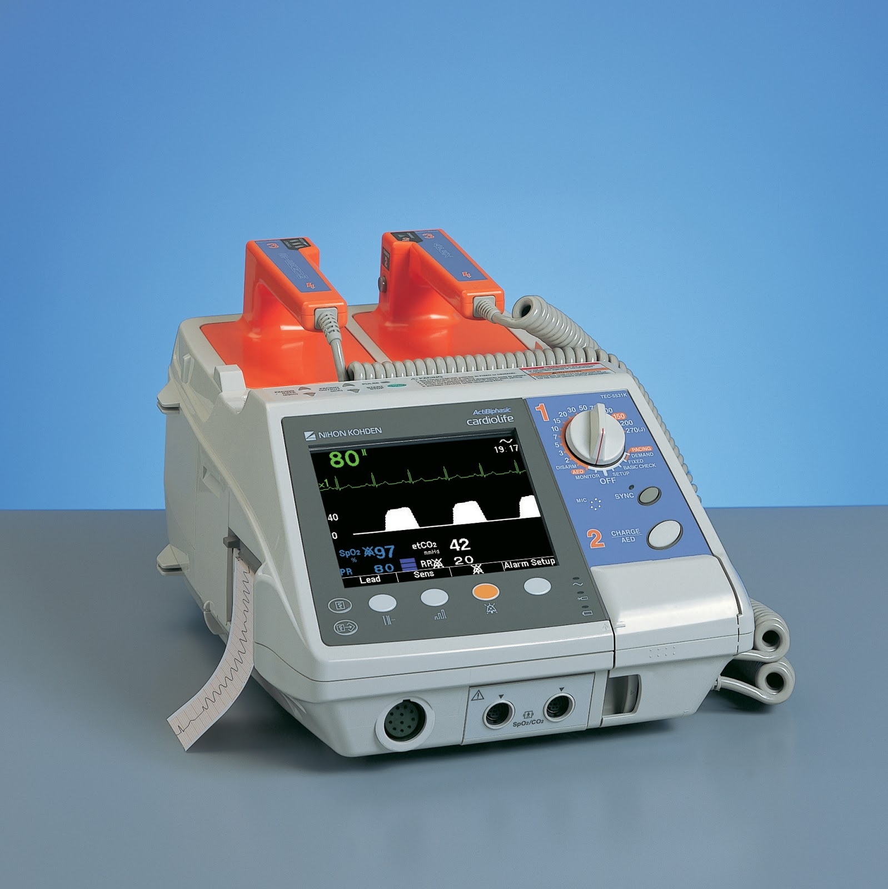

## Treatment Devices
* Hemodialysis
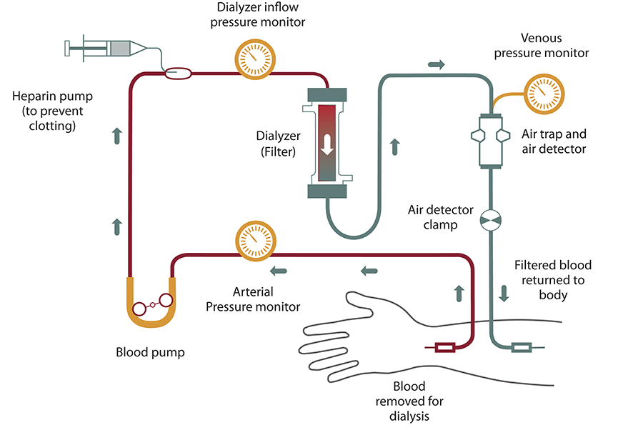
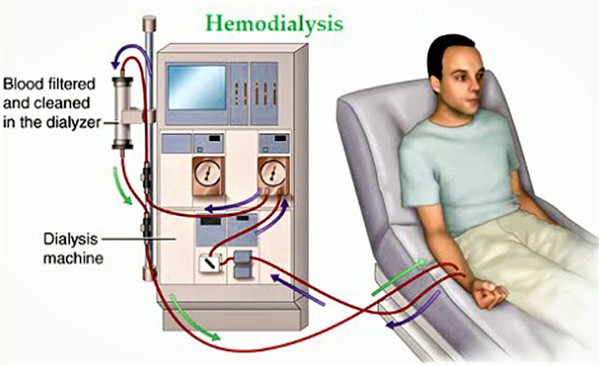

* Radiotherapy 

Linear accelerator (linac)

Cancer treatment. Killing cancer cells using radiation.
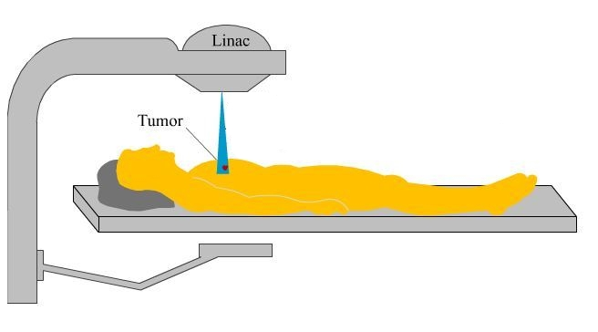
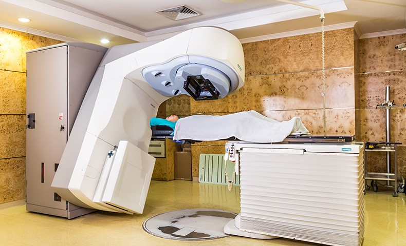