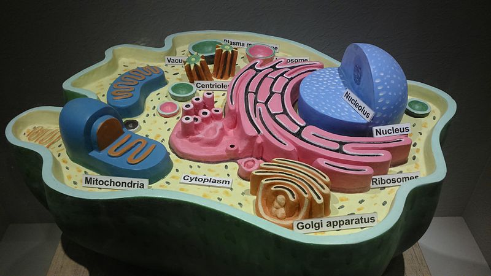
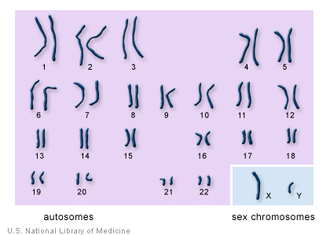
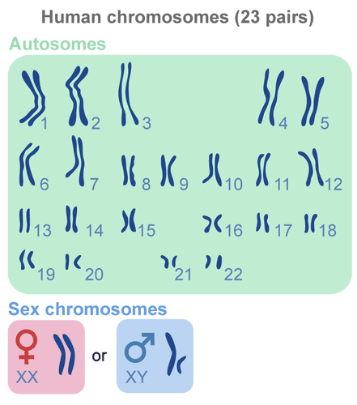
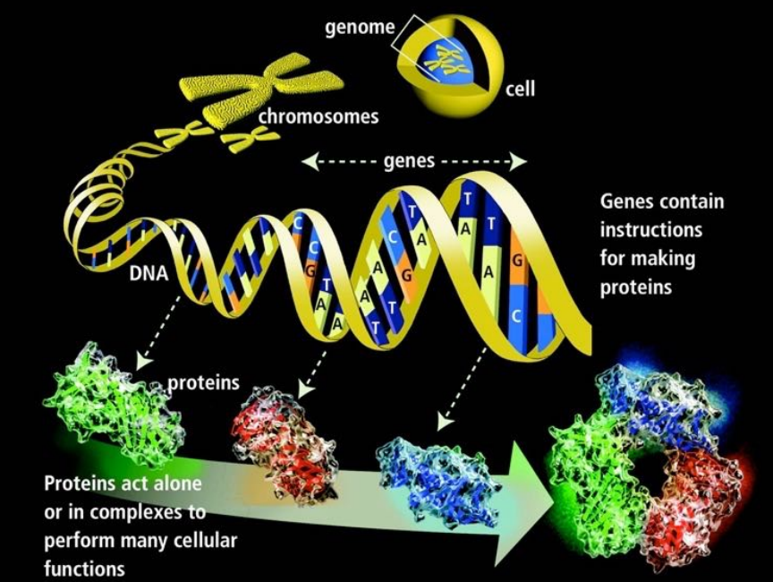
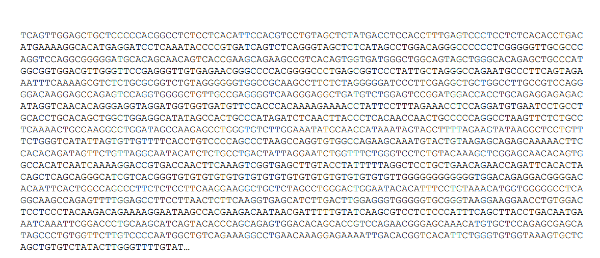

---
# You don't need to edit this file, it's empty on purpose.
# Edit theme's home layout instead if you wanna make some changes
# See: https://jekyllrb.com/docs/themes/#overriding-theme-defaults
layout: page
category: "notes"
course: "hemn115"
title:  "Week 7: Introduction to Bioinformatics"
year: "2019"
by: "Eslam"
---

* TOC
{:toc}

# Bioinformatics

Cell is the basic structural, functional and biological unit of all known living organisms. 

Cell nuclei contains cell's genetic materials DNA and RNA that forms the chromosomes. Human has 23 pairs of chromosomes. Genome is distributed along these chromosomes.

DNA stands for Deoxyribonucleic acids. DNA has two strands of four types of nucleotides.

* Adenine (A)
* Guanine (G)
* Cytosine (C)
* Thymine (T)
  
The two polymers are complementary to each other.

## Genome Data
This is how gnome data looks like

## Genome replication

[DNA replication 3D Video](https://www.youtube.com/watch?v=TNKWgcFPHqw)

replication origin problem and applications: gene therapy 

frost-resistant tomatoes

pesticide-resistant corn [link](http://www.genewatch.org/sub-568238)

First human gene therapy experiment [link](https://history.nih.gov/exhibits/genetics/sect4.htm)

Online course [link](http://www.hcbravo.org/cmsc423/calendar/)

