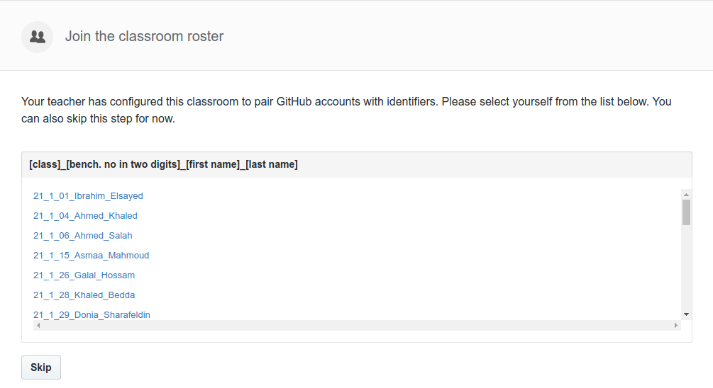
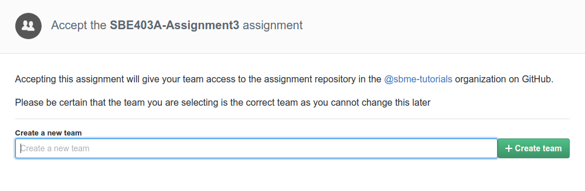
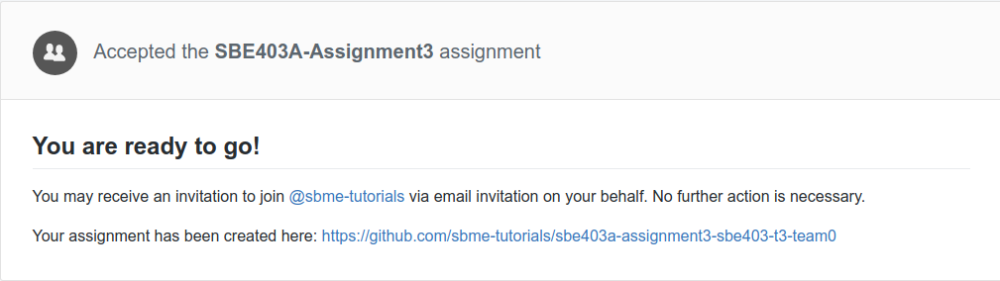
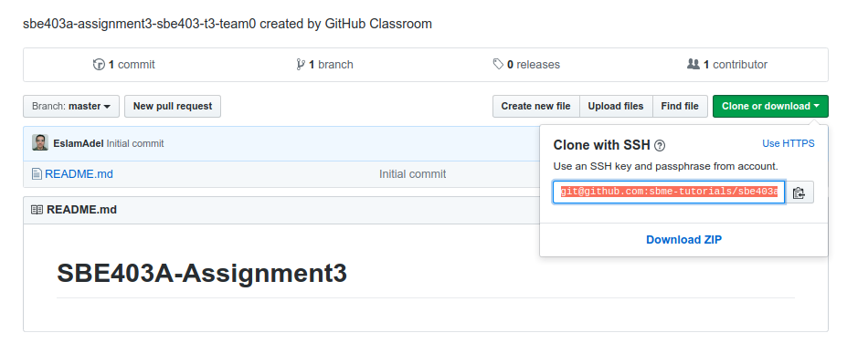
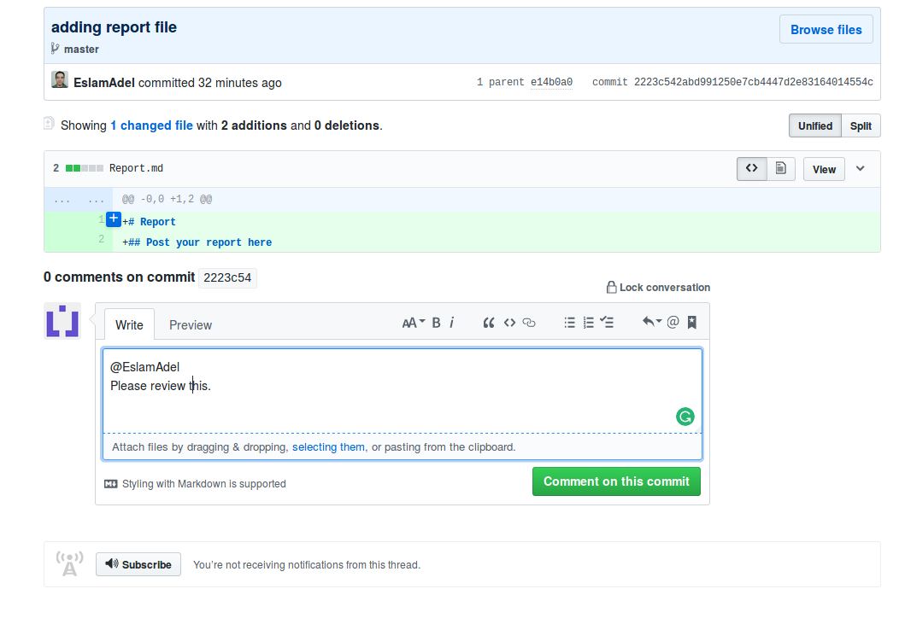

## Deadline

Deadline for online submission is **Wednesday 24/10/2018**.

## Joining to Assignment Repository

Refer to this [sheet](https://docs.google.com/spreadsheets/d/11VQe8X_r_I-VvTGBHARTOybL7Umu7yXfOuouuMljMD8/edit?usp=sharing) to know your team number.

1. Go to the [Assignment Page](https://classroom.github.com/g/IL8V8RP1).
2. Skip Classroom roster

3. Joint your team or create it.

4. Wait till your repository created.

5. Open the link and Clone repository.
```bash
git clone URL
```



## Important Notes 

1. All group members must join their groups in their assignment repository 
2. More credit for students who are more active with more contributions. 
3. Don't use github as a Dropbox or a Drive  (by uploading files). Work on the project and when you finished add, commit, and push that's it.

## How to ask for help?

You can ask me to review your code, give an advice and fixing bugs. It is so easy, you have just to commit your buggy code and push it to github then mention me in the a comment and I will review the code.



### Submitting

```terminal
$ git add .
$ git commit  -m "Assignment Submission"
$ git push origin master
```

