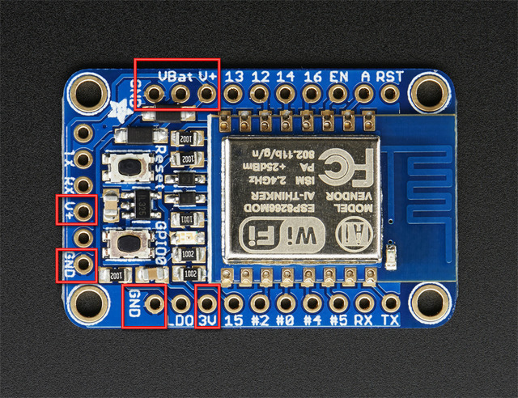
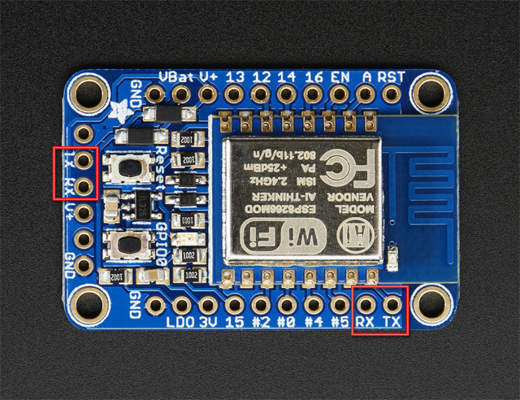

---
# You don't need to edit this file, it's empty on purpose.
# Edit theme's home layout instead if you wanna make some changes
# See: https://jekyllrb.com/docs/themes/#overriding-theme-defaults
layout: page
category: "notes"
course: "sbe403a"
year: "2019"
title: "ESP"
---
* TOC
{:toc}

## Overview of HUZZAH ESP8266

* Power Pins

* Serial Pins

* GPIO Pins
9 GPIO Digital pins

* Analog Pins
Only one analog pin A has a maximum 1.0V. 

* Other Pins
    * **LDO** for voltage regulation (enabled by default)
    * **RST** reset pin 
    * **EN** for enabling esp (enabled by default)

## Connect USB-Serial cable

## Installing esp Board package 
* add this URL http://arduino.esp8266.com/stable/package_esp8266com_index.json
 at **File > Preferences** additional board URl
* From **Tools > Board > Boards Manager** install the ESP8266 package.
* For windows install [adafruit drivers](https://learn.adafruit.com/adafruit-arduino-ide-setup/windows-driver-installation)
* Select Adafruit Feather HUZZAH ESP8266 board and its serial port. 

## Blink test Example

```c
int ledPin = 13; // LED connected to digital pin 13

// The setup() method runs once, when the sketch starts
void setup()
{
pinMode(ledPin, OUTPUT); // initialize the digital pin as an output
}
// the loop() method runs over and over again,
void loop()
{
digitalWrite(ledPin, HIGH); // turn the LED on
delay(1000); // wait a second
digitalWrite(ledPin, LOW); // turn the LED off
delay(1000); // wait a second
}
``` 
## Uploading code
* Make the board in upload mode 
    * Hold on GPIO button 
    * Click reset button

## Documentation 
You can find documentation for all available libraries, classes, functions in * [ESP8266 Arduino Core’s documentation](https://arduino-esp8266.readthedocs.io/en/latest/index.html)

## Sample Example 
From ESP8266WiFi library you can find examples that show you how to configure esp to work as host or client, access point, server, ... etc. 

## Useful links
* [Adafruit HUZZAH ESP8266](https://learn.adafruit.com/adafruit-huzzah-esp8266-breakout/overview)
* [Windows Driver Installation](https://learn.adafruit.com/adafruit-arduino-ide-setup/windows-driver-installation)
* [How To Program An ESP8266 With the Arduino IDE (Video Tutorial)](https://www.youtube.com/watch?v=AFUAMVFzpWw)
* [Use multiple analog sensors on an ESP8266 (Video Tutorial)](https://www.youtube.com/watch?v=S5zp_S3vo1Y)
* [ 744051 8-Channel Analog Multiplexer / Demultiplexer RAM electronics](http://ram-e-shop.com/oscmax/catalog/product_info.php?products_id=122)
* [ESP8266 Arduino Core’s documentation](https://arduino-esp8266.readthedocs.io/en/latest/index.html)
