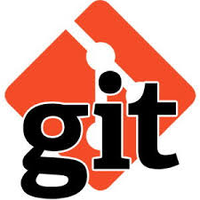
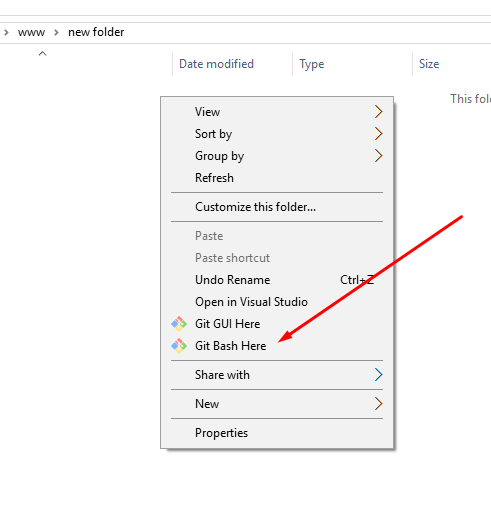
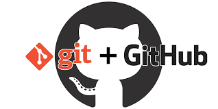
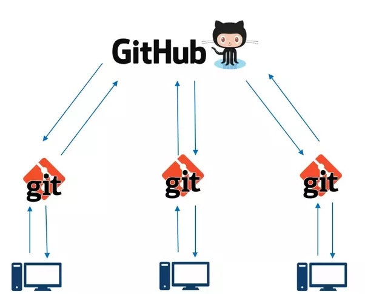
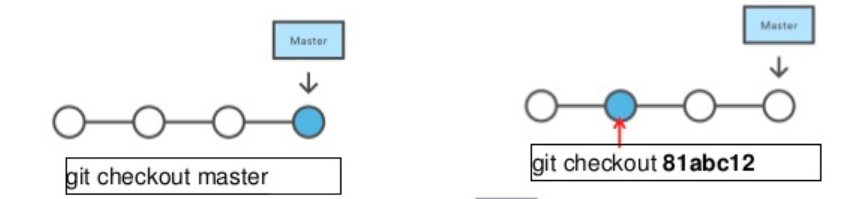
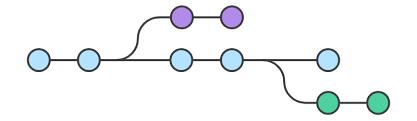
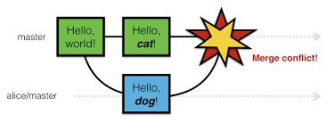
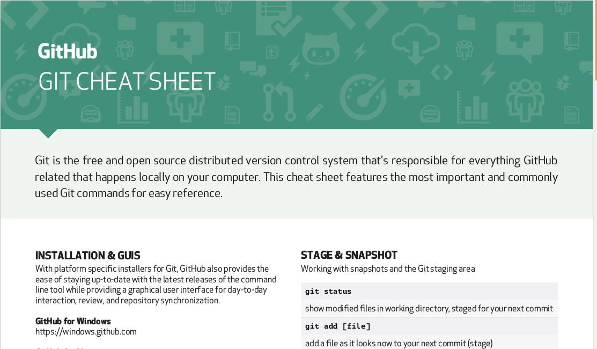

---
# You don't need to edit this file, it's empty on purpose.
# Edit theme's home layout instead if you wanna make some changes
# See: https://jekyllrb.com/docs/themes/#overriding-theme-defaults
layout: page
category: "notes"
course: "sbe403a"
title: "Version Control System"
year: "2019"
by: "Eslam"
---
* TOC
{:toc}


## Overview & Problem definition 

* Project Backup strategy  
    * Disk crash
    * Professional Work Archiving
     
        final, final1, final2, ... etc.
        
        What is the working file ?? 
    
* Team work collaboration
    * Work on same source
    * Auto merging work

* Record all changes
* View all history of the project


## Git Version Control System 

* The most popular version control system 
* Supports parallel simultaneous development
* Handle huge number of users
* Branch development and easy merging 
* Others: SVN , Mercurial




## Getting Started 
* Installation
    * For linux 
    ```bash
    sudo apt-get install git
    ```
    * For windows install from [here](https://git-scm.com/downloads)
    
         

## Open the bash 

To open bash click git bash here

 
 


## Git and github
 
 * create an account on [github](github.com) 
 * github : remote server 
 * git : local development
 * Allow code sharing and team contribution
 
 


## The work flow 




## Basic Illustration


## Git cycle
* Configuration : one time after installation

```bash
git config --global user.email "example@mail.com"
git config --global user.mail "Name"
```

### Create or clone repository 

* Repository is the source code of the project 
* Create empty repository 
```bash 
git init
```
* Clone existing one
```bash
git clone URL
```

* Showing repository status 
```bash
git status 
```

## Tracking and Commit

* Tracking file content
```bash
git add filename
```
* ignore changes

``bash
git stash
``

### Commit 

* Recording change in the repository 
* Snapshot of project at this state
* Records 
    * How was the change 
    * Who did it and when
    * The purpose of that change
```bash
git commit -m "Your message"
```

## Project Monitoring 

* Show history 


```bash 
git log 
```


```bash
git show commitId
```


## Transition between states (commits)

Switch to a certain commit 

```bash
git checkout commitId
```

Back to last commit 

```bash
git checkout master
```



 

## Publishing and sharing

* Updating local repository from master branch

```bash
git pull origin master 
```

* Publishing your commits on master branch

```bash 
git push origin master
```

* Auto-merge is enabled


## Branches
* Separate line of development
* Used for 
    * Parallel development
    * Bug isolation and fix
    * Trying new idea 
* Finally branch is merged or deleted



## Branched cont, 
* Create branch
```bash 
git checkout -b branch_name
```
* Show branches
```bash 
git show-branch
```
* Merge branch to master

```bash
git checkout master
git merge branch_name
```


 
## Merge Conflict

* Merging in case of same line is modified by through commits
* Example 

 


## Resources
* [Git Cheat Sheet](https://services.github.com/on-demand/downloads/github-git-cheat-sheet.pdf)

* interactive [learning git](https://learngitbranching.js.org/)