---
# You don't need to edit this file, it's empty on purpose.
# Edit theme's home layout instead if you wanna make some changes
# See: https://jekyllrb.com/docs/themes/#overriding-theme-defaults
layout: page
category: "notes"
course: "sbe403a"
title: "Overview of Raspberry Pi zero "
year: "2019"
by: "Eslam"
---
* TOC
{:toc}

# Introduction to Raspberry PI

Raspberry Pi is a mini computer. It is basically a cheap PC for learning purposes and practising programming.
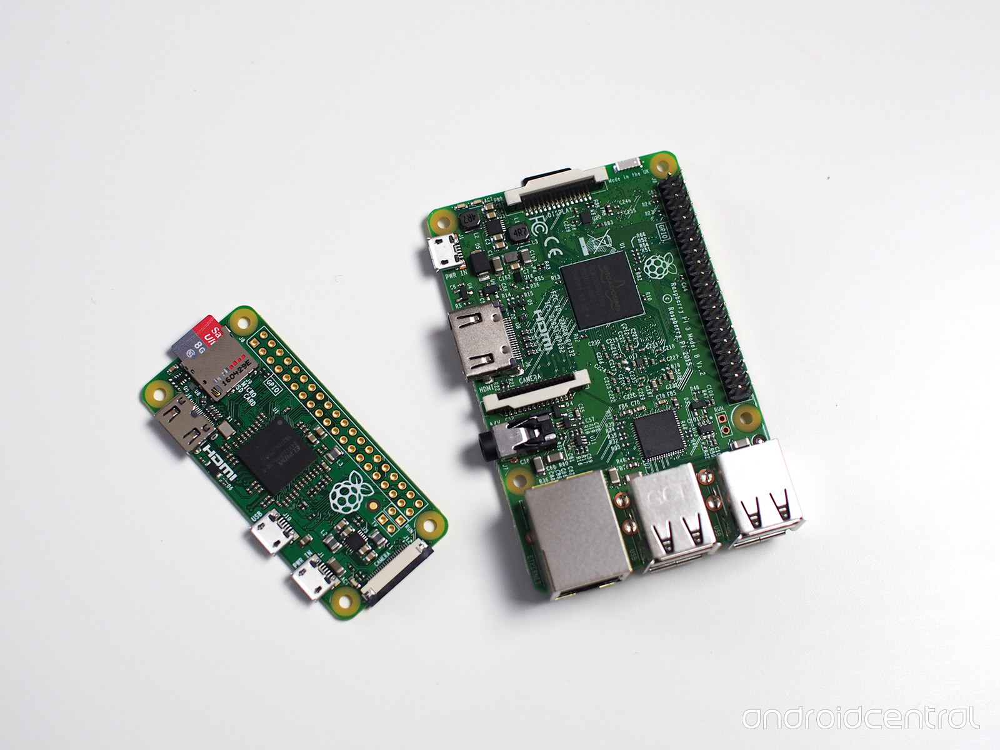
Raspberry is just like apple a name of fruit, Pi stands for python interpreter which is provided. 
Price  of PI 3 about $35, PI zero W $5

## Raspberry PI zero W specs

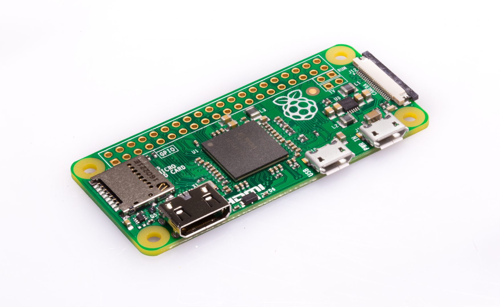

* Size : 65mm x 30mm 
* 1GHz single core processor
* 512 MB RAM
* Wireless
* 40 GPIO Pins
* mini HDMI port
* mini USB Port
* SD card area
* Camera Connector

## Installing The OS 

1. Head to download page and download the image of raspbian image  or use NBOOS.
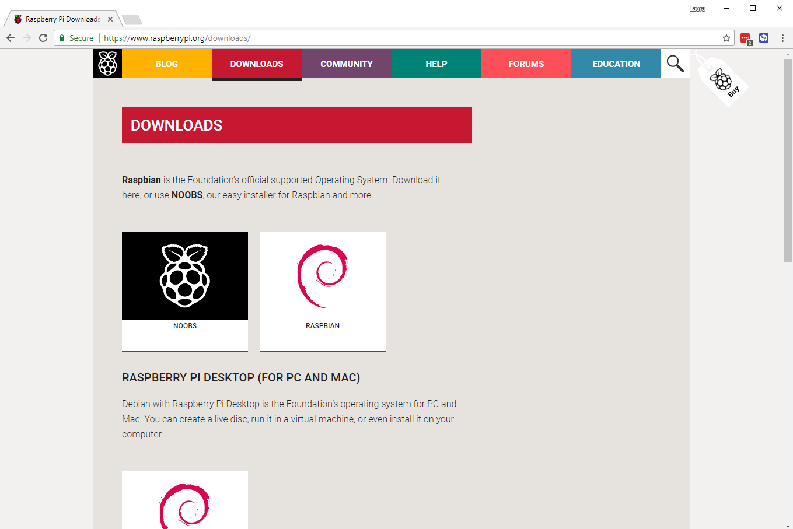
2. Format the SD Card (min 8G SD card)
3. Burn the image on the SD card 
   for linux 
   ```bash
   sudo dd if=file.img of=/dev/sdx 
   ```


4. Add SD card to the board
5. Connect Mouse/Keyboard
6. Connect the display 
7. Connect the power (5V DC 1 or 2A)

You can can see more details setting up your pi [here](https://projects.raspberrypi.org/en/projects/raspberry-pi-setting-up).

### Pi Desktop
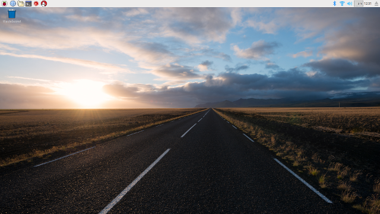

At first you will have the Pi wizard 

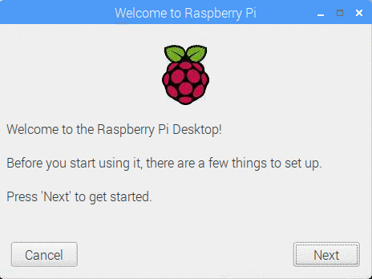

System is installed with some interesting applications 
* Programming

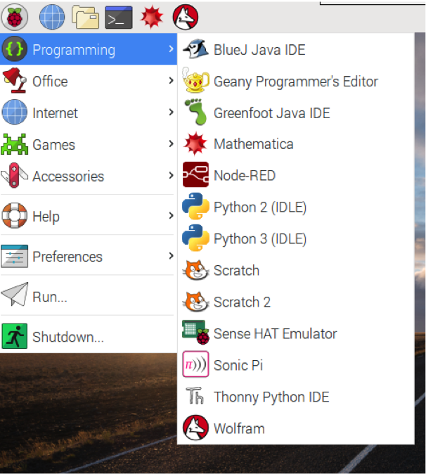

* Some games 


* Other accessories

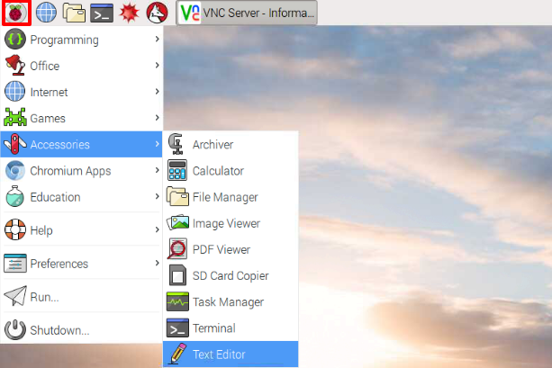

* Terminal 
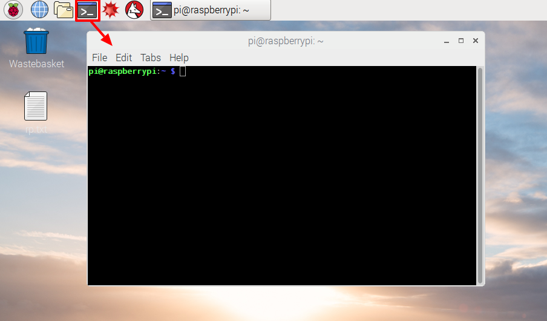

## Controlling Pi remotely 


Actually you don't have to connect the display, mouse and keyboard every time. You can enable ssh and access pi through any other computer.

### Using SSH

1. Open the terminal 
2. Type 
   ```bash
    sudo raspi-config
    ```
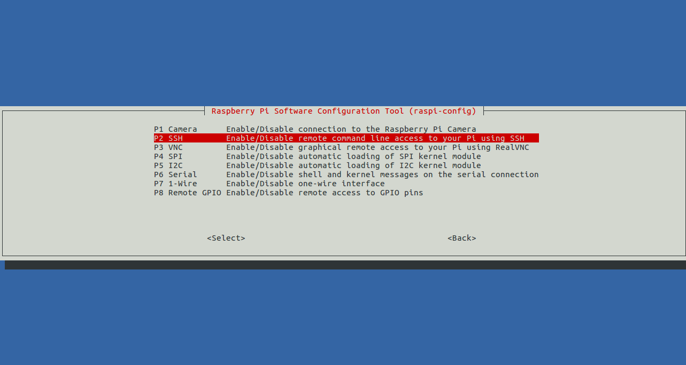

3. Use arrows to open Interfacing options and enable SSH (Remote command line access)

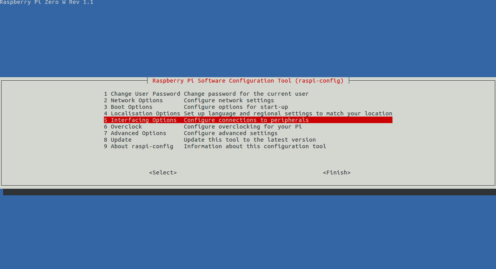

Or basically you can enable it from preferences and Raspberry pi configuration 
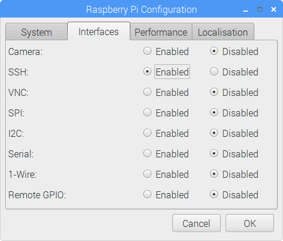


* To access raspberry pi from your computer install ssh

```bash
sudo apt-get install ssh 
ssh pi@192.168.1.200 # Or the IP of your PI
```

* For windows users you can use PuTTY. Check this [link](https://learn.adafruit.com/adafruits-raspberry-pi-lesson-6-using-ssh/ssh-under-windows) for more help


### Use VNC 

1. Install VNC on your computer [here](https://www.realvnc.com/en/connect/download/viewer/windows/)
2. Install VNC on your pi check [this](https://www.raspberrypi.org/documentation/remote-access/vnc/)

Make sure you enabled VNC.

3. Open pi from your computer using its IP


And now you can work from your computer 


## Basic linux commands

Operating system of raspberry pi is based on linux. Here some basic commands  

Command | Meaning
|---|---|
|ls| List files in current directory|
|cd |Change directory|
pwd |print working directory
rm filename |remove filename
mkdir directoryname |Make directory named directoryname
rmdir directoryname| remove empty directory
mv oldfile newfile | Move (rename) oldfile to newfile
cp oldfile newfile | Copy oldfile to newfile
man command | Display manual of command
date | read system date/time
sudo perform as|  root user
./program | run program
exit | Quit terminal session


## Getting started with python
Python is interpreted high level programming language for general purpose computing. 


### Variables

Python is untyped language 

```python
x = 5
y = 'Hello SBME'
```

### Lists

```python
# Initialize the list
myList = [2, 55, 565]

# add an element
myList.append(8)

print( myList ) # ??
print( myList[0] ) # ??
print( myList[3] ) # ??
print( myList[4] ) # ??
```


### Arithmetic Operations

```python

x = 19
y = 18 

z = x / y
z = x * y
z = x + y
z = x - y

```

### Comparison Operators

|operator | meaning|
|---|---|
|==	|Equal| to|
!=	|Not equal to
<	|Less than
>	|Greater than
<=	|Less than or equal to
>=	|Greater than or equal to


### Logical Operations

```python
x = True
y = False 

x or y 
x and y 
not x 
```

### If, elif, else

```python 

x = 23 
y = 22 

if x < y:
  print("x is greater than y")
elif x == y
    print("x and y are equal")
else:
    print("y is greater than x")
```

### Loops

```python

for i in range(10):
  print( i )

i = 0
while i < 10 :
  print( i )
  i += 1
```


### Functions

```python
def mean( list ):
  sum = 0
  for element in list:
    sum += element
  return sum / len( sum )

m = mean([1,12,42,1,23,12])
print( m )
```


### Importing Libraries

```python 
import numpy as np
from gpiozero import LED
```


## Pi physical computing with python
> Full tutorials are available [here](https://projects.raspberrypi.org/en/projects/physical-computing)

### GPIO 
Pi has 40 Pins 


**Note**
* Using 5V to drive something like motors could destroy the board
* Maximum input for GPIO pins is 3.3V. 5V could destroy the board

### Lighting a LED 
1. Open python3 

just type on terminal
```bash
$ python3
``` 

or you python IDLE3

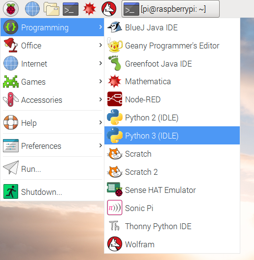

2. Connect the led to GPIO17

3. Code
```python
>>from gpiozero import LED
>>led = LED(17)
>>led.on()
>>led.off()
```

### Blinking example
1. Make a new file blink.py

you can use nano editor or vim. 
```bash
$nano blink.py 
```
or 
```bash
$vi blink.py 
```
2. Add your code
```python
from gpiozero import LED
from time import sleep

led = LED(17)

while True:
    led.on()
    sleep(1)
    led.off()
    sleep(1)
```
3. Run the example
```bash
$python3 blink.py
```

### Using Buttons

Connect the button 


```python
from gpiozero import Button

button = Button(2)
button.wait_for_press()
print('You pushed me')
```

### Toggle the led with the button

```python
from gpiozero import LED, Button
from signal import pause

led = LED(17)
button = Button(2)

button.when_pressed = led.on
button.when_released = led.off

pause()
```

### More examples 

You will find more examples for different hardware interfaces in the tutorial link. The library supports 
```python
from gpiozero import Buzzer, TrafficLights, LightSensor, MotionSensor, DistanceSensor
``` 

### Analog inputs 
All GPIO pins of pi are digital. To connect pi with analog sensors you have to use an ADC to make it digital. Communication for analog is using SPI protocol. 

They recommending the usage of 8 channels ADC MCP3008 

This is the connection with Pi 


And you have another 8 pins to connect the analog device like potentiometer


Code 

```python
from gpiozero import MCP3008
# Potentiometer is connected to channel 0
pot = MCP3008(0)
# Get the analog value
print(pot.value)
```

### Using motors

Use H bridge and Pi to control the motor

```python 
from gpiozero import Motor

# Initialization
motor1 = Motor(4, 14)
motor2 = Motor(17, 27)

# Move forward with full speed
motor1.forward()
# Move forward with half speed
motor1.forward(0.5)
# Move backward with half speed
motor2.backward(0.5)
# Reverse 
motor1.reverse()
# Stop
motor1.stop()
```

**Two wheeled Robot**

```python
from gpiozero import Robot
# Initialize it 
robot = Robot((4, 14), (17, 27))
# All movements 
robot.forward()
robot.backward()
robot.reverse()
robot.right()
robot.left()
robot.stop()
```
## Useful links 

* [Raspberry Pi projects](https://projects.raspberrypi.org/en)
* [Getting Started](https://projects.raspberrypi.org/en/projects/raspberry-pi-getting-started)
* [Physical computing with python](https://projects.raspberrypi.org/en/projects/physical-computing)
)
* [Build a robot](https://projects.raspberrypi.org/en/projects/build-a-buggy)