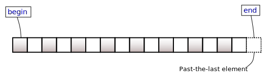

<textarea id="source">

---
## Output of this tutorial

1. Classes in STL
2. STL Containers (data structures)
3. STL Iterators
4. STL Algorithms

???
* Comparison with Python

---
## STL categories

Classes and functions in the STL can be divided into:

1. Containers: data structures.
2. Iterators: unifies the way we iterate on **containers**.
3. Algorithms: applies on **containers** via **iterators**.
4. Other utilities: `std::pair`, filesystems, networks and sockets, threads, etc.

---
## STL containers

.footnote[© Juha Kärkkäinen]

"An STL container is a collection of objects of the same type (the elements)".

--
* container owns the elements.
    * Creation and destruction is controlled by the container.

We already know:

1. `std::vector`: dynamic array.
2. `std::string`: dynamic array (special implementation of `std::vector<char>`)
3. `std::list`: doubly-linked list.
4. `std::map`: advanced binary search tree (red-black tree)
5. `std::set`: advanced binary search tree (red-black tree)

---
### STL containers: common properties
.footnote[© Juha Kärkkäinen]

* Default constructor: initialize and empty container.
* Copy constructor and assignment (deep copy).
* Swap:
  * `a.swap(b)` or `std::swap( a , b)`.
  * constant time.
* `==`, `!=`:
  * content-based equality: equal elements in same order.
* `<`, `>`, `<=`, `>=`:
  * lexicographic order: first inequal elements determine the order.
* `a.begin()`, `a.end()`: iterator to the first element and the element beyond last.


---
### `std::string`
.footnote[© Juha Kärkkäinen]


* only char as element type
* concatenation (`operator+`, `append`)
* I/O (`<<`, `>>`, `getline`)
* C-string conversions
* `substr`, `compare`, `find`.
  
---
### `std::vector<bool>`
.footnote[© Juha Kärkkäinen]

* Elements are stored as bits in a bit vector.
* very space-efficient.

---
### Associative containers

The **key** controls the access patterns.

--
#### Ordered associative containers (based on red-black trees)

1. `std::set`, `std::multiset`.
2. `std::map`, `std::multimap`.

--
#### Unordered associative containers (based on hashes)

1. `std::unordered_set`, `std::unordered_multiset`.
2. `std::unordered_map`, `std::unordered_multimap`.

---
## Selection of the appropriate container

<iframe src="https://drive.google.com/file/d/1gHoOsh5JcRzP_0dEQll8Xp-yYkUJ94VZ/preview" width="640" height="480"></iframe>

---
## Migration to Python

| STL | Python |
|--|--|
| `std::vector`, `std::array` | `numpy.array` |
| `std::string` | `str()` |
| `std::list` | `list()` or `[]` |
| `std::set`, `std::unordered_set` | `set()` |
| `std::map`, `std::unordered_map` | `dict()` |

---
#### The **Segmentation fault** error:

* Dereferencing a `nullptr`.
* Dereferencing an un-initialized pointer, as a side-effect of undefined behavior.
* Dereferencing a pointer of a de-allocated place:
  * De-allocated place in stack memory after going out of scope.
  * De-allocated place in heap memory after `delete`ing that place using its pointer.
* Exceeding array boundaries.
* Stack overflow


---
### Iteration on STL containers

Iteration styles:

--
1. for-loop or while loop with incrementing **index**.
--
2. for-loop or while loop with incrementing **iterator**.
--
3. recursion.
--
4. range-based for-loop (the most expressive)
--
5. `std::for_each`.

--
For each case we will demonstrate on:

1. `std::vector<int>`,
2. `std::list<int>`,
3. `std::map<std::string, double>`

---
### Iteration on STL containers
#### initialize containers

```c++
std::vector< int > v = { 2, 3, 5, 7, 11};

std::list< int > l = { 0, 1, 2, 3, 4, 5};

std::map< std::string, double > m = { {"water", 100}, {"mercury", 356.73}};
```

---
### Iteration on STL containers
#### regular iteration with incrementing `index`

```c++
for( int i = 0; i < v.size(); ++i )
{
    std::cout << v[i] << "\n";
}
```

- .red[We cannot use it] with `std::list` or `std::map`.

---
### Iteration on STL containers
#### regular iteration with incrementing **iterators**

```c++
for( auto it = v.begin(); it != v.end(); ++it )
{
    std::cout << *it << "\n";
}

for( auto it = l.begin(); it != l.end(); ++it )
{
    std::cout << *it << "\n";
}

for( auto it = m.begin(); it != m.end(); ++it )
{
    std::cout << it->first << ":" << it->second << "\n";
}
```

---
### Iteration on STL containers
#### Iterators at a glance



--
operations on iterators:

* retrieve element: `*it`.
* jump to next iterator: `++it`.
* `a.erase( it )`.

---
### Iteration on STL containers
#### Iterators on key/value containers

* For `std::map`, `std::unordered_map`, the element type is `std::pair< K, V>`.

--
##### `std::pair`

```c++
std::pair< int , int > minmax;
minmax.first = -3;
minmax.second = 5;
```

--
```c++
for( auto it = m.begin(); it != m.end(); ++it )
{
    std::cout << it->first << ":" << it->second << "\n";
}
```

--
* Can we have a more expressive printing?

---
### Iteration on STL containers
#### Iterators on key/value containers

##### `std::cout` formatting

```c++
for( auto it = m.begin(); it != m.end(); ++it )
{
    std::cout << it->first << ":" << it->second << "\n";
}
```

--
#### `fmt` formatting

```c++
for( auto it = m.begin(); it != m.end(); ++it )
{
    fmt::print("{}:{}\n", it->first, it->second );
}
```

--
* similar to Python

--
```python
print( "Hello, {}!".format( "World!" ))

print( "{}:{}".format( "water", 100 ))
```

---
### Iteration on STL containers
#### regular ranged for loop

--
* Iterators may not be necessarily used in explicit way

--
```c++
for( auto it = v.begin(); it != v.end(); ++it )
{
    std::cout << *it << "\n";
}

for( auto it = l.begin(); it != l.end(); ++it )
{
    std::cout << *it << "\n";
}

for( auto it = m.begin(); it != m.end(); ++it )
{
    std::cout << it->first << ":" << it->second << "\n";
}
```


---
### Iteration on STL containers
#### regular ranged for loop

* Iterators may not be necessarily used in explicit way

```c++
for( const auto &val : v )
{
    std::cout << val << "\n";
}

for( int &x : l ) 
{
    x = x * x;
    std::cout << x << "\n";
}

for( auto &[k,v] : m )
{
    std::cout << k << ":" << v << "\n";
}
```

---
### Memory Management and Memory Leakage

### Valgrind

---
#### Installing Valgrind

```terminal
sudo apt-get install valgrind
```

---
#### Running Valgrind

In order to trace your code to the point of the crash you need to compile your code with an additional flag `-g`. The flag `-g` tells your compiler to compiler your program in *Debugging* mode.

```bash
g++ -g -std=c++11 -Wall test.cpp -o test
```

* `-g` for debugging mode.
* `-std=c++11` to use the C++ standards of 2011.
* `-Wall` to emit any compilation warnings, very useful flag.
* `test.cpp` the source file that has a `main` function.
* `-o test` a flag for the compiler output followed by the output name of the executable.

```bash
valgrind -v --leak-check=full --show-leak-kinds=all ./test
```

---
### CLion


---
## Testing


* In practice, testing your program is done in a more principled way.
* read about [Test-Driven Development (TDD)](https://en.wikipedia.org/wiki/Test-driven_development)
* In C++, there are famous unit testing frameworks, for example:
    * [{Google Test}](https://github.com/google/googletest).
    * [{Catch2}](https://github.com/catchorg/Catch2).
    * [{Boost.Test}](http://www.boost.org/doc/libs/1_66_0/libs/test/doc/html/index.html)
* read about continuous integration (CI)

---
## Conan package manager


---
## Basic libraries for practicing

* [fmt](https://github.com/fmtlib/fmt): A modern formatting library.
* [gtest](https://github.com/google/googletest): google testing library.
* [clara](https://github.com/catchorg/Clara): A simple to use, composable, command line parser for C++11 and beyond.


---
## For summer practicing

* C++: QT
* Dive into research topic (e.g machine learning, bioinformatics, etc.)
* Language: TOEFEL or GRE.

---
## Self-reading

* Destructors
* [Learn C++](https://www.learncpp.com/)

</textarea>
