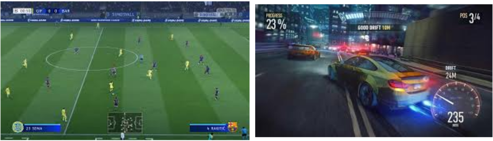
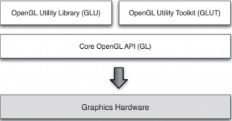
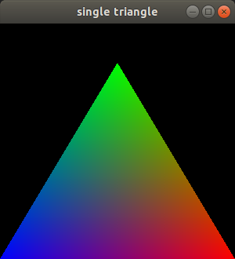
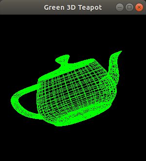
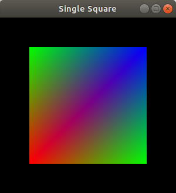

---
# You don't need to edit this file, it's empty on purpose.
# Edit theme's home layout instead if you wanna make some changes
# See: https://jekyllrb.com/docs/themes/#overriding-theme-defaults
layout: page
category: "notes"
course: "sbe306"
year: "2019"
title: "Introduction to Computer Graphics"
---

* TOC
{:toc}


## Computer Graphics

* Definition:

 Use computer to create images from models and interact with them.

 

 * Depend heavily on the science of:
    * Geometry
    * Optics
    * Physics

* CG includes:
    * 3D modeling  (Creating the object)
    * Shaders (Coloring objects)
    * Visualization and rendering (Existing Data Ex: Medical images)
    * Animation ( Transformations) 
    * … Etc

* Movies:
    * Animations
    * Visual effects

        
        

* Video Games:
    * User interaction
        
        

* Computer Aided  design:

    

* Medical Visualization:

    

    

    

## Tools

* OpenGL (Open Graphics Library):
    * Cross platform API for rendering
    * Handle the interaction with GPU (rendering acceleration)
    * Low level functionalities for rendering 
* OpenGL Utility (GLU)  OpenGL Utility Toolkit (glut):
    * Higher level functions
    * Window handling ,Camera positioning, interaction

        

        

* Visualization toolkit (VTK):
    * For volume rendering and medical visualization
    * VTK with Qt
    * Qt is a Cpp library for GUI and general programming
    * From DICOM images to 3D volume
    * Tissue coloring and selection
    * Navigation and exploration
        
        

        

* Unity Game Engine:
    * Drag and drop tool with coding for fast production
    * Cross platform (Desktop and mobiles) 

        

* OpenGL:
    * Cross platform application programming interface (API) for rendering
    * Handle interaction with GPU to accelerate rendering 
    * Has low level functionality 
    * OpenGL Utility (GLU) and OpenGL utility toolkit (glut) 
    * Provides high level functionalities
        * Ex: Camera positioning
        * window handling
        *  keyboard interaction
    * OpenGL, GLU and glut are a C API not C++ API (No classes, namespaces) 
    * Functions of OpenGL starts with gl, for GLU glu, for glut glut
    * Data types and dimension of vectors provided to function identified as follow 
        * f for float, i for integer,
        * Ex: ``` glvertex2i(), glvertex3f() ```

## Installation

### Linux Users

```
sudo apt-get install freeglut3-dev 
```

### Windows Users

1. Download the compiled source files [Here](https://osdn.net/projects/sfnet_colladaloader/downloads/colladaloader/colladaloader%201.1/glut-3.7.6-bin.zip/).

2. Create a new folder in “C:\” directory, and name it “glut”.

3. Inside “C:\glut”, create two new folders with  names “include” and “lib”

4. Create a new folder and call it “GL” inside “C:\glut\include”, copy glut.h” from the unzipped file and passed it here. where you should have : C:\glut\include\GL\glut.h

5. Inside “C:\glut\lib” copy “glut.def ” + “glut32.lib” + “glut32.dll” + “README-win32.txt” from the unzipped file and passed it here. where you should have : So: C:\glut\lib\glut.def, C:\glut\lib\glut32.lib, C:\glut\lib\ glut32.dll, C:\glut\lib\ README-win32.txt

6. Start, Control Panel, System, Advanced, Environment Variables

7. In the “Environment Variables” window and under the “system variables” select “path”, then click “edit” and in the “variable value” label add “C:\glut\lib;”, then click “Ok”

8. restart your computer to make sure that the windows operating
system noticed those changes.

9. Go to Visual Studio and create your C++ project as follow:

    1. New Project
    2. Under “Installed” on the left panel; select “Visual C++”, then select “ Win32” ,select from the middle panel “Win32 console application”, rename your project (with a meaningful name, ex: HelloCG), select your path from “Browse”, then click “Ok”.
    3. In the “Win32 Application Wizard” click “Next”, under “Additional options”select “Empty project”, then click “Finish”
    4. From “Solution Explorer” window, right click on “Source Files” and chose “Add” then chose “New Item...”
    5. From the “Add New Item” window, select “C++ File (.cpp)” from the middle panel, then edit the name (ex. main.cpp) .... Now you are ready to go with a C++ project with OpenGL
    6. Go to “Project”, then “Properties” and in the “Configuration Properties” in the left panel chose “VC++ Directories”, then from the right panel edit “Include Directories” and browse to add the path of the C:\glut\include, also edit “”Library Directories” and browse to add “C:\glut\lib”.

## Demo 1

```C++
#include <GL/glut.h>

void display(void)
{
  glClear(GL_COLOR_BUFFER_BIT);
  glBegin(GL_TRIANGLES);
    glColor3f(0.0, 0.0, 1.0);  /* blue */
    glVertex2i(0, 0);
    glColor3f(0.0, 1.0, 0.0);  /* green */
    glVertex2i(150, 250);
    glColor3f(1.0, 0.0, 0.0);  /* red */
    glVertex2i(300, 0);
  glEnd();
  glFlush();  /* Single buffered, so needs a flush. */
}

int main(int argc, char **argv)
{
  glutInit(&argc, argv);
  glutCreateWindow("single triangle");
  glOrtho(0, 300, 0, 300, -1, 1);   /* Map abstract coords directly to window coords. */
  glutDisplayFunc(display);
  glutMainLoop();
  return 0;      
}
```

then run project on windows or compile in linux By:
```
$ gcc -o source source.c -lGL -lGLU -lglut -lm
$ ./source
```
you should see



## Demo 2
```C++
#include <GL/glut.h>

void display(void)
{  
  //Clear color and depth buffers 
  glClear(GL_COLOR_BUFFER_BIT | GL_DEPTH_BUFFER_BIT);
  // Assign a color to the teapot
  glColor3f(0.0, 1.0, 0.0);
  // Rotation
  glRotatef(10, 0.0, 0.0, 1.0);
  glRotatef(10, 0.0, 1.0, 0.0);
  
  //Draw 
  glutWireTeapot(1);
  //Must swap the buffer in double buffer mode
  glutSwapBuffers();
}

void init(void)
{
  //Model(Object coordinates), View (Camera coordinates), Projection (Screen coordinates)
  glMatrixMode(GL_PROJECTION);
  gluPerspective( /* field of view in degree */ 40.0,
    /* aspect ratio */ 1.0,
    /* Z near */ 1.0, /* Z far */ 10.0);
  glMatrixMode(GL_MODELVIEW);
  gluLookAt(0.0, 0.0, 5.0,  /* eye is at (0,0,5) */
    0.0, 0.0, 0.0,      /* center is at (0,0,0) */
    0.0, 1.0, 0.);      /* up is in positive Y direction */
}

int
main(int argc, char **argv)
{
  glutInit(&argc, argv);
  //Use Double buffer, RGB, and depth test mode
  glutInitDisplayMode(GLUT_DOUBLE | GLUT_RGB | GLUT_DEPTH);
  glutCreateWindow("Green 3D Teapot");
  init();
  glutDisplayFunc(display);
  glutMainLoop();
  return 0;            
}
```
compile the same as above you should see



## Try it

Write the necessary code to get the following square. You can start from Demo 1 src code

