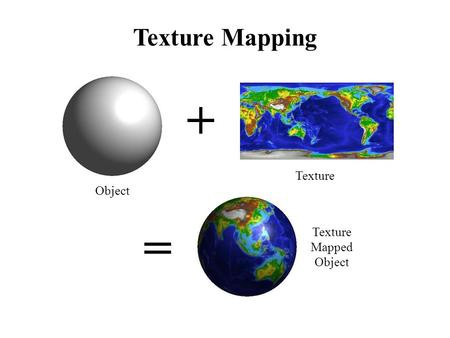
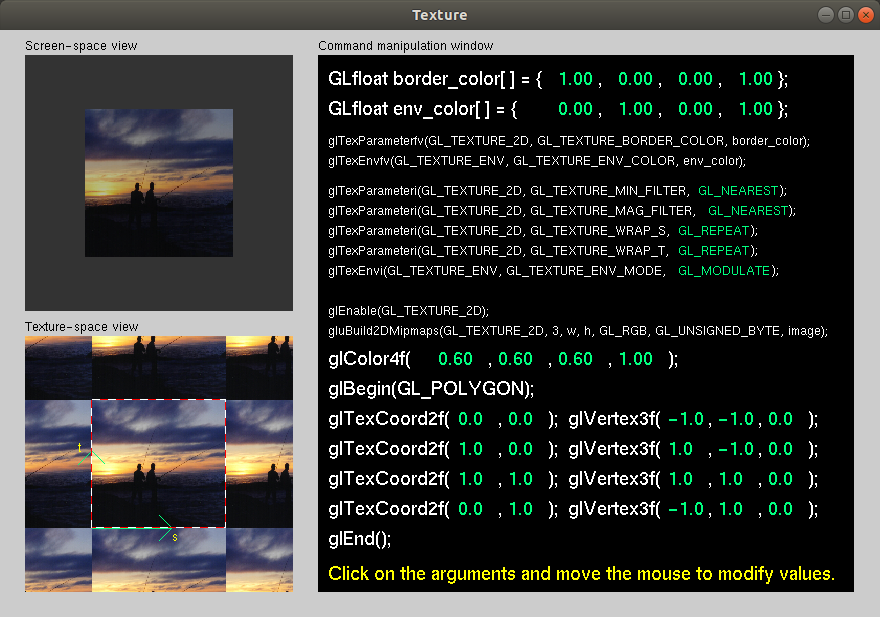
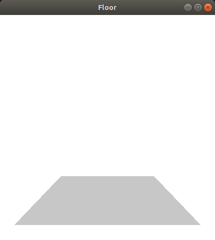
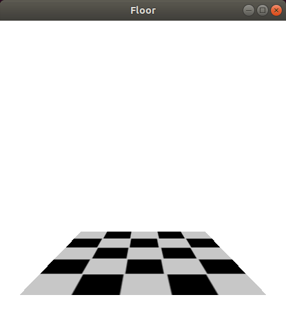
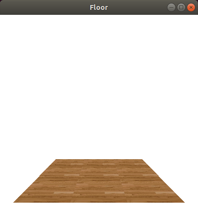
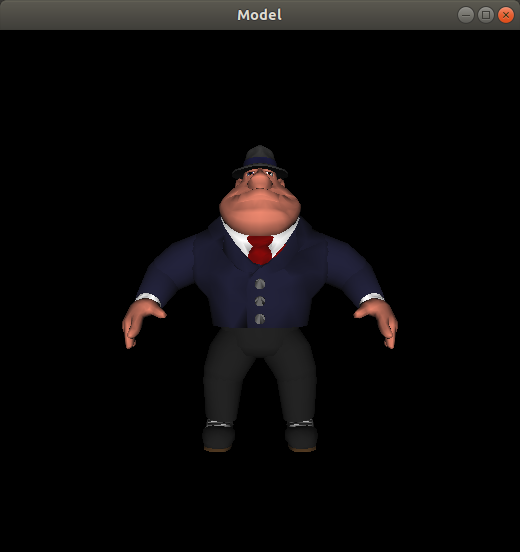
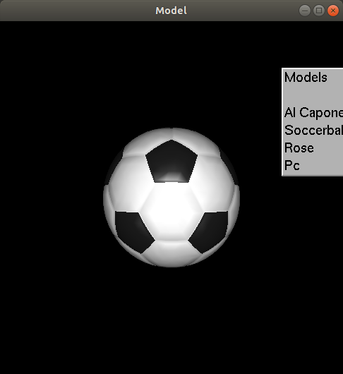
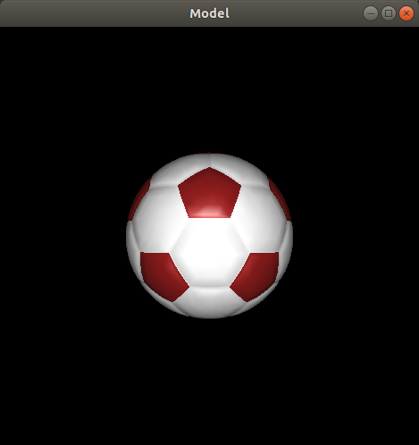
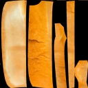
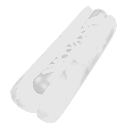

---
# You don't need to edit this file, it's empty on purpose.
# Edit theme's home layout instead if you wanna make some changes
# See: https://jekyllrb.com/docs/themes/#overriding-theme-defaults
layout: page
category: "notes"
course: "sbe306"
year: "2020"
title: "Textue Mapping"
---
* TOC
{:toc}

## Texture Mapping

* Pasting and image on surfaces
* Map 2D image(pixels) to 3D object(Points)
* Produce realistic models
* Simple solution to avoid complex surface manipulation. 



### Texture Maping (GL)

#### Parameters 

* Texture coordinates & object coordinates.
* Interpolation
* Wrap mode

```c++
//Enable Texture Mapping 
glEnable(GL_TEXTURE_2D);
//Make Texture using the image
glGenTextures(1, &_textureId)
glBindTexture(GL_TEXTURE_2D, _textureId);
glTexImage2D(...);
//Setting parameters
glTexParameteri(GL_TEXTURE_2D, GL_TEXTURE_MIN_FILTER, GL_LINEAR);
glTexParameteri(GL_TEXTURE_2D, GL_TEXTURE_MAG_FILTER, GL_LINEAR);
//Adjusting Texture Coordinates
glTexCoord2f(...)
```



#### Simple Demo

* Texture disabled 



* Texture Enabled



* Adjusting Texture Coordinates


* Another Texture




## Object loading

### 3D model files

* Created 3D models can be saved in different formats (STL, OBJ, 3DS, ... )
* 3D Model is a list of 3D points that represent the model 
* In this tutorial we will use OBJ format 


#### OBJ file (.obj)

* List of geometric vertices 
* List of vertices normals 
* List of texture coordinates

#### MTL file (.mtl)

* Define material properties (Ambient, Diffuse, Specular, ... )

* Define texture maps (images)
* Used to style the object

### Simple Demo

* Loading model 



* Selection menu to switch the model 



* Adjusting materials  



* Free 3D models [here](http://www.sweethome3d.com/freeModels.jsp)


## 3D model with texture mapping 

Example 

|   2D Image |    3D Model   |    Result  |
|----|-------|-----|
|   **+**|  | **=**|

Note: 

Models with texture images are not required in this course.

## Section Demos

Demos are available [here](https://github.com/sbme-tutorials/SBE306-Computer-Graphics-Tutorials/tree/master/Tutorial-05). 