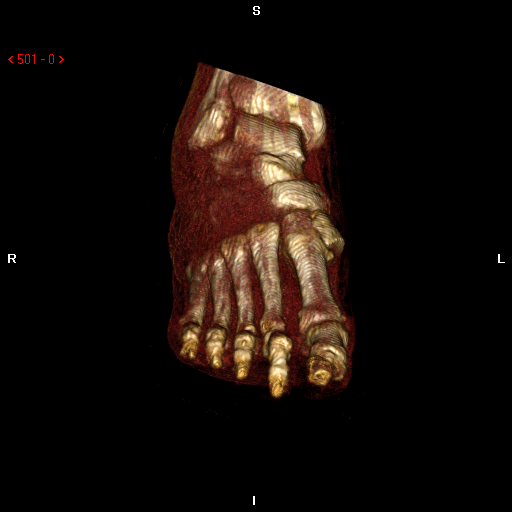
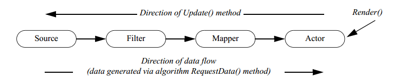

<textarea id="source">

class: middle, center
# Visualization Toolkit (VTK)

Esalm Adel 

eslam.a.mahmoud@eng1.cu.edu.eg

---
## Outlines

* Introduction to volume rendering
    * What is volume rendering? 
    * How to use computer graphics algorithm for visualization of medical images? 
    * Volume coloring, How ?
        * Transfer function basic idea 
        * User adjustable transfer function

---
## Outlines cont,

* Visualization Toolkit (VTK)
    * What is VTK? 
    * How to install VTK ? 
        * Python (Recommended)
        * C++ (Bonus)
    * VTK visualization Pipeline.
    * How to make a GUI app using VTK ? 
        * VTK and Qt integration 
        * Simple surface renderer example
---
## Outlines cont,

* Volume visualization Task
    * Build your own volume rendering app with VTK & Qt
    * Required Features
---
class: middle, center
# Volume Rendering

---

## What is volume rendering ? 

--

* The process of visualization of 3D data

--

* What data ?

--

* Medical images

--

* Each 2D image represent a scan of a slice of human body

--

* Arranging all images together is a 3D volume

---
## What is volume rendering ? 

**Objective** is to create a 3D object like that from series of 2D images



---


## CG for medical visualization

--

How to use CG to visualize 3D volume ? 

--

**Ray casting** for direct volume rendering

--

**Surface extraction** for surface rendering 

--
Transformations

---

## Volume Coloring 

--

Different color for different tissue 

--
How ? 

--
**Basic Idea** map different ranges of intensities to different colors, Where each range represent a different tissue.


---

## Volume coloring in Ray casting

--

Transfer function

-- 

The mapping function that maps intensity ranges to different colors. 

--

Used for ray casting rendering only 

-- 

What about surface rendering ? 

---

class: middle, center

# Visualization Toolkit [VTK](https://vtk.org/)

---

## What is VTk 


* Open source, object oriented software system for computer graphics and visualization

* It is available in both C++ and Python

* Huge library with different tools for many applications 

---

## VTK Installation 

* Installation from its C++ source code 

```bash
$ git clone https://github.com/Kitware/VTK.git
$ cd VTK 
$ mkdir build
$ cd build 
$ cmake ..
$ make
$ sudo make install
```

* Installation of its python API via anaconda 

```bash
$ conda install -c anaconda vtk
```

---

## Getting started with VTK 

[Basic Example](https://vtk.org/Wiki/VTK/Examples/Python/Cylinder)

```python
#Import library and create cylinder object
import vtk
from vtk.util.colors import tomato

cylinder = vtk.vtkCylinderSource()
cylinder.SetResolution(8)

# Setup pipeline :Mapper, Actor, renderer

#The mapper : responsible for pushing the geometry into the graphics library
cylinderMapper = vtk.vtkPolyDataMapper()
cylinderMapper.SetInputConnection(cylinder.GetOutputPort())
```
---

# Getting started with VTK cont,

```python
# The actor : transformation matrix, and/or texture map.
cylinderActor = vtk.vtkActor()
cylinderActor.SetMapper(cylinderMapper)
cylinderActor.GetProperty().SetColor(tomato)
cylinderActor.RotateX(30.0)
cylinderActor.RotateY(-45.0)
# Renderer : renders into the render window. 
ren = vtk.vtkRenderer()
renWin = vtk.vtkRenderWindow()
renWin.AddRenderer(ren)
# The render window interactor :  captures mouse events 
iren = vtk.vtkRenderWindowInteractor()
iren.SetRenderWindow(renWin)
# Add the actors to the renderer, set the background and size
ren.AddActor(cylinderActor)
ren.SetBackground(0.1, 0.2, 0.4)
renWin.SetSize(200, 200)
# This allows the interactor to initalize itself
iren.Initialize()
om(1.5)
renWin.Render()
# Start the event loop.
iren.Start()
```
---

## Basic Example 


**Let's run it**

---

## VTK Pipeline 

This is the basic pipeline of VTK application



--

You have to define full pipeline for a visualization process.

--

You can modify, adjust the pipeline according to application but main components must be defined.

---

## Medical Example 


[more examples](https://github.com/Kitware/VTK/tree/master/Examples/Medical/Python) 

---

## GUI App with VTK

--
### How ?

--
Using Qt with VTK 


---

## Installation of Qt 

* For C++ download and install Qt creator ([here](https://download.qt.io/archive/qt/))
* Installation for python using anaconda 
```bash
$ conda install -c anaconda pyqt 
```

--- 

## Qt Designer 


---

##  Qt Designer cont, 

once you have finished your design convert it to python source

```bash 
$ pyuic5 myGui.ui > myGui.py 
```

Then you can import it into your app 

```python 
from myGui import *

class AppWindow(QMainWindow):
    def __init__(self):
        super().__init__()
        self.ui = Ui_MainWindow()
        self.ui.setupUi(self)
        self.show

app = QApplication(sys.argv)
w = AppWindow()
w.show()
sys.exit(app.exec_())
```

---

## Qt signal and slots

--

How to respond to changes ? 

--

Signals and slots in Qt 

For example connecting slider change value signal to a slot that handle it

```python 
def sliderSlot(value):
    # Do action with this value
    pass

horizontalSlider.valueChanged.connect(sliderSlot)
```

[more in documentation](https://doc.qt.io/qt-5/signalsandslots.html)

---

class: middle, center
# Volume Rendering Task

---
## Task Requirements
  
* Build your own volume rendering app with VTK & Qt

* Features 
    * Support loading DICOM series dynamically 
    * Surface rendering (With adjustable iso value)
    * Ray casting rendering (with a fixed transfer function)
        * Bonus (Adjustable transfer function)
---
class: middle, center

# Thanks 

</textarea>
    