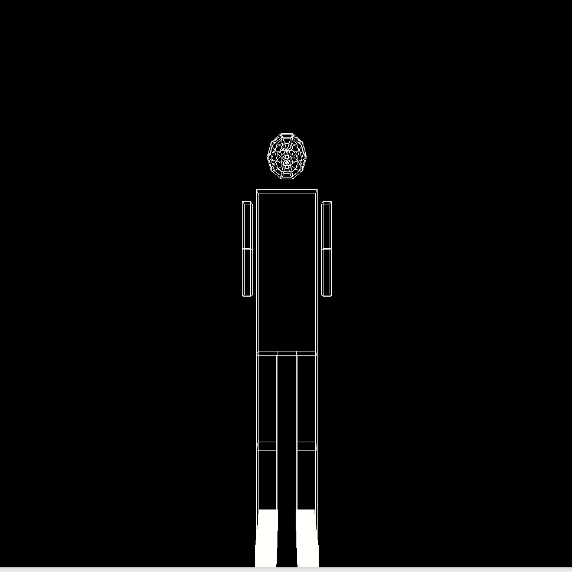

## Objectives

* Raising modeling transformation level. 
* Modeling a 3D object.
* Apply transformations to move the camera around,up,beneath and through the objects the model.
* simulation for full body joints movement.
* Report your results and comments.

## Deadline

Deadline for online submission will be  on  **Friday 3/4/2020 11:59 PM**

## Joining to Assignment Repository

This is an individual assignment 

1. Go to the [Assignment Page](https://classroom.github.com/a/vUm1Y7sM).
2. Accept the assignment.
3. Wait till your repository created.
4. Open the link and Clone repository.

## Instructions

1. use the robotic body drawn in the last assignment.
2. Set up camera to move aroud the body
3. move camera around the section with vertical and horizontal rotation.



## Submitting

```terminal
$ git commit -a -m "solved all problems!"
$ git push origin master
```