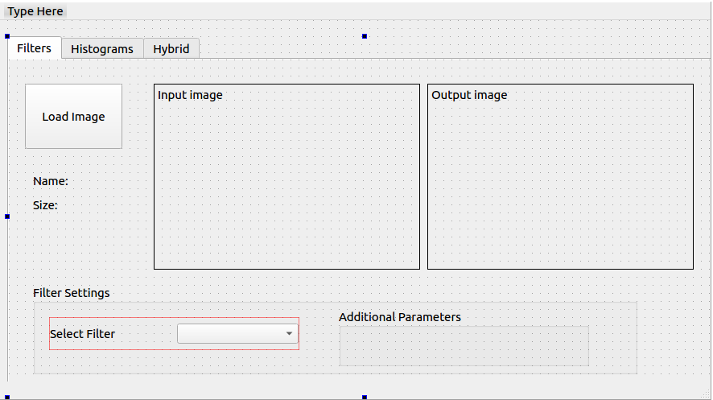
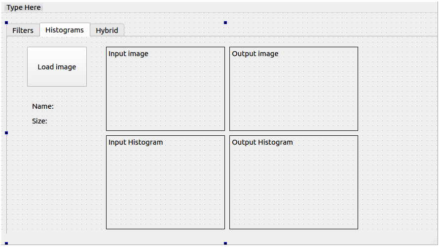
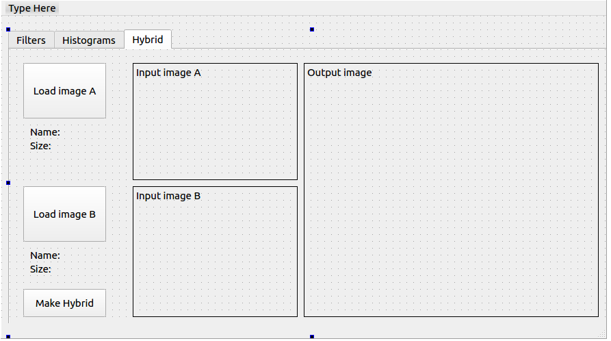

## Objectives

* Filtration of noisy images using low pass filters such as: average, Gaussian, median.
* Edge detection using variety of masks such as: Sobel, Prewitt, and canny edge detectors.
* Histograms and equalization.
* Frequency domain filters.
* Hybrid images.

## Deadline

**Monday 2/3/2020 11:59 PM**

## Joining to Assignment Repository

Refer to this sheet to know your **Group number**: (TBA)

1. Register your team in the assignment through [https://classroom.github.com/g/yHMkJP3m](https://classroom.github.com/g/yHMkJP3m).
2. You either join to an existing team, or create a new team.

## Deliverables

When you clone your assignment repository, you will find the following files that you will start working from:

1. `CV404Filters.py`
2. `CV404Frequency.py`
3. `CV404Histograms.py`
4. `MainWindow.ui`
5. `images`

### A) Computer Vision Functions

You need to implement Python functions which will support the following tasks:

1. Add additive noise to the image.
    * For example: Uniform, Gaussian and salt & pepper noise.
2. Filter the noisy image using the following low pass filters.
    * Average, Gaussian and median filters.
3. Detect edges in the image using the following masks
    * Sobel, Roberts , Prewitt and canny edge detectors.
4. Draw histogram and distribution curve.
5. Equalize the image.
6. Normalize the image.
7. Local and global thresholding.
8. Transformation from color image to gray scale image and plot of R, G, and B histograms with its distribution function (cumulative curve that you use it for mapping and histogram equalization).
9. Frequency domain filters (high pass and low pass).
10. Hybrid images.

You should implement these tasks **without depending on OpenCV library or alike**.

Organize your implementation among the following files:

1. `CV404Filters.py`: this will include your implementation for filtration functions (requirements 1-3).
2. `CV404Histograms.py`: this will include your implementation for histogram related tasks (requirements 4-8).
3. `CV404Frequency.py`: this will include your implementation for frequency domain related tasks (requirements 9-10).

### B) GUI Integration

Integrate your functions in part (A) to the following Qt MainWindow design:

| Tab 1 |
---|---|
|  

| Tab 2 |
|---|
|  |

| Tab 3 |
|---|
|  |