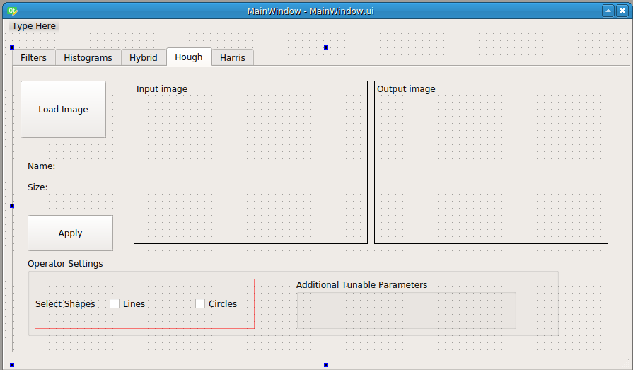
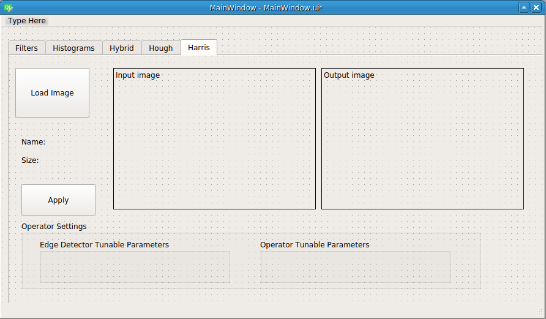
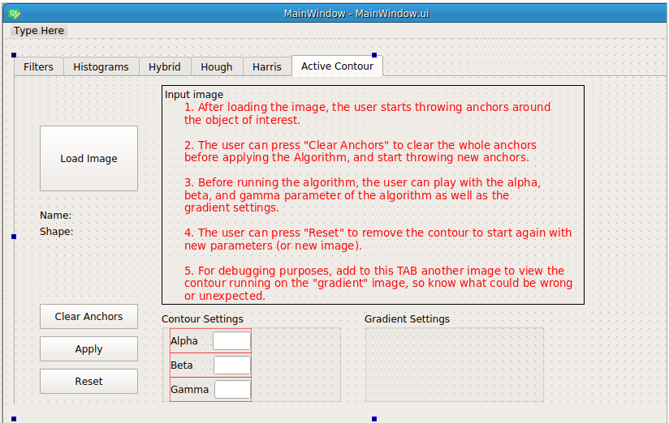

## Objectives

* Apply Hough transform for detecting parametric shapes like circles and lines.
* Apply Harris operator for detecting corners.
* Apply Active Contour Model for semi-supervised shape delineation.

## Deadline

**Thursday 2/4/2020 11:59 PM**

## Joining to Assignment Repository

Refer to this sheet to know your **Group number**: (https://docs.google.com/spreadsheets/d/1H0mGNnDtruLanYVxQH6439rXLTpPglXzglBmYt1J_ow/edit?usp=sharing)

1. Register your team in the assignment through [https://classroom.github.com/g/pLAsu9oN](https://classroom.github.com/g/pLAsu9oN).
2. Join your team that you already worked with in the previous assignment.

## Deliverables

You will start working from the source code you delivered for previous task.

Only one member in each team will do the following:

1. First, copy the remote url of the newly generated repository.
2. From the folder of the previous repository, upload the source to the new repository.

For example, for team **SBE404-2020-Team01**, in the folder of the previous task, the responsible member may run the following command:

```bash
git push git@github.com:sbme-tutorials/cv404-2020-assignment-02-sbe404-2020-team01.git master -u
```

Now you will find your work of the previous task uploaded to the new repository. Now clone the new repository in an independent folder.


### A) Computer Vision Functions

You need to implement Python functions which will support the following tasks:

1. For all given images; detect edges using Canny edge detector, detect lines and circles located in these images (if any) using Hough transform. Superimpose the detected
shapes on the images.
2. For given images; detect corners using Harris operator and experiment with different techniques to extract the real corners (e.g experiment with thresholding, local thresholding, non-maxima supression, local maxima extraction).
3. For given images; initialize the contour for a given object and evolve the Active Contour Model (snake) using the greedy algorithm. Represent the
output as chain code and compute the perimeter and the area inside these
contours.

Add new Python files to organize your implementation of the core functionalities:


1. `CV404Hough.py`: this will include your implementation for Hough transform for lines and circles (requirement 1).
2. `CV404Harris.py`: this will include your implementation for Harris operator for corners detection (requirement 2)
3. `CV404ActiveContour.py`: this will include your implementation for Harris operator for corners detection (requirement 2)


Important notes:

* You should implement these tasks **without depending on OpenCV library or alike**. However you can use the OpenCV Canny Edge Detector as preprocessing to Hough Transform. 
* You should not include any GUI related lines within `CV404Hough.py`, `CV404Harris.py`, `CV404ActiveContour.py` files, they should include the core computer vision functionalities.
* You should have only one scipt file to run the whole GUI.
* More than 1-2 scenarios lead to your program crash will affect your submission score.
* Plagiarizing lines will not be tolerated.
* Every member should have clear contribution in the task and that should be obvious through the git commits.


### B) GUI Integration

Integrate your functions in part (A) to new tabs in the Qt MainWindow design:

| Tab 4 |
---|---|
|  

| Tab 5 |
|---|
|  |


| Tab 6 |
|---|
|  |