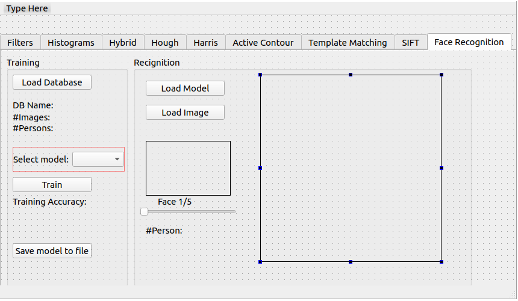

## Objectives

1. Given standard face datasets 
   * http://www.face-rec.org/databases/ 
2. Detect Faces (color or grayscale)
3. Recognize faces based on PCA/Eigen analysis
4. Report performance and plot ROC curve

## Deadline

**Sunday 10/5/2020 11:59 PM**

## Joining to Assignment Repository

Refer to this sheet to know your **Group number**: (https://docs.google.com/spreadsheets/d/1H0mGNnDtruLanYVxQH6439rXLTpPglXzglBmYt1J_ow/edit?usp=sharing)

1. Register your team in the assignment through [https://classroom.github.com/g/6mrU3o1l](https://classroom.github.com/g/6mrU3o1l).
2. Join your team that you already worked with in the previous assignment.

## Deliverables

You will start working from the source code you delivered for previous task.

Only one member in each team will do the following:

1. First, copy the remote url of the newly generated repository.
2. From the folder of the previous repository, upload the source to the new repository.

For example, for team **SBE404-2020-Team01**, in the folder of the previous task, the responsible member may run the following command:

```bash
git push git@github.com:sbme-tutorials/cv404-2020-assignment-04-sbe404-2020-team01.git master -u
```

Now you will find your work of the previous task uploaded to the new repository. Now clone the new repository in an independent folder.


### A) Computer Vision Functions

You need to implement Python functions which will support the following tasks:


1. Model Fitting (Training):
   1. Given standard face datasets :http://www.face-rec.org/databases/
   2. Detect Faces (color or grayscale)
   3. Train a model to recognize faces based on PCA/Eigen analysis.
   4. Report performance metrics.
   5. Save model parameters to external file:
      * See this [link](https://scikit-learn.org/stable/modules/model_persistence.html) or this [link](https://machinelearningmastery.com/save-load-machine-learning-models-python-scikit-learn/).
      * Automate the filenaming to include at least information about the model and training date (e.g `svm-Aug-5-2020-19hr20mn`).
2. Model Deployment:
   1. Load the model from the parameters file.
   2. Given a sample from the database (not used in the training)
   3. Detect Faces (using the same function)
   4. Recognize the face using the loaded model.

Add new Python file `CV404Recognition.py` to organize your implementation of the core functionalities.

Important notes:

* You should implement these tasks **without depending on OpenCV library or alike**.
* You should not include any GUI related lines within `CV404Recognition.py`, it should include the core computer vision functionalities.
* You should have only one scipt file to run the whole GUI.
* More than 1-2 scenarios lead to your program crash will affect your submission score.
* Plagiarizing lines will not be tolerated.
* Every member should have clear contribution in the task and that should be obvious through the git commits.


### B) GUI Integration

Integrate your functions in part (A) to new tabs in the following Qt suggested design (you can develop your own UI if it enhances the usability):

| Tab 9 |
|---|
|  |