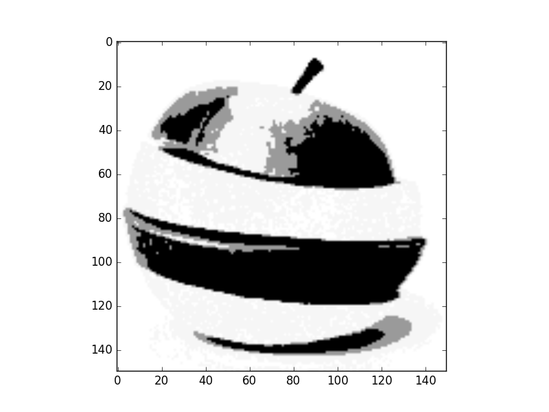
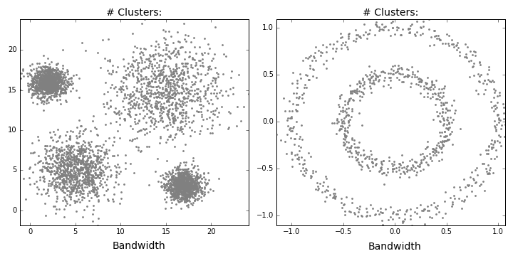

* TOC
{:toc}

## Region (seed) Growing Segmentation 
Region-growing methods rely mainly on the assumption that the neighboring pixels within one region have similar values. The common procedure is to compare one pixel with its neighbors. If a similarity criterion is satisfied, the pixel can be set to belong to the cluster as one or more of its neighbors. The selection of the similarity criterion is significant and the results are influenced by noise in all instances. 

This method takes a set of seeds as input along with the image. The seeds mark each of the objects to be segmented. The regions are iteratively grown by comparison of all unallocated neighboring pixels to the regions. The difference between a pixel's intensity value and the region's mean,  is used as a measure of similarity. The pixel with the smallest difference measured in this way is assigned to the respective region. This process continues until all pixels are assigned to a region. Because seeded region growing requires seeds as additional input, the segmentation results are dependent on the choice of seeds, and noise in the image can cause the seeds to be poorly placed. 


```python
seeds location = input()  ## take object seed to be segmented as input
each region mean  = seed value
set error as similarity measure for regions
while there is unallocated pixels 
    for each pixel in each region
        if  unallocated neighbors of (2x2 , 3x3 or 4x4) patches  within a specified erros from region mean
            then add to region and recalculate region mean
        else
            mark as visited and dont add to region

```
## Clustering Segmentation 

Clustering is the process of grouping similar data points together and marking them as a same cluster or group. It is used in many fields including machine learning, data analysis and data mining. We can consider segmentation as a clustering problem. We need to cluster image into different object, each object's pixels has common features for example same color or same intensity. 


Talking about similarity criteria takes us to what so-called feature. A feature is a value that measures or identify characteristic of a subject, it must discriminate between different subjects. One of important rules in machine learning is that Good feature with simple classifier is more accurate than bad feature with robust classifier. 

Feature space is an alternative space of ordinary data space. Its coordinates are feature values and each data point is represented by its value of different features. For example, color components R, G, and B are the coordinates of our feature space. Each pixel in the image will be represented as a 3D vector of its R, G, and B values. Working in feature space in image segmentation collects pixels with same color (feature) together even so they are isolated in image space.
  
## K means Clustering

K means clustering Initially assumes random cluster centers in feature space. Data are clustered to these centers according to the distance between them and centers. Now we can update the value of the center for each cluster, it is the mean of its points. Process is repeated and data are re-clustered for each iteration, new mean is calculated till convergence. Finally we have our centers and its related data points. The process is shown in the following figure. 


### Basic algorithm 

So basic Algorithm steps for k means segmentation are

```python
Construct feature space from your image (number of data point = number of pixels)
Set number of required clusters k 
Set Max number of iterations for clustering
Get random k points in your feature space (initial centers)
for i in range(max number of iterations)
    #Cluster remaining data points to centers according to distance
    for each data point:
        for each cluster:
            distances =  distance between it cluster centers
        its cluster = min(distances)
    #Calculate the new centers 
    for each cluster:
        newCenter = mean(RelatedPoints)
```

### Kmeans Performance Test 

* Results for k = 5 classes 

Original Image


1. 1D feature space (Gray level) 



2. 2D feature space (Colors HS channels)


3. 3D feature space (Colors RGB) 


We can see that convergence in 3D space is slower so classes picked none relevant colors.

**Let`s try it mathematically**
given the following coordinates use Kmeans to cluster the points into wo clusters. use following points as start seeds (-3,2) and (3,2)

| X       | Y   | 
|---------|-----|
|   -1    | 3 |
|   -2    | 3 |
| 0       |2|
|2        |4|
|3        |3|
|-1       |-2|

**Alternatives:** Kmeans++ and Kmedoid.

## Mean shift Clustering

Mean shift clustering is a non-parametric technique for clustering, it isn't require to specify the number of clusters. Also it is robust for outliers as clusters aren't in spherical shape it takes a none-linear shape according to clustering procedure. 

### Basic algorithm 
Pseudo code of basic mean shift algorithm with uniform kernel 

```python 
Extract feature space from image
While number of unvisited points > 0
    Select a random point in feature space (Initial mean)
    While true: 
    Get distance between mean and all points in feature space
    For uniform window, select points in the range of specified bandwidth and track that points
    Get the new mean, it is the mean of points within bandwidth
    if distance between new and old means < threshold:
        cluster all tracked points to new mean 
        update number of visited points 
        break
```
This algorithm is shown in that figure


So the process will repeated till all points in feature space are clustered. 


**Wait, we didn't finish yet!**

### Merging clusters

One of drawbacks of uniform kernel is that center may not move for uniform regions. Merging nearby centers is the solution of such problem. Merge condition is that distance between the two centers is lower than half the bandwidth. Algorithm will be modified as follow

```python 
Extract feature space from image
While number of unvisited points > 0
    Select a random point in feature space (Initial mean)
    While true: 
    Get distance between mean and all points in feature space
    For uniform window, select points in the range of specified bandwidth and track that points
    Get the new mean, it is the mean of points within bandwidth
    if distance between new and old means < threshold:
        for c in clusters:
            #Check merge condition
            if distance(c, center) < 0.5* Bandwidth:
                mean of cluster c = 0.5*distance(c,center)
                cluster all tracked points to cluster c
        #No merge
        cluster all tracked points to new mean 
        #Update visited points
        update number of visited points 
        break
```

### Bandwidth selection 

The effect of changing bandwidth is that number of clusters will change. Larger bandwidth tends to lower number of clusters while smaller bandwidth tends to more number of clusters.



### Results of mean shift segmentation

Original Image


1. 1D feature space (Gray level) 


2. 2D feature space (Colors HS channels)


3. 3D feature space (Colors RGB) 


As we can see mean shift is a robust segmentation algorithm. It more efficient than k means algorithm. It provides clusters with irregular shape and its points share same attraction basin.


## Hierarchical clustering

In data mining and statistics, hierarchical clustering is a method of cluster analysis which seeks to build a hierarchy of clusters. Strategies for hierarchical clustering generally fall into two types:[1]

1. Agglomerative: This is a "bottom-up" approach: each observation starts in its own cluster, and pairs of clusters are merged as one moves up the hierarchy.
2. Divisive: This is a "top-down" approach: all observations start in one cluster, and splits are performed recursively as one moves down the hierarchy.

The choice of an appropriate metric will influence the shape of the clusters, as some elements may be close to one another according to one distance and farther away according to another.

**Example for agglomerative clustering**


### Basic Algorithm

```python
Initially each point in feature space considered a cluster or a leaf
initially number of clusters
while number of cluster in step i < number of cluster in step i-1:
    calculate the similarity metric between each adjacent clusters
    if distances are within a specified error:
         merge clusters
    then repeat until the number of cluster remain constants  (convergence)
```


