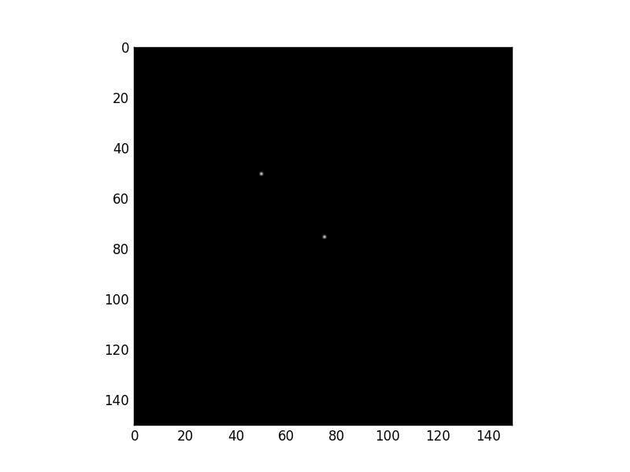
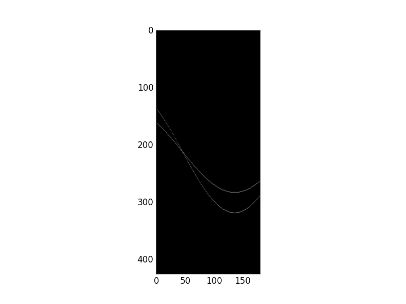

* TOC
{:toc}

## Readings 
[Survey of Hough transform](https://arxiv.org/pdf/1502.02160.pdf)

## Preview 
* What we have taken ? 

    We started by representation of digital image as a grid of pixels. Each pixel has a gray level for gray images. For color images, each pixel has three channels mainly R, G, and B. Then we investigated different color spaces.

    Afterwards we moved to some image manipulation methods to enhance the image using histogram transforms. Then we moved to image filtering and denoising. And finally to edge detection and enhancement.  

* What's next ?

    Till now we didn't get into the main objective of computer vision which is transform the image to model and make it easy to interpret images, identify objects in it, and recognize them. Here we start with basic algorithm (Hough transform) that enables us to identify and detect lines, circles, and other geometric shapes. 

<!-- * What is the applications? 
    There is many applications of object detection and recognition like Object recognition and tracking. Medical Application A real-time tracking system of surgical instruments in laparoscopic operations -->

## Hough Line
Proposed by Paul V.C Hough 1962 
* Got USA [Patent](https://patents.google.com/patent/US3069654) 
* Originally for line detection 
* Extended to detect other shapes like , circle, ellipse etc.

### Original Hough transform (Cartesian Coordinates)
In image space line is defined by the slope $$m$$ and the y-intercept $b$ 

 $$y = mx + b$$

 So to detect the line in the image space we have to define these parameters, which is not applicable in image domain. In the other domain with $$m$$ and $$b$$ coordinates, line represent a point from image domain. Points on the same line in image domain will be mapped to lines in Hough domain. These lines intersect with each other in a point with specific values $$m$$ and $$b$$. These values are the slope and y-intercept of original line in image domain. 
 
 For example in the following image. 
 Blue point in image domain was mapped to the blue line in Hough domain. The same for red point. Intersection point of blue and red lines in hough domain has the values $$m$$ and $$b$$ of the line $$y = mx +b$$
 

More points that on same line tends to more lines in Hough domain and that will increase voting to the intersection point indicating that there is many points belongs to line in image domain with that slope and y-intercept.

[source](http://what-when-how.com/biomedical-image-analysis/the-hough-transform-biomedical-image-analysis/)

### Alternative Parameter Space (Polar Coordinates)
Due to undefined value of slope for vertical lines in cartesian coordinates, we have to move to polar coordinates. In polar coordinates line is define by $$\rho$$ and $$\theta$$ where $$\rho$$ is the norm distance of the line from origin. $$\theta$$ is the angle between the norm and the horizontal $$x$$ axis. The equation of line in terms of $$\rho$$ and $$\theta$$ now is 

$$y = \frac{-cos(\theta)}{sin(\theta)} x + \frac{\rho}{sin(\theta)}$$

and 

$$\rho = x cos(\theta)  + y sin(\theta)$$


The Range of values of $$\rho$$ and $$\theta$$ 
* $$\theta$$ in polar coordinate takes value in range of -90 to 90 
* The maximum norm distance is given by diagonal distance which is 

$$\rho_{max} = \sqrt{x^2 + y^2}$$

So $$\rho$$ has values in range from $$-\rho_{max}$$ to $$\rho_{max}$$

### Algorithm
Basic Algorithm steps for Hough transform is : 
```python
Extract edges of the image How ? using Canny
1- initialize parameter space rs, thetas
2- Create accumulator array and initialize to zero
3- for each edge pixel     
4-     for each theta
5-         calculate r = x cos(theta) + y sin(theta)
6-         Increment accumulator at r, theta
7- Find Maximum values in accumulator (lines)
Extract related r, theta
```
**Lets try to implement it.** 

### Basic Implementation

At first import used libraries
```python
import numpy as np
import matplotlib.pyplot as plt
```
Lets define function that builds the accumulator in Hough domain

```python
def houghLine(image):
    ''' Basic Hough line transform that builds the accumulator array
    Input : image : edge image (canny)
    Output : accumulator : the accumulator of hough space
             thetas : values of theta (-90 : 90)
             rs : values of radius (-max distance : max distance)
    '''
```
Some variables needed
```python
    #Get image dimensions
    # y for rows and x for columns 
    Ny = image.shape[0]
    Nx = image.shape[1]

    #Max diatance is diagonal one 
    Maxdist = int(np.round(np.sqrt(Nx**2 + Ny ** 2)))
```
1. initialize parameter space rs, thetas
```python    
    # Theta in range from -90 to 90 degrees
    thetas = np.deg2rad(np.arange(-90, 90))
    #Range of radius
    rs = np.linspace(-Maxdist, Maxdist, 2*Maxdist)
```
2. Create accumulator array and initialize to zero
```python 
    accumulator = np.zeros((2 * Maxdist, len(thetas)))
```

3. Loop for each edge pixel 
```python
    for y in range(Ny):
        for x in range(Nx):
            # Check if it is an edge pixel
            #  NB: y -> rows , x -> columns
             if image[y,x] > 0:
```
4. Loop for each theta
```python
                 # Map edge pixel to hough space
                 for k in range(len(thetas)):
```
5. calculate $$\rho$$

```python   
                    # Calculate space parameter
                    r = x*np.cos(thetas[k]) + y * np.sin(thetas[k])
```
6. Increment accumulator at r, theta
```python
   
                    # Update the accumulator
                    # N.B: r has value -max to max
                    # map r to its idx 0 : 2*max
                    accumulator[int(r) + Maxdist,k] += 1
    return accumulator, thetas, rs
```

Now lets try to test our houghLine function as follow

#### One edge point image

Lets see Hough transform for an image with only one edge point.
```python
image = np.zeros((150,150))
image[75, 75] = 1
accumulator, thetas, rhos = houghLine(image)
plt.figure('Original Image')
plt.imshow(image)
plt.set_cmap('gray')
plt.figure('Hough Space')
plt.imshow(accumulator)
plt.set_cmap('gray')
plt.show()
```
**Original Image**


**Hough Transform**


As we see the edge point is mapped to a curve in hough domain

#### Two edge points image

Lets add another point.
```python
image[50, 50] = 1
```

**Original Image**



**Hough Transform**



Every point was mapped to a curve. Both curves intersected at a point in Hough domain. This point says that "Hey, Two edge points in image domain are on the same line with specific r and theta"

What about a complete line ? 

#### Image with a single line
Lets see
```python
image[:, :] = np.eye(150)
```
**Original Image**


**Hough Transform**


All curves in hHough domain have only one intersection point, so there is only one line in the image domain.

Lets get the value of $$\rho$$ and $$\theta$$ at the peak point

#### Getting value of $$\rho$$ and $$\theta$$

```python
idx = np.argmax(accumulator)
rho = int(rhos[int(idx / accumulator.shape[1])])
theta = thetas[int(idx % accumulator.shape[1])]
print("rho={0:.0f}, theta={1:.0f}".format(rho, np.rad2deg(theta)))
```
Output is 
```python
rho = 0, theta = -45
```
And this is the norm distance and angle of the line in the image. 

#### Trying real images
After building accumulator we can sort it and get top values according to selected threshold. Each selected point from accumulator denotes a line in image space with specific $$\rho$$ and $$\theta$$. You can superimpose these lines on real images. for example

This is the **original image**


And this is the **canny image** 


and this is the **final image** after detecting lines using Hough transform 

Note : Number of detected lines is based on a threshold set by user.


## Hough Circle 
The same idea is applied for other shapes. Onces you have parametric equation that describes the shape you can build parameter space and detect that shape. For the circle 

$$ r^2 = (x-x_0)^2 + (y-y_0)^2$$

Circle parameters are center $$(x_0, y_0)$$ and radius $$r$$

Your parameter space now is 3D parameter space.


Think how to extend the basic Hough line transform to detect circles.
## Useful links
[Understanding Hough transform in python](https://alyssaq.github.io/2014/understanding-hough-transform/)

[OpenCV Hough Line Transform](http://opencv-python-tutroals.readthedocs.io/en/latest/py_tutorials/py_imgproc/py_houghlines/py_houghlines.html)

[Scikit-image Hough Line](http://scikit-image.org/docs/dev/auto_examples/edges/plot_line_hough_transform.html)

[OpenCV Hough Circle](https://docs.opencv.org/3.1.0/da/d53/tutorial_py_houghcircles.html)
