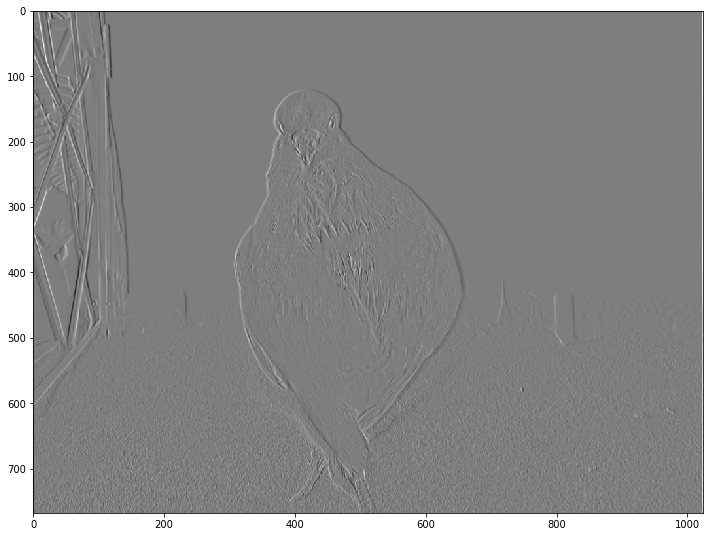
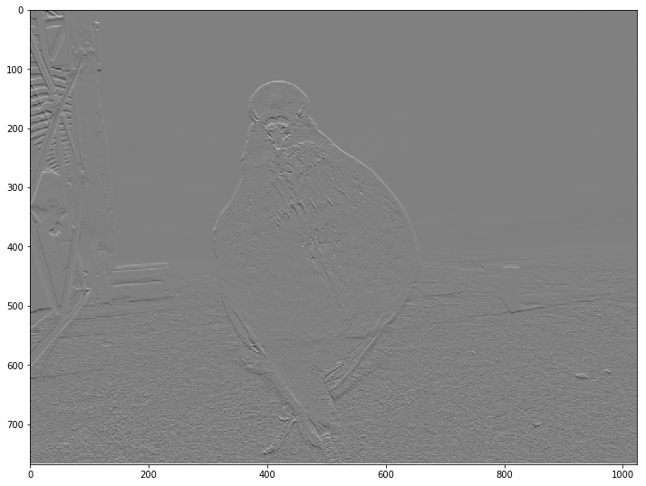
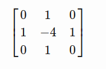

<textarea id="source">


---
class: center, middle
## Image Filtering & Edge Detection


---
class: left, top
## So far, we have learnt

1. Loading and accessing image pixels.
--
1. Constructing a **histogram** for the image (probability distribution).
--
1. Estimating a diagnostic parameters for a region (mean, std, variance).
--
1. Color transformations.
--
1. Fourier transform.
--
1. Histogram Equalization (converting the probability distribution in hand to a uniform distribution). 


---
class: left, top
## Point operators (transfer functions)

#### Examples

1. Thresholding
--
1. Image negation (negative image)
--
1. Histogram equalization
--
1. Linear scaling
--
1. Nonlinear scaling
--
1. RGB to Grayscale?


---
class: left, top
## Histogram Processing
### Example: Histogram Equalization

--
#### Transform the histogram to a uniform one.

--


---
class: left, top
## Histogram Processing
### Example: Histogram Equalization

* Intensity image (3 bits): [0-7]
* Image size = 64x64 = 4096

### Step 1: compute the discrete PDF (histogram)
--
 


---
class: left, top
## Histogram Processing
### Example: Histogram Equalization

### Step 2: compute the discrete CDF (accumulative histogram)

| `i` | accumulative | accumulative x 7 | rounded |
|--|--|--|--|
| `s0` | 0.19 | 1.33 | 1 |
| `s1` | 0.44 | 3.08 | 3 |
| `s2` | 0.65 | 4.55 | 5 |
| `s3` | 0.81 | 5.67 | 6 |
| `s4` | 0.89 | 6.23 | 6 |
| `s5` | 0.95 | 6.65 | 7 |
| `s6` | 0.98 | 6.86 | 7 |
| `s7` | 1.00 | 7.00 | 7 |

---
class: left, top
## Histogram Processing
### Example: Histogram Equalization

### Step 2: compute the discrete CDF (accumulative histogram)

 ===> 


---
class: left, top
## Histogram Processing
### Example: Histogram Equalization

### Step 3: use the previous table to map the pixels values

--
 


---
class: left, top
## Histogram Processing
### Example: Histogram Matching

* Intensity image (3 bits): [0-7]
* Image size = 64x64 = 4096
--
* Obtain an image with an **arbitrary distribution** instead of a uniform distribution
--
* Target distribution


 

---
class: left, top
## Histogram Processing
### Example: Histogram Matching

### Step 1: obtain the scaled histogram equalized values (previous example)

* `s0` = 1   `s1` = 3   `s2` = 5   `s3` = 6
* `s4` = 7   `s5` = 7   `s6` = 7   `s7` = 7

---
class: left, top
## Histogram Processing
### Example: Histogram Matching

### Step 2: compute the discrete CDF of the target distribution

| `i` |  accumulative x 7 | rounded |
|--|--|--|
| `z0` | 0.00 | 0 |
| `z1` | 0.00 | 0 |
| `z2` | 0.00 | 0 |
| `z3` | 1.05 | 1 |
| `z4` | 2.45 | 2 |
| `z5` | 4.55 | 5 |
| `z6` | 5.95 | 6 |
| `z7` | 7.00 | 7 |


---
class: left, top
## Histogram Processing
### Example: Histogram Matching

### Step 2: compute the discrete CDF of the target distribution

 ===> 

---
class: left, top
## Histogram Processing
### Example: Histogram Matching

### Step 3: use the previous table to map the pixels values

--
 


---
class: top, left
## Edge detection kernels

* Edges represents the object boundaries. 
--
* Edge detection is a very important preprocessing step object detection 

---
### Prewitt operator 

For Ix(x,y) and Iy(x,y)

```python
prewitt_h = np.array([[ -1 , 0 , 1 ] ,
                      [ -1 , 0 , 1 ] ,
                      [ -1 , 0 , 1 ] ])
prewitt_v = prewitt_h.transpose()
```

---
## Edge detection kernels
### Prewitt operator 

Horizontally... 
```python
image_prewit_h = signal.convolve2d( image_gr , prewitt_h ,'same')
```
--


---
## Edge detection kernels
### Prewitt operator 

Vertically...
```python
image_prewit_v = signal.convolve2d( image_gr , prewitt_v ,'same')
```
--


---
class: top, left
## Edge detection kernels Cont'd
### Sobel operator

For Ix(x,y) and Iy(x,y)


```python
sobel_h = np.array([[ -1 , 0 , 1 ] ,
                    [ -2 , 0 , 2 ] ,
                    [ -1 , 0 , 1 ]])
sobel_v = sobel_h.transpose()
```

---
## Edge detection kernels
### Sobel operator 

Horizontally... 
```python
image_sobel_h = signal.convolve2d( image_gr , sobel_h ,'same')
```
--


---
## Edge detection kernels
### Sobel operator 

Vertically...
```python
image_sobel_v = signal.convolve2d( image_gr , sobel_v ,'same')
```
--


---
## Edge detection kernels
### Sobel magnitude and phase

--
```python
def gradient_sobel( img ):
    image_sobel_h = signal.convolve2d( img , sobel_h ,'same')
    image_sobel_v = signal.convolve2d( img , sobel_v ,'same')
    phase = np.arctan2(image_sobel_h , image_sobel_v) * (180.0 / np.pi)

    # Assign phase values to nearest [ 0 , 45 , 90 ,  135 ]
    phase = ((45 * np.round(phase / 45.0)) + 180) % 180;

    gradient = np.sqrt(image_sobel_h * image_sobel_h + image_sobel_v * image_sobel_v)
    return gradient, phase
```

---
## Edge detection kernels
### Sobel magnitude and phase


---
class: top, left

## Edge detection kernels Cont'd
### Laplacian 
It is an approximation of second order derivative that defines zeros crossing. 
For Example 3x3 laplacian is : 




Laplacian usually is applied after gaussian smoothing. So LOG refers to laplacian of gaussian.
---

class: top, left
## Gradient magnitude and direction

Gradient magnitude is given by 

$$
\begin{equation}
I_{xy} = \sqrt{I_x(x,y)^2 + I_y(x,y)^2}
\end{equation}
$$

and Gradient direction: 

$$
\begin{equation}
I_{\theta} = tan^{-1}(\frac{I_y(x,y)}{I_x(x,y)})
\end{equation}
$$


</textarea>
