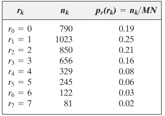
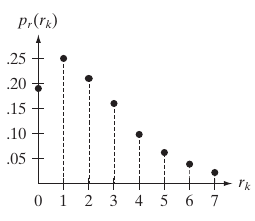
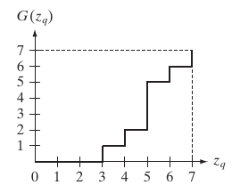

<textarea id="source" markdown="1">

class: left, top
## Histogram Processing: Equalization

* Intensity image (3 bits): [0-7]
* Image size = 64x64 = 4096

### Step 1: Compute the discrete PDF (histogram)

--
.center[ ]

---
class: left, top

## Histogram Processing: Equalization (cont'd)

### Step 2: Compute the discrete CDF (cumulative histogram)

.center[
| `i` | accumulative | accumulative x 7 | rounded |
|--|--|--|--|
| `s0` | 0.19 | 1.33 | 1 |
| `s1` | 0.44 | 3.08 | 3 |
| `s2` | 0.65 | 4.55 | 5 |
| `s3` | 0.81 | 5.67 | 6 |
| `s4` | 0.89 | 6.23 | 6 |
| `s5` | 0.95 | 6.65 | 7 |
| `s6` | 0.98 | 6.86 | 7 |
| `s7` | 1.00 | 7.00 | 7 |

]

---
class: left, top
## Histogram Processing: Equalization (cont'd)

### Step 2: Compute the discrete CDF (cumulative histogram)

.center[ ===> ]

---
class: left, top
## Histogram Processing: Equalization (cont'd)

### Step 3: Use the previous table to map the pixels values

--
.center[ ]

---
class: left, top
## Histogram Processing: Matching

* Intensity image (3 bits): [0-7]
* Image size = 64x64 = 4096
--
* Obtain an image with an **arbitrary distribution** instead of a uniform distribution
--
* Target distribution

.center[ ]

---
class: center, top
## Histogram Processing: Matching (cont'd)

### Step 1: Obtain the scaled histogram equalized values (previous example)

* `s0` = 1   `s1` = 3   `s2` = 5   `s3` = 6
* `s4` = 7   `s5` = 7   `s6` = 7   `s7` = 7

---
class: center, top
## Histogram Processing: Matching (cont'd)

### Step 2: compute the discrete CDF of the target distribution

.center[
| `i` |  accumulative x 7 | rounded |
|--|--|--|
| `z0` | 0.00 | 0 |
| `z1` | 0.00 | 0 |
| `z2` | 0.00 | 0 |
| `z3` | 1.05 | 1 |
| `z4` | 2.45 | 2 |
| `z5` | 4.55 | 5 |
| `z6` | 5.95 | 6 |
| `z7` | 7.00 | 7 |
]

---
class: center, top
## Histogram Processing: Matching

### Step 2: compute the discrete CDF of the target distribution

 ===> 

---
class: center, top
## Histogram Processing: Matching

### Step 3: use the previous table to map the pixels values

--
 

</textarea>
