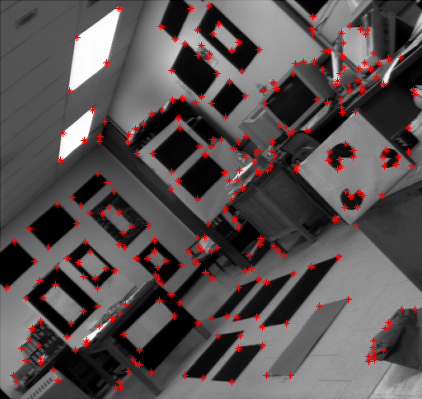

<textarea id="source" markdown="1">

# Section 4

## Hough Transform and Harris Operator

##### Presentation by *{{ page.author }}*



---
class: left, top

## Hough Transform

Proposed by Paul V.C Hough 1962

* Got USA [Patent](https://patents.google.com/patent/US3069654) 
* Originally for line detection 
* Extended to detect other shapes like, circle, ellipse etc.

---
## Hough Transform: Line Detection (Cartesian Coordinates)

In image space line is defined by the slope $m$ and the y-intercept $b$ :


$$y = mx + b$$


--
.center[]

---
## Hough Transform: Line Detection (Cartesian Coordinates)

--
* Each point proposes list of candidate lines
--
* Overall, how to find the true lines?

--
.center[]

---
## Hough Transform: Line Detection (Cartesian Coordinates)

In image space line is defined by the slope $m$ and the y-intercept $b$ :


$$y = mx + b$$


.center[]

---
class: left, top

## Hough Transform: Line Detection (Polar Coordinates)

--
* Some lines cannot be be defined in Cartesian
--
* So we have to move to polar coordinates. 
--
* In polar coordinates line is define by $\rho$ and $\theta$ 
--
* $\rho$ is the norm distance of the line from origin. 
* $\theta$ is the angle between the norm and the horizontal $x$ axis. 
* The equation of line in terms of $\rho$ and $\theta$ now is 

$$y = \frac{-cos(\theta)}{sin(\theta)} x + \frac{\rho}{sin(\theta)}$$

and 

$$\rho = x cos(\theta)  + y sin(\theta)$$

---
class: left, top

## Hough Transform: Line Detection (Polar Coordinates)

.center[]


---
class: left, top

## Hough Transform: Line Detection (Polar Coordinates)

.center[]

The Range of values of $\rho$ and $\theta$ 

--
* $\theta$: in polar coordinate takes value in range of -90 to 90 
* The maximum norm distance is given by diagonal distance which is $\rho$max $= \sqrt{x^2 + y^2}$
* So $\rho$ has values in range from $-\rho$max to $\rho$max


---
## Hough Transform: Line Detection (Polar Coordinates)

### Algorithm

Basic Algorithm steps for Hough transform is : 

```
# Extract edges of the image (For example, using Canny)

1. initialize parameter space rs, thetas
2. Create accumulator array and initialize to zero
3. for each edge pixel     
4.     for each theta
5.         calculate r = x cos(theta) + y sin(theta)
6.         Increment accumulator at r, theta
7. Find Maximum values in accumulator (lines)

Extract related r, theta
```


---
## Hough Transform: Line Detection (Polar Coordinates)

### Basic Implementation

At first import used libraries


```python
import numpy as np
import matplotlib.pyplot as plt
import matplotlib.cm as cm
```

---
## Hough Transform: Line Detection (Polar Coordinates)

### Basic Implementation

```python
def hough_line(image):
    Ny = image.shape[0]
    Nx = image.shape[1] 
    Maxdist = int(np.round(np.sqrt(Nx**2 + Ny ** 2)))
    thetas = np.deg2rad(np.arange(-90, 90))
    rs = np.linspace(-Maxdist, Maxdist, 2*Maxdist)
    accumulator = np.zeros((2 * Maxdist, len(thetas)))

    for y in range(Ny):
        for x in range(Nx):
            if image[y,x] > 0:
                 for k in range(len(thetas)):
                    r = x*np.cos(thetas[k]) + y * np.sin(thetas[k])
                    accumulator[int(r) + Maxdist,k] += 1
    return accumulator, thetas, rs
```

---
## Useful links


* [{Understanding Hough transform in python}](https://alyssaq.github.io/2014/understanding-hough-transform/)
* [{OpenCV Hough Line Transform}](http://opencv-python-tutroals.readthedocs.io/en/latest/py_tutorials/py_imgproc/py_houghlines/py_houghlines.html)
* [{Scikit-image Hough Line}](http://scikit-image.org/docs/dev/auto_examples/edges/plot_line_hough_transform.html)
* [{OpenCV Hough Circle}](https://docs.opencv.org/3.1.0/da/d53/tutorial_py_houghcircles.html)
* [{Survey of Hough transform}](https://arxiv.org/pdf/1502.02160.pdf)


---
## Hough Transform: Line Detection (Polar Coordinates)


[{`hough_transform.ipnyb`}](https://github.com/sbme-tutorials/sbme-tutorials.github.io/blob/master/2020/cv/notebooks/hough_transform.ipynb)


---
class: top, left
## Corner Detection

### Feature Detection

.center[]

---
## Corner Detection

### Feature Detection

.center[]

---
## Corner Detection

### Feature Detection

.center[]

---
class: top, left
## Corner Detection

### Challenges

* .red[Patch (image) matching]
--
  * .green[Distinctive features]
--
* .red[Geometric transformations (translation, rotation, scale)]
--
  * .green[Robust and efficient]
--
* .red[Photometric (brightness, exposure)]
--
  * .green[Many preprocessing options can be applied]


---
class: top, left
## Corner Detection

### Harris operator: corner detector


.center[]


---
## Corner Detection

### Harris operator: corner detector

#### Compute the .red[principal] vectors of variation at location `p` 

.center[]

---
## Corner Detection: Harris operator

### Step 1: image smoothing (optional)

--
$$ L(p,\sigma ) = \[I * G_\sigma \](p) $$

```python
 signal.convolve2d(img, gaussian_kernel(7,1.0) ,'same')
```

.center[]

---
## Corner Detection: Harris operator

### Step 2: compute $I_x$ and $I_y$

Many options to compute the $I_x$ and $I_y$ exist:

1. First order difference.
2. Prewitt kernel
3. Sobel kernel

```python
Ix = signal.convolve2d( img , sobel_h ,'same')
Iy = signal.convolve2d( img , sobel_v ,'same')
```

.center[ ]

---
## Corner Detection: Harris operator

### Step 3: construct the Hessian (Hesh'n) matrix $M$

We will construct the Hessian matrix so we are able to compute the principal vectors of variation.

--
$$ M(p) = 
\begin{bmatrix}
I_x^2       & I_xI_y \\\
I_xI_y       & I_y^2
\end{bmatrix}
$$

--
```python
Ixx =  np.multiply( Ix, Ix) 
Iyy =  np.multiply( Iy, Iy)
Ixy =  np.multiply( Ix, Iy)
```

---
## Corner Detection: Harris operator

### Step 3 (Alternative): construct the Hessian (Hesh'n) matrix $M$ .red[over a window]

* If we need more robust detection
--
* Compute $M$ over a window (e.g $3 \times 3$)
--
* Now can detect larger corner that lives inside a window of pixels, instead of a single pixel.

--
$$
\hat{M}(p) = \sum_{i,j}  w(i,j)
\begin{bmatrix}
I_x^2       & I_xI_y \\\
I_xI_y       & I_y^2
\end{bmatrix}
$$

--
$$
\hat{M}(p) =
\begin{bmatrix}
\sum w(i,j) I_x^2(i,j)       & \sum  w(i,j) I_xI_y(i,j) \\\
\sum  w(i,j) I_xI_y(i,j)       & \sum w(i,j) I_y^2(i,j)
\end{bmatrix} 
$$

---
## Corner Detection: Harris operator

### Step 3 (Alternative): construct the Hessian (Hesh'n) matrix $M$ .red[over a window]

$$
\hat{M}(p) =
\begin{bmatrix}
\hat{I_x^2}       & \hat{I_xI_y} \\\
\hat{I_xI_y}       & \hat{I_y^2}
\end{bmatrix}
$$

--
```python
Ixx =  np.multiply( Ix, Ix) 
Iyy =  np.multiply( Iy, Iy)
Ixy =  np.multiply( Ix, Iy)

Ixx_hat = signal.convolve2d( Ixx , box_filter(3) ,'same') 
Iyy_hat = signal.convolve2d( Iyy , box_filter(3) ,'same') 
Ixy_hat = signal.convolve2d( Ixy , box_filter(3) ,'same') 
```


---
## Corner Detection: Harris operator

### Step 4: compute $\lambda_1$ and $\lambda_2$ of $\hat{M}$

* Hessian matrix


* Eigen vectors and Eigen values
  * values (amount of variation)
  * vector (variation direction)

.center[]

---
## Corner Detection: Harris operator

### Step 4: compute $\lambda_1$ and $\lambda_2$ of $\hat{M}$

.center[]


---
## Corner Detection: Harris operator

### Step 4: compute $\lambda_1$ and $\lambda_2$ of $\hat{M}$

--
$$|H - \lambda I | = 0$$

---
## Corner Detection: Harris operator

### Step 4: compute $\lambda_1$ and $\lambda_2$ of $\hat{M}$

.center[]

---
## Corner Detection: Harris operator

### Step 5: evaluate corners using $R$ as a measure

--
$$R = (\lambda_1 \times \lambda_2) - k (\lambda_1 + \lambda_2)^2$$


---
## Corner Detection: Harris operator

### Step 4 (Alternative): evaluate $R$ directly without $\lambda_1$ and $\lambda_2$

#### Indirect solution

--
$$det(M) = \lambda_1 \times \lambda_2$$

--
$$trace(M) = \lambda_1 + \lambda_2 $$

--
##### Instead of calculating $\lambda_1, \lambda_2$

--
* $R = det(\hat{M}) - k * trace(\hat{M})^2$
--
* Trace is sum of diagonal elements 

---
## Corner Detection: Harris operator

### Step 4 (Alternative): evaluate $R$ directly without $\lambda_1$ and $\lambda_2$

$$
\hat{M}(p) =
\begin{bmatrix}
\hat{I_x^2}       & \hat{I_xI_y} \\\
\hat{I_xI_y}       & \hat{I_y^2}
\end{bmatrix}
$$

$$R = det(\hat{M}) - k * trace(\hat{M})$$


```python
K = 0.05

detM = np.multiply(Ixx_hat,Iyy_hat) - np.multiply(Ixy_hat,Ixy_hat) 
trM = Ixx_hat + Iyy_hat
R = detM - K * (trM**2) 
```

---
## Corner Detection: Harris operator

### Finally

```python
corners = ???
```

Select large values of $R$, using whatever thresholding heuristic in mind.


#### Thresholding options:
- constant absolute value 
  - (e.g `corners = np.abs(R) > 2.5`)
--
- relative to maximum value 
  - (e.g `corners =  np.abs(R) > 0.2 * np.max(R)`)
--
- relative to quantile value 
  - (e.g `corners =  np.abs(R) > np.quantile(np.abs(R),0.9)`)


```python
corners = np.abs(R) >  np.quantile( np.abs(R),0.999)
```
---
## Corner Detection: Harris operator

### Results

--
.center[ ]


</textarea>
