<textarea id="source" markdown="1">

# Section 6

## Scale Invariance, MOPS, and SIFT

##### Presentation by *{{ page.author }}*



---
## Problem definition


* Features or **key-points** are corners: unique in the image.
* Harris is a corner detector$^1$
* Harris operator is .green[invariant for translation, illumination and rotation].
* Harris operator is .red[variant for scaling].

### Example 

<div class="row">
<div class="col-md-6 small" markdown="1">

* In smaller image there is a corner.
* Difficult to detect in large scale.
* Not recognized for all scales. 
* Size of the window effect detectability. 
* Large corners needs large windows, vice versa.
</div>

<div class="col-md-6" markdown="1">
Two different scales 


</div>

</div>

<div class="my-footer"><span markdown="1">
1. [{Section 4: Hough Transform and Harris Operator}](https://sbme-tutorials.github.io/2020/cv/presentations/week04.html#1)</span></div>

---
## How to achieve Scale Invariance

### Scale Invariance 1: Multi-Scale Feature Representation


* Common approach: detect features at multiple scales using a Gaussian pyramid
* Example: Multiscale Oriented PatcheS descriptor (MOPS) (Brown, Szeliski, Winder, 2004)

Technical Report (Microsoft Research): 

[{MSR-TR-2004-133 | December 2004}](https://www.microsoft.com/en-us/research/publication/multi-scale-oriented-patches/)


---
##### Key steps in MOPS
###### A) Construct Scale Space (Gaussian Pyramid)


<span style="display:block;text-align:center"></span>

* Each image $I\_s$ has scale $s \in \\{\sigma\_1,...,\sigma\_5\\}$

<div class="my-footer"><span markdown="1">
Images are adapted from slides by Matthew Brown
</span></div>

---
##### Key steps in MOPS
###### B) Keypoints representation

- Extract keypoints (corners) at the current scale $s \in \\{\sigma\_1, \sigma\_2,.., \sigma\_5\\}$
- Find the dominant orientation $\theta$ of the keypoint
- Each keypoint now is represented by $(x,y,s,\theta)$

.center[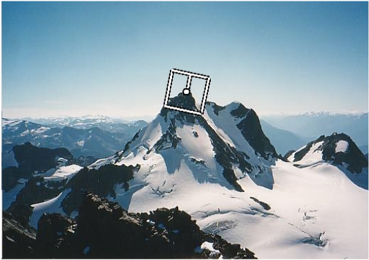]


<div class="my-footer"><span markdown="1">
Images are adapted from slides by Matthew Brown
</span></div>

---
##### Key steps in MOPS
###### C) Photometric normalization

- Extract an **oriented** $40\times 40$ patch around the keypoint
- Scale to 1/5 size (Gaussian smoothing+subsampling)
- Rotate to horizontal and sample 8x8 window.
- Estimate the local mean $\hat{x}$ and the std $\hat{s\_x}$ of intensities in the 8x8.
- Normalize intensities $\hat{I} = \frac{I-\hat{x}}{\hat{s\_x}}$

.center[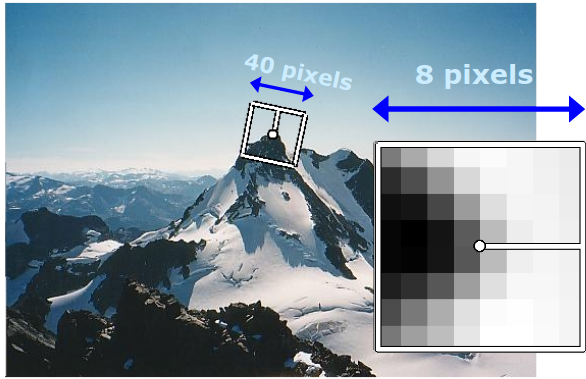]


<div class="my-footer"><span markdown="1">
Images are adapted from slides by Matthew Brown
</span></div>

---
##### Key steps in MOPS
###### D) Extend to all scales

.center[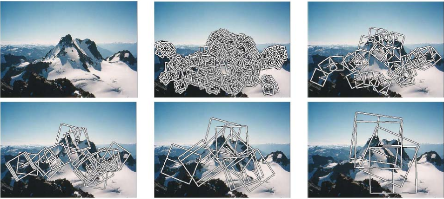]

##### Note on matching feature descriptors in MOPS

To facilitate the search process: 
- a Wavelet transform can be applied to the 8x8 patch.
- extracted coefficients = smaller fingerprint 
- can be used to hash-searching other descriptors.

<div class="my-footer"><span markdown="1">
Images are adapted from slides by Matthew Brown
</span></div>

---
### Scale Invariance 2: Capture the best features across scales

- MOPS represents features per-scale.
- In contrast, SIFT captures the best features along the scale axis.

### Scale Invariant Feature Transform (SIFT)

- not a new way to find key-points or corners
- descriptor of detected corners of different image scales
.center[]
- Developed and patented by Lowe
.center.small[[{Distinctive Image Featuresfrom Scale-Invariant Keypoints}](https://www.cs.ubc.ca/~lowe/papers/ijcv04.pdf) [{Patent}](https://patents.google.com/patent/US6711293B1/en)]


---
class: small
### SIFT
### Key steps in SIFT

1. Scale-space construction
2. Scale-space extrema detection 
   - find local maxima in DoG space
    .center[]
   - .small[Refine the points $\\{(x,y,s)\\}$ from (1).]
   - .small[Thresholding: by contrast and cornerness.]
3. Orientation assignment
   - HoG
4. Keypoint descriptor
   - HoG

---
### SIFT
#### 1. SIFT scale space (DOG)

In SIFT Pyramid we have 

* Octaves: different levels of image resolutions (pyramids levels)
* Scales: different scales of window in each octave level (different $\sigma$ of gaussian window)

.center[]


---
### SIFT
#### 1. SIFT scale space (DOG)

.center[]

* First octave starts with the $\times 2$ upsampled input.
* Subsequent octaves  $\times 2$ subsample their previous.
* Scales: $\sigma, k \sigma, k^2 \sigma, k^3 \sigma, k^4 \sigma$

The author suggests using:

- $\sigma = 1.6$
- $k=\sqrt{2}$

---
### SIFT
#### 1. SIFT scale space (DOG)

```python
# The following are suggested by SIFT author
N_OCTAVES = 4 
N_SCALES = 5 
SIGMA = 1.6
K = sqrt(2)
# s: (s, √2s , 2s, 2√2 s , 4s )
SIGMA_SEQ = lambda s: [ (K**i)*s for i in range(N_SCALES) ] 
# 1.6, 1.6√2, 3.2, 3.2√2, 6.4
SIGMA_SIFT = SIGMA_SEQ(SIGMA) 
KERNEL_RADIUS = lambda s : 2 * int(round(s))
KERNELS_SIFT = [ gaussian_kernel2d(std = s, 
                                   kernlen = 2 * KERNEL_RADIUS(s) + 1) 
                for s in SIGMA_SIFT ]
```
.center[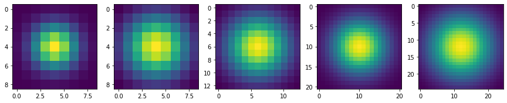]


---
class: small
#### 1. SIFT scale space (DOG)
##### Python's map, lambda, zip

```python
a = [1,2,3,4,5,6]
b = list(map(lambda ai: ai**2, a))
print(b)
```
```
[1, 4, 9, 16, 25, 36]
```
```python
a = [1,2,3,4,5,6]
b = list(map(lambda ai: ai**2, a))
print(list(zip(a,b)))
```
```
[(1, 1), (2, 4), (3, 9), (4, 16), (5, 25), (6, 36)]
```
```python
print(a[-1])
print(a[:-1])
print(a[1:])
print(list(zip( a[:-1] , a[1:] )))
```
```
6
[1, 2, 3, 4, 5]
[2, 3, 4, 5, 6]
[(1, 2), (2, 3), (3, 4), (4, 5), (5, 6)]
```

---
### SIFT
#### 1. SIFT scale space (DOG)

```python
def image_dog( img ):
    octaves = []
    dog = []
    base = rescale( img, 2, anti_aliasing=False) 
    octaves.append([ convolve2d( base , kernel , 'same', 'symm') 
                        for kernel in KERNELS_SIFT ])
    dog.append([ s2 - s1 
            for (s1,s2) in zip( octaves[0][:-1], octaves[0][1:])])
    for i in range(1,N_OCTAVES):
        base = octaves[i-1][2][::2,::2] # 2x subsampling 
        octaves.append([base] + 
            [convolve2d( base , kernel , 'same', 'symm') 
                        for kernel in KERNELS_SIFT[1:] ])
        dog.append([ s2 - s1 
            for (s1,s2) in zip( octaves[i][:-1], octaves[i][1:])])
    return dog , octaves
```

---
### SIFT
#### 1. SIFT scale space (DOG)

```python
plt.imshow(imgs_rgb[0])
plt.axis('off'); plt.show()
```

.center[]

---
class: small
### SIFT
#### 1. SIFT scale space (DOG)

```python
fig, ax = plt.subplots(N_OCTAVES,N_SCALES,figsize = (15, 10))
for octave_idx in range(N_OCTAVES):
    for scale_idx in range(N_SCALES):
        img_scale = img_octaves[octave_idx][scale_idx]
        ax[octave_idx,scale_idx].imshow(img_scale)
```

.center[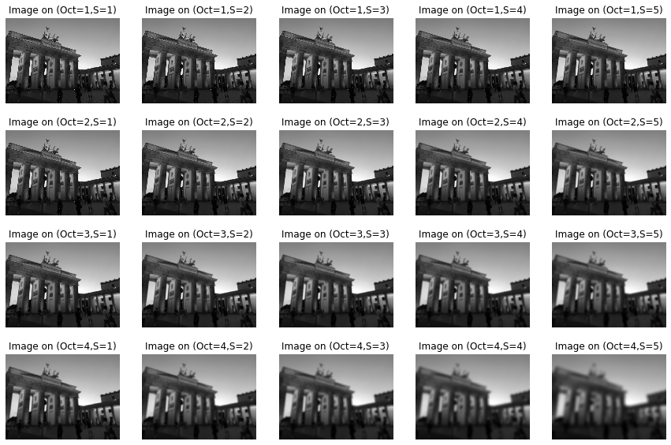]

---
class: small
### SIFT
#### 1. SIFT scale space (DOG)

```python
fig, ax = plt.subplots(N_OCTAVES,N_SCALES-1,figsize = (15, 10))
for octave_idx in range(N_OCTAVES):
    for dog_idx in range(N_SCALES-1):
        img_dog = img_dogs[octave_idx][dog_idx]
        ax[octave_idx,dog_idx].imshow(img_dog, cmap = 'gray')
```
.center[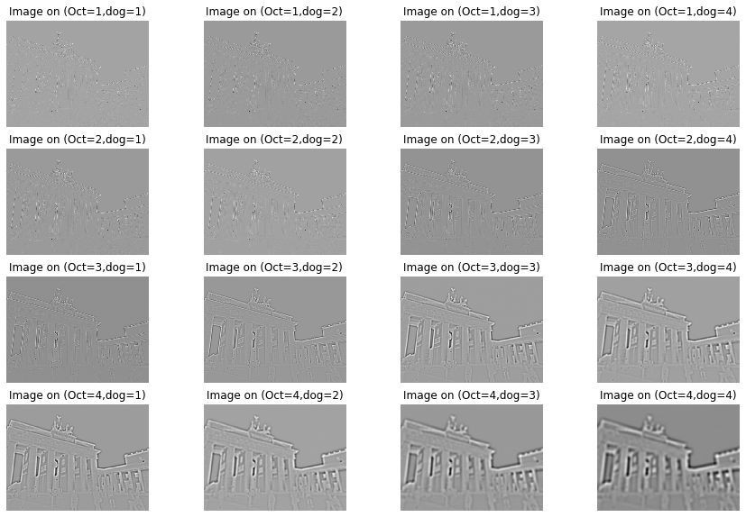]

---
class: small
### SIFT
#### 2. Scale-space extrema detection 

- .blue[find local maxima in DoG space]
.center[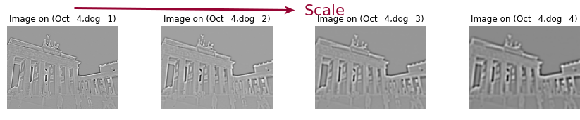]
  - Each pixel is compared with 26 neighbors.
  - 9 from upper scale+9 from lower scale+ 8 from current scale
  - Take if maximum or minimum.
  - For same iamge, it is not necessary for its corners to be localized at same scale.
  - Ignore first and last DoG (no enough neighbors) 
- Refine the points $\\{(x,y,s)\\}$ from (1).
- Thresholding: by contrast and cornerness.

---
class: small
### SIFT
#### 2. Scale-space extrema detection 

- find local maxima in DoG space
- .blue[Refine the points $\\{(x,y,s)\\}$ from (1).]
  .center[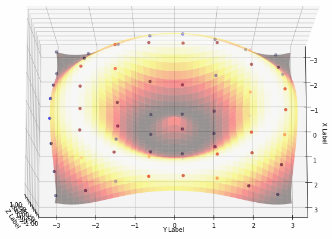]
  - .small[Assume quadratic surface (3 terms from tylor expansion)]
  - .small[$D(x)= D + \frac{\partial D^T}{\partial \mathbf{x}}\mathbf{x} + \frac{1}{2}\mathbf{x}^T\frac{\partial^2 D }{\partial \mathbf{x}^2} \mathbf{x}$]
  - .small[$\mathbf{x} = (x,y,\sigma)^T$ is the offset from the sample]
  - .small[Differentiate and Equate to zero: $\hat{\mathbf{x}}=-\frac{1}{2}\frac{\partial^2 D^{-1} }{\partial \mathbf{x}^2}\frac{\partial D }{\partial \mathbf{x}}$]
  - .small[For this section, we will skip this refinement step (left as an exercise).]
- Thresholding: by contrast and cornerness.

---
class: small
### SIFT
#### 2. Scale-space extrema detection 

- find local maxima in DoG space
- Refine the points $\\{(x,y,s)\\}$ from (1).
- .blue[Thresholding: by contrast and cornerness.]
  - $\mathbf{H} = \begin{bmatrix} D\_{xx} & D\_{xy} \\\ 
  D\_{xy} & D\_{yy} \end{bmatrix}$
  - $\text{Tr}(\mathbf{H}) = D\_{xx} + D\_{yy} = \lambda\_1 + \lambda\_2$
  - $\text{Det}(\mathbf{H}) = D\_{xx} D\_{yy} - D\_{xy}^2 = \lambda\_1 \lambda\_2$
  - $\lambda\_1 = r \lambda\_2$
  - $\frac{\text{Tr}(\mathbf{H})^2}{\text{Det}(\mathbf{H})} = \frac{(\lambda\_1 + \lambda\_2)^2}{\lambda\_1\lambda\_2}=\frac{(r\lambda_2 + \lambda_2)^2}{r\lambda_2^2} = \frac{(r+1)^2}{r^2}$
  - Threshold: $\frac{\text{Tr}(\mathbf{H})^2}{\text{Det}(\mathbf{H})} < \frac{(r+1)^2}{r}$
  - Author recommends $r=10$
  - Contrast thresholding: $|D|>t\_c$
  - Author recommends $t\_c=0.03$


---
class: small
### SIFT
#### 2. Scale-space extrema detection 

##### Corner & Contrast test

```python
def corners( dog , r = 10.0 ):
    threshold = ((r + 1.0)**2)/r
    dx = np.array([-1,1]).reshape((1,2));  dy = dx.T
    dog_x = convolve2d( dog , dx , boundary='symm', mode='same' )
    dog_y = convolve2d( dog , dy , boundary='symm', mode='same' )
    dog_xx = convolve2d( dog_x , dx , boundary='symm', mode='same' )
    dog_yy = convolve2d( dog_y , dy , boundary='symm', mode='same' )
    dog_xy = convolve2d( dog_x , dy , boundary='symm', mode='same' )
        
    tr = dog_xx + dog_yy
    det = dog_xx * dog_yy - dog_xy ** 2
    response = np.zeros_like( dog )
    nonzero = det > np.finfo(np.float32).eps
    response[nonzero] = ( tr[nonzero] ** 2 ) / det[nonzero]
    coords = list(map( tuple , np.argwhere( response > threshold ).tolist() ))
    return coords

def contrast( dog , img_max, threshold = 0.03 ):
    dog_norm = dog / img_max
    coords = list(map( tuple , np.argwhere( np.abs( dog_norm ) > threshold ).tolist() ))
    return coords
```

---
### SIFT
#### 2. Scale-space extrema detection 

.center[]


```python
def cube_extrema( img1, img2, img3 ):
    value = img2[1,1]
    if value > 0: 
        return all([np.all( value >= img ) for img in [img1,img2,img3]])
    else: 
        return all([np.all( value <= img ) for img in [img1,img2,img3]])
```

---
class: small
### SIFT
#### 2. Scale-space extrema detection 

```python
def dog_keypoints( img_dogs , img_max , threshold = 0.03 ):
    octaves_keypoints = []
    for octave_idx in range(N_OCTAVES):
        img_octave_dogs = img_dogs[octave_idx]
        keypoints_per_octave = []
        for dog_idx in range(1, len(img_octave_dogs)-1):
            dog = img_octave_dogs[dog_idx]; h, w = dog.shape
            keypoints = np.full( dog.shape, False, dtype = np.bool)
            candidates= set((i,j) for i in range(1,h-1) for j in range(1,w-1))
            candidates= candidates & set(corners(dog)) & set(contrast(dog,img_max,threshold))
            for i,j in candidates:
                slice1= img_octave_dogs[dog_idx -1][i-1:i+2, j-1:j+2]
                slice2= img_octave_dogs[dog_idx   ][i-1:i+2, j-1:j+2]
                slice3= img_octave_dogs[dog_idx +1][i-1:i+2, j-1:j+2]
                if cube_extrema( slice1, slice2, slice3 ): 
                    keypoints[i,j] = True
            keypoints_per_octave.append(keypoints)
        octaves_keypoints.append(keypoints_per_octave)
    return octaves_keypoints
```

---
class: small
### SIFT
#### 3. Keypoints Orientation

.center[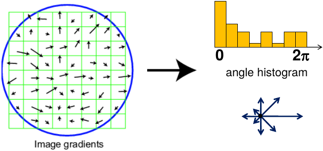 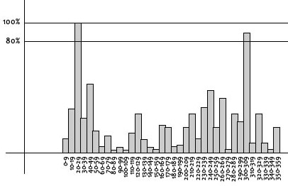]

- Each keypoint should assigned a dominant direction (rotation invariance, later).
- $m(x,y) = \sqrt{(L(x+1,y) - L(x-1,y))^2 + (L(x,y+1) - L(x,y-1))^2}$
- $\theta(x,y) = tan^{-1}(\frac{L(x,y+1) - L(x,y-1)}{L(x+1,y) - L(x-1,y)})$

```python
def sift_gradient(img):
    dx = np.array([-1,0,1]).reshape((1,3)); dy = dx.T
    gx = signal.convolve2d( img , dx , boundary='symm', mode='same' )
    gy = signal.convolve2d( img , dy , boundary='symm', mode='same' )
    magnitude = np.sqrt( gx * gx + gy * gy )
    direction = np.rad2deg( np.arctan2( gy , gx )) % 360
    return gx,gy,magnitude,direction
```

<div class="my-footer"><span markdown="1">
Image adapted from slides by David Lowe and [{aishack.in}](https://aishack.in/tutorials/sift-scale-invariant-feature-transform-keypoint-orientation/)
</span></div>

---
class: small
### SIFT
#### 3. Keypoints Orientation

.center[ ]

- Get the gradient angles of the window and quantize them to **36** intervals (0, 10, 20, ..., 360).
- Use Gaussian kernel with ($\sigma\_\theta = 1.5 \sigma$)
- Kernel radius `r = 2 * int(round(sigma))`
- Any peaks above **80%** of the highest peak are converted into a new keypoint.


---
class: small
### SIFT
#### 3. Keypoints Orientation

```python
def dog_keypoints_orientations( img_gaussians , keypoints , num_bins = 36 ):
    kps = []
    for octave_idx in range(N_OCTAVES):
        for idx,scale_keypoints in enumerate(keypoints[octave_idx]):
            gaussian_img = img_gaussians[octave_idx][ scale_idx + 1 ] 
            sigma = 1.5 * SIGMA * ( 2 ** octave_idx ) * ( K ** (scale_idx))
            radius = KERNEL_RADIUS(sigma)
            kernel = gaussian_kernel2d(std = sigma, kernlen = 2 * radius + 1)
            gx,gy,magnitude,direction = sift_gradient(gaussian_img)
            direction_idx = np.round( direction * num_bins / 360 ).astype(int)          
            
            for i,j in map( tuple , np.argwhere( scale_keypoints ).tolist() ):
                window = [i-radius, i+radius+1, j-radius, j+radius+1]
                mag_win = padded_slice( magnitude , window ) * kernel
                dir_idx = padded_slice( direction_idx, window )

                hist = np.zeros(num_bins, dtype=np.float32)
                for bin_idx in range(num_bins):
                    hist[bin_idx] = np.sum( mag_win[ dir_idx == bin_idx ] )
                for bin_idx in np.argwhere( hist >= 0.8 * hist.max() ).tolist():
                    angle = (bin_idx[0]+0.5) * (360./num_bins) % 360
                    kps.append( (i,j,octave_idx,scale_idx,angle))
    return octaves_kps
```

---
### SIFT
#### 3. Keypoints Orientation

##### Corners + Orientation (Last Octave)

.center[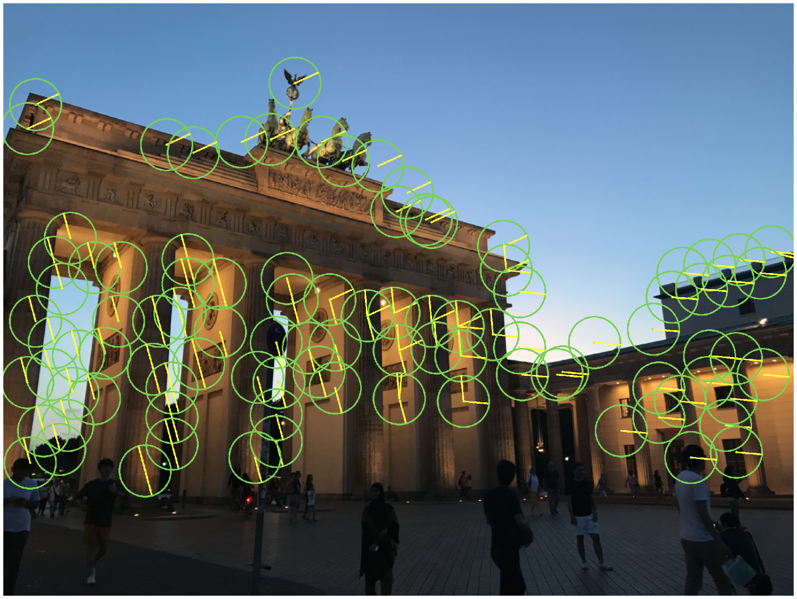]

---
### SIFT
#### 3. Keypoints Orientation

##### Corners + Orientation (all Octaves)

.center[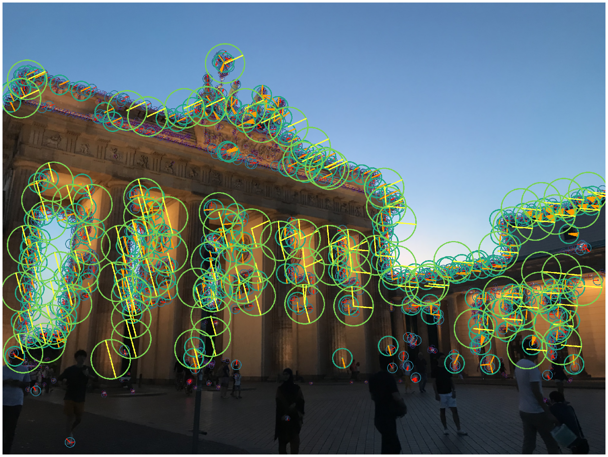]

---
### SIFT
#### 4. SIFT Descriptor

.center[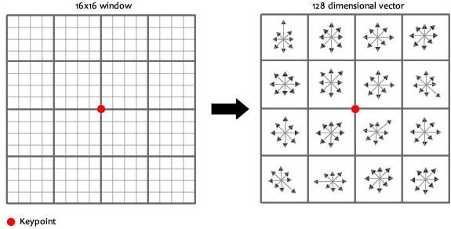]


After localization of a keypoint and determination of dominant direction:

* Extract a $16 \times 16$ window centered by the keypoint.
* Get gradient magnitude and multiply it by a $16 \times 16$ gaussian window of $\sigma =1.5$

---
### SIFT
#### 4. SIFT Descriptor

.center[]

* Adjusting orientation (To be rotation invariant):
    * .small[get the gradient angle of the window and Quantize them to 8 intervals (0, 45, 90, ..., 360)]
    * .small[subtract corner dominant direction from gradient angle.]

---
class: small
### SIFT
#### 4. SIFT Descriptor

.center[]

* Divide the $16 \times 16$ window into **16** subregions ($4 \times 4$ each). 
* For each region construct histogram for the quntized 8 directions.
* Each region is represented by **8 values**
* Combine all values into one vector $S$ (size = $8 \times 16 = 128)$
* Unit normalize $S' = \frac{S}{||S||}$
* Clip values larger than 0.2 (overcome nonlinear illumination effect): $S'' = \text{Clip}(S',0,0.2)$
* Renormalize $S''' = \frac{S''}{||S''||}$

---
class: small
### SIFT
#### 4. SIFT Descriptor

.center[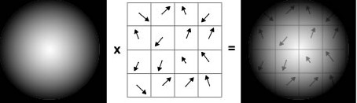]

```python
def extract_sift_descriptors128( img_gaussians, keypoints, num_bins = 8 ):
    descriptors = [] ; points = []; scale_data = {} 
    for octave_idx in range(N_OCTAVES):
        for (i,j,o_idx,scale_idx, theta) in keypoints[octave_idx]:
            # A) Caching
            if 'index' not in data or data['index'] != (o_idx,scale_idx):
                data['index'] = (o_idx,scale_idx)
                gaussian_img = img_gaussians[octave_idx][ scale_idx ] 
                sigma = 1.5 * SIGMA * ( 2 ** octave_idx ) * ( K ** (scale_idx))
                data['kernel'] = gaussian_kernel2d(std = sigma, kernlen = 16)                
                _, _, data['magnitude'], data['direction'] =sift_gradient(gaussian_img)
            win_mag = rotated_subimage(data['magnitude'],(j,i),theta,16,16)* data['kernel']
            win_dir = rotated_subimage(data['direction'],(j,i),theta,16,16)
            win_dir = (((win_dir - theta) % 360) * num_bins / 360.).astype(int)
            # B) HoG "4x4" x 16 ...
            # C) Combine+Normalize ...
    return points , descriptors
```

---
class: small
### SIFT
#### 4. SIFT Descriptor

.center[]

```python
def extract_sift_descriptors128( img_gaussians, keypoints, num_bins = 8 ):
    descriptors = [] ; points = []; scale_data = {} 
    for octave_idx in range(N_OCTAVES):
        for (i,j,o_idx,scale_idx, theta) in keypoints[octave_idx]:
            # A) Caching ...
            # B) HoG "4x4" x 16
            features = []
            for sub_i in range(4):
                for sub_j in range(4):
                    sub_weights = win_mag[sub_i*4:(sub_i+1)*4, sub_j*4:(sub_j+1)*4]
                    sub_dir_idx = win_dir[sub_i*4:(sub_i+1)*4, sub_j*4:(sub_j+1)*4]
                    hist = np.zeros(num_bins, dtype=np.float32)
                    for bin_idx in range(num_bins):
                        hist[bin_idx] = np.sum( sub_weights[ sub_dir_idx == bin_idx ] )
                    features.extend( hist.tolist())
            # C) Combine+Normalize ...
    return points , descriptors
```

---
class: small
### SIFT
#### 4. SIFT Descriptor

```python
def extract_sift_descriptors128( img_gaussians, keypoints, num_bins = 8 ):
    descriptors = []
    points = []
    for octave_idx in range(N_OCTAVES):
        scale_data = {}         
        for (i,j,o_idx,scale_idx, theta) in keypoints[octave_idx]:
            # Caching...
            # B) HoG "4x4" x 16...
            # C) Combine+Normalize
            features /= (np.linalg.norm(np.array(features)))
            features = np.clip(features , np.finfo(np.float16).eps , 0.2)
            features /= (np.linalg.norm(features))
            descriptors.append(features)
            points.append( (i ,j , octave_idx, scale_idx, theta))
    return points , descriptors
```

---
class: small, middle
### SIFT - Results

.center[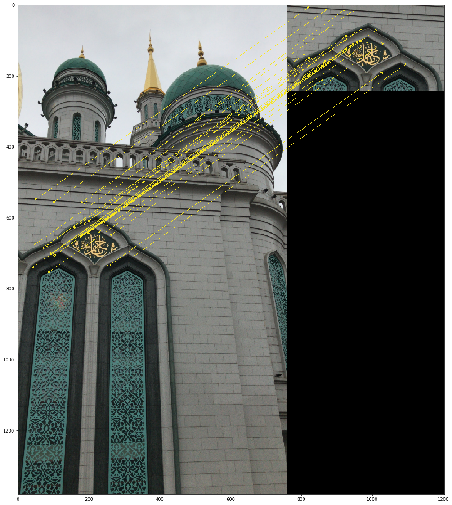]

---
class: small, middle
### SIFT - Results

.center[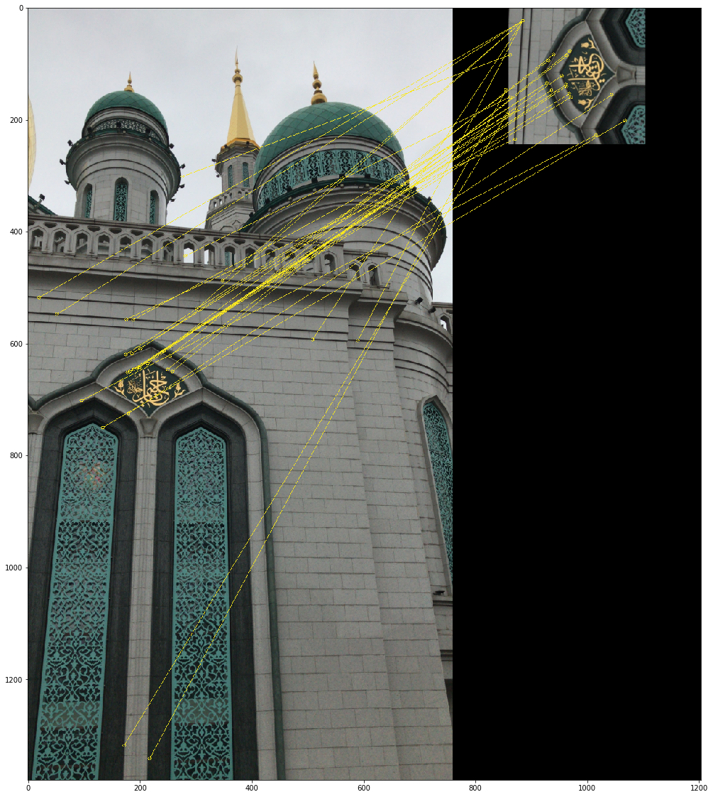]

---
class: small, middle, center
### SIFT - Results

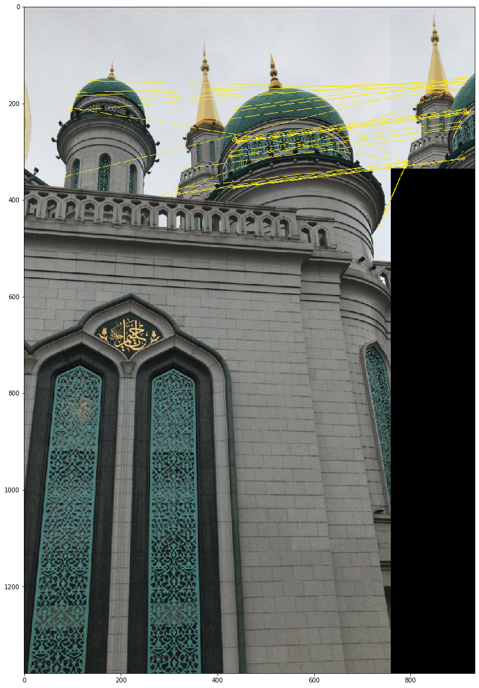

---
class: small, middle, center
### SIFT - Results

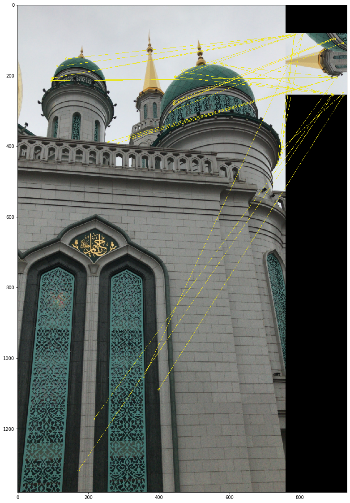

---
class: small, middle, center
### SIFT - Results

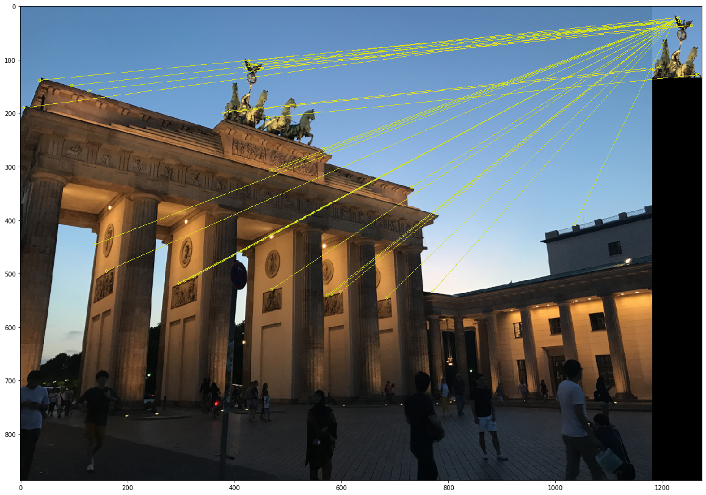

---
class: small, middle, center
### SIFT - Results

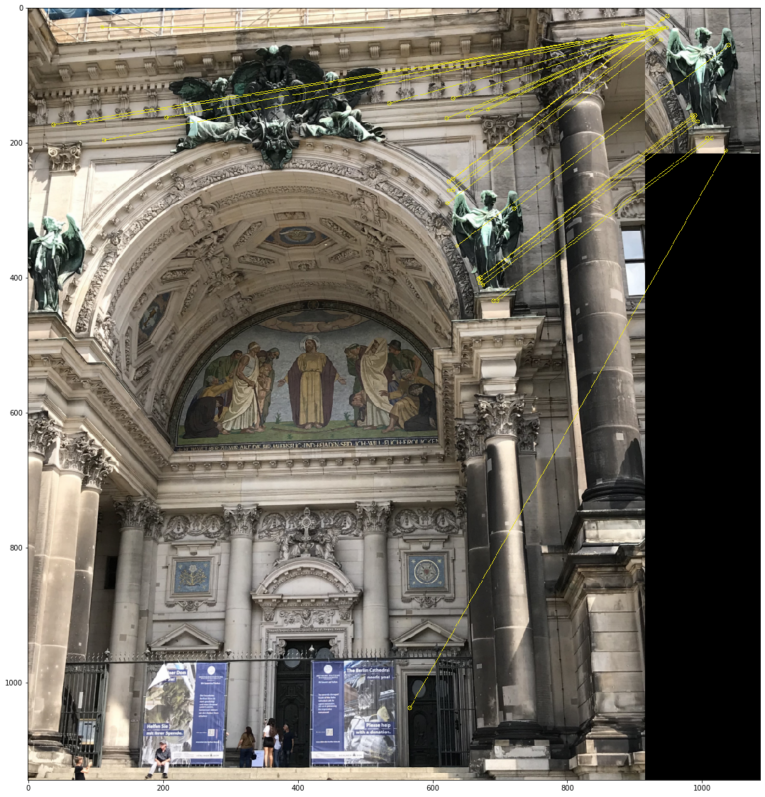

---
class: small, middle, center
### SIFT - Results

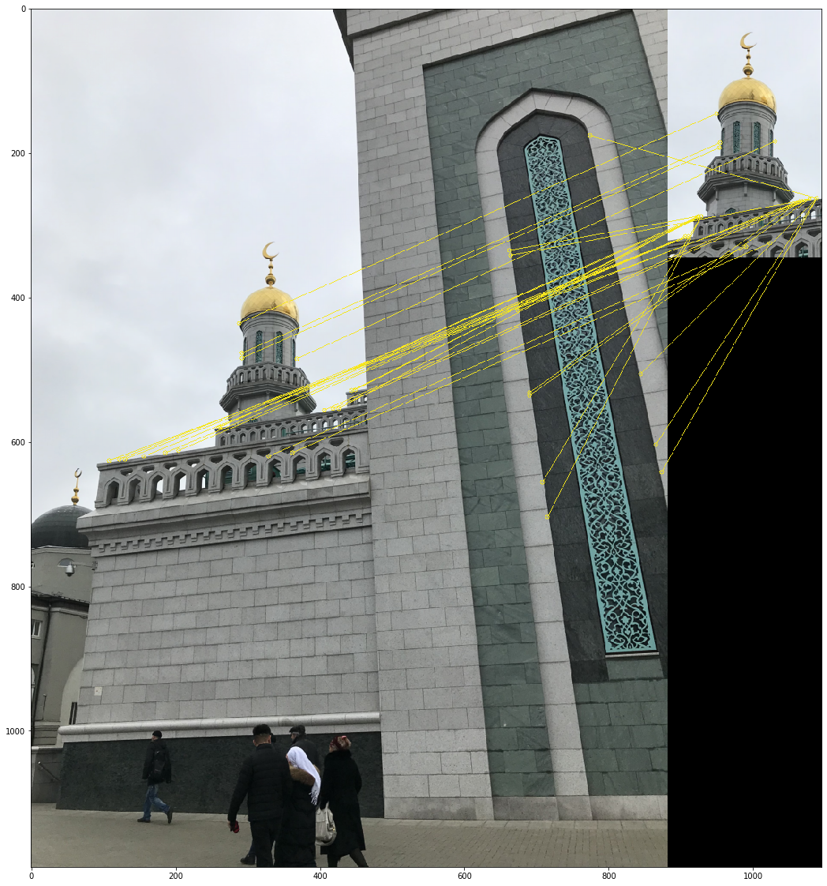

---
class: middle, center


[{`scale_invariance.ipnyb`}](https://github.com/sbme-tutorials/sbme-tutorials.github.io/blob/master/2020/cv/notebooks/scale_invariance.ipynb)


---
class: center, middle
## Image Matching Challenge 2020 
### Sponsored by CVPR 2020

.center[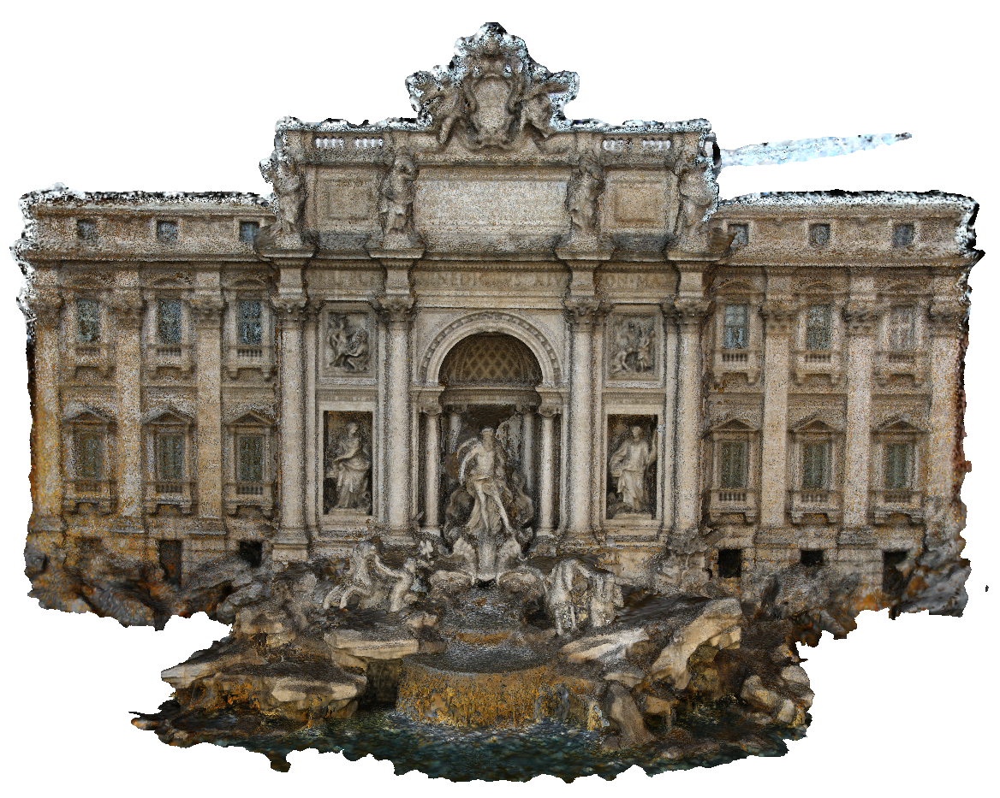]

* Some local descriptors developed as early as 2004
* Several of them outperform the state-of-the-art machine learning approaches in object recognition

[{vision.uvic.ca/image-matching-challenge}](https://vision.uvic.ca/image-matching-challenge/)


[{github.com/vcg-uvic/image-matching-benchmark}](https://github.com/vcg-uvic/image-matching-benchmark)


---
# Thank you




</textarea>
