<textarea id="source" markdown="1">

# Section 6

## Template Matching and Scale Invariant Feature Descriptors

##### Presentation by *{{ page.author }}*



---
class: left, top
## Template matching


<div class="row">
<div class="col-md-6" markdown="1">
- distance metric
- output: intensity image
- application: crop a single object (e.g cell) and predict where other such similar objects are in the image.
- .red[Not rotation invariant]
- good for approximately .blue[rounded objects]
- good for .blue[regular shapes in consistent direction].
</div>
<div class="col-md-6" markdown="1">
Find (<span>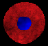</span>) in <br><br>
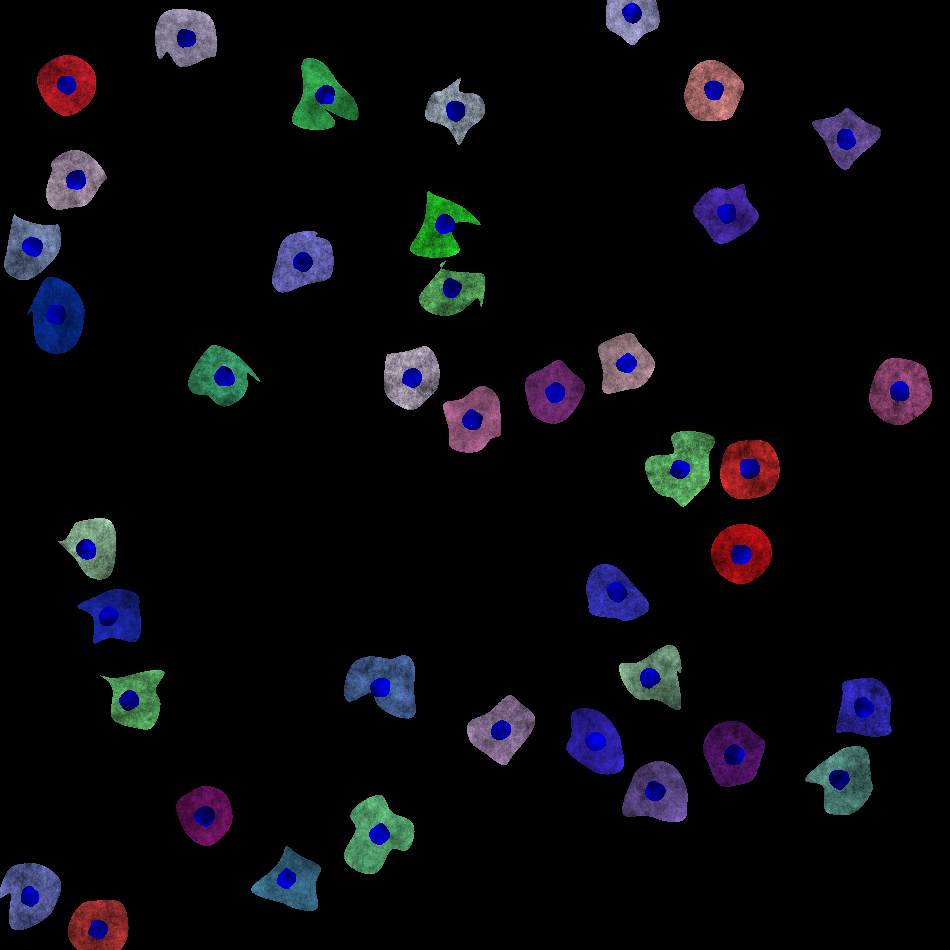<br>
</div>
</div>

<div class="my-footer"><span markdown="1">[{Dataset: Simulated 24-well plate with synthetic cells (Lehmussola et al., 2007)}](https://data.broadinstitute.org/bbbc/BBBC031/)</span></div>


---
class: left, top
## Template matching

### Example

<div class="row">
<div class="col-md-4 align-self-center" markdown="1">
$h=$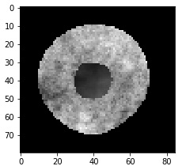
</div>
<div class="col-md-8 align-self-center" markdown="1">
$I=$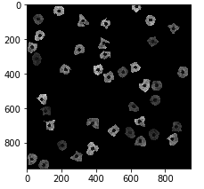
</div>

</div>
<div class="row">
<div class="col-md-4 align-self-center" markdown="1">
$h=$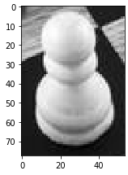
</div>
<div class="col-md-8 align-self-center" markdown="1">
$I=$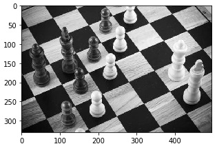
</div>

</div>

---


### Method 0: Direct 2D correlation of the image with the template

$$y[m,n] = \sum\_{k,l} h[k,l]x[m+k,n+l]$$

```python
import numpy as np
from scipy.signal import correlate2d
def match_template_corr( x , temp ):
    y = np.empty(x.shape)
    y = correlate2d(x,temp,'same')
    return y
```

<div class="row text-center justify-content-bottom">
<div class="col-md-3" markdown="1">
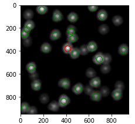
</div>
<div class="col-md-3" markdown="1">
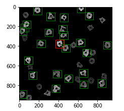
<h6>.red[$\uparrow \uparrow$ False Positives]</h6>

</div>
<div class="col-md-3" markdown="1">
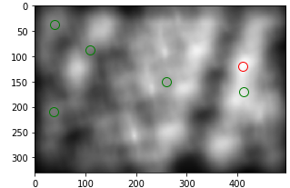
</div>
<div class="col-md-3" markdown="1">
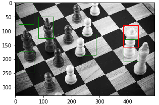
<h6>.red[$\uparrow \uparrow$ False Positives]</h6>
</div>
</div>
---

### Method 1: Direct 2D correlation of the image with the *zero-mean* template

$$y[m,n] = \sum\_{k,l} (h[k,l]-\bar{h}) x\[m+k,n+l\]$$

```python
def match_template_corr_zmean( x , temp ):
    return match_template_corr(x , temp - temp.mean())
```

<div class="row text-center justify-content-bottom">
<div class="col-md-3" markdown="1">
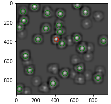
</div>
<div class="col-md-3" markdown="1">
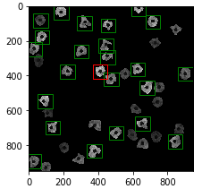
<h6>.blue[fewer FP]</h6>

</div>
<div class="col-md-3" markdown="1">
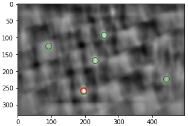
</div>
<div class="col-md-3" markdown="1">
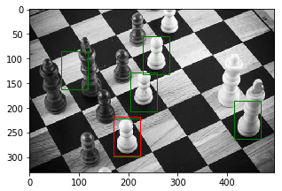
<h6>.blue[$\downarrow$ FP]</h6>
</div>
</div>

---
### Method 2: SSD

$$y\[m,n\] = \sum\_{k,l} (h[k,l]- x[m+k,n+l])^2$$

.red[We need to avoid for loops!]

$$ = \sum\_{k,l}h\[k,l\]^2 - 2\sum\_{k,l}h\[k,l\]x\[m+k,n+l\] + \sum\_{k,l}x\[m+k,n+l\]^2 $$

| $ \sum\_{k,l}h\[k,l\]^2$  | $\sum\_{k,l}h\[k,l\]x\[m+k,n+l\]$ | $\sum\_{k,l}x\[m+k,n+l\]^2$ |
|--|--|--|--|
| .small[`np.sum(h*h)`] | .small[`correlate2d(x,h)`] | .small[`correlate2d(x*x,np.ones(h.shape))`] |

---
### Method 2: SSD (cont'd)


$$y\[m,n\] = \sum\_{k,l} (h[k,l]- x[m+k,n+l])^2$$

.red[We need to avoid for loops!]

$$ = \sum\_{k,l}h\[k,l\]^2 - 2\sum\_{k,l}h\[k,l\]x\[m+k,n+l\] + \sum\_{k,l}x\[m+k,n+l\]^2 $$

```python
def match_template_ssd( x , temp ):
    term1 = np.sum( np.square( temp ))
    term2 = -2*correlate2d(x, temp,'same')
    term3 = correlate2d( np.square( x ), np.ones(temp.shape),'same' )
    return 1 - np.sqrt(ssd)
```

- Numerical stability?

---
### Method 2: SSD (cont'd)


$$y\[m,n\] = \sum\_{k,l} (h[k,l]- x[m+k,n+l])^2$$

.red[We need to avoid for loops!]

$$ = \sum\_{k,l}h\[k,l\]^2 - 2\sum\_{k,l}h\[k,l\]x\[m+k,n+l\] + \sum\_{k,l}x\[m+k,n+l\]^2 $$

```python
def match_template_ssd( x , temp ):
    term1 = np.sum( np.square( temp ))
    term2 = -2*correlate2d(x, temp,'same')
    term3 = correlate2d( np.square( x ), np.ones(temp.shape),'same' )
    ssd = np.maximum( term1 + term2 + term3 , 0 )
    return 1 - np.sqrt(ssd)
```

---
### Method 2: SSD (cont'd)

```python
def match_template_ssd( x , temp ):
    term1 = np.sum( np.square( temp ))
    term2 = -2*correlate2d(x, temp,'same')
    term3 = correlate2d( np.square( x ), np.ones(temp.shape),'same' )
    ssd = np.maximum( term1 + term2 + term3 , 0 )
    return 1 - np.sqrt(ssd)
```

<div class="row text-center">
<div class="col-md-4 align-self-center" markdown="1">
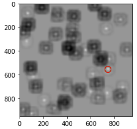
</div>
<div class="col-md-8 align-self-center" markdown="1">
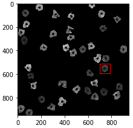
</div>

</div>
<div class="row  text-center">
<div class="col-md-4 align-self-center" markdown="1">
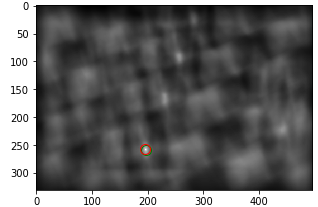
</div>
<div class="col-md-8 align-self-center" markdown="1">
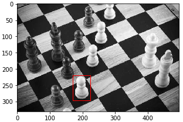
</div>

</div>

---
class: center
### Method 3: Normalized cross-correlation


$$\gamma[\color{BlueViolet}{u,v}] = \frac{\sum\_{x,y} (f[x,y]-\bar{f\_{u,v}}) (t[\color{Red}{x-u,y-v}] - \bar{t})}{ \sqrt{\sum\_{x,y}(f[x,y]-\bar{f\_{u,v}})^2 \sum\_{x,y}(t[\color{Red}{x-u,y-v}] - \bar{t})^2 }}$$

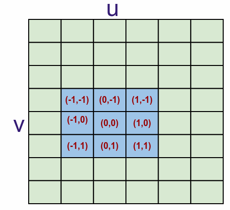

In the above image $u=2$, $v=4$, $x \in \{1,2,3\}$, and $y \in \{3,4,5\}$

---
class: center
### Method 3: Normalized cross-correlation (cont'd)

$$\gamma[\color{BlueViolet}{u,v}] = \frac{\sum\_{x,y} (f[x,y]-\bar{f\_{u,v}}) (t[\color{Red}{x-u,y-v}] - \bar{t})}{ \sqrt{\sum\_{x,y}(f[x,y]-\bar{f\_{u,v}})^2 \sum\_{x,y}(t[\color{Red}{x-u,y-v}] - \bar{t})^2 }}$$

| Formula | Python |
|---|---|
|  $f\_c=(f[x,y]-\bar{f\_{u,v}})$ | .small[`f_c=f-correlate2d(f,np.ones(t.shape)/t.size)`]  |
| $t\_c= (t[\color{Red}{x-u,y-v}] - \bar{t})$ | .small[`t_c=t-t.mean()`]  |
| $\sum\_{x,y} f\_c t\_c$ | .small[`correlate2d( f_c , t_c , 'same' )`] |
| $\sum\_{x,y}f\_c^2$ | .small[`correlate2d( f_c * f_c , np.ones(t.shape))`]  |
| $\sum\_{x,y}t\_c^2$ | .small[`np.sum(t_c * t_c)`] |

---
### Method 3: Normalized cross-correlation (cont'd)

$$\gamma[\color{BlueViolet}{u,v}] = \frac{\sum\_{x,y} (f[x,y]-\bar{f\_{u,v}}) (t[\color{Red}{x-u,y-v}] - \bar{t})}{ \sqrt{\sum\_{x,y}(f[x,y]-\bar{f\_{u,v}})^2 \sum\_{x,y}(t[\color{Red}{x-u,y-v}] - \bar{t})^2 }}$$


```python
def match_template_xcorr( f , t ):
    f_c = f - correlate2d( f , np.ones(t.shape)/np.prod(t.shape), 'same') 
    t_c = t - t.mean()
    numerator = correlate2d( f_c , t_c , 'same' )
    d1 = correlate2d( np.square(f_c) , np.ones(t.shape), 'same')
    d2 = np.sum( np.square( t_c ))
    # to avoid sqrt of negative
    denumerator = np.sqrt( np.maximum( d1 * d2 , 0 )) 
    return numerator/denumerator
```

- Division by zero?

---
### Method 3: Normalized cross-correlation (cont'd)

```python
def match_template_xcorr( f , t ):
    f_c = f - correlate2d( f , np.ones(t.shape)/np.prod(t.shape), 'same') 
    t_c = t - t.mean()
    numerator = correlate2d( f_c , t_c , 'same' )
    d1 = correlate2d( np.square(f_c) , np.ones(t.shape), 'same')
    d2 = np.sum( np.square( t_c ))
    # to avoid sqrt of negative
    denumerator = np.sqrt( np.maximum( d1 * d2 , 0 ))
    response = np.zeros( f.shape )
    # mask to avoid division by zero
    valid = denumerator > np.finfo(np.float32).eps 
    response[valid] = numerator[valid]/denumerator[valid]
    return response
```

---
### Method 3: Normalized cross-correlation (cont'd)


<div class="row text-center">
<div class="col-md-4 align-self-center" markdown="1">
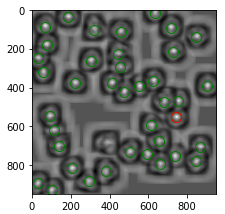
</div>
<div class="col-md-8 align-self-center" markdown="1">
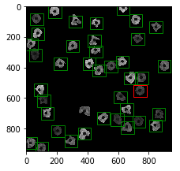
</div>

</div>
<div class="row  text-center">
<div class="col-md-4 align-self-center" markdown="1">
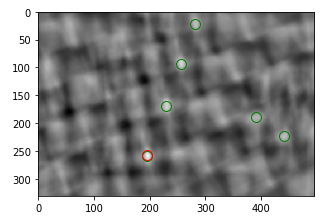
</div>
<div class="col-md-8 align-self-center" markdown="1">
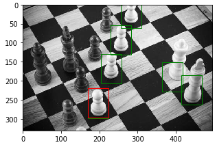
</div>

</div>


---
class: middle, center


[{`template_matching.ipnyb`}](https://github.com/sbme-tutorials/sbme-tutorials.github.io/blob/master/2020/cv/notebooks/template_matching.ipynb)


</textarea>
