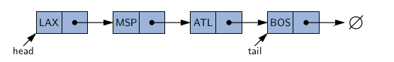
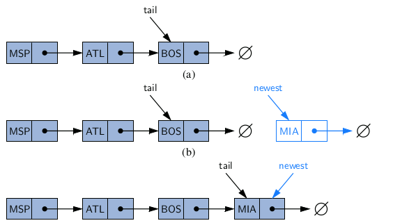
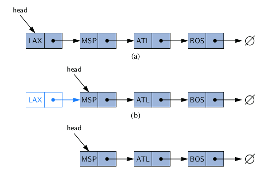
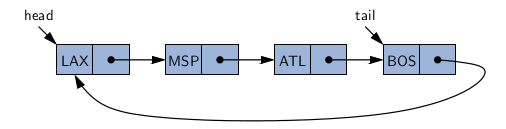
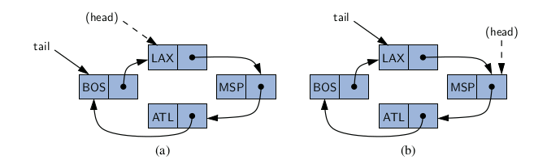
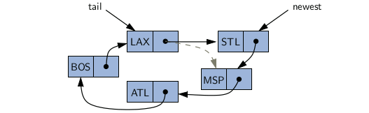
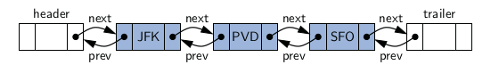
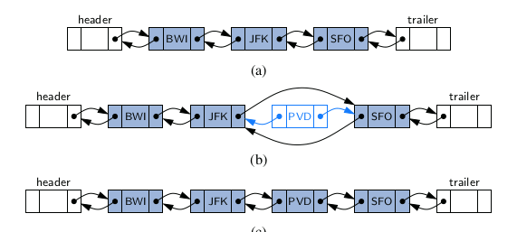
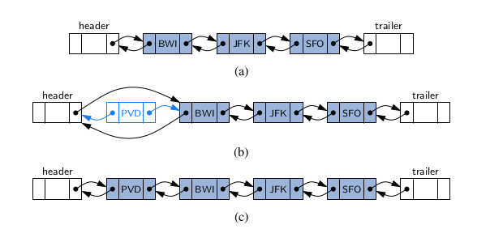
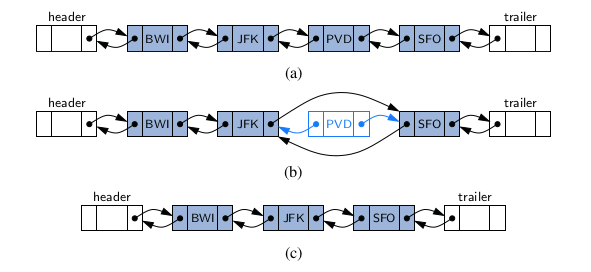

---
# You don't need to edit this file, it's empty on purpose.
# Edit theme's home layout instead if you wanna make some changes
# See: https://jekyllrb.com/docs/themes/#overriding-theme-defaults
layout: page
category: "notes"
course: "CMP2241"
year: "2020"
---
* TOC
{:toc}

## Linked Lists

Arrays are great for storing things in a certain order, but they
have drawbacks. The capacity of the array must be fixed when it is created, and
insertions and deletions at interior positions of an array can be time consuming if
many elements must be shifted.

In this section, we introduce a data structure known as a linked list, which pro-
vides an alternative to an array-based structure. A linked list, in its simplest form,
is a collection of nodes that collectively form a linear sequence. In a singly linked
list, each node stores a reference to an object that is an element of the sequence, as
well as a reference to the next node of the list.

### Singly Linked Lists
the linked list instance must keep a reference to the first
node of the list, known as the head. Without an explicit reference to the head,
there would be no way to locate that node (or indirectly, any others). The last
node of the list is known as the tail. The tail of a list can be found by traversing the
linked list— starting at the head and moving from one node to another by following
each node’s next reference. We can identify the tail as the node having null as its
next reference. This process is also known as link hopping or pointer hopping.



#### Inserting an Element at the Head of a Singly Linked List

An important property of a linked list is that it does not have a predetermined fixed
size; it uses space proportional to its current number of elements. When using a
singly linked list, we can easily insert an element at the head of the list.


```
Algorithm addFirst(e):
	newest = Node(e) 
	newest.next = head
	head = newest
	size = size + 1
```

#### Inserting an Element at the Tail of a Singly Linked List

We can also easily insert an element at the tail of the list, provided we keep a
reference to the tail node, as shown in Figure 3.13. In this case, we create a new
node, assign its next reference to null, set the next reference of the tail to point to
this new node, and then update the tail reference itself to this new node. 



```
Algorithm addLast(e):
	newest = Node(e) 
	newest.next = null
	tail.next = newest
	tail = newest
	size = size + 1
```

#### Removing an Element from a Singly Linked List

emoving an element from the head of a singly linked list is essentially the reverse
operation of inserting a new element at the head.



```
Algorithm removeFirst( ):
	if head == null then
	the list is empty.
	head = head.next
	size = size − 1
```

#### Implementing a Singly Linked List Class

A complete implementation of a SinglyLinkedList class,supporting the following methods:
* **size( )**: Returns the number of elements in the list.
* **isEmpty( )**: Returns true if the list is empty, and false otherwise.
* **first( )**: Returns (but does not remove) the first element in the list.
* **last( )**: Returns (but does not remove) the last element in the list.
* **addFirst(e)**: Adds a new element to the front of the list.
* **addLast(e)**: Adds a new element to the end of the list.
* **removeFirst( )**: Removes and returns the first element of the list.

```java

public class SinglyLinkedList<E> {

	private static class Node<E> {
		private E element;
		private Node<E> next;

		public Node(E e, Node<E> n) {
			element = e;
			next = n;
		}

		public E getElement() {
			return element;
		}

		public Node<E> getNext() {
			return next;
		}

		public void setNext(Node<E> n) {
			next = n;
		}
	}

	private Node<E> head = null;
	private Node<E> tail = null;
	private int size = 0;

	public SinglyLinkedList() {
	}

	public int size() {
		return size;
	}

	public boolean isEmpty() {
		return size == 0;
	}

	public E first() {
		if (isEmpty())
			return null;
		return head.getElement();
	}

	public E last() {
		if (isEmpty())
			return null;
		return tail.getElement();
	}

	public void addFirst(E e) {
		head = new Node<>(e, head);
		if (size == 0)
			tail = head;
		size++;
	}

	public void addLast(E e) {
		Node<E> newest = new Node<>(e, null);
		if (isEmpty())
			head = newest;
		else
			tail.setNext(newest);
		tail = newest;
		size++;
	}

	public E removeFirst() {
		if (isEmpty())
			return null;
		E answer = head.getElement();
		head = head.getNext();
		size--;
		if (size == 0)
			tail = null;
		return answer;
	}

	public static void main(String[] args) {

	}
}

```

### Circularly Linked Lists

Linked lists are traditionally viewed as storing a sequence of items in a linear or-
der, from first to last. However, there are many applications in which data can
be more naturally viewed as having a cyclic order, with well-defined neighboring
relationships, but no fixed beginning or end.
For example, many multiplayer games are turn-based, with player A taking a
turn, then player B, then player C, and so on, but eventually back to player A again,
and player B again, with the pattern repeating.



Implementing the new rotate method is quite trivial. We do not move any nodes
or elements, we simply advance the tail reference to point to the node that follows
it (the implicit head of the list). 



We can add a new element at the front of the list by creating a new node and
linking it just after the tail of the list.



**Additional Optimization**

In implementing a new class, we make one additional optimization—we no longer
explicitly maintain the head reference. So long as we maintain a reference to the
tail, we can locate the head as tail.getNext( ). Maintaining only the tail reference
not only saves a bit on memory usage, it makes the code simpler and more efficient,
as it removes the need to perform additional operations to keep a head reference
current. In fact, our new implementation is arguably superior to our original singly
linked list implementation, even if we are not interested in the new rotate method.

```java

public class CircularlyLinkedList<E> {

	private static class Node<E> {
		private E element;
		private Node<E> next;

		public Node(E e, Node<E> n) {
			element = e;
			next = n;
		}

		public E getElement() {
			return element;
		}

		public Node<E> getNext() {
			return next;
		}

		public void setNext(Node<E> n) {
			next = n;
		}
	}

	private Node<E> tail = null;
	private int size = 0;

	public CircularlyLinkedList() {
	}

	public int size() {
		return size;
	}

	public boolean isEmpty() {
		return size == 0;
	}

	public E first() {
		if (isEmpty())
			return null;
		return tail.getNext().getElement();
	}

	public E last() {
		if (isEmpty())
			return null;
		return tail.getElement();
	}

	public void rotate() {
		if (tail != null)
			tail = tail.getNext();
	}

	public void addFirst(E e) {
		if (size == 0) {
			tail = new Node<>(e, null);
			tail.setNext(tail);
		} else {
			Node<E> newest = new Node<>(e, tail.getNext());
			tail.setNext(newest);
		}
		size++;
	}

	public void addLast(E e) {
		addFirst(e);
		tail = tail.getNext();
	}

	public E removeFirst() {
		if (isEmpty())
			return null;
		Node<E> head = tail.getNext();
		if (head == tail)
			tail = null;
		else
			tail.setNext(head.getNext());
		size--;
		return head.getElement();
	}
}

```

### Doubly Linked Lists

n a singly linked list, each node maintains a reference to the node that is immedi-
ately after it. We have demonstrated the usefulness of such a representation when
managing a sequence of elements. However, there are limitations that stem from
the asymmetry of a singly linked list. we demonstrated that we can efficiently insert a node at either end of a singly linked list, and can delete a node at
the head of a list, but we are unable to efficiently delete a node at the tail of the list.
More generally, we cannot efficiently delete an arbitrary node from an interior po-
sition of the list if only given a reference to that node, because we cannot determine
the node that immediately precedes the node to be deleted (yet, that node needs to
have its next reference updated).


To provide greater symmetry, we define a linked list in which each node keeps
an explicit reference to the node before it and a reference to the node after it. Such
a structure is known as a doubly linked list. These lists allow a greater variety of
O(1)-time update operations, including insertions and deletions at arbitrary posi-
tions within the list. We continue to use the term “next” for the reference to the
node that follows another, and we introduce the term “prev” for the reference to the
node that precedes it.

#### Header and Trailer Sentinels

In order to avoid some special cases when operating near the boundaries of a doubly
linked list, it helps to add special nodes at both ends of the list: a header node at the
beginning of the list, and a trailer node at the end of the list. These “dummy” nodes
are known as sentinels (or guards), and they do not store elements of the primary
sequence.



#### Inserting and Deleting with a Doubly Linked List

Every insertion into our doubly linked list representation will take place between
a pair of existing nodes, as diagrammed in Fthe following figure. For example, when a new
element is inserted at the front of the sequence, we will simply add the new node
between the header and the node that is currently after the header.





The deletion of a node, proceeds in the opposite fash-
ion of an insertion. The two neighbors of the node to be deleted are linked directly
to each other, thereby bypassing the original node. As a result, that node will no
longer be considered part of the list and it can be reclaimed by the system. Because
of our use of sentinels, the same implementation can be used when deleting the first
or the last element of a sequence, because even such an element will be stored at a
node that lies between two others.



#### Implementing a Doubly Linked List Class

A complete implementation of a DoublyLinkedList class

* **size( )**: Returns the number of elements in the list.
* **isEmpty( )**: Returns true if the list is empty, and false otherwise.
* **first( )**: Returns (but does not remove) the first element in the list.
* **last( )**: Returns (but does not remove) the last element in the list.
* **addFirst(e)**: Adds a new element to the front of the list.
* **addLast(e)**: Adds a new element to the end of the list.
* **removeFirst( )**: Removes and returns the first element of the list.
* **removeLast( )**: Removes and returns the last element of the list.

```java
package standardDS;

public class DoublyLinkedList<E> {

	private static class Node<E> {
		private E element;
		private Node<E> prev;
		private Node<E> next;

		public Node(E e, Node<E> p, Node<E> n) {
			element = e;
			prev = p;
			next = n;
		}

		public E getElement() {
			return element;
		}

		public Node<E> getPrev() {
			return prev;
		}

		public Node<E> getNext() {
			return next;
		}

		public void setPrev(Node<E> p) {
			prev = p;
		}

		public void setNext(Node<E> n) {
			next = n;
		}

	} // ----------- end of nested Node class -----------

	private Node<E> header;
	private Node<E> trailer;
	private int size = 0;

	public DoublyLinkedList() {
		header = new Node<>(null, null, null);
		trailer = new Node<>(null, header, null);
		header.setNext(trailer);
	}

	public int size() {
		return size;
	}

	public boolean isEmpty() {
		return size == 0;
	}

	public E first() {
		if (isEmpty())
			return null;
		return header.getNext().getElement();
	}

	public E last() {
		if (isEmpty())
			return null;
		return trailer.getPrev().getElement();
	}

	public void addFirst(E e) {
		addBetween(e, header, header.getNext());
	}

	public void addLast(E e) {
		addBetween(e, trailer.getPrev(), trailer);
	}

	public E removeFirst() {
		if (isEmpty())
			return null;
		return remove(header.getNext());
	}

	public E removeLast() {
		if (isEmpty())
			return null;
		return remove(trailer.getPrev());
	}

	private void addBetween(E e, Node<E> predecessor, Node<E> successor) {
		Node<E> newest = new Node<>(e, predecessor, successor);
		predecessor.setNext(newest);
		successor.setPrev(newest);
		size++;
	}

	private E remove(Node<E> node) {
		Node<E> predecessor = node.getPrev();
		Node<E> successor = node.getNext();
		predecessor.setNext(successor);
		successor.setPrev(predecessor);
		size--;
		return node.getElement();
	}
}
```