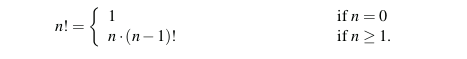
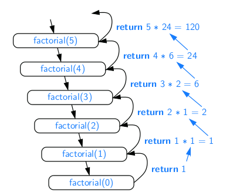
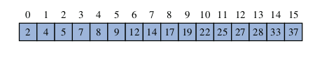
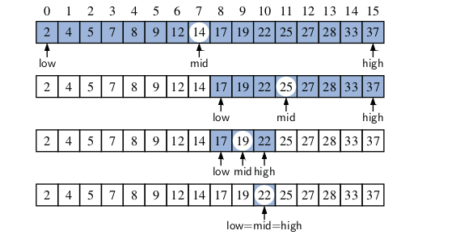
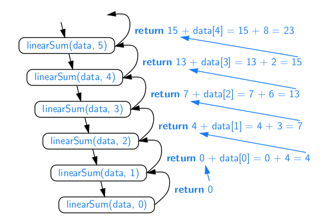
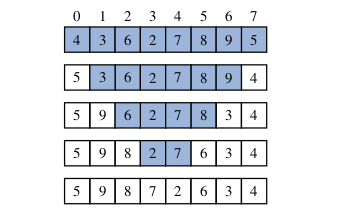
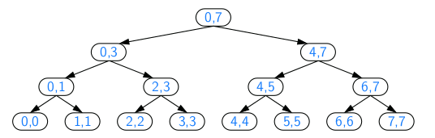

* TOC
{:toc}

## Recursion

One way to describe repetition within a computer program is the use of loops,
An entirely different way to achieve repetition is through a process known as recursion.

Recursion is a technique by which a method makes one or more calls to itself
during execution, or by which a data structure relies upon smaller instances of
the very same type of structure in its representation. There are many examples of
recursion in art and nature. For example, fractal patterns are naturally recursive.

### The factorial function

To demonstrate the mechanics of recursion, we begin with a simple mathematical
example of computing the value of the factorial function. The factorial of a posi-
tive integer n, denoted n!, is defined as the product of the integers from 1 to n.


There is a natural recursive definition for the factorial function. To see this,
observe that 5! = 5 · (4 · 3 · 2 · 1) = 5 · 4!. More generally, for a positive integer n,
we can define n! to be n · (n − 1)!. This recursive definition can be formalized as.




```java

public class factorial {

	public static int iterativeFactorial(int n) throws IllegalArgumentException {
		if (n < 0) {
			throw new IllegalArgumentException();
		} else if (n == 0) {
			return 1;
		} else {
			int fact = 1;
			for (int i = 1; i <= n; i++)
				fact *= i;
			return fact;
		}
	}

	public static int recursiveFactorial(int n) throws IllegalArgumentException {
		if (n < 0) {
			throw new IllegalArgumentException();
		} else if (n == 0) {
			return 1;
		} else {
			return n * recursiveFactorial(n - 1);
		}
	}

	public static void main(String[] args) {

		System.out.println("#### 5! using loops ####");
		System.out.println(factorial.iterativeFactorial(5));
		System.out.println("#### 5! using recursion ####");
		System.out.println(factorial.recursiveFactorial(5));
	}

}
```



### Binary Search

we describe a classic recursive algorithm, binary search, used to
efficiently locate a target value within a sorted sequence of n elements stored in
an array. This is among the most important of computer algorithms, and it is the
reason that we so often store data in sorted order



When the sequence is **unsorted**, the standard approach to search for a target
value is to use a loop to examine every element, until either finding the target or
exhausting the data set. This algorithm is known as linear search, or sequential
search, and it runs in O(n) time (i.e., linear time) since every element is inspected
in the worst case.

When the sequence is sorted and indexable, there is a more efficient algorithm.
(For intuition, think about how you would accomplish this task by hand!) If we
consider an arbitrary element of the sequence with value v, we can be sure that all
elements prior to that in the sequence have values less than or equal to v, and that all
elements after that element in the sequence have values greater than or equal to v.
This observation allows us to quickly “home in” on a search target using a variant
of the children’s game “high-low.” We call an element of the sequence a candidate
if, at the current stage of the search, we cannot rule out that this item matches the
target. The algorithm maintains two parameters, low and high, such that all the
candidate elements have index at least low and at most high. Initially, low = 0 and
high = n − 1. We then compare the target value to the median candidate, that is,
the element with index

**mid = ⌊(low + high)/2⌋**

**Complexity O(log n)**

We have four cases:
* If the target equals the median candidate, then we have found the item we are
looking for, and the search terminates successfully.
* If the target is less than the median candidate, then we recur on the first half
of the sequence, that is, on the interval of indices from low to mid − 1.
* If the target is greater than the median candidate, then we recur on the second
half of the sequence, that is, on the interval of indices from mid + 1 to high.
* If low > high, as the interval [low, high] is empty. the search failed.



```java

public class BinarySearch {
	
	public static boolean binarySearch(int[] data, int target, int low, int high) {
		if (low > high)
			return false;
		else {
			int mid = (low + high) / 2;
			if (target == data[mid])
				return true;
			else if (target < data[mid])
				return binarySearch(data, target, low, mid - 1); // recur left of the middle
			else
				return binarySearch(data, target, mid + 1, high); // recur right of the middle

		}
	}
}

```

### Linear Recursion:

If a recursive method is designed so that each invocation of the body makes at
most one new recursive call, this is know as linear recursion. Of the recursions
we have seen so far, the implementation of the Factorial method and Binary Search.

#### Summing the Elements of an Array Recursively

Linear recursion can be a useful tool for processing a sequence, such as a Java array.
Suppose, for example, that we want to compute the sum of an array of n integers.
We can solve this summation problem using linear recursion by observing that if
n = 0 the sum is trivially 0, and otherwise it is the sum of the first n − 1 integers in
the array plus the last value in the array.



```java
	public static int linearSum(int[] data, int n) {
		if (n == 0)
			return 0;
		else
			return linearSum(data, n - 1) + data[n - 1];
	}
```

#### Reversing a Sequence with Recursion

Let us consider the problem of reversing the n elements of an array, so that
the first element becomes the last, the second element becomes second to the last,
and so on. We can solve this problem using linear recursion, by observing that the
reversal of a sequence can be achieved by swapping the first and last elements and
then recursively reversing the remaining elements.



```java
	public static void reverseArray(int[] data, int low, int high) {
		if (low < high) {
			// if at least two elements in subarray
			int temp = data[low];
			// swap data[low] and data[high]
			data[low] = data[high];
			data[high] = temp;
			reverseArray(data, low + 1, high - 1);
			// recur on the rest
		}
	}
```

### Binary Recursion:

When a method makes two recursive calls, we say that it uses **binary recursion**

#### Summing the Elements of an Array Recursively

let us revisit the problem of summing the n integers of an array. Computing the sum of one or zero
values is trivial. With two or more values, we can recursively compute the sum of
the first half, and the sum of the second half, and add those sums together.



```java
	public static int binarySum(int[] data, int low, int high) {

		if (low > high)
			return 0;
		else if (low == high)
			return data[low];
		else {
			int mid = (low + high) / 2;
			return binarySum(data, low, mid) + binarySum(data, mid + 1, high);
		}
	}
```

**HINT**:The size of the range is divided in half at each recursive call,
and so the depth of the recursion is 1 + logn. Therefore, binarySum uses O(logn)
amount of additional space, which is a big improvement over the O(n) space used
by the linearSum