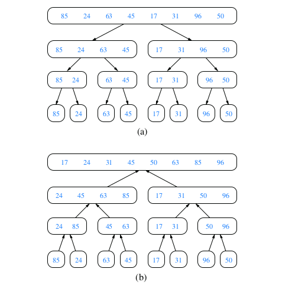
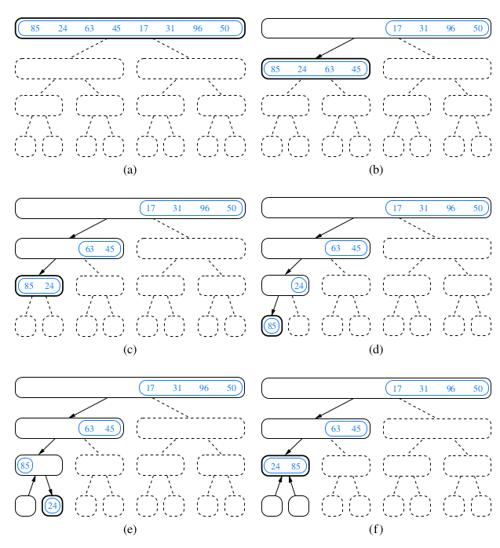
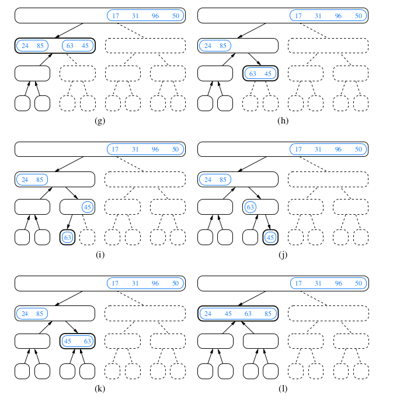
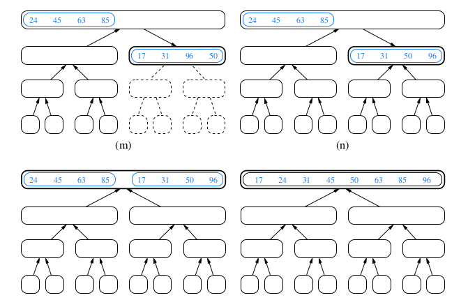
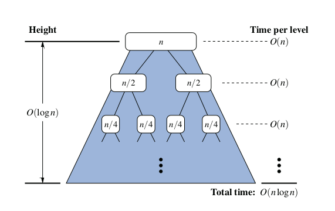
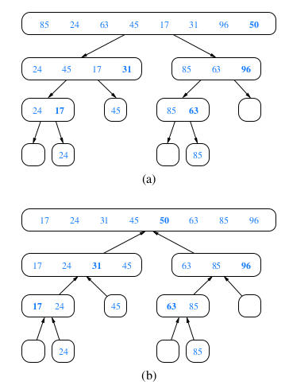
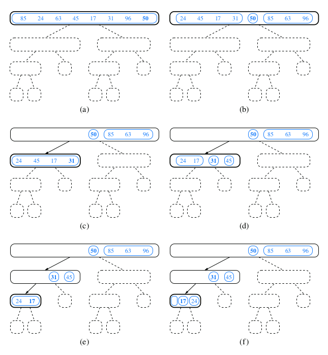
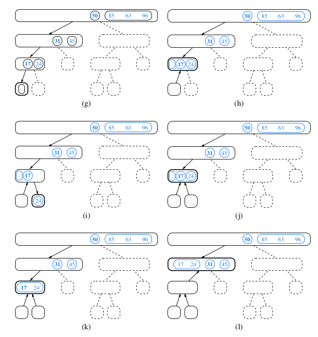
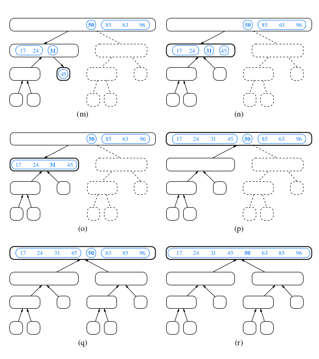

* TOC
{:toc}

## Divide-and-Conquer for Sorting

1. Divide: If the input size is smaller than a certain threshold (say, one or two
elements), solve the problem directly using a straightforward method and
return the solution so obtained. Otherwise, divide the input data into two or
more disjoint subsets.
2. Conquer: Recursively solve the subproblems associated with the subsets.
3. Combine: Take the solutions to the subproblems and merge them into a solution to the original problem.


### Merge Sort
Merge Sort uses recursion in an algorithmic design pattern called **divide-and-conquer**:

We first describe the merge-sort algorithm at a high level, without focusing on
whether the data is an array or linked list. To sort a sequence S with n elements using the three divide-and-
conquer steps, the merge-sort algorithm proceeds as follows:

1. Divide: If S has zero or one element, return S immediately; it is already
sorted. Otherwise (S has at least two elements), remove all the elements
from S and put them into two sequences, S1 and S2 , each containing about
half of the elements of S; that is, S1 contains the first ⌊n/2⌋ elements of S,
and S2 contains the remaining ⌈n/2⌉ elements.
2. Conquer: Recursively sort sequences S1 and S2 .
3. Combine: Put the elements back into S by merging the sorted sequences S1
and S2 into a sorted sequence.

We can visualize an execution of the merge-sort algorithm by means of a binary
tree T , called the merge-sort tree. Each node of T represents a recursive invocation
(or call) of the merge-sort algorithm. We associate with each node v of T the
sequence S that is processed by the invocation associated with v. The children of
node v are associated with the recursive calls that process the subsequences S1 and
S2 of S. The external nodes of T are associated with individual elements of S,
corresponding to instances of the algorithm that make no recursive calls.

#### Demonstration for Merge Sort









#### Array-Based Implementation of Merge-Sort

```java

import java.util.Arrays;
import java.util.Comparator;

public class MergeSort {

	public static void mergeSort(int[] a, int n) {
		if (n < 2) {
			return;
		}
		int mid = n / 2;
		int[] l = new int[mid];
		int[] r = new int[n - mid];

		for (int i = 0; i < mid; i++) {
			l[i] = a[i];
		}
		for (int i = mid; i < n; i++) {
			r[i - mid] = a[i];
		}
		mergeSort(l, mid);
		mergeSort(r, n - mid);

		merge(a, l, r, mid, n - mid);
	}

	public static void merge(int[] a, int[] l, int[] r, int left, int right) {

		int i = 0, j = 0, k = 0;
		while (i < left && j < right) {
			if (l[i] <= r[j]) {
				a[k++] = l[i++];
			} else {
				a[k++] = r[j++];
			}
		}
		while (i < left) {
			a[k++] = l[i++];
		}
		while (j < right) {
			a[k++] = r[j++];
		}
	}

	public static void main(String[] args) {
		int[] actual = { 5, 1, 6, 2, 3, 4 };
		MergeSort.mergeSort(actual, actual.length);
		System.out.println(Arrays.toString(actual));
	}
}

```

#### Merge Sort Analysis



### Quick Sort

Like merge-sort, this
algorithm is also based on the divide-and-conquer paradigm, but it uses this tech-
nique in a somewhat opposite manner, as all the hard work is done before the
recursive calls.

The quick-sort algorithm sorts a sequence S using a simple recursive approach.
The main idea is to apply the divide-and-conquer technique, whereby we divide
S into subsequences, recur to sort each subsequence, and then combine the sorted
subsequences by a simple concatenation. In particular, the quick-sort algorithm
consists of the following three steps:

1. Divide: If S has at least two elements (nothing needs to be done if S has
zero or one element), select a specific element x from S, which is called the
pivot. As is common practice, choose the pivot x to be the last element in S.
Remove all the elements from S and put them into three sequences:
   * L, storing the elements in S less than x
   * E, storing the elements in S equal to x
   * G, storing the elements in S greater than x 
   * Of course, if the elements of S are distinct, then E holds just one element—
the pivot itself.
2. Conquer: Recursively sort sequences L and G.
3. Combine: Put back the elements into S in order by first inserting the elements
of L, then those of E, and finally those of G.

#### Demonstration for Quick Sort









#### Array-Based Implementation of Merge-Sort

```java
import java.util.Arrays;

public class QuickSort {

	public static void quickSort(int arr[], int begin, int end) {
	    if (begin < end) {
	        int partitionIndex = partition(arr, begin, end);
	 
	        quickSort(arr, begin, partitionIndex-1);
	        quickSort(arr, partitionIndex+1, end);
	    }
	}
	
	private static int partition(int arr[], int begin, int end) {
	    int pivot = arr[end];
	    int i = (begin-1);
	 
	    for (int j = begin; j < end; j++) {
	        if (arr[j] <= pivot) {
	            i++;
	 
	            int swapTemp = arr[i];
	            arr[i] = arr[j];
	            arr[j] = swapTemp;
	        }
	    }
	 
	    int swapTemp = arr[i+1];
	    arr[i+1] = arr[end];
	    arr[end] = swapTemp;
	 
	    return i+1;
	}
	
	
	public static void main(String[] args) {
		int[] actual = { 5, 1, 6, 2, 3, 4 };
		QuickSort.quickSort(actual, 0,actual.length-1);
		System.out.println(Arrays.toString(actual));

	}
}
```

### QuickSort vs MergeSort

Let's discuss in which cases we should choose QuickSort over MergeSort.

Although both Quicksort and Mergesort have an average time complexity of O(n log n), Quicksort is the preferred algorithm, as it has an O(log(n)) space complexity. Mergesort, on the other hand, requires O(n) extra storage, which makes it quite expensive for arrays.

Quicksort requires to access different indices for its operations, but this access is not directly possible in linked lists, as there are no continuous blocks; therefore to access an element we have to iterate through each node from the beginning of the linked list. Also, Mergesort is implemented without extra space for LinkedLists.

In such case, overhead increases for Quicksort and Mergesort is generally preferred.