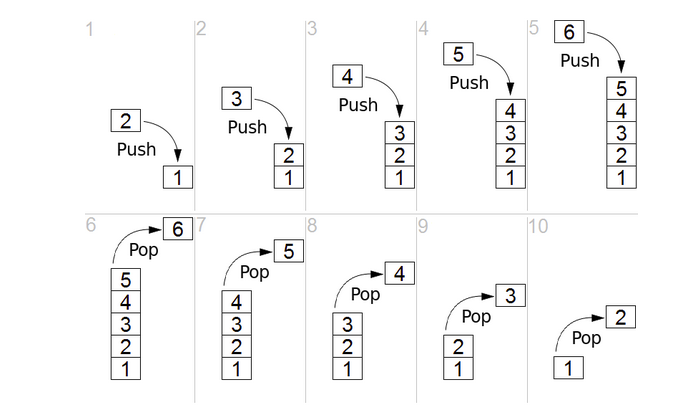
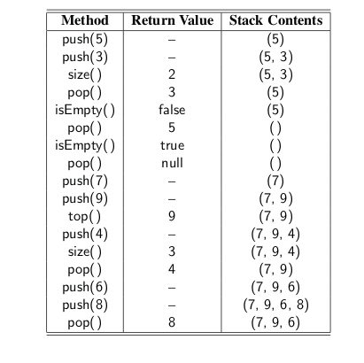
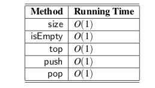

* TOC
{:toc}

## Stack

A stack is a collection of objects that are inserted and removed according to the
**last-in, first-out (LIFO)** principle. A user may insert objects into a stack at any
time, but may only access or remove the most recently inserted object that remains



* Abstract data type
* LIFO (last in, first out)
* Defines a set of supported operations
* Many implementation options (e.g Array or Linked List)


### Essential Operations

1. Push: Adds element e to the top of the stack.
2. Pop: Removes and returns the top element from the stack.

### Non-Essential Operations

1. top: Returns the top element of the stack, without removing it.
2. size: Returns the number of elements in the stack.
3. isEmpty: Returns a boolean indicating whether the stack is empty.



### A Stack Interface in Java

In order to formalize our abstraction of a stack, we define what is known as its
application programming interface (API) in the form of a Java interface, which
describes the names of the methods that the ADT supports and how they are to be
declared and used.

We rely on Java’s generics framework  allow-
ing the elements stored in the stack to belong to any object ```type <E>```. For ex-
ample, a variable representing a stack of integers could be declared with type
```Stack <Integer>```. The formal type parameter is used as the parameter type for
the push method, and the return type for both pop and top.

```java
public interface Stack<E> {
	/**
	 * Returns the number of elements in the stack.
	 * 
	 * @return number of elements in the stack
	 */
	int size();

	/**
	 * Tests whether the stack is empty.
	 * 
	 * @return true if the stack is empty, false otherwise
	 */
	boolean isEmpty();

	/**
	 * Inserts an element at the top of the stack.
	 * 
	 * @param e the element to be inserted
	 */
	void push(E e);

	/**
	 * Returns, but does not remove, the element at the top of the stack.
	 * 
	 * @return top element in the stack (or null if empty)
	 */

	E top();

	/**
	 * Removes and returns the top element from the stack.
	 * 
	 * @return element removed (or null if empty)
	 */
	E pop();
}
```

### Array-Based Stack Implementation

As our first implementation of the stack ADT, we store elements in an array, named
data, with capacity N for some fixed N. We oriented the stack so that the bottom
element of the stack is always stored in cell ```data[0]```, and the top element of the
stack in cell ```data[t]``` for index t that is equal to one less than the current size of the
stack.

```java

public class ArrayStack<E> implements Stack<E> {

	public static final int CAPACITY = 1000; // default array capacity
	private E[] data;
	private int top = 11;

	public ArrayStack() {
		this(CAPACITY);
	} // constructs stack with default capacity

	public ArrayStack(int capacity) {
		data = (E[]) new Object[capacity];
	}

	@Override
	public int size() {
		return (top + 1);
	}

	@Override
	public boolean isEmpty() {
		return (top == -1);
	}

	@Override
	public void push(Object e) {
		if (size() == data.length)
			throw new IllegalStateException("Stack is full");
		data[++top] = (E) e;
	}

	@Override
	public E top() {
		if (isEmpty())
			return null;
		return data[top];
	}

	@Override
	public E pop() {
		if (isEmpty())
			return null;
		E answer = data[top];
		data[top] = null;
		top--;
		return answer;
	}

	public static void main(String[] args) {
		Stack<Integer> S = new ArrayStack<>();
		S.push(5);
		S.push(3);
		System.out.println(S.size());
		System.out.println(S.pop());
		System.out.println(S.isEmpty());
		System.out.println(S.pop());
		System.out.println(S.isEmpty());
		System.out.println(S.pop());
		S.push(7);
		S.push(9);
		System.out.println(S.top());
		S.push(4);
		System.out.println(S.size());
		System.out.println(S.pop());
		S.push(6);
		S.push(8);
		System.out.println(S.pop());
	}
}

```

### Analyzing the Array-Based Stack Implementation:

The correctness of the methods in the array-based implementation follows from
our definition of index t. Note well that when pushing an element, t is incremented
before placing the new element, so that it uses the first available cell.

The following table shows the running times for methods of this array-based stack im-
plementation. Each method executes a constant number of statements involving
arithmetic operations, comparisons, and assignments, or calls to size and isEmpty,
which both run in constant time. Thus, in this implementation of the stack ADT,
each method runs in constant time, that is, they each run in O(1) time.



### Implementing a Stack with a Singly Linked List

we demonstrate how the Stack interface can be easily implemented
using a singly linked list for storage. Unlike our array-based implementation, the
linked-list approach has memory usage that is always proportional to the number
of actual elements currently in the stack, and without an arbitrary capacity limit.

```java

public class LinkedStack<E> implements Stack<E> {

	private SinglyLinkedList<E> data = new SinglyLinkedList<>();

	public LinkedStack() {
	}

	@Override
	public int size() {
		return data.size();
	}

	@Override
	public boolean isEmpty() {
		return data.isEmpty();
	}

	@Override
	public void push(E e) {
		data.addFirst(e);
	}

	@Override
	public E top() {
		return data.first();
	}

	@Override
	public E pop() {
		return data.removeFirst();
	}

	public static void main(String[] args) {
		Stack<Integer> S = new LinkedStack<>();
		S.push(5);
		S.push(3);
		System.out.println(S.size());
		System.out.println(S.pop());
		System.out.println(S.isEmpty());
		System.out.println(S.pop());
		System.out.println(S.isEmpty());
		System.out.println(S.pop());
		S.push(7);
		S.push(9);
		System.out.println(S.top());
		S.push(4);
		System.out.println(S.size());
		System.out.println(S.pop());
		S.push(6);
		S.push(8);
		System.out.println(S.pop());
	}

}

```

