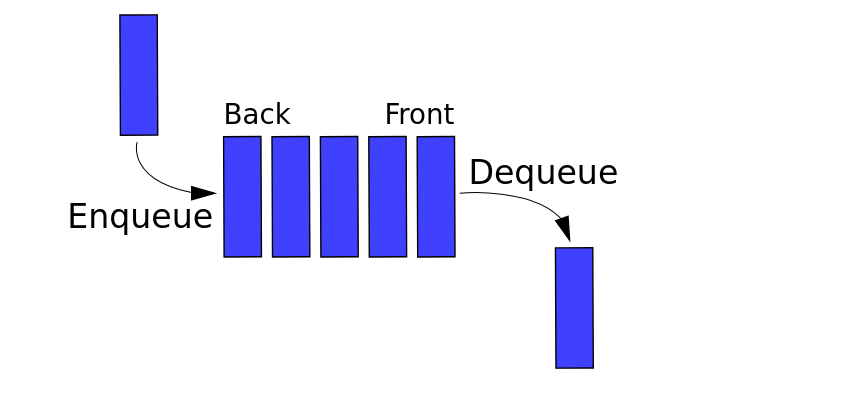
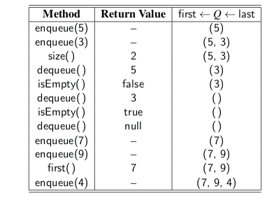

* TOC
{:toc}

## Queue

Another fundamental data structure is the queue. It is a close “cousin” of the stack,
but a queue is a collection of objects that are inserted and removed according to the
**first-in, first-out (FIFO)** principle. That is, elements can be inserted at any time,
but only the element that has been in the queue the longest can be next removed.



*  Abstract Data Type (ADT),
*  Many implementations (e.g arrays and linked lists)
*  Queue behaviour == FIFO (first in, first out).

### Essential Operations

1. enqueue: Adds element e to the back of queue.
2. dequeue: Removes and returns the first element from the queue.

### on-Essential Operations

1. first: Returns the first element of the queue, without removing it.
2. size: Returns the number of elements in the queue.
3. isEmpty: Returns a boolean indicating whether the queue is empty.



### A Queue Interface in Java

The queue abstract data type defines a collection that keeps objects in a
sequence, where element access and deletion are restricted to the first element in
the queue, and element insertion is restricted to the back of the sequence. This
restriction enforces the rule that items are inserted and deleted in a queue accord-
ing to the first-in, first-out (FIFO) principle.

```java

public interface Queue<E> {
	/** Returns the number of elements in the queue. */
	int size();

	/** Tests whether the queue is empty. */
	boolean isEmpty();

	/** Inserts an element at the rear of the queue. */
	void enqueue(E e);

	/**
	 * Returns, but does not remove, the first element of the queue (null if empty).
	 */
	E first();

	/** Removes and returns the first element of the queue (null if empty). */
	E dequeue();
}

```

### Array-Based Queue Implementation

```java

public class ArrayQueue<E> implements Queue<E> {

	public static final int CAPACITY = 1000; // default array capacity
	private E[] data; // generic array used for storage
	private int front = 0; // index of the front element
	private int rear = 0; // current number of elements

	public ArrayQueue() {
		this(CAPACITY);
	}

	public ArrayQueue(int capacity) {
		data = (E[]) new Object[capacity];
	}

	@Override
	public int size() {
		return rear;
	}

	@Override
	public boolean isEmpty() {
		return rear == 0;
	}

	@Override
	public void enqueue(E e) {
		if (rear == data.length)
			throw new IllegalStateException("Queue is full");
		int avail = (front + rear) % data.length;
		data[avail] = e;
		rear++;
	}

	@Override
	public E first() {
		if (isEmpty())
			return null;
		return data[front];
	}

	@Override
	public E dequeue() {
		if (isEmpty())
			return null;
		E answer = data[front];
		data[front] = null;
		front = (front + 1) % data.length;
		rear--;
		return answer;
	}

	public static void main(String[] args) {
		Queue<Integer> Q = new ArrayQueue<>();
		Q.enqueue(5);
		Q.enqueue(3);
		System.out.println(Q.size());
		System.out.println(Q.dequeue());
		System.out.println(Q.isEmpty());
		System.out.println(Q.dequeue());
		System.out.println(Q.isEmpty());
		System.out.println(Q.dequeue());
		Q.enqueue(7);
		Q.enqueue(9);
		System.out.println(Q.first());
		Q.enqueue(4);
		System.out.println(Q.first());
		Q.enqueue(6);
		Q.enqueue(8);
		System.out.println(Q.first());

	}

}

```

### Implementing a Queue with a Singly Linked List

As we did for the stack ADT, we can easily adapt a singly linked list to imple-
ment the queue ADT while supporting worst-case O(1)-time for all operations, and
without any artificial limit on the capacity. The natural orientation for a queue is to
align the front of the queue with the front of the list, and the back of the queue with
the tail of the list, because the only update operation that singly linked lists support
at the back end is an insertion.

```java

public class LinkedQueue<E> implements Queue<E> {

	private SinglyLinkedList<E> data = new SinglyLinkedList<>(); // an empty list

	public LinkedQueue() {
	}

	@Override
	public int size() {
		return data.size();
	}

	@Override
	public boolean isEmpty() {
		return data.isEmpty();
	}

	@Override
	public void enqueue(E e) {
		data.addLast(e);
	}

	@Override
	public E first() {
		return data.first();
	}

	@Override
	public E dequeue() {
		return data.removeFirst();
	}

	public static void main(String[] args) {
		Queue<Integer> Q = new ArrayQueue<>();
		Q.enqueue(5);
		Q.enqueue(3);
		System.out.println(Q.size());
		System.out.println(Q.dequeue());
		System.out.println(Q.isEmpty());
		System.out.println(Q.dequeue());
		System.out.println(Q.isEmpty());
		System.out.println(Q.dequeue());
		Q.enqueue(7);
		Q.enqueue(9);
		System.out.println(Q.first());
		Q.enqueue(4);
		System.out.println(Q.first());
		Q.enqueue(6);
		Q.enqueue(8);
		System.out.println(Q.first());
	}

}

```