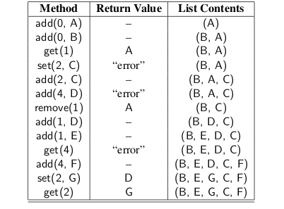
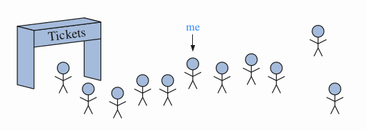
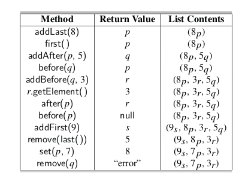

* TOC
{:toc}

## List and Iterator ADTs

we introduced the stack, queue, and deque abstract data types, and
discussed how either an array or a linked list could be used for storage in an efficient
concrete implementation of each. Each of those ADTs represents a linearly ordered
sequence of elements. The deque is the most general of the three, yet even so, it
only allows insertions and deletions at the front or back of a sequence.

we explore several abstract data types that represent a linear se-
quence of elements, but with more general support for adding or removing elements
at arbitrary positions. However, designing a single abstraction that is well suited for
efficient implementation with either an array or a linked list is challenging, given
the very different nature of these two fundamental data structures.

### List ADT

Java defines a general interface, java.util.List, that includes the following index-based methods (and more):
* **size( )**: Returns the number of elements in the list.
* **isEmpty( )**: Returns a boolean indicating whether the list is empty.
* **get(i)**: Returns the element of the list having index i; an error condition occurs if i is not in range [0, size( ) − 1]
* **set(i, e)**: Replaces the element at index i with e, and returns the old element that was replaced; an error condition occurs if i is not in range [0, size( ) − 1].
* **add(i, e)**: Inserts a new element e into the list so that it has index i, moving all subsequent elements one index later in the list; an errorcondition occurs if i is not in range [0, size( )].
* **remove(i)**: Removes and returns the element at index i, moving all subsequent elements one index earlier in the list; an error condition occurs if i is not in range [0, size( ) − 1].

We note that the index of an existing element may change over time, as other
elements are added or removed in front of it. We also draw attention to the fact that
the range of valid indices for the add method includes the current size of the list, in
which case the new element becomes the last.

```java
public interface List<E> {

	/** Returns the number of elements in this list. */
	int size();

	/** Returns whether the list is empty. */
	boolean isEmpty();

	/** Returns (but does not remove) the element at index i. */
	E get(int i) throws IndexOutOfBoundsException;

	/** Replaces the element at index i with e, and returns the replaced element. */
	E set(int i, E e) throws IndexOutOfBoundsException;

	/**
	 * Inserts element e to be at index i, shifting all subsequent elements later.
	 */
	void add(int i, E e) throws IndexOutOfBoundsException;

	/**
	 * Removes/returns the element at index i, shifting subsequent elements earlier.
	 */
	E remove(int i) throws IndexOutOfBoundsException;
}
```

**List Operations Examples**



### Array Lists

An obvious choice for implementing the list ADT is to use an array A, where ```A[i]```
stores (a reference to) the element with index i. We will begin by assuming that we
have a fixed-capacity array,

```java

public class ArrayList<E> implements List<E> {

	public static final int CAPACITY = 16;
	private E[] data;
	private int size = 0;

	public ArrayList() {
		this(CAPACITY);
	}

	public ArrayList(int capacity) {
		data = (E[]) new Object[capacity];
	}

	@Override
	public int size() {
		return size;
	}

	@Override
	public boolean isEmpty() {
		return size == 0;
	}

	@Override
	public E get(int i) throws IndexOutOfBoundsException {
		if (i < 0 || (i >= size && size != 0))
			throw new IndexOutOfBoundsException("Illegal index: " + i);
		return data[i];
	}

	@Override
	public E set(int i, E e) throws IndexOutOfBoundsException {
		if (i < 0 || (i >= size && size != 0))
			throw new IndexOutOfBoundsException("Illegal index: " + i);
		E temp = data[i];
		data[i] = e;
		return temp;
	}

	@Override
	public void add(int i, E e) throws IndexOutOfBoundsException {
		if (i < 0 || (i >= size && size != 0))
			throw new IndexOutOfBoundsException("Illegal index: " + i);

		if (size == data.length)
			throw new IllegalStateException("Array is full");

		for (int k = size - 1; k >= i; k--)
			data[k + 1] = data[k];
		data[i] = e;
		size++;
	}

	@Override
	public E remove(int i) throws IndexOutOfBoundsException {
		if (i < 0 || (i >= size && size != 0))
			throw new IndexOutOfBoundsException("Illegal index: " + i);

		E temp = data[i];
		for (int k = i; k < size - 1; k++)
			data[k] = data[k + 1];
		data[size - 1] = null;
		size--;
		return temp;
	}

	public static void main(String[] args) {
		ArrayList<Integer> A = new ArrayList<>();
		System.out.println("Current Size" + A.size());
		A.add(0, 5);
		System.out.println(A.get(0));
		A.set(0, 3);
		System.out.println(A.get(0));
		A.add(0, 2);
		System.out.println(A.get(0));
		System.out.println(A.get(1));
		A.remove(0);
		System.out.println(A.get(0));


	}
}
```

### Positional Lists

When working with array-based sequences, integer indices provide an excellent
means for describing the location of an element, or the location at which an inser-
tion or deletion should take place. However, numeric indices are not a good choice
for describing positions within a linked list because, knowing only an element’s in-
dex, the only way to reach it is to traverse the list incrementally from its beginning
or end, counting elements along the way.

Furthermore, indices are not a good abstraction for describing a more local
view of a position in a sequence, because the index of an entry changes over time
due to insertions or deletions that happen earlier in the sequence. For example, it
may not be convenient to describe the location of a person waiting in line based on
the index, as that requires knowledge of precisely how far away that person is from
the front of the line. We prefer an abstraction in which there is some other means for describing a position.



#### Positions

To provide a general abstraction for the location of an element within a structure,
we define a simple position abstract data type. A position supports the following
single method:
* **getElement( )**: Returns the element stored at this position.

A position acts as a marker or token within a broader positional list. A position
p, which is associated with some element e in a list L, does not change, even if the
index of e changes in L due to insertions or deletions elsewhere in the list. Nor does
position p change if we replace the element e stored at p with another element. The
only way in which a position becomes invalid is if that position (and its element)
are explicitly removed from the list.

#### The Positional List Abstract Data Type

We now view a positional list as a collection of positions, each of which stores an
element. The accessor methods provided by the positional list ADT include the
following, for a list L:
* **first( )**: Returns the position of the first element of L (or null if empty).
* **last( )**: Returns the position of the last element of L (or null if empty).
* **before(p)**: Returns the position of L immediately before position p
(or null if p is the first position).
* **after(p)**: Returns the position of L immediately after position p
(or null if p is the last position).
* **isEmpty( )**: Returns true if list L does not contain any elements.
* **size( )**: Returns the number of elements in list L.

An error occurs if a position p, sent as a parameter to a method, is not a valid
position for the list.

**Note** well that the first( ) and last( ) methods of the positional list ADT return
the associated positions, not the elements.

The positional list ADT also includes the following update methods:

* **addFirst(e)**: Inserts a new element e at the front of the list, returning the
position of the new element.
* **addLast(e)**: Inserts a new element e at the back of the list, returning the
position of the new element.
* **addBefore(p, e)**: Inserts a new element e in the list, just before position p,
returning the position of the new element.
* **addAfter(p, e)**: Inserts a new element e in the list, just after position p,
returning the position of the new element.
* **set(p, e)**: Replaces the element at position p with element e, return-
ing the element formerly at position p.
* **remove(p)**: Removes and returns the element at position p in the list,
invalidating the position.

**Positional List Operations Examples**



```java
public interface Position<E> {
	/**
	 * Returns the element stored at this position.
	 *
	 * @return the stored element
	 * @throws IllegalStateException if position no longer
	 */
	E getElement() throws IllegalStateException;
}
```

```java
public interface PositionalList<E> {
	/* Returns the number of elements in the list. */
	int size();

	/* Tests whether the list is empty. */
	boolean isEmpty();

	/* Returns the first Position in the list (or null, if empty). */
	Position<E> first();

	/* Returns the last Position in the list (or null, if empty). */
	Position<E> last();

	/*
	 * Returns the Position immediately before Position p (or null, if p is first).
	 */
	Position<E> before(Position<E> p) throws IllegalArgumentException;

	/* Returns the Position immediately after Position p (or null, if p is last). */
	Position<E> after(Position<E> p) throws IllegalArgumentException;

	/* Inserts element e at the front of the list and returns its new Position. */
	Position<E> addFirst(E e);

	/* Inserts element e at the back of the list and returns its new Position. */
	Position<E> addLast(E e);

	/*
	 * Inserts element e immediately before Position p and returns its new Position.
	 */
	Position<E> addBefore(Position<E> p, E e) throws IllegalArgumentException;

	/*
	 * Inserts element e immediately after Position p and returns its new Position.
	 */
	Position<E> addAfter(Position<E> p, E e) throws IllegalArgumentException;

	/*
	 * Replaces the element stored at Position p and returns the replaced element.
	 */
	E set(Position<E> p, E e) throws IllegalArgumentException;

	/* Removes the element stored at Position p and returns it (invalidating p). */
	E remove(Position<E> p) throws IllegalArgumentException;
}
```

#### Doubly Linked List Implementation for positional lists

```java
public class LinkedPositionalList<E> implements PositionalList<E> {

	private static class Node<E> implements Position<E> {
		private E element;
		// reference to the element stored at this node
		private Node<E> prev;
		// reference to the previous node in the list
		private Node<E> next;

		// reference to the subsequent node in the list
		public Node(E e, Node<E> p, Node<E> n) {
			element = e;
			prev = p;
			next = n;
		}

		public E getElement() throws IllegalStateException {
			if (next == null)
				// convention for defunct node
				throw new IllegalStateException("Position no longer valid");
			return element;
		}

		public Node<E> getPrev() {
			return prev;
		}

		public Node<E> getNext() {
			return next;
		}

		public void setElement(E e) {
			element = e;
		}

		public void setPrev(Node<E> p) {
			prev = p;
		}

		public void setNext(Node<E> n) {
			next = n;
		}
	} // ----------- end of nested Node class -----------
		// instance variables of the LinkedPositionalList

	private Node<E> header;
	// header sentinel
	private Node<E> trailer;
	// trailer sentinel
	private int size = 0;

	// number of elements in the list
	/** Constructs a new empty list. */
	public LinkedPositionalList() {
		header = new Node<>(null, null, null);
		// create header
		trailer = new Node<>(null, header, null);
		// trailer is preceded by header
		header.setNext(trailer);
		// header is followed by trailer
	}

	/** Validates the position and returns it as a node. */
	private Node<E> validate(Position<E> p) throws IllegalArgumentException {
		if (!(p instanceof Node))
			throw new IllegalArgumentException("Invalid p");
		Node<E> node = (Node<E>) p;
		// safe cast
		if (node.getNext() == null)
			// convention for defunct node
			throw new IllegalArgumentException("p is no longer in the list");
		return node;
	}

	/** Returns the given node as a Position (or null, if it is a sentinel). */
	private Position<E> position(Node<E> node) {
		if (node == header || node == trailer)
			return null;
		// do not expose user to the sentinels
		return node;
	}

	@Override
	public int size() {
		// TODO Auto-generated method stub
		return size;
	}

	@Override
	public boolean isEmpty() {
		return size == 0;
	}

	@Override
	public Position<E> first() {
		return position(header.getNext());
	}

	@Override
	public Position<E> last() {
		return position(trailer.getPrev());
	}

	@Override
	public Position<E> before(Position<E> p) throws IllegalArgumentException {
		Node<E> node = validate(p);
		return position(node.getPrev());
	}

	@Override
	public Position<E> after(Position<E> p) throws IllegalArgumentException {
		Node<E> node = validate(p);
		return position(node.getNext());
	}

	private Position<E> addBetween(E e, Node<E> pred, Node<E> succ) {
		Node<E> newest = new Node<>(e, pred, succ); // create and link a new node
		pred.setNext(newest);
		succ.setPrev(newest);
		size++;
		return newest;
	}

	@Override
	public Position<E> addFirst(E e) {
		return addBetween(e, header, header.getNext());
	}

	@Override
	public Position<E> addLast(E e) {
		return addBetween(e, trailer.getPrev(), trailer);
	}

	@Override
	public Position<E> addBefore(Position<E> p, E e) throws IllegalArgumentException {
		Node<E> node = validate(p);
		return addBetween(e, node.getPrev(), node);
	}

	@Override
	public Position<E> addAfter(Position<E> p, E e) throws IllegalArgumentException {
		Node<E> node = validate(p);
		return addBetween(e, node, node.getNext());
	}

	@Override
	public E set(Position<E> p, E e) throws IllegalArgumentException {
		Node<E> node = validate(p);
		E answer = node.getElement();
		node.setElement(e);
		return answer;
	}

	@Override
	public E remove(Position<E> p) throws IllegalArgumentException {
		Node<E> node = validate(p);
		Node<E> predecessor = node.getPrev();
		Node<E> successor = node.getNext();
		predecessor.setNext(successor);
		successor.setPrev(predecessor);
		size--;
		E answer = node.getElement();
		node.setElement(null);
		node.setNext(null);
		node.setPrev(null);
		return answer;
	}
}

```

### Iterators

An iterator is a software design pattern that abstracts the process of scanning
through a sequence of elements, one element at a time. The underlying elements
might be stored in a container class, streaming through a network, or generated by
a series of computations.

In order to unify the treatment and syntax for iterating objects in a way that is
independent from a specific organization, Java defines the java.util.Iterator inter-
face with the following two methods:
* **hasNext( )**: Returns true if there is at least one additional element in the
sequence, and false otherwise.
* **next( )**: Returns the next element in the sequence.

The interface uses Java’s generic framework, with the next( ) method return-
ing a parameterized element type. For example, the Scanner class formally implements the Iterator```<String>``` interface, with its ```next( )```
method returning a String instance.
If the ```next( )``` method of an iterator is called when no further elements are avail-
able, a NoSuchElementException is thrown. Of course, the hasNext( ) method can
be used to detect that condition before calling ```next( )```.
The combination of these two methods allows a general loop construct for pro-
cessing elements of the iterator. For example, if we let variable, iter, denote an
instance of the Iterator```<String>``` type, then we can write the following:
```java
while (iter.hasNext( )) {
String value = iter.next( );
System.out.println(value);
}
```
The java.util.Iterator interface contains a third method, which is optionally
supported by some iterators:

* **remove( )**: Removes from the collection the element returned by the most
recent call to next( ). Throws an IllegalStateException if next
has not yet been called, or if remove was already called since
the most recent call to next.

This method can be used to filter a collection of elements, for example to dis-
card all negative numbers from a data set.

#### The Iterable Interface and Java’s For-Each Loop

A single iterator instance supports only one pass through a collection; calls to next
can be made until all elements have been reported, but there is no way to “reset”
the iterator back to the beginning of the sequence.

However, a data structure that wishes to allow repeated iterations can support
a method that returns a new iterator, each time it is called. To provide greater
standardization, Java defines another parameterized interface, named Iterable, that
includes the following single method:

* **iterator( )**: Returns an iterator of the elements in the collection.

An instance of a typical collection class in Java, such as an ArrayList, is iterable
(but not itself an iterator); it produces an iterator for its collection as the return value
of the iterator( ) method. Each call to iterator( ) returns a new iterator instance,
thereby allowing multiple (even simultaneous) traversals of a collection.

```java
for (ElementType variable : collection) {
    loopBody
}
```

is supported for any instance, collection, of an iterable class. ElementType must be
the type of object returned by its iterator, and variable will take on element values
within the loopBody. Essentially, this syntax is shorthand for the following:

```java
Iterator<ElementType> iter = collection.iterator( );
while (iter.hasNext( )) {
    ElementType variable = iter.next( );
    loopBody
}
```

We note that the iterator’s remove method cannot be invoked when using the
for-each loop syntax. Instead, we must explicitly use an iterator. As an example,
the following loop can be used to remove all negative numbers from an ArrayList
of floating-point values.

```java
ArrayList<Double> data; // populate with random numbers (not shown)
Iterator<Double> walk = data.iterator( );
while (walk.hasNext( ))
    if (walk.next( ) < 0.0)
        walk.remove( );
```

#### Implementing Iterators
There are two general styles for implementing iterators that differ in terms of what
work is done when the iterator instance is first created, and what work is done each
time the iterator is advanced with a call to next( ).

1. **snapshot iterator**:maintains its own private copy of the sequence of elements,
which is constructed at the time the iterator object is created. It effectively records
a “snapshot” of the sequence of elements at the time the iterator is created, and is
therefore unaffected by any subsequent changes to the primary collection that may
occur. Implementing snapshot iterators tends to be very easy, as it requires a simple
traversal of the primary structure. The downside of this style of iterator is that it
requires O(n) time and O(n) auxiliary space, upon construction, to copy and store
a collection of n elements.

2. **lazy iterator**: is one that does not make an upfront copy, instead perform-
ing a piecewise traversal of the primary structure only when the next( ) method is
called to request another element. The advantage of this style of iterator is that
it can typically be implemented so the iterator requires only O(1) space and O(1)
construction time.

#### Iterations with the ArrayList class (Lazy Iterator):

We will have it im-
plement the Iterable<E> interface. (In fact, that requirement is already part of
Java’s List interface.) Therefore, we must add an iterator( ) method to that class
definition, which returns an instance of an object that implements the Iterator<E>
interface. For this purpose, we define a new class, ArrayIterator, as a nonstatic
nested class of ArrayList . The
advantage of having the iterator as an inner class is that it can access private fields
(such as the array A) that are members of the containing list.

```java
import java.util.Iterator;
import java.util.NoSuchElementException;

public class ArrayList<E> implements List<E> {

	private class ArrayIterator implements Iterator<E> {
		private int j = 0;
		// index of the next element to report
		private boolean removable = false; // can remove be called at this time?

		/**
		 * Tests whether the iterator has a next object.
		 * 
		 * @return true if there are further objects, false otherwise
		 */
		public boolean hasNext() {
			return j < size;
		} // size is field of outer instance

		/**
		 * Returns the next object in the iterator.
		 *
		 * @return next object
		 * @throws NoSuchElementException if there are no further elements
		 */
		public E next() throws NoSuchElementException {
			if (j == size)
				throw new NoSuchElementException("No next element");
			removable = true; // this element can subsequently be removed
			return data[j++]; // post-increment j, so it is ready for future call to next
		}

	} // ------------ end of nested ArrayIterator class ------------

	/** Returns an iterator of the elements stored in the list. */
	public Iterator<E> iterator() {
		return new ArrayIterator();
		// create a new instance of the inner class
	}

	public static final int CAPACITY = 16;
	private E[] data;
	private int size = 0;

	public ArrayList() {
		this(CAPACITY);
	}

	public ArrayList(int capacity) {
		data = (E[]) new Object[capacity];
	}

	@Override
	public int size() {
		return size;
	}

	@Override
	public boolean isEmpty() {
		return size == 0;
	}

	@Override
	public E get(int i) throws IndexOutOfBoundsException {
		if (i < 0 || (i >= size && size != 0))
			throw new IndexOutOfBoundsException("Illegal index: " + i);
		return data[i];
	}

	@Override
	public E set(int i, E e) throws IndexOutOfBoundsException {
		if (i < 0 || (i >= size && size != 0))
			throw new IndexOutOfBoundsException("Illegal index: " + i);
		E temp = data[i];
		data[i] = e;
		return temp;
	}

	@Override
	public void add(int i, E e) throws IndexOutOfBoundsException {
		if (i < 0 || (i >= size && size != 0))
			throw new IndexOutOfBoundsException("Illegal index: " + i);

		if (size == data.length)
			throw new IllegalStateException("Array is full");

		for (int k = size - 1; k >= i; k--)
			data[k + 1] = data[k];
		data[i] = e;
		size++;
	}

	@Override
	public E remove(int i) throws IndexOutOfBoundsException {
		if (i < 0 || (i >= size && size != 0))
			throw new IndexOutOfBoundsException("Illegal index: " + i);

		E temp = data[i];
		for (int k = i; k < size - 1; k++)
			data[k] = data[k + 1];
		data[size - 1] = null;
		size--;
		return temp;
	}

	public static void main(String[] args) {
		ArrayList<Integer> A = new ArrayList<>();
		A.add(0, 5);
		A.add(0, 2);
		A.add(0, 47);
		System.out.println(A.get(0));
		System.out.println(A.get(1));
		System.out.println(A.get(2));
		System.out.println("##################");
		Iterator<Integer> iteratorA = A.iterator();
		while (iteratorA.hasNext()) {
			System.out.println(iteratorA.next());
		}
		A.remove(0);
		System.out.println(A.get(0));

	}

}
```