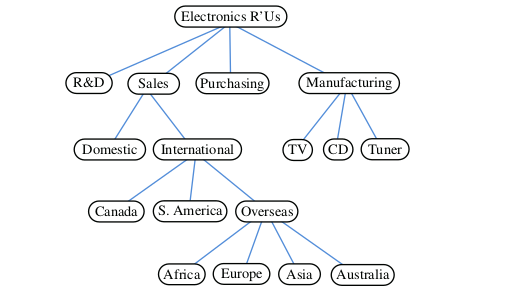
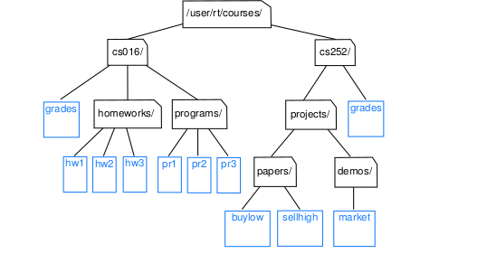
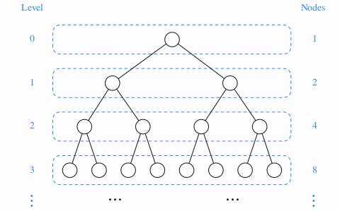
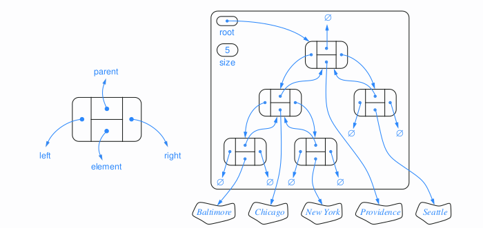
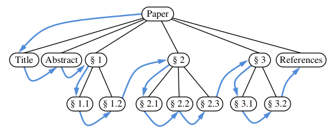
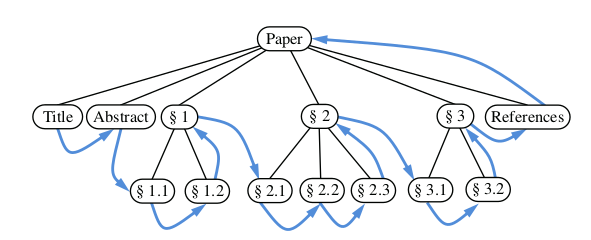
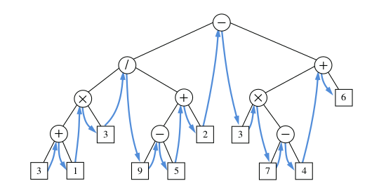

* TOC
{:toc}

## General Trees

Productivity experts say that breakthroughs come by thinking “nonlinearly.” In
this Tutorial, we will discuss one of the most important nonlinear data structures in
computing—trees. Tree structures are indeed a breakthrough in data organization,
for they allow us to implement a host of algorithms much faster than when using
linear data structures, such as arrays or linked lists. Trees also provide a natural
organization for data, and consequently have become ubiquitous structures in file
systems, graphical user interfaces, databases, websites, and many other computer
systems.

### Tree Definitions and Properties

A tree is an abstract data type that stores elements hierarchically. With the excep-
tion of the top element, each element in a tree has a parent element and zero or
more children elements. A tree is usually visualized by placing elements inside
ovals or rectangles, and by drawing the connections between parents and children
with straight lines.



**Formal Tree Definition:** Formally, we define a tree T as a set of nodes storing elements such that the nodes
have a parent-child relationship that satisfies the following properties:

1. If T is nonempty, it has a special node, called the root of T , that has no parent.
2. Each node v of T different from the root has a unique parent node w; every
node with parent w is a child of w.
3. Two nodes that are children of the same parent are siblings. A node v is external
if v has no children. A node v is internal if it has one or more children. External
nodes are also known as leaves.

### Edges and Paths in Trees



A node u is an ancestor of a node v if u = v or u is an ancestor of the parent
of v. Conversely, we say that a node v is a descendant of a node u if u is an ancestor
of v.

1. cs252/ is an ancestor of papers/, and pr3 is a
descendant of cs016/. The subtree of T rooted at a node v is the tree consisting of
all the descendants of v in T (including v itself). 
2. the subtree rooted at cs016/ consists of the nodes cs016/, grades, homeworks/, programs/, hw1, hw2,
hw3, pr1, pr2, and pr3.

An edge of tree T is a pair of nodes (u, v) such that u is the parent of v, or vice
versa. A path of T is a sequence of nodes such that any two consecutive nodes in
the sequence form an edge.

1. The path (cs252/, projects/, demos/, market).

### The Tree Abstract Data Type

we define a tree ADT using the
concept of a position as an abstraction for a node of a tree. An element is stored
at each position, and positions satisfy parent-child relationships that define the tree
structure. 

1. A position object for a tree supports the method:

    * **getElement( ):** Returns the element stored at this position.

2. The tree ADT then supports the following accessor methods, allowing a user to navigate the various positions of a tree T:
    * **root( )**: Returns the position of the root of the tree(or null if empty).
    * **parent(p)**: Returns the position of the parent of position p (or null if p is the root).
    * **children(p)**: Returns an iterable collection containing the children of position p (if any).
    * **numChildren(p)**: Returns the number of children of position p.

3. If a tree T is ordered, then children(p) reports the children of p in order. In addition to the above fundamental accessor methods, a tree supports the following query methods:
    * **isInternal(p)**: Returns true if position p has at least one child.
    * **isExternal(p)**: Returns true if position p does not have any children.
    * **isRoot(p)**: Returns true if position p is the root of the tree.

These methods make programming with trees easier and more readable, since we can use them in the conditionals of if statements and while loops.

4. Trees support a number of more general methods, unrelated to the specific structure of the tree. These incude:
    * **size( )**: Returns the number of positions (and hence elements) that are contained in the tree.
    * **isEmpty( )**: Returns true if the tree does not contain any positions (and thus no elements).
    * **iterator( )**: Returns an iterator for all elements in the tree (so that the tree itself is Iterable).
    * **positions( )**: Returns an iterable collection of all positions of the tree.

If an invalid position is sent as a parameter to any method of a tree, then an
IllegalArgumentException is thrown.

### Tree Interface in Java

we declare the Tree interface
to formally extend Java’s Iterable interface (and we include a declaration of the
required iterator( ) method).

```java
import java.util.Iterator;

public interface Tree<E> extends Iterable<E> {
	Position<E> root();

	Position<E> parent(Position<E> p) throws IllegalArgumentException;

	Iterable<Position<E>> children(Position<E> p) throws IllegalArgumentException;

	int numChildren(Position<E> p) throws IllegalArgumentException;

	boolean isInternal(Position<E> p) throws IllegalArgumentException;

	boolean isExternal(Position<E> p) throws IllegalArgumentException;

	boolean isRoot(Position<E> p) throws IllegalArgumentException;

	int size();

	boolean isEmpty();

	Iterator<E> iterator();

	Iterable<Position<E>> positions();
}
```

### AbstractTree Base Class in Java

we discussed the role of interfaces and abstract classes in Java.
While an interface is a type definition that includes public declarations of vari-
ous methods, an interface cannot include definitions for any of those methods. In
contrast, an abstract class may define concrete implementations for some of its
methods, while leaving other abstract methods without definition.

An abstract class is designed to serve as a base class, through inheritance, for
one or more concrete implementations of an interface. When some of the func-
tionality of an interface is implemented in an abstract class, less work remains to
complete a concrete implementation. The standard Java libraries include many such
abstract classes, including several within the Java Collections Framework. To make
their purpose clear, those classes are conventionally named beginning with the word
Abstract. For example, there is an AbstractCollection class that implements some
of the functionality of the Collection interface, an AbstractQueue class that imple-
ments some of the functionality of the Queue interface, and an AbstractList class
that implements some of the functionality of the List interface.

```java
public abstract class AbstractTree<E> implements Tree<E> {

	public boolean isInternal(Position<E> p) { return numChildren(p) > 0; }
	public boolean isExternal(Position<E> p) { return numChildren(p) == 0; }
	public boolean isRoot(Position<E> p) { return p == root( ); }
	public boolean isEmpty( ) { return size( ) == 0; }
	
}
```

### Computing Depth Of The Tree


Let p be a position within tree T . The depth of p is the number of ancestors of
p, other than p itself. For example, in the tree of Figure above, the node storing
International has depth 2. Note that this definition implies that the depth of the
root of T is 0. The depth of p can also be recursively defined as follows:
* If p is the root, then the depth of p is 0.
* Otherwise, the depth of p is one plus the depth of the parent of p.

```java
public int depth(Position<E> p) {
    if (isRoot(p))
        return 0;
    else
        return 1 + depth(parent(p));
}
```

### Computing Height Of The Tree


We next define the height of a tree to be equal to the maximum of the depths of
its positions (or zero, if the tree is empty). For example, the tree  above has
height 4, as the node storing Africa (and its siblings) has depth 4. It is easy to see
that the position with maximum depth must be a leaf.

```java
private int heightBad( ) {
    int h = 0;
    for (Position<E> p : positions( ))
        if (isExternal(p))
    h = Math.max(h, depth(p));
    return h;
}
```
### Binary Trees
A binary tree is an ordered tree with the following properties:
1. Every node has at most two children.
2. Each child node is labeled as being either a left child or a right child.
3. A left child precedes a right child in the order of children of a node.

The subtree rooted at a left or right child of an internal node v is called a left subtree
or right subtree, respectively, of v. A binary tree is proper if each node has either
zero or two children. Some people also refer to such trees as being full binary
trees. Thus, in a proper binary tree, every internal node has exactly two children.
A binary tree that is not proper is improper.


### The Binary Tree Abstract Data Type

As an abstract data type, a binary tree is a specialization of a tree that supports three
additional accessor methods:
* **left(p)**: Returns the position of the left child of p
(or null if p has no left child).
* **right(p)**: Returns the position of the right child of p
(or null if p has no right child).
* **sibling(p)**: Returns the position of the sibling of p
(or null if p has no sibling).

**Defining a BinaryTree Interface**

```java
public interface BinaryTree<E> extends Tree<E> {
	Position<E> left(Position<E> p) throws IllegalArgumentException;

	Position<E> right(Position<E> p) throws IllegalArgumentException;

	Position<E> sibling(Position<E> p) throws IllegalArgumentException;
}
```

**Defining an AbstractBinaryTree Base Class**

We continue our use of abstract base classes to promote greater reusability within
our code. The AbstractBinaryTree class:

```java
import java.util.ArrayList;
import java.util.List;

public abstract class AbstractBinaryTree<E> extends AbstractTree<E> implements BinaryTree<E> {
	/** Returns the Position of p's sibling (or null if no sibling exists). */
	public Position<E> sibling(Position<E> p) {
		Position<E> parent = parent(p);
		if (parent == null)
			return null;
		if (p == left(parent))
			return right(parent);
		else
			return left(parent);
	}

	/** Returns the number of children of Position p. */
	public int numChildren(Position<E> p) {
		int count = 0;
		if (left(p) != null)
			count++;
		if (right(p) != null)
			count++;
		return count;
	}

	/**
	 * Returns an iterable collection of the Positions representing p's children.
	 */
	public Iterable<Position<E>> children(Position<E> p) {
		List<Position<E>> snapshot = new ArrayList<>(2); // max capacity of 2
		if (left(p) != null)
			snapshot.add(left(p));
		if (right(p) != null)
			snapshot.add(right(p));
		return snapshot;

	}
}
```

### Properties of Binary Trees

Binary trees have several interesting properties dealing with relationships between
their heights and number of nodes. We denote the set of all nodes of a tree T at the
same depth d as level d of T . In a binary tree, level 0 has at most one node (the
root), level 1 has at most two nodes (the children of the root), level 2 has at most
four nodes, and so on.  In general, level d has at most ```2^d``` nodes.



### Tree Implementation (using Liked Structures)

natural way to realize a binary tree T is to use a linked structure, with a node
in the following graph that maintains references to the element stored at a position p
and to the nodes associated with the children and parent of p. If p is the root
of T , then the parent field of p is null. Likewise, if p does not have a left child
(respectively, right child), the associated field is null. The tree itself maintains an
instance variable storing a reference to the root node (if any), and a variable, called
size, that represents the overall number of nodes of T .



### Operations for Updating a Linked Binary Tree

The Tree and BinaryTree interfaces define a variety of methods for inspecting an
existing tree, yet they do not declare any update methods. Presuming that a newly
constructed tree is empty, we would like to have means for changing the structure
of content of a tree.

Although the principle of encapsulation suggests that the outward behaviors of
an abstract data type need not depend on the internal representation, the efficiency of
the operations depends greatly upon the representation. We therefore prefer to have
each concrete implementation of a tree class support the most suitable behaviors for
updating a tree. In the case of a linked binary tree, we suggest that the following
update methods be supported:

* **addRoot(e)**: Creates a root for an empty tree, storing e as the element,
and returns the position of that root; an error occurs if the
tree is not empty.
* **addLeft(p, e)**: Creates a left child of position p, storing element e, and
returns the position of the new node; an error occurs if p
already has a left child.
* **addRight(p, e)**: Creates a right child of position p, storing element e, and
returns the position of the new node; an error occurs if p
already has a right child.
* **set(p, e)**: Replaces the element stored at position p with element e,
and returns the previously stored element.
* **attach(p, T 1 , T 2 )**: Attaches the internal structure of trees T 1 and T 2 as the
respective left and right subtrees of leaf position p and
resets T 1 and T 2 to empty trees; an error condition occurs
if p is not a leaf.
* **remove(p)**: Removes the node at position p, replacing it with its child
(if any), and returns the element that had been stored at p;
an error occurs if p has two children.

```java
import java.util.Iterator;

public class LinkedBinaryTree<E> extends AbstractBinaryTree<E> {

	protected static class Node<E> implements Position<E> {
		private E element;
		private Node<E> parent;
		private Node<E> left;
		private Node<E> right;

		public Node(E e, Node<E> above, Node<E> leftChild, Node<E> rightChild) {
			element = e;
			parent = above;
			left = leftChild;
			right = rightChild;
		}

		public E getElement() {
			return element;
		}

		public Node<E> getParent() {
			return parent;
		}

		public Node<E> getLeft() {
			return left;
		}

		public Node<E> getRight() {
			return right;
		}

		public void setElement(E e) {
			element = e;
		}

		public void setParent(Node<E> parentNode) {
			parent = parentNode;
		}

		public void setLeft(Node<E> leftChild) {
			left = leftChild;
		}

		public void setRight(Node<E> rightChild) {
			right = rightChild;
		}
	}

	/** Factory function to create a new node storing element e. */
	protected Node<E> createNode(E e, Node<E> parent, Node<E> left, Node<E> right) {
		return new Node<E>(e, parent, left, right);
	}

	protected Node<E> root = null;
	private int size = 0;

	public LinkedBinaryTree() {
	}

	/** Validates the position and returns it as a node. */
	protected Node<E> validate(Position<E> p) throws IllegalArgumentException {
		if (!(p instanceof Node))
			throw new IllegalArgumentException("Not valid position type");
		Node<E> node = (Node<E>) p;
		if (node.getParent() == node)
			// our convention for defunct node
			throw new IllegalArgumentException("p is no longer in the tree");
		return node;
	}

	// accessor methods (not already implemented in AbstractBinaryTree)
	/** Returns the number of nodes in the tree. */
	public int size() {
		return size;
	}

	/** Returns the root Position of the tree (or null if tree is empty). */
	public Position<E> root() {
		return root;
	}

	/** Returns the Position of p's parent (or null if p is root). */
	public Position<E> parent(Position<E> p) throws IllegalArgumentException {
		Node<E> node = validate(p);
		return node.getParent();
	}

	/** Returns the Position of p's left child (or null if no child exists). */
	public Position<E> left(Position<E> p) throws IllegalArgumentException {
		Node<E> node = validate(p);
		return node.getLeft();
	}

	/** Returns the Position of p's right child (or null if no child exists). */
	public Position<E> right(Position<E> p) throws IllegalArgumentException {
		Node<E> node = validate(p);
		return node.getRight();
	}

	// update methods supported by this class
	/**
	 * Places element e at the root of an empty tree and returns its new Position.
	 */
	public Position<E> addRoot(E e) throws IllegalStateException {
		if (!isEmpty())
			throw new IllegalStateException("Tree is not empty");
		root = createNode(e, null, null, null);
		size = 1;
		return root;
	}

	/**
	 * Creates a new left child of Position p storing element e; returns its
	 * Position.
	 */
	public Position<E> addLeft(Position<E> p, E e) throws IllegalArgumentException {
		Node<E> parent = validate(p);
		if (parent.getLeft() != null)
			throw new IllegalArgumentException("p already has a left child");
		Node<E> child = createNode(e, parent, null, null);
		parent.setLeft(child);
		size++;
		return child;
	}

	/**
	 * Creates a new right child of Position p storing element e; returns its
	 * Position.
	 */
	public Position<E> addRight(Position<E> p, E e) throws IllegalArgumentException {
		Node<E> parent = validate(p);
		if (parent.getRight() != null)
			throw new IllegalArgumentException("p already has a right child");
		Node<E> child = createNode(e, parent, null, null);
		parent.setRight(child);
		size++;
		return child;
	}

	/**
	 * Replaces the element at Position p with e and returns the replaced element.
	 */
	public E set(Position<E> p, E e) throws IllegalArgumentException {
		Node<E> node = validate(p);
		E temp = node.getElement();
		node.setElement(e);
		return temp;
	}

	/** Removes the node at Position p and replaces it with its child, if any. */
	public E remove(Position<E> p) throws IllegalArgumentException {
		Node<E> node = validate(p);
		if (numChildren(p) == 2)
			throw new IllegalArgumentException("p has two children");
		Node<E> child = (node.getLeft() != null ? node.getLeft() : node.getRight());
		if (child != null)
			child.setParent(node.getParent()); // child’s grandparent becomes its parent
		if (node == root)
			root = child;
		else {
			Node<E> parent = node.getParent();
			if (node == parent.getLeft())
				parent.setLeft(child);
			else
				parent.setRight(child);
		}
		size--;
		E temp = node.getElement();
		node.setElement(null);
		node.setLeft(null);
		node.setRight(null);
		node.setParent(node);
		return temp;
	}

	@Override
	public Iterator<E> iterator() {
		// TODO Auto-generated method stub
		return null;
	}

	@Override
	public Iterable<Position<E>> positions() {
		// TODO Auto-generated method stub
		return null;
	}
}
```

### Tree Traversal Algorithms

traversal of a tree T is a systematic way of accessing, or “visiting,” all the posi-
tions of T . The specific action associated with the “visit” of a position p depends
on the application of this traversal, and could involve anything from increment-
ing a counter to performing some complex computation for p.

#### Preorder Traversals

In a preorder traversal of a tree T , the root of T is visited first and then the sub-
trees rooted at its children are traversed recursively. If the tree is ordered, then
the subtrees are traversed according to the order of the children

```
Algorithm preorder(p):
	perform the “visit” action for position p { this happens before any recursion }
	for each child c in children(p) do
		preorder(c)			{ recursively traverse the subtree rooted at c }
```


#### Postorder Traversals

postorder traversal. In some sense, this algorithm can be viewed as the opposite of the preorder traversal, be-
cause it recursively traverses the subtrees rooted at the children of the root first, and
then visits the root

```
Algorithm postorder(p):
	for each child c in children(p) do
		postorder(c) { recursively traverse the subtree rooted at c }
	perform the “visit” action for position p { this happens after any recursion }
```



#### Inorder Traversals

The standard preorder, postorder, and breadth-first traversals that were introduced
for general trees can be directly applied to binary trees. In this section, we will
introduce another common traversal algorithm specifically for a binary tree.

During an inorder traversal, we visit a position between the recursive traver-
sals of its left and right subtrees. The inorder traversal of a binary tree T can be
informally viewed as visiting the nodes of T “from left to right.” Indeed, for every
position p, the inorder traversal visits p after all the positions in the left subtree of
p and before all the positions in the right subtree of p.

```
Algorithm inorder(p):
	if p has a left child lc then
		inorder(lc) { recursively traverse the left subtree of p }
	perform the “visit” action for position p
	if p has a right child rc then
		inorder(rc) { recursively traverse the right subtree of p }
```




