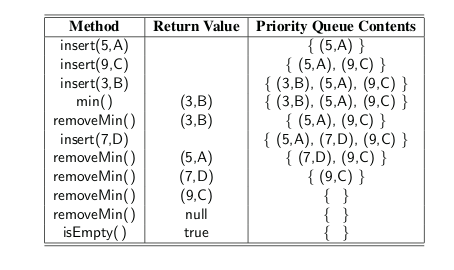

* TOC
{:toc}

## Priority Queues

we introduced the queue ADT as a collection of objects that are
added and removed according to the first-in, first-out (FIFO) principle. A com-
pany’s customer call center embodies such a model in which waiting customers are
told “calls will be answered in the order that they were received.” In that setting, a
new call is added to the back of the queue, and each time a customer service rep-
resentative becomes available, he or she is connected with the call that is removed
from the front of the call queue.

In practice, there are many applications in which a queue-like structure is used
to manage objects that must be processed in some way, but for which the first-in,
first-out policy does not suffice. Consider, for example, an air-traffic control center
that has to decide which flight to clear for landing from among many approaching
the airport. This choice may be influenced by factors such as each plane’s distance
from the runway, time spent waiting in a holding pattern, or amount of remaining
fuel. It is unlikely that the landing decisions are based purely on a FIFO policy.

we introduce a new abstract data type known as a priority queue.
This is a collection of prioritized elements that allows arbitrary element insertion,
and allows the removal of the element that has first priority. When an element is
added to a priority queue, the user designates its priority by providing an associ-
ated key. The element with the minimal key will be the next to be removed from
the queue

### The Priority Queue ADT

We model an element and its priority as a key-value composite known as an entry.

* **insert(k, v)**: Creates an entry with key k and value v in the priority queue.
* **min( )**: Returns (but does not remove) a priority queue entry (k,v)
having minimal key; returns null if the priority queue is empty.
* **removeMin( )**: Removes and returns an entry (k,v) having minimal key from
the priority queue; returns null if the priority queue is empty.
* **size( )**: Returns the number of entries in the priority queue.
* **isEmpty( )**: Returns a boolean indicating whether the priority queue is
empty.


A priority queue may have multiple entries with equivalent keys, in which case
methods min and removeMin may report an arbitrary choice among those entry
having minimal key. Values may be any type of object.

**Priority Queue Operations**



### Implementing a Priority Queue

One challenge in implementing a priority queue is that we must keep track of both
an element and its key, even as entries are relocated within a data structure.

```java
public interface Entry<K, V> {
	K getKey();

	V getValue();
}
```

This allows us to return both a key and value as a single
object from methods such as min and removeMin. We also define the insert method
to return an entry; in a more advanced adaptable priority queue

```java
public interface PriorityQueue<K, V> {
	int size();

	boolean isEmpty();

	Entry<K, V> insert(K key, V value) throws IllegalArgumentException;

	Entry<K, V> min();

	Entry<K, V> removeMin();
}
```

### Comparing Keys with Total Orders.

In defining the priority queue ADT, we can allow any type of object to serve as a
key, but we must be able to compare keys to each other in a meaningful way. More
so, the results of the comparisons must not be contradictory.

For a comparison rule,
which we denote by ≤, to be self-consistent, it must define a total order relation,
which is to say that it satisfies the following properties for any keys k 1 , k 2 , and k 3 :

Comparability property: k 1 ≤ k 2 or k 2 ≤ k 1 .
* Antisymmetric property: if k 1 ≤ k 2 and k 2 ≤ k 1 , then k 1 = k 2 .
* Transitive property: if k 1 ≤ k 2 and k 2 ≤ k 3 , then k 1 ≤ k 3 .

The comparability property states that comparison rule is defined for every pair of
keys. Note that this property implies the following one:
* Reflexive property: k ≤ k.

### The Comparable Interface

Java provides two means for defining comparisons between object types. 

The first of these is that a class may define what is known as the natural ordering of its
instances by formally implementing the java.lang.Comparable interface, which in-
cludes a single method, compareTo. The ```syntax a.compareTo(b)``` must return an
integer i with the following meaning:

* i < 0 designates that a < b.
* i = 0 designates that a = b.
* i > 0 designates that a > b.

For example, the compareTo method of the String class defines the natural
ordering of strings to be lexicographic, which is a case-sensitive extension of the
alphabetic ordering to Unicode.

In some applications, we may want to compare objects according to some notion
other than their natural ordering. For example, we might be interested in which
of two strings is the shortest, or in defining our own complex rules for judging
which of two stocks is more promising. To support generality, Java defines the
java.util.Comparator interface. A **comparator** is an object that is external to the
class of the keys it compares. It provides a method with the signature compare(a, b)
that returns an integer with similar meaning to the compareTo method described
above.

**Eample** comparator that evaluates
strings based on their length

```java

public class StringLengthComparator implements Comparator<String> {
    public int compare(String a, String b) {
        if (a.length( ) < b.length( )) return −1;
        else if (a.length( ) == b.length( )) return 0;
        else return 1;
    }
}
```

For a general and reusable form of a priority queue, we allow a user to choose
any key type and to send an appropriate comparator instance as a parameter to the
priority queue constructor. The priority queue will use that comparator anytime it
needs to compare two keys to each other.

```java
ublic class DefaultComparator<E> implements Comparator<E> {
    public int compare(E a, E b) throws ClassCastException {
        return ((Comparable<E>) a).compareTo(b);
    }
}
```

### The AbstractPriorityQueue Base Class

To manage technical issues common to all our priority queue implementations, we
define an abstract base class named AbstractPriorityQueue. This includes a nested
PQEntry class that implements the public Entry interface.

Our abstract class also declares and initializes an instance variable, comp, that
stores the comparator being used for the priority queue. We then provide a protected
method, compare, that invokes the comparator on the keys of two given entries.

```java

package priorityQueues;

import java.util.Comparator;

public abstract class AbstractPriorityQueue<K, V> implements PriorityQueue<K, V> {

	protected static class PQEntry<K, V> implements Entry<K, V> {

		private K k; // key
		private V v; // value

		public PQEntry(K key, V value) {
			k = key;
			v = value;
		}

		public K getKey() {
			return k;
		}

		public V getValue() {
			return v;
		}

		protected void setKey(K key) {
			k = key;
		}

		protected void setValue(V value) {
			v = value;
		}
	}

	private Comparator<K> comp;

	protected AbstractPriorityQueue(Comparator<K> c) {
		comp = c;
	}

	protected AbstractPriorityQueue() {
		this(new DefaultComparator<K>());
	}

	protected int compare(Entry<K, V> a, Entry<K, V> b) {
		return comp.compare(a.getKey(), b.getKey());
	}

	protected boolean checkKey(K key) throws IllegalArgumentException {
		try {
			return (comp.compare(key, key) == 0); // see if key can be compared to itself
		} catch (ClassCastException e) {
			throw new IllegalArgumentException("Incompatible key");
		}
	}

	public boolean isEmpty() {
		return size() == 0;
	}
}

```

### Implementing a Priority Queue with an Unsorted List

In our first concrete implementation of a priority queue, we store entries within an
unsorted linked list.

```java

public class UnsortedPriorityQueue<K, V> extends AbstractPriorityQueue<K, V> {

	private LinkedPositionalList<Entry<K, V>> list = new LinkedPositionalList<>();

	public UnsortedPriorityQueue() {
		super();
	}

	public UnsortedPriorityQueue(Comparator<K> comp) {
		super(comp);
	}

	private Position<Entry<K, V>> findMin() { // only called when nonempty
		Position<Entry<K, V>> small = list.first();
		for (Position<Entry<K, V>> walk : list.positions())
			if (compare(walk.getElement(), small.getElement()) < 0)
				small = walk;
		return small;
	}

	@Override
	public Entry<K, V> insert(K key, V value) throws IllegalArgumentException {
		checkKey(key);
		Entry<K, V> newest = new PQEntry<>(key, value);
		list.addLast(newest);
		return newest;
	}

	@Override
	public Entry<K, V> min() {
		if (list.isEmpty())
			return null;
		return findMin().getElement();
	}

	@Override
	public Entry<K, V> removeMin() {
		if (list.isEmpty())
			return null;
		return list.remove(findMin());
	}

	@Override
	public int size() {
		return list.size();
	}

	public void TraversePositionalList() {
		for (Position<Entry<K, V>> walk : list.positions())
			System.out.println(walk.getElement().getValue());
	}

	public void TraversePriorityQueue() {
		while (list.size() > 0) {
			System.out.println(removeMin().getValue());
		}
	}

	public static void main(String[] args) {
		UnsortedPriorityQueue<Integer, String> upq = new UnsortedPriorityQueue<>();
		upq.insert(2, "ayman");
		upq.insert(4, "ahmed");
		System.out.println(upq.min().getValue());
		upq.insert(1, "farida");
		System.out.println(upq.min().getValue());
		upq.TraversePriorityQueue();
	}

}
```

### Implementing a Priority Queue with an Sorted List

```java
package priorityQueues;

import java.util.Comparator;

import positionalList.LinkedPositionalList;
import trees.Position;
import positionalList.PositionalList;

public class SortedPriorityQueue<K, V> extends AbstractPriorityQueue<K, V> {

	private LinkedPositionalList<Entry<K, V>> list = new LinkedPositionalList<>();

	public SortedPriorityQueue() {
		super();
	}

	public SortedPriorityQueue(Comparator<K> comp) {
		super(comp);
	}

	@Override
	public int size() {
		return list.size();
	}

	public Entry<K, V> insert(K key, V value) throws IllegalArgumentException {
		checkKey(key);
		Entry<K, V> newest = new PQEntry<>(key, value);
		Position<Entry<K, V>> walk = list.last();
		while (walk != null && compare(newest, walk.getElement()) < 0)
			walk = list.before(walk);
		if (walk == null)
			list.addFirst(newest);
		else
			list.addAfter(walk, newest);
		return newest;
	}

	@Override
	public Entry<K, V> min() {
		if (list.isEmpty())
			return null;
		return list.first().getElement();
	}

	@Override
	public Entry<K, V> removeMin() {
		if (list.isEmpty())
			return null;
		return list.remove(list.first());
	}

	public void TraversePriorityQueue() {
		for (Position<Entry<K, V>> walk : list.positions())
			System.out.println(walk.getElement().getValue());

	}

	public static void main(String[] args) {
		SortedPriorityQueue<Integer, String>spq = new SortedPriorityQueue<>();
		spq.insert(2, "ayman");
		spq.insert(4, "ahmed");
		System.out.println(spq.min().getValue());
		spq.insert(1, "farida");
		System.out.println(spq.min().getValue());
		spq.TraversePriorityQueue();
	}

}

```