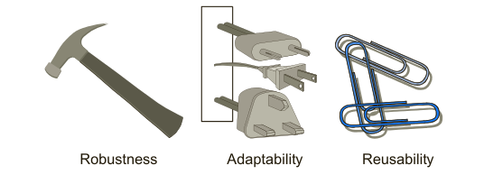
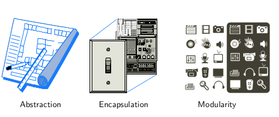
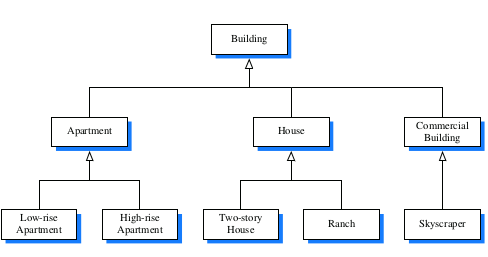

---
# You don't need to edit this file, it's empty on purpose.
# Edit theme's home layout instead if you wanna make some changes
# See: https://jekyllrb.com/docs/themes/#overriding-theme-defaults
layout: page
category: "notes"
course: "CMP2241"
year: "2020"
---
* TOC
{:toc}

# Object-Oriented Design

As the name implies, the main “actors” in the object-oriented paradigm are called
objects. Each object is an instance of a class. Each class presents to the outside
world a concise and consistent view of the objects that are instances of this class,
without going into too much unnecessary detail or giving others access to the inner
workings of the objects.

## Design Goals

Software implementations should achieve **robustness, adaptability, and reusability**.



1. **Robustness**:
very good programmer wants to develop software that is correct, which means that
a program produces the right output for all the anticipated inputs in the program’s
application. In addition, we want software to be robust, that is, capable of handling
unexpected inputs that are not explicitly defined for its application. For example,
if a program is expecting a positive integer (perhaps representing the price of an
item) and instead is given a negative integer, then the program should be able to
recover gracefully from this error.
*
2. **Adaptability**:
Modern software applications, such as Web browsers and Internet search engines,
typically involve large programs that are used for many years. Software, there-
fore, needs to be able to evolve over time in response to changing conditions in its
environment. Thus, another important goal of quality software is that it achieves
adaptability (also called evolvability). Related to this concept is portability, which
is the ability of software to run with minimal change on different hardware and
operating system platforms.

3. **Reusability**:
Going hand in hand with adaptability is the desire that software be reusable, that
is, the same code should be usable as a component of different systems in various
applications. Developing quality software can be an expensive enterprise, and its
cost can be offset somewhat if the software is designed in a way that makes it easily
reusable in future applications.

## Object-Oriented Design Principles

Chief among the principles of the object-oriented approach, which are intended to
facilitate the goals outlined above, are:



1. **Abstraction**:
The notion of abstraction is to distill a complicated system down to its most funda-
mental parts. Typically, describing the parts of a system involves naming them and
explaining their functionality. Applying the abstraction paradigm to the design of
data structures gives rise to abstract data types (ADTs). An ADT is a mathematical
model of a data structure that specifies the type of data stored, the operations sup-
ported on them

2. **Encapsulation**:
different
components of a software system should not reveal the internal details of their
respective implementations. One of the main advantages of encapsulation is that it
gives one programmer freedom to implement the details of a component, without
concern that other programmers will be writing code that intricately depends on
those internal decisions. The only constraint on the programmer of a component
is to maintain the public interface for the component, as other programmers will
be writing code that depends on that interface.

3. **Modularity**:
Modern software systems typically consist of several different components that
must interact correctly in order for the entire system to work properly. Keeping
these interactions straight requires that these different components be well orga-
nized. Modularity refers to an organizing principle in which different compo-
nents of a software system are divided into separate functional units.

## Design Patterns
Computing researchers and practitioners have developed a variety of organiza-
tional concepts and methodologies for designing quality object-oriented software
that is concise, correct, and reusable. Of special relevance to this book is the con-
cept of a design pattern, which describes a solution to a “typical” software design
problem. A pattern provides a general template for a solution that can be applied in
many different situations. It describes the main elements of a solution in an abstract
way that can be specialized for a specific problem at hand. It consists of a name,
which identifies the pattern; a context, which describes the scenarios for which this
pattern can be applied; a template, which describes how the pattern is applied; and
a result, which describes and analyzes what the pattern produces.

* Recursion 
* Amortization
* Divide-and-conquer 
* Prune-and-search, also known as decrease-and-conquer 
* Brute force 
* The greedy method 
* Dynamic programming

## Inheritance

A natural way to organize various structural components of a software package
is in a hierarchical fashion, with similar abstract definitions grouped together in
a level-by-level manner that goes from specific to more general as one traverses
up the hierarchy.



A hierarchical design is useful in software development, as common function-
ality can be grouped at the most general level, thereby promoting reuse of code,
while differentiated behaviors can be viewed as extensions of the general case. In
object-oriented programming, the mechanism for a modular and hierarchical orga-
nization is a technique known as inheritance. This allows a new class to be defined
based upon an existing class as the starting point. In object-oriented terminology,
the existing class is typically described as the base class, parent class, or super-
class, while the newly defined class is known as the subclass or child class. We
say that the subclass extends the superclass.

### Example : Extending the CreditCard Class


```java

public class PredatoryCreditCard extends CreditCard {
	private double apr; // percentage rate

	public PredatoryCreditCard(String cust, String bk, String acnt, int lim, double initialBal, double rate) {
		super(cust, bk, acnt, lim, initialBal);
		apr = rate;
	}

	// new method
	public void processMonth() {
		if (balance > 0) { // only charge interest on a positive balance
			double monthlyFactor = Math.pow(1 + apr, 1.0 / 12); // compute monthly rate
			balance *= monthlyFactor;
		}
	}

	public boolean charge(double price) {
		boolean isSuccess = super.charge(price);
		if (!isSuccess)
			balance += 5;
		return isSuccess;
	}

	public static void main(String[] args) {

		PredatoryCreditCard PCC = new PredatoryCreditCard("John Bowman", "California Finance",
			      "5391 0375 9387 5309", 2500, 300,0.2);
		PredatoryCreditCard.printSummary(PCC);
		PCC.charge(1000);
		PredatoryCreditCard.printSummary(PCC);

	}

}


```

## Polymorphism 

The word polymorphism literally means “many forms.” In the context of object-
oriented design, it refers to the ability of a reference variable to take different forms.
Consider, for example, the declaration of a variable having CreditCard as its type:

```java
CreditCard card;
```

Because this is a reference variable, the statement declares the new variable, which
does not yet refer to any card instance. While we have already seen that we can
assign it to a newly constructed instance of the CreditCard class, Java also allows us
to assign that variable to refer to an instance of the PredatoryCreditCard subclass.
That is, we can do the following:

```java
CreditCard card = new PredatoryCreditCard(,,,,,);
```

We say that the variable, card, is polymorphic; it may take one of many forms,
depending on the specific class of the object to which it refers. Because card
has been declared with type CreditCard, that variable may only be used to call
methods that are declared as part of the CreditCard definition. So we can call
card.makePayment(50) and card.charge(100), but a compilation error would be
reported for the call card.processMonth( ) because a CreditCard is not guaranteed
to have such a behavior. (That call could be made if the variable were originally
declared to have PredatoryCreditCard as its type.)

