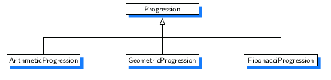
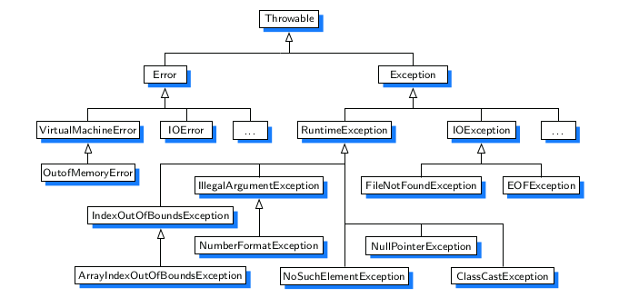

---
# You don't need to edit this file, it's empty on purpose.
# Edit theme's home layout instead if you wanna make some changes
# See: https://jekyllrb.com/docs/themes/#overriding-theme-defaults
layout: page
category: "notes"
course: "CMP2241"
year: "2020"
---
* TOC
{:toc}

# Object-Oriented Design

As the name implies, the main “actors” in the object-oriented paradigm are called
objects. Each object is an instance of a class. Each class presents to the outside
world a concise and consistent view of the objects that are instances of this class,
without going into too much unnecessary detail or giving others access to the inner
workings of the objects.

## Design Goals

Software implementations should achieve **robustness, adaptability, and reusability**.


1. **Robustness**:
very good programmer wants to develop software that is correct, which means that
a program produces the right output for all the anticipated inputs in the program’s
application. In addition, we want software to be robust, that is, capable of handling
unexpected inputs that are not explicitly defined for its application. For example,
if a program is expecting a positive integer (perhaps representing the price of an
item) and instead is given a negative integer, then the program should be able to
recover gracefully from this error.
*
2. **Adaptability**:
Modern software applications, such as Web browsers and Internet search engines,
typically involve large programs that are used for many years. Software, there-
fore, needs to be able to evolve over time in response to changing conditions in its
environment. Thus, another important goal of quality software is that it achieves
adaptability (also called evolvability). Related to this concept is portability, which
is the ability of software to run with minimal change on different hardware and
operating system platforms.

3. **Reusability**:
Going hand in hand with adaptability is the desire that software be reusable, that
is, the same code should be usable as a component of different systems in various
applications. Developing quality software can be an expensive enterprise, and its
cost can be offset somewhat if the software is designed in a way that makes it easily
reusable in future applications.

## Object-Oriented Design Principles

Chief among the principles of the object-oriented approach, which are intended to
facilitate the goals outlined above, are:


1. **Abstraction**:
The notion of abstraction is to distill a complicated system down to its most funda-
mental parts. Typically, describing the parts of a system involves naming them and
explaining their functionality. Applying the abstraction paradigm to the design of
data structures gives rise to abstract data types (ADTs). An ADT is a mathematical
model of a data structure that specifies the type of data stored, the operations sup-
ported on them

2. **Encapsulation**:
different
components of a software system should not reveal the internal details of their
respective implementations. One of the main advantages of encapsulation is that it
gives one programmer freedom to implement the details of a component, without
concern that other programmers will be writing code that intricately depends on
those internal decisions. The only constraint on the programmer of a component
is to maintain the public interface for the component, as other programmers will
be writing code that depends on that interface.

3. **Modularity**:
Modern software systems typically consist of several different components that
must interact correctly in order for the entire system to work properly. Keeping
these interactions straight requires that these different components be well orga-
nized. Modularity refers to an organizing principle in which different compo-
nents of a software system are divided into separate functional units.

## Design Patterns
Computing researchers and practitioners have developed a variety of organiza-
tional concepts and methodologies for designing quality object-oriented software
that is concise, correct, and reusable. Of special relevance to this book is the con-
cept of a design pattern, which describes a solution to a “typical” software design
problem. A pattern provides a general template for a solution that can be applied in
many different situations. It describes the main elements of a solution in an abstract
way that can be specialized for a specific problem at hand. It consists of a name,
which identifies the pattern; a context, which describes the scenarios for which this
pattern can be applied; a template, which describes how the pattern is applied; and
a result, which describes and analyzes what the pattern produces.

* Recursion 
* Amortization
* Divide-and-conquer 
* Prune-and-search, also known as decrease-and-conquer 
* Brute force 
* The greedy method 
* Dynamic programming

## Inheritance

A natural way to organize various structural components of a software package
is in a hierarchical fashion, with similar abstract definitions grouped together in
a level-by-level manner that goes from specific to more general as one traverses
up the hierarchy.


A hierarchical design is useful in software development, as common function-
ality can be grouped at the most general level, thereby promoting reuse of code,
while differentiated behaviors can be viewed as extensions of the general case. In
object-oriented programming, the mechanism for a modular and hierarchical orga-
nization is a technique known as inheritance. This allows a new class to be defined
based upon an existing class as the starting point. In object-oriented terminology,
the existing class is typically described as the base class, parent class, or super-
class, while the newly defined class is known as the subclass or child class. We
say that the subclass extends the superclass.

### Example : Extending the CreditCard Class


```java

public class PredatoryCreditCard extends CreditCard {
	private double apr; // percentage rate

	public PredatoryCreditCard(String cust, String bk, String acnt, int lim, double initialBal, double rate) {
		super(cust, bk, acnt, lim, initialBal);
		apr = rate;
	}

	// new method
	public void processMonth() {
		if (balance > 0) { // only charge interest on a positive balance
			double monthlyFactor = Math.pow(1 + apr, 1.0 / 12); // compute monthly rate
			balance *= monthlyFactor;
		}
	}

	public boolean charge(double price) {
		boolean isSuccess = super.charge(price);
		if (!isSuccess)
			balance += 5;
		return isSuccess;
	}

	public static void main(String[] args) {

		PredatoryCreditCard PCC = new PredatoryCreditCard("John Bowman", "California Finance",
			      "5391 0375 9387 5309", 2500, 300,0.2);
		PredatoryCreditCard.printSummary(PCC);
		PCC.charge(1000);
		PredatoryCreditCard.printSummary(PCC);

	}

}


```

## Polymorphism 

The word polymorphism literally means “many forms.” In the context of object-
oriented design, it refers to the ability of a reference variable to take different forms.
Consider, for example, the declaration of a variable having CreditCard as its type:

```java
CreditCard card;
```

Because this is a reference variable, the statement declares the new variable, which
does not yet refer to any card instance. While we have already seen that we can
assign it to a newly constructed instance of the CreditCard class, Java also allows us
to assign that variable to refer to an instance of the PredatoryCreditCard subclass.
That is, we can do the following:

```java
CreditCard card = new PredatoryCreditCard(,,,,,);
```

We say that the variable, card, is polymorphic; it may take one of many forms,
depending on the specific class of the object to which it refers. Because card
has been declared with type CreditCard, that variable may only be used to call
methods that are declared as part of the CreditCard definition. So we can call
card.makePayment(50) and card.charge(100), but a compilation error would be
reported for the call card.processMonth( ) because a CreditCard is not guaranteed
to have such a behavior. (That call could be made if the variable were originally
declared to have PredatoryCreditCard as its type.)

## Inheritance Hierarchies

may have many subclasses. In fact, it is quite common in Java to develop complex
inheritance hierarchies to maximize the reusability of code.
As a second example of the use of inheritance, we develop a hierarchy of classes
for iterating numeric progressions. A numeric progression is a sequence of num-
bers, where each number depends on one or more of the previous numbers. For
example, an arithmetic progression determines the next number by adding a fixed
constant to the previous value, and a geometric progression determines the next
number by multiplying the previous value by a fixed constant. In general, a pro-
gression requires a first value, and a way of identifying a new value based on one
or more previous values.



### simple progression

```java
/∗∗ Generates a simple progression. By default: 0, 1, 2, ... ∗/
public class Progression {
	protected long current;

	public Progression() {
		this(0);
	}

	public Progression(long start) {
		current = start;
	}

	public long nextValue() {
		long answer = current;
		advance();
		return answer;
	}

	protected void advance() {
		current++;
	}

	public void printProgression(int n) {
		System.out.print(nextValue());
		for (int j = 1; j < n; j++)
			System.out.print(" " + nextValue()); // print leading space before others
		System.out.println();
	}

	public static void main(String[] args) {
		Progression pro = new Progression();
		pro.printProgression(5);

	}

}

```

### Arithmetic Progression

```java
/∗∗ Generates a arithmetic progression with a user defined step. By default: 0, start+step, 2+step, ... ∗/

public class ArithmeticProgression extends Progression {

	protected long increment;

	public ArithmeticProgression() {
		this(1, 0);
	}

	public ArithmeticProgression(long stepsize) {
		this(stepsize, 0);
	}

	public ArithmeticProgression(long stepsize, long start) {

		super(start);

		increment = stepsize;

	}

	protected void advance() {
		current += increment;

	}

	public static void main(String[] args) {
		ArithmeticProgression ar = new ArithmeticProgression(5L);
		ar.printProgression(5);

	}

}
```

### Geometric Progression

```java
/∗∗ Generates a geometric progression with a user defined step. By default: 0, base, base^2, ... ∗/

public class GeometricProgression extends Progression {

	protected long base;

	public GeometricProgression() {
		this(2, 1);
	}

	public GeometricProgression(long b) {
		this(b, 1);
	}

	public GeometricProgression(long b, long start) {

		super(start);

		base = b;
	}

	protected void advance() {

		current *= base;
	}

	public static void main(String[] args) {
		GeometricProgression gp = new GeometricProgression(3);
		gp.printProgression(5);

	}

}

```

### Fibonacci Progression

```java

/∗∗ Generates a fibonacci progression with a user defined step. By default: 0,1,1,3, ... ∗/

public class FibonacciProgression extends Progression {
	protected long prev;

	public FibonacciProgression() {
		this(0, 1);
	}

	public FibonacciProgression(long first, long second) {
		super(first);
		prev = second - first;
	}

	protected void advance() {

		long temp = prev;

		prev = current;

		current += temp;

	}

	public static void main(String[] args) {
		FibonacciProgression fp = new FibonacciProgression();
		fp.printProgression(5);
	}
}

```

### Testing Progression

```java
public class TestProgression {

	public static void main(String[] args) {

		Progression prog;
		System.out.print("Arithmetic progression with default increment: ");
		prog = new ArithmeticProgression( );
		prog.printProgression(10);
		System.out.print("Arithmetic progression with increment 5: ");
		prog = new ArithmeticProgression(5);
		prog.printProgression(10);
		System.out.print("Arithmetic progression with start 2: ");
		prog = new ArithmeticProgression(5, 2);
		prog.printProgression(10);
		System.out.print("Geometric progression with default base: ");
		prog = new GeometricProgression( );
		prog.printProgression(10);
		System.out.print("Geometric progression with base 3: ");
		prog = new GeometricProgression(3);
		prog.printProgression(10);
		System.out.print("Fibonacci progression with default start values: ");
		prog = new FibonacciProgression( );
		prog.printProgression(10);
		System.out.print("Fibonacci progression with start values 4 and 6: ");
		prog = new FibonacciProgression(4, 6);
		prog.printProgression(8);
	}

}
```

## Nested Classes

Java allows a class definition to be nested inside the definition of another class.
The main use for nesting classes is when defining a class that is strongly affili-
ated with another class. This can help increase encapsulation and reduce undesired
name conflicts. Nested classes are a valuable technique when implementing data
structures, as an instance of a nested use can be used to represent a small portion
of a larger data structure, or an auxiliary class that helps navigate a primary data
structure.

```java
public class CreditCard {
private static class Transaction { /* details omitted */ }
// instance variable for a CreditCard
Transaction[ ] history;
// keep log of all transactions for this card
}
```

## Exceptions

Exceptions are unexpected events that occur during the execution of a program.
An exception might result due to an unavailable resource, unexpected input from a
user, or simply a logical error on the part of the programmer. In Java, exceptions
are objects that can be thrown by code that encounters an unexpected situation, or
by the Java Virtual Machine, for example, if running out of memory. An exception
may also be caught by a surrounding block of code that “handles” the problem
in an appropriate fashion. If uncaught, an exception causes the virtual machine to
stop executing the program and to report an appropriate message to the console.

If an exception occurs and is not handled, then the Java runtime system will termi-
nate the program after printing an appropriate message together with a trace of the
runtime stack.

```java
Exception in thread "main" java.lang.NullPointerException
at java.util.ArrayList.toArray(ArrayList.java:358)
at net.datastructures.HashChainMap.bucketGet(HashChainMap.java:35)
at net.datastructures.AbstractHashMap.get(AbstractHashMap.java:62)
at dsaj.design.Demonstration.main(Demonstration.java:12)
```

### Try-Catch statment

The general methodology for handling exceptions is a **try-catch** construct in
which a guarded fragment of code that might throw an exception is executed. If
it throws an exception, then that exception is caught by having the flow of control
jump to a predefined catch block that contains the code to analyze the exception
and apply an appropriate resolution. If no exception occurs in the guarded code, all
catch blocks are ignored.

```java
try {
	guardedBody
} catch (exceptionType1 variable1 ) {
	remedyBody 1
} catch (exceptionType2 variable2 ) {
	remedyBody 2
}
```

```java
	public static void main(String[] args) {
		int n = DEFAULT;
		try {
			n = Integer.parseInt(args[0]);
			if (n <= 0) {
				System.out.println("n must be positive. Using default.");
				n = DEFAULT;
			}
		} catch (ArrayIndexOutOfBoundsException e) {
			System.out.println("No argument specified for n. Using default.");
		} catch (NumberFormatException e) {
			System.out.println("Invalid integer argument. Using default.");
		}
	}
```

As an aside, if we had been willing to use the same error message for the two
exceptional cases, we can use a single catch clause with the following syntax:

```java
catch (ArrayIndexOutOfBoundsException | NumberFormatException e) {
System.out.println("Using default value for n.");
}
```

### Throwing Exceptions

Exceptions originate when a piece of Java code finds some sort of problem during
execution and throws an exception object. This is done by using the throw keyword
followed by an instance of the exception type to be thrown. It is often convenient
to instantiate an exception object at the time the exception has to be thrown. Thus,
a throw statement is typically written as follows:

```java
throw new exceptionType(parameters);
```

where exceptionType is the type of the exception and the parameters are sent to
that type’s constructor; most exception types offer a version of a constructor that
accepts an error message string as a parameter.

```java
public void ensurePositive(int n) {
	if (n < 0)
		throw new IllegalArgumentException("That's not positive!");
	// code
}
```

### The Throws Clause

When a method is declared, it is possible to explicitly declare, as part of its sig-
nature, the possibility that a particular exception type may be thrown during a call
to that method. It does not matter whether the exception is directly from a throw
statement in that method body, or propagated upward from a secondary method call
made from within the body.
The syntax for declaring possible exceptions in a method signature relies on the
keyword throws (not to be confused with an actual throw statement). For example,
the parseInt method of the Integer class has the following formal signature:

```java
public static int parseInt(String s) throws NumberFormatException;
```

### Exception Hierarchy

Java provides further refinement by declaring the RuntimeException class as an
important subclass of Exception. All subtypes of RuntimeException in Java are
officially treated as unchecked exceptions, and any exception type that is not part
of the RuntimeException is a checked exception.


