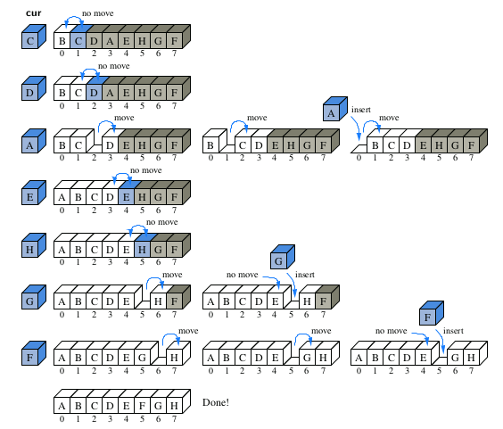
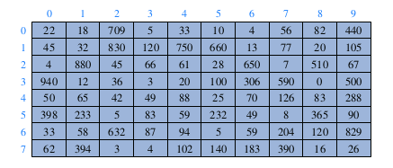
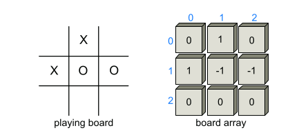

---
# You don't need to edit this file, it's empty on purpose.
# Edit theme's home layout instead if you wanna make some changes
# See: https://jekyllrb.com/docs/themes/#overriding-theme-defaults
layout: page
category: "notes"
course: "CMP2241"
year: "2020"
---
* TOC
{:toc}

## Arrays

The first application we study is storing a sequence of high score entries for a video
game in an array. This is representative of many applications in which a sequence
of objects must be stored. We could just as easily have chosen to store records for
patients in a hospital or the names of players on a football team. Nevertheless, let
us focus on storing high score entries, which is a simple application that is already
rich enough to present some important data-structuring concepts.

```java
public class GameEntry {

	private String name;
	private int score;

	public GameEntry(String n, int s) {
		name = n;
		score = s;
	}

	public String getName() {
		return name;
	}

	public int getScore() {
		return score;
	}

	public String toString() {
		return "(" + name + ", " + score + ")";
	}

}
```

**Class for storing high scores**

To maintain a sequence of high scores, we develop a class named Scoreboard. A
scoreboard is limited to a certain number of high scores that can be saved; once that
limit is reached, a new score only qualifies for the scoreboard if it is strictly higher
than the lowest “high score” on the board. The length of the desired scoreboard
may depend on the game, perhaps 10, 50, or 500. Since that limit may vary, we
allow it to be specified as a parameter to our Scoreboard constructor.
Internally, we will use an array named board to manage the GameEntry in-
stances that represent the high scores. The array is allocated with the specified
maximum capacity, but all entries are initially null.

One of the most common updates we might want to make to a Scoreboard is to add
a new entry. Keep in mind that not every entry will necessarily qualify as a high
score. If the board is not yet full, any new entry will be retained. Once the board is
full, a new entry is only retained if it is strictly better than one of the other scores,
in particular, the last entry of the scoreboard, which is the lowest of the high scores.

Another feature also is removing a game entry from the scoreBoard class. Suppose some hot shot plays our video game and gets his or her name on our high
score list, but we later learn that cheating occurred. In this case, we might want
to have a method that lets us remove a game entry from the list of high scores.
Therefore, let us consider how we might remove a reference to a GameEntry object
from a Scoreboard.

```java

public class Scoreboard {

	private int numEntries = 0;
	private GameEntry[] board;

	public Scoreboard(int capacity) {
		board = new GameEntry[capacity];
	}

	public void add(GameEntry e) {
		int newScore = e.getScore();
		if (numEntries < board.length || newScore > board[numEntries - 1].getScore()) {
			if (numEntries < board.length)
				numEntries++;
			int j = numEntries - 1;
			while (j > 0 && board[j - 1].getScore() < newScore) {
				board[j] = board[j - 1];
				j--;
			}
			board[j] = e;
		}
	}

	public GameEntry remove(int i) throws IndexOutOfBoundsException {
		if (i < 0 || i >= numEntries)
			throw new IndexOutOfBoundsException("Invalid index: " + i);

		GameEntry temp = board[i];
		for (int j = i; j < numEntries - 1; j++)
			board[j] = board[j + 1];

		board[numEntries - 1] = null;
		numEntries--;
		return temp;
	}
}

```

## Arrays Sorting: sample ( Insertion Sorting)

The algorithm proceeds by considering one element at
a time, placing the element in the correct order relative to those before it. We
start with the first element in the array, which is trivially sorted by itself. When
considering the next element in the array, if it is smaller than the first, we swap
them. Next we consider the third element in the array, swapping it leftward until it
is in its proper order relative to the first two elements. We continue in this manner
with the fourth element, the fifth, and so on, until the whole array is sorted.



```java

	public static void insertionSort(char[] data) {
		int n = data.length;
		for (int k = 1; k < n; k++) {
			// begin with second character
			char cur = data[k];
			// time to insert cur=data[k]
			int j = k;
			// find correct index j for cur
			while (j > 0 && data[j - 1] > cur) {
				// thus, data[j-1] must go after cur
				data[j] = data[j - 1];
				// slide data[j-1] rightward
				j--;
				// and consider previous j for cur
			}
			data[j] = cur;
			// this is the proper place for cur
		}
```
 
 ## Two-Dimensional Arrays and Positional Games

Many computer games, be they strategy games, simulation games, or first-person
conflict games, involve objects that reside in a two-dimensional space. Software for
such positional games needs a way of representing objects in a two-dimensional
space. A natural way to do this is with a two-dimensional array, where we use two
indices, say i and j, to refer to the cells in the array. The first index usually refers
to a row number and the second to a column number. Given such an array, we can
maintain two-dimensional game boards and perform other kinds of computations
involving data stored in rows and columns.

rrays in Java are one-dimensional; we use a single index to access each cell
of an array. Nevertheless, there is a way we can define two-dimensional arrays in
Java—we can create a two-dimensional array as an array of arrays. That is, we can
define a two-dimensional array to be an array with each of its cells being another
array. Such a two-dimensional array is sometimes also called a matrix.

```java
int[ ][ ] data = new int[8][10];
```



**Tic-Tac-Toe**

As most school children know, Tic-Tac-Toe is a game played in a three-by-three
board. Two players—X and O—alternate in placing their respective marks in the
cells of this board, starting with player X. If either player succeeds in getting three
of his or her marks in a row, column, or diagonal, then that player wins.

The basic idea is to use a two-dimensional array, board, to maintain the game
board. Cells in this array store values that indicate if that cell is empty or stores an
X or O. That is, board is a three-by-three matrix, whose middle row consists of the
cells board[1][0], board[1][1], and board[1][2]. In our case, we choose to make the
cells in the board array be integers, with a 0 indicating an empty cell, a 1 indicating
an X, and a −1 indicating an O. This encoding allows us to have a simple way of
testing if a given board configuration is a win for X or O, namely, if the values
of a row, column, or diagonal add up to 3 or −3, respectively.



```java

public class TicTacToe {

	public static final int X = 1, O = -1;
	public static final int EMPTY = 0;
	private int board[][] = new int[3][3];
	private int player;

	public TicTacToe() {
		clearBoard();
	}

	public void clearBoard() {
		for (int i = 0; i < 3; i++)
			for (int j = 0; j < 3; j++)
				board[i][j] = EMPTY;
		player = X;
	}

	public void putMark(int i, int j) throws IllegalArgumentException {
		if ((i < 0) || (i > 2) || (j < 0) || (j > 2))
			throw new IllegalArgumentException("Invalid board position");
		if (board[i][j] != EMPTY)
			throw new IllegalArgumentException("Board position occupied");
		board[i][j] = player;
		player = -player;
	}

	public boolean isWin(int mark) {
		return ((board[0][0] + board[0][1] + board[0][2] == mark * 3)
				|| (board[1][0] + board[1][1] + board[1][2] == mark * 3)
				|| (board[2][0] + board[2][1] + board[2][2] == mark * 3)
				|| (board[0][0] + board[1][0] + board[2][0] == mark * 3)
				|| (board[0][1] + board[1][1] + board[2][1] == mark * 3)
				|| (board[0][2] + board[1][2] + board[2][2] == mark * 3)
				|| (board[0][0] + board[1][1] + board[2][2] == mark * 3)
				|| (board[2][0] + board[1][1] + board[0][2] == mark * 3)); // rev diag
	}

	public int winner() {
		if (isWin(X))
			return (X);
		else if (isWin(O))
			return (O);
		else
			return (0);
	}

	public String toString() {
		StringBuilder sb = new StringBuilder();
		for (int i = 0; i < 3; i++) {
			for (int j = 0; j < 3; j++) {
				switch (board[i][j]) {
				case X:
					sb.append("X");
					break;
				case O:
					sb.append("O");
					break;
				case EMPTY:
					sb.append(" ");
					break;
				}
				if (j < 2)
					sb.append("|");
			}
			if (i < 2)
				sb.append("\n-----\n");
		}
		return sb.toString();
	}

	public static void main(String[] args) {
		TicTacToe game = new TicTacToe();
		game.putMark(1, 1);
		game.putMark(0, 2);
		game.putMark(2, 2);
		game.putMark(0, 0);
		game.putMark(0, 1);
		game.putMark(2, 1);
		game.putMark(1, 2);
		game.putMark(1, 0);
		game.putMark(2, 0);
		System.out.println(game);
		int winningPlayer = game.winner();
		String[] outcome = { "O wins", "Tie", "X wins" }; // rely on ordering
		System.out.println(outcome[1 + winningPlayer]);
	}
}


```

