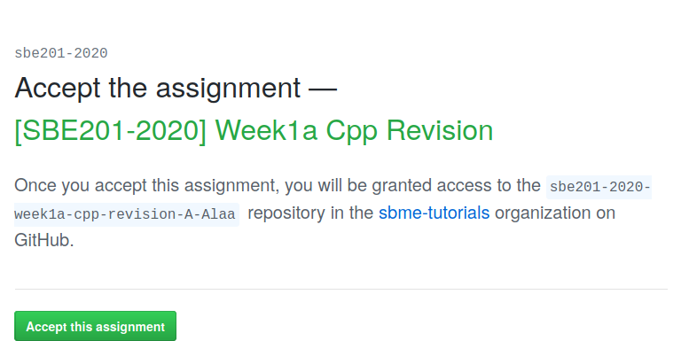
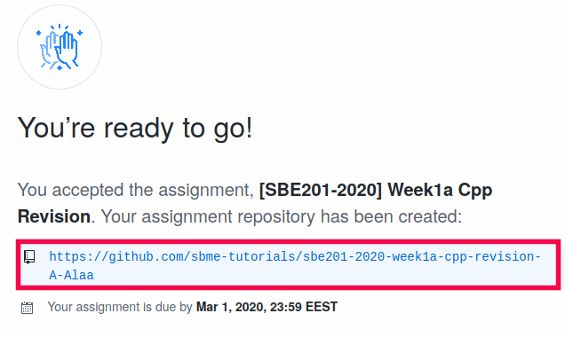
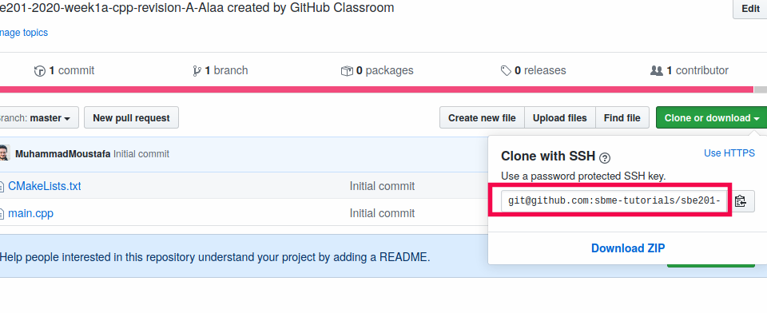
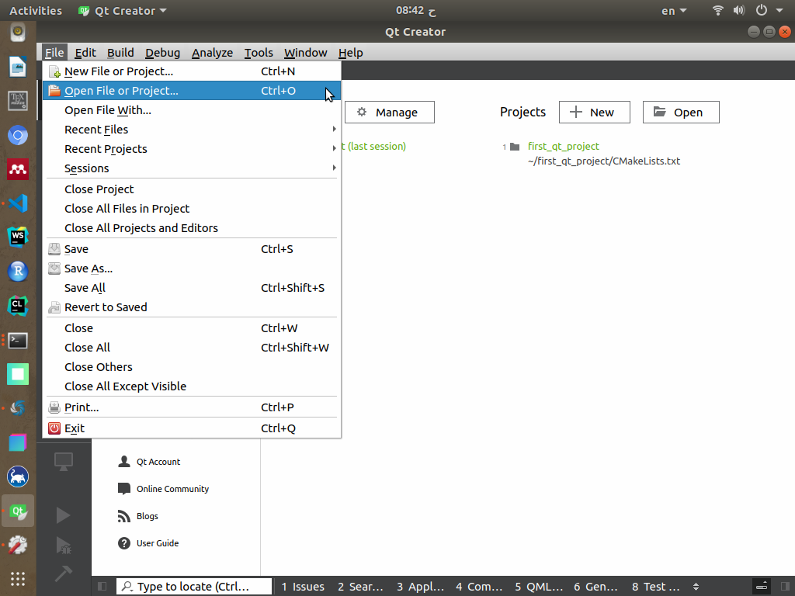
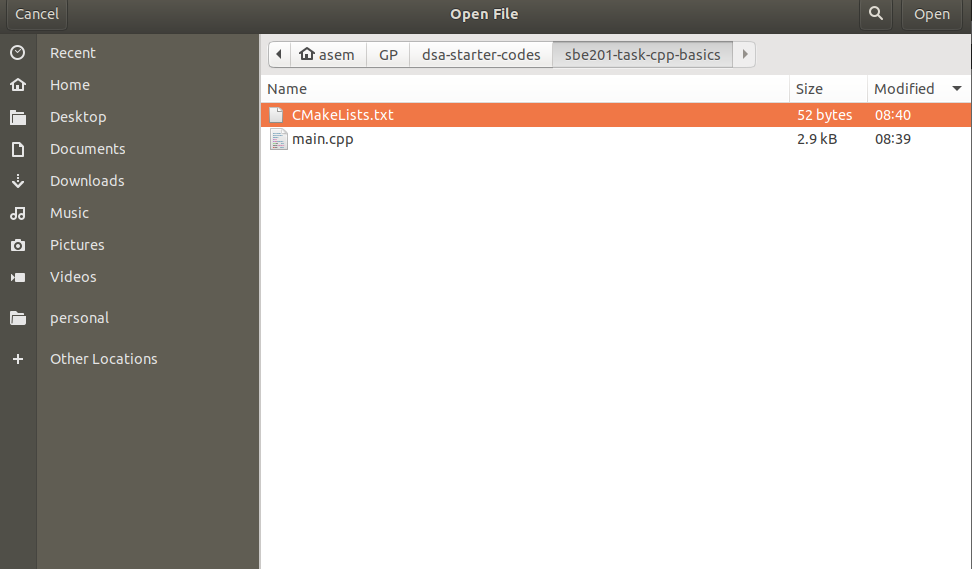
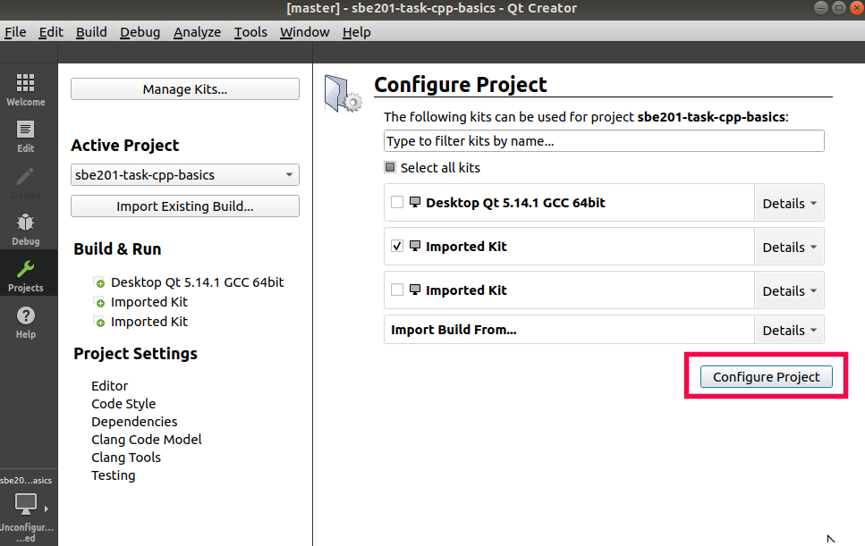
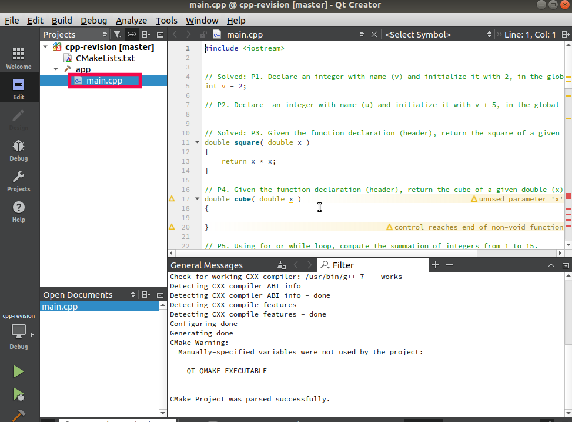
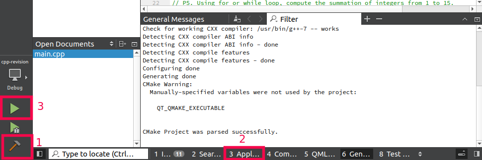
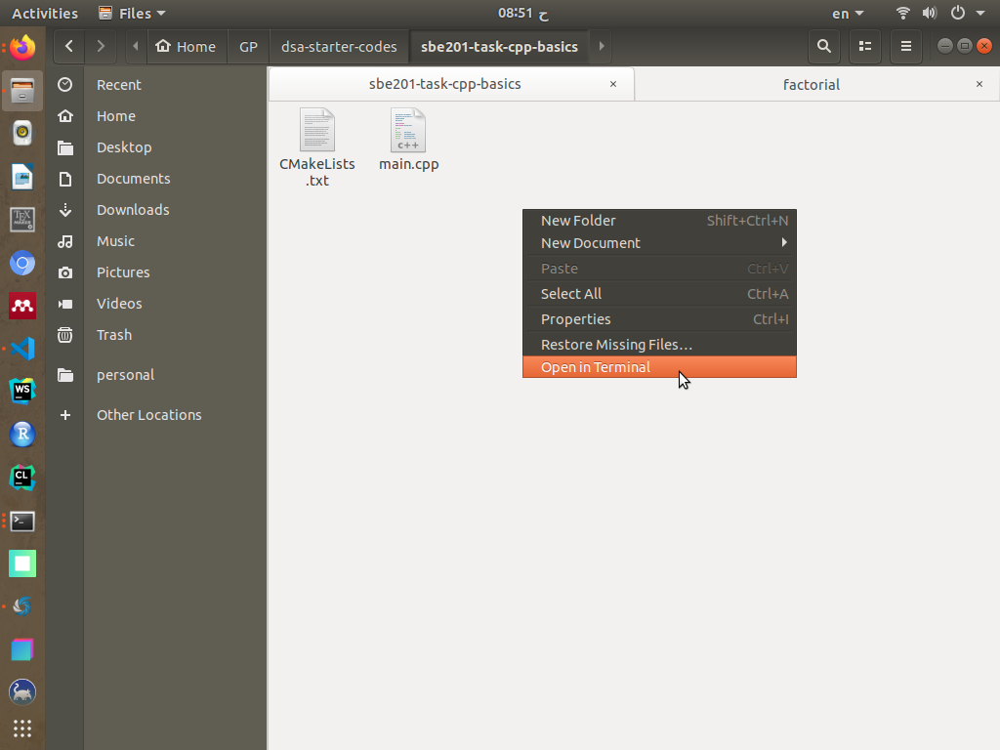

## Objectives

* Git: Submit your first assignment using Git and GitHub.
* C++: Creating variables.
* C++: Using arithmetic operations on variables.
* C++: Using control statements: If, else if, else, while, for, switch-case.
* C++: Play with simple functions.
* C++: Play with namespace.

## Prerequisites (Before you start)

* Read the notes of the first week [Part 1: C++ Basics]({{ site.baseurl }}){:target="_blank"} 
* Install Qt Creator. See [Installing and running Qt Creator IDE]({{ site.baseurl }}){:target="_blank"}

## Deadline

**Saturday, 1st March 2020, 11:59 PM**.

## Assignment Registration

* Join the assignment page [\[SBE201-2020\] Week1a Cpp Revision](https://classroom.github.com/a/-X2Q48Jz). 

| Press on **Accept this assignment** |
|----|
|  |


| Ready to go, click on the generated link |
|---|
|  |


| Clone your remote repository to your machine |
|-----|
|  |
| from the terminal `git clone your_link` |


| Using Qt Creator, select **File->Open File or Project..** |
|-----|
|  |

| Go to your assignment directory and select the CMake file `CMakeLists.txt` |
|-----|
|  |

| Press **Configure** |
|-----|
|  |

| Open the `main.cpp` file. You will find the questions as in-line comments. Questions `P1` and `P3` are solved for you to be more familiar. |
|-----|
|  |

| To compile and run..  |
|-----|
|  |


## Submission

| Open a terminal in the assignment directory |
|---|
|   |

```terminal
$ git commit -a -m "solved all problems!"
$ git push origin master
```

<div class="alert alert-primary" markdown="1" role="alert">

### <i class="fas fa-info-circle"></i> Notes

* You can push all solutions with a single `commit` and a single `push`.
* You can also solve each problem separately and `commit` and `push` for each problem you solve:

  * So you practice yourself with `git` commands.
  * So you realize some significance of using `git` to work on large projects.

</div>


